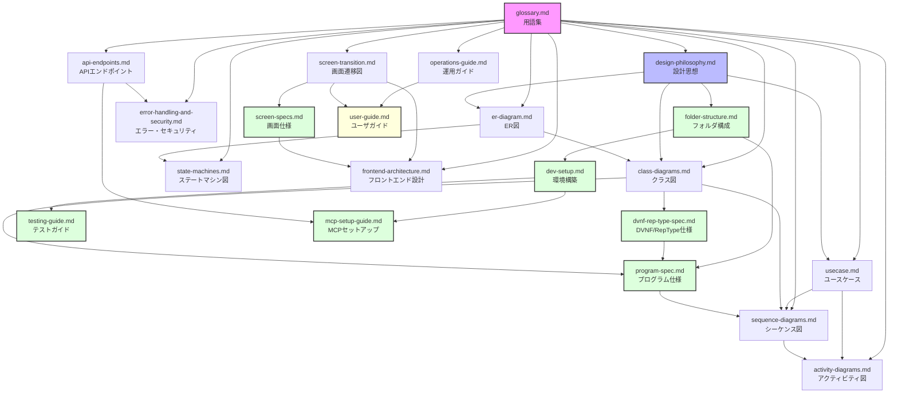

# gkill リバースエンジニアリング設計資料集

## 概要

このディレクトリには、gkillのソースコードからリバースエンジニアリングによって作成した設計資料を収録しています。

### 作成の背景・目的

gkillは長期にわたって開発されてきたライフログアプリケーションですが、体系的な設計ドキュメントが整備されていませんでした。本資料集は以下の目的で作成されました：

- 既存コードベースの理解促進
- 新規開発者のオンボーディング支援
- 設計判断の背景と意図の明文化
- 今後の開発・保守における参照資料の整備

## 推奨する読み順

以下の順番で読むことを推奨します。前の資料の知識が後の資料の理解を助けます。

### 開発者向け

1. **[glossary.md](glossary.md)** — 用語集。最初に読んでください。以降の全資料で使われるドメイン用語（Kyou、kmemo、TimeIs等）の定義を収録しています。
2. **[design-philosophy.md](design-philosophy.md)** — 設計思想。アーキテクチャの全体像と設計判断の背景を理解します。
3. **[folder-structure.md](folder-structure.md)** — フォルダ構成。プロジェクト全体のディレクトリ構成を把握します。
4. **[usecase.md](usecase.md)** — ユースケース。システムが「何をするか」を把握します。
5. **[er-diagram.md](er-diagram.md)** — ER図。データモデルとエンティティ間の関係を理解します。
6. **[class-diagrams.md](class-diagrams.md)** — クラス図。Go/TypeScriptのコード構造とクラス階層を理解します。
7. **[dvnf-rep-type-spec.md](dvnf-rep-type-spec.md)** — DVNF/RepType仕様。データバージョニングとリポジトリ種別の仕様です。
8. **[program-spec.md](program-spec.md)** — 主要プログラム仕様。初期化フロー、DAO構成、APIハンドラ、キャッシュシステム等の詳細です。
9. **[sequence-diagrams.md](sequence-diagrams.md)** — シーケンス図。主要な処理フロー（ログイン、データ登録、MCP OAuth等）を理解します。
10. **[activity-diagrams.md](activity-diagrams.md)** — アクティビティ図。詳細な処理ロジックのフローチャートです。
11. **[state-machines.md](state-machines.md)** — ステートマシン図。エンティティの状態遷移を理解します。
12. **[screen-transition.md](screen-transition.md)** — 画面遷移図。UIのページ・ダイアログ遷移を理解します。
13. **[screen-specs.md](screen-specs.md)** — 画面仕様。各画面の項目定義・コンポーネント構成の詳細です。
14. **[frontend-architecture.md](frontend-architecture.md)** — フロントエンド設計ガイド。Vue 3 + TypeScript実装の詳細です。
15. **[api-endpoints.md](api-endpoints.md)** — APIエンドポイント一覧。全79エンドポイントのリファレンスです。
16. **[error-handling-and-security.md](error-handling-and-security.md)** — エラーハンドリング・セキュリティ設計。エラーコード体系とセキュリティポリシーです。
17. **[operations-guide.md](operations-guide.md)** — 運用ガイド。デプロイ、バックアップ、トラブルシューティング手順です。
18. **[dev-setup.md](dev-setup.md)** — 環境構築資料。開発環境のセットアップ手順です。
19. **[testing-guide.md](testing-guide.md)** — テストガイド。テストの実行方法、アーキテクチャ、追加ガイドラインです。
20. **[mcp-setup-guide.md](mcp-setup-guide.md)** — MCPセットアップガイド。Claude（Claude.ai / Claude Code / Claude Desktop）からgkillのMCPサーバーを利用するための手順です。

### ユーザ向け

1. **[user-guide.md](user-guide.md)** — ユーザ向け導入資料。インストール、基本操作、トラブルシューティングです。

## 各資料の概要

| ファイル | 内容 | 主な読者・用途 |
|---|---|---|
| [glossary.md](glossary.md) | ドメイン用語の定義（71項目） | 全員。用語確認時に随時参照 |
| [design-philosophy.md](design-philosophy.md) | アーキテクチャ決定と設計思想 | 設計判断の背景を知りたいとき |
| [folder-structure.md](folder-structure.md) | プロジェクトのフォルダ構成 | 初回参照、ファイル探索時 |
| [usecase.md](usecase.md) | ユースケース一覧（74件） | 機能仕様の把握、テスト設計 |
| [er-diagram.md](er-diagram.md) | エンティティ関連図（Mermaid） | DB設計・データモデルの理解 |
| [class-diagrams.md](class-diagrams.md) | Go/TSクラス階層（Mermaid） | コード構造の理解、実装時の参照 |
| [dvnf-rep-type-spec.md](dvnf-rep-type-spec.md) | DVNF命名規則・RepType仕様 | リポジトリ管理、データ型の理解 |
| [program-spec.md](program-spec.md) | 主要プログラム仕様（初期化、DAO、API、キャッシュ） | アーキテクチャの深い理解 |
| [sequence-diagrams.md](sequence-diagrams.md) | 主要処理のシーケンス図（22本: 正常系17 + 異常系5） | 処理フローの理解、デバッグ |
| [activity-diagrams.md](activity-diagrams.md) | 処理ロジックのフローチャート | 詳細な処理手順の確認 |
| [state-machines.md](state-machines.md) | エンティティ状態遷移図 | 状態管理ロジックの理解 |
| [screen-transition.md](screen-transition.md) | ページ・ダイアログ遷移図 | UI実装・改修時の参照 |
| [screen-specs.md](screen-specs.md) | 画面仕様・項目定義（265+コンポーネント） | UI実装・改修時の参照 |
| [frontend-architecture.md](frontend-architecture.md) | Vue 3フロントエンド設計ガイド | フロントエンド開発者向け |
| [api-endpoints.md](api-endpoints.md) | 全APIエンドポイントのリファレンス | API利用・実装時の参照 |
| [error-handling-and-security.md](error-handling-and-security.md) | エラー処理方針・セキュリティ設計 | エラー処理実装、セキュリティレビュー |
| [operations-guide.md](operations-guide.md) | デプロイ・バックアップ・保守手順 | 運用担当者、環境構築時 |
| [dev-setup.md](dev-setup.md) | 開発環境構築手順（ビルド、クロスコンパイル） | 新規開発者のオンボーディング |
| [testing-guide.md](testing-guide.md) | テスト実行・アーキテクチャ・追加ガイドライン | テスト実行、テスト追加時の参照 |
| [mcp-setup-guide.md](mcp-setup-guide.md) | MCP サーバーセットアップ手順 | Claude連携のセットアップ、トラブルシューティング |
| [user-guide.md](user-guide.md) | ユーザ向け導入・操作ガイド | エンドユーザ、導入担当者 |

## 資料間の依存関係

**矢印の読み方：** `A → B` は「Aを先に読むとBの理解が容易になる」ことを意味します。緑色のノードは新規追加資料、黄色はユーザ向け資料です。

主な依存の流れ：
- **glossary.md** は全資料の基盤です。必ず最初に読んでください。
- **design-philosophy.md** → 構造系資料（ER図、クラス図、フォルダ構成）の設計判断の背景を提供します。
- **folder-structure.md** → **dev-setup.md** / **program-spec.md** は、ディレクトリ構成から環境構築手順・プログラム仕様へ進みます。
- **dev-setup.md** → **mcp-setup-guide.md** は、開発環境構築からMCP連携セットアップへ進みます。**api-endpoints.md** の知識も前提になります。
- **er-diagram.md** → **class-diagrams.md** → **dvnf-rep-type-spec.md** → **program-spec.md** → **sequence-diagrams.md** → **activity-diagrams.md** と、データ構造からコード構造、処理フローへと段階的に詳細化されます。
- **screen-transition.md** → **screen-specs.md** → **frontend-architecture.md** は、画面遷移から画面仕様、フロントエンド実装の詳細へ進みます。
- **api-endpoints.md** → **error-handling-and-security.md** は、APIの仕様からエラー処理方針へ進みます。
- **user-guide.md** は、operations-guide.mdとscreen-transition.mdの知識をユーザ向けにまとめたものです。

## Mermaid図の閲覧方法

本資料集ではMermaid記法による図を多数使用しています。以下の方法で閲覧できます：

- **GitHub** — `.md`ファイル内のMermaidコードブロックは自動的にレンダリングされます。
- **VS Code** — 拡張機能「[Markdown Preview Mermaid Support](https://marketplace.visualstudio.com/items?itemName=bierner.markdown-mermaid)」をインストールすると、プレビューで図が表示されます。
- **Mermaid Live Editor** — [https://mermaid.live](https://mermaid.live) にコードブロックの内容を貼り付けると、ブラウザ上で図を確認・編集できます。
