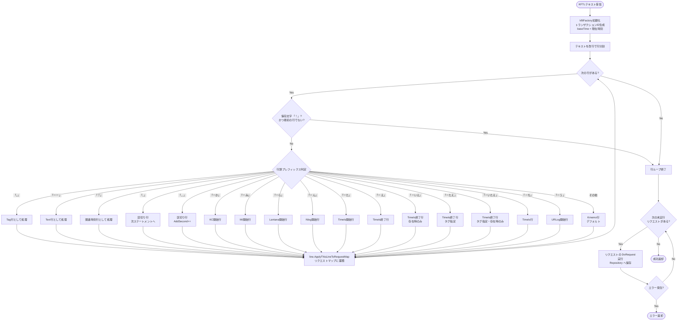
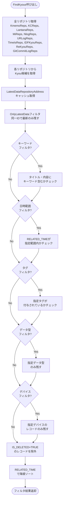
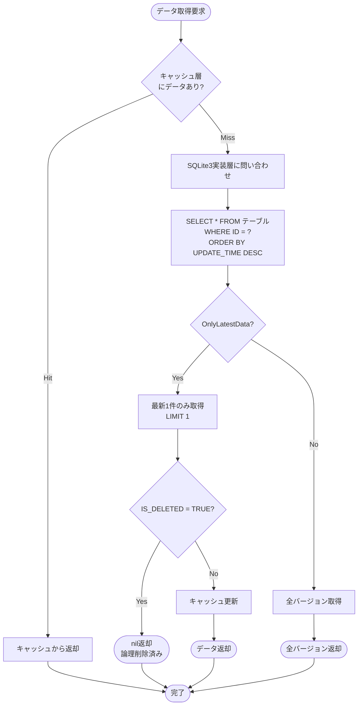
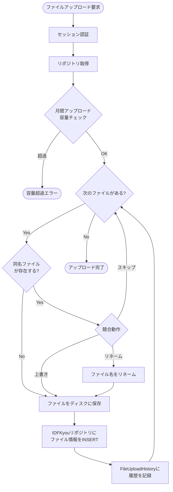
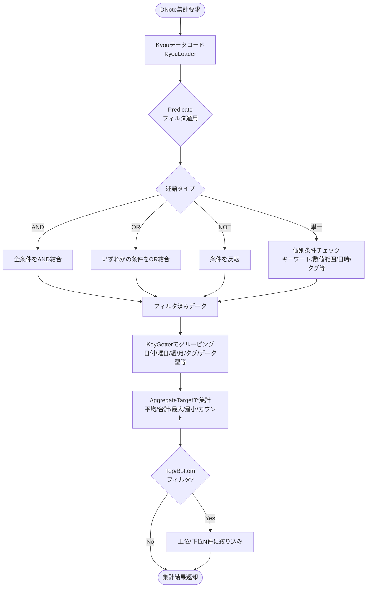
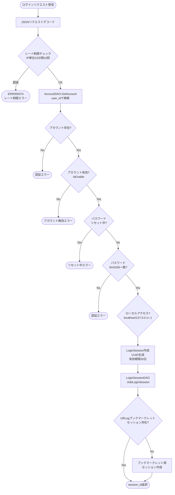
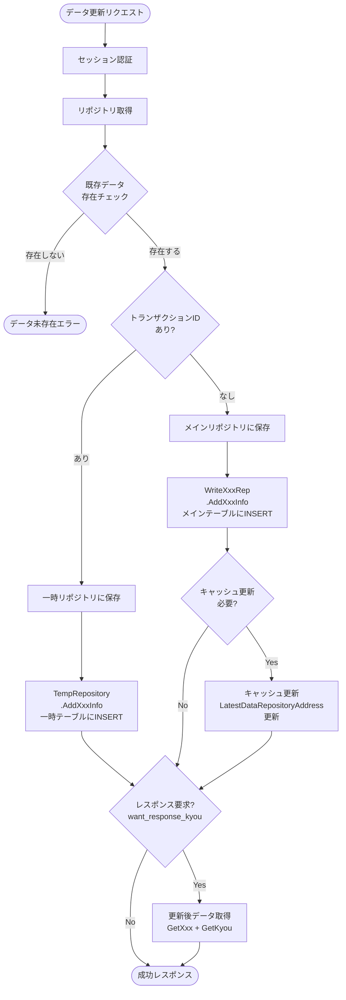

# gkill アクティビティ図

コードの実装から抽出した主要処理フローのアクティビティ図。

## 1. KFTL テキストパース処理フロー



## 2. Kyou 検索フィルタリングフロー



## 3. Repository 4層のデータ取得フロー



## 4. ファイルアップロード処理フロー



## 5. DNote 集計処理フロー



## 6. ZIP内容閲覧処理フロー

```mermaid
flowchart TD
    Start([ZIP内容閲覧リクエスト]) --> Auth[セッション認証]
    Auth --> GetIDFKyou[IDFKyou取得<br>ファイルパス特定]
    GetIDFKyou --> CalcHash[ZIPファイルのSHA1ハッシュ計算]
    CalcHash --> CacheCheck{zip_cache/{rep_name}/{sha1}/<br>が存在する?}

    CacheCheck -->|Yes| BuildEntries[ZipEntryリスト生成<br>キャッシュから]
    CacheCheck -->|No| ExtractToTemp[一時ディレクトリに展開開始]

    ExtractToTemp --> LoopEntries{次のZIPエントリがある?}
    LoopEntries -->|Yes| TraversalCheck{パストラバーサル<br>チェック}

    TraversalCheck -->|../含む| SkipEntry[エントリをスキップ]
    SkipEntry --> LoopEntries
    TraversalCheck -->|OK| SymlinkCheck{シンボリックリンク?}

    SymlinkCheck -->|Yes| SkipEntry
    SymlinkCheck -->|No| DecodeFilename[Shift_JISファイル名<br>デコード（必要な場合）]

    DecodeFilename --> WriteFile[ファイルを一時ディレクトリに書き込み]
    WriteFile --> LoopEntries

    LoopEntries -->|No| AtomicRename[一時ディレクトリ→<br>zip_cache/{rep_name}/{sha1}/ にリネーム<br>（アトミック展開）]
    AtomicRename --> BuildEntries

    BuildEntries --> ReturnEntries([ZipEntryリスト返却<br>MSG000080])
```

## 7. ログイン認証フロー



## 8. データ更新（Append-Only）フロー


