# gkill アクティビティ図

コードの実装から抽出した主要処理フローのアクティビティ図。

## 1. KFTL テキストパース処理フロー

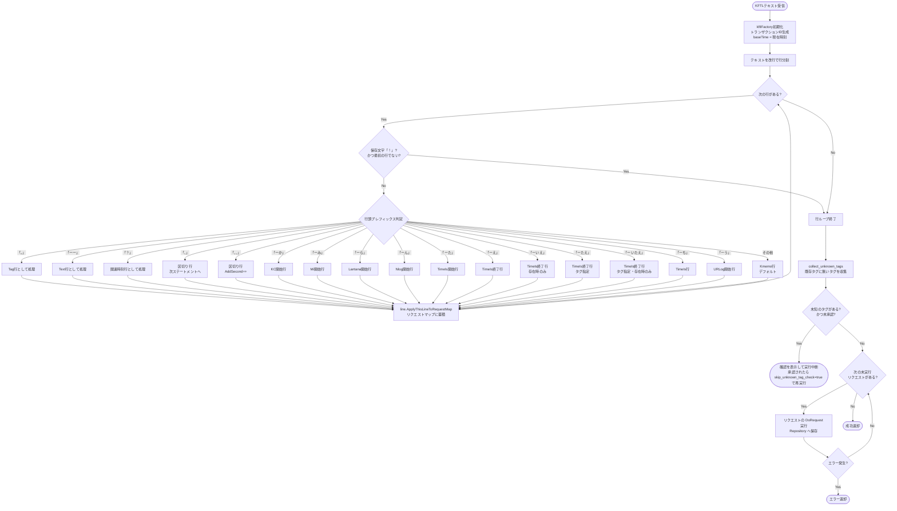
```mermaid
flowchart TD
    Start([KFTLテキスト受信]) --> Init[kftlFactory初期化<br>トランザクションID生成<br>baseTime = 現在時刻]
    Init --> Split[テキストを改行で行分割]
    Split --> LoopStart{次の行がある?}

    LoopStart -->|Yes| CheckSave{保存文字「！」?<br>かつ最初の行でない?}
    CheckSave -->|Yes| LoopEnd[行ループ終了]
    CheckSave -->|No| CheckPrefix{行頭プレフィックス判定}

    LoopStart -->|No| LoopEnd

    CheckPrefix -->|「。」| TagLine[Tag行として処理]
    CheckPrefix -->|「ーー」| TextLine[Text行として処理]
    CheckPrefix -->|「？」| RelTimeLine[関連時刻行として処理]
    CheckPrefix -->|「、」| SplitLine[区切り行<br>次ステートメントへ]
    CheckPrefix -->|「、、」| SplitNextSec[区切り行<br>AddSecond++]
    CheckPrefix -->|「ーか」| KCLine[KC開始行]
    CheckPrefix -->|「ーみ」| MiLine[Mi開始行]
    CheckPrefix -->|「ーら」| LantanaLine[Lantana開始行]
    CheckPrefix -->|「ーん」| NlogLine[Nlog開始行]
    CheckPrefix -->|「ーた」| TimeIsStartLine[TimeIs開始行]
    CheckPrefix -->|「ーえ」| TimeIsEndLine[TimeIs終了行]
    CheckPrefix -->|「ーいえ」| TimeIsEndIfExistLine[TimeIs終了行<br>存在時のみ]
    CheckPrefix -->|「ーたえ」| TimeIsEndByTagLine[TimeIs終了行<br>タグ指定]
    CheckPrefix -->|「ーいたえ」| TimeIsEndByTagIfExistLine[TimeIs終了行<br>タグ指定・存在時のみ]
    CheckPrefix -->|「ーち」| TimeIsLine[TimeIs行]
    CheckPrefix -->|「ーう」| URLogLine[URLog開始行]
    CheckPrefix -->|その他| KmemoLine[Kmemo行<br>デフォルト]

    TagLine --> ApplyToMap[line.ApplyThisLineToRequestMap<br>リクエストマップに蓄積]
    TextLine --> ApplyToMap
    RelTimeLine --> ApplyToMap
    SplitLine --> ApplyToMap
    SplitNextSec --> ApplyToMap
    KCLine --> ApplyToMap
    MiLine --> ApplyToMap
    LantanaLine --> ApplyToMap
    NlogLine --> ApplyToMap
    TimeIsStartLine --> ApplyToMap
    TimeIsEndLine --> ApplyToMap
    TimeIsEndIfExistLine --> ApplyToMap
    TimeIsEndByTagLine --> ApplyToMap
    TimeIsEndByTagIfExistLine --> ApplyToMap
    TimeIsLine --> ApplyToMap
    URLogLine --> ApplyToMap
    KmemoLine --> ApplyToMap

    ApplyToMap --> LoopStart

    LoopEnd --> CollectTags[collect_unknown_tags<br>既存タグに無いタグを収集]
    CollectTags --> UnknownTagCheck{未知のタグがある?<br>かつ未承認?}
    UnknownTagCheck -->|Yes| ConfirmDialog([確認を表示して実行中断<br>承認されたら skip_unknown_tag_check=true で再実行])
    UnknownTagCheck -->|No| ExecStart{次の未実行<br>リクエストがある?}
    ExecStart -->|Yes| ExecReq[リクエストの DoRequest 実行<br>Repository へ保存]
    ExecReq --> ExecCheck{エラー発生?}
    ExecCheck -->|Yes| Error([エラー返却])
    ExecCheck -->|No| ExecStart
    ExecStart -->|No| Success([成功返却])
```

> **未知タグの確認はクライアント側の分岐。** `classes/use-kftl-view.ts` の `do_submit()` が
> リクエスト構築後・`DoRequest` 実行前に判定する。タイプミスによるタグの乱立を防ぐためのもので、
> サーバ側 `/api/submit_kftl_text` には該当する処理は無い。

### プレフィックスの2系統

上図のプレフィックス分岐は日本語表記で示しているが、
**ASCII 系のプレフィックスも同じ分岐に入る**（`kftl-prefixes.ts` / `kftl_factory.go`）。

`。`=`#` / `ーー`=`--` / `？`=`?` / `、`=`,` / `、、`=`,,` / `ーか`=`/num` / `ーみ`=`/mi` /
`ーら`=`/mood` / `ーん`=`/expense` / `ーう`=`/url` / `ーた`=`/start` / `ーえ`=`/end` /
`ーいえ`=`/end?` / `ーたえ`=`/endt` / `ーいたえ`=`/endt?` / `ーち`=`/timeis` / `！`=`!`

## 2. Kyou 検索フィルタリングフロー

```mermaid
flowchart TD
    Start([FindKyous呼び出し]) --> GetRepos[全リポジトリ取得<br>KmemoReps, KCReps, LantanaReps,<br>MiReps, NlogReps, URLogReps,<br>TimeIsReps, IDFKyouReps,<br>ReKyouReps, MiReKyouReps,<br>GitCommitLogReps, GPSLogReps,<br>PluginReps]

    GetRepos --> FetchAll[各リポジトリから<br>Kyou候補を取得]
    FetchAll --> GetCache[LatestDataRepositoryAddress<br>キャッシュ取得]
    GetCache --> FilterLatest[OnlyLatestDataフィルタ<br>同一IDで最新のみ残す]

    FilterLatest --> FilterKeyword{キーワード<br>フィルタ?}
    FilterKeyword -->|Yes| ApplyKeyword[タイトル・内容に<br>キーワード含むかチェック]
    FilterKeyword -->|No| FilterTime

    ApplyKeyword --> FilterTime{日時範囲<br>フィルタ?}
    FilterTime -->|Yes| ApplyTime[RELATED_TIMEが<br>指定範囲内かチェック]
    FilterTime -->|No| FilterTag

    ApplyTime --> FilterTag{タグ<br>フィルタ?}
    FilterTag -->|Yes| ApplyTag[指定タグが<br>付与されているかチェック]
    FilterTag -->|No| FilterDataType

    ApplyTag --> FilterDataType{データ型<br>フィルタ?}
    FilterDataType -->|Yes| ApplyDataType[指定データ型<br>のみ残す]
    FilterDataType -->|No| FilterDevice

    ApplyDataType --> FilterDevice{デバイス<br>フィルタ?}
    FilterDevice -->|Yes| ApplyDevice[指定デバイスの<br>レコードのみ残す]
    FilterDevice -->|No| FilterDeleted

    ApplyDevice --> FilterDeleted[IS_DELETED=TRUE<br>のレコードを除外]
    FilterDeleted --> Sort[RELATED_TIME<br>で降順ソート]
    Sort --> Return([フィルタ結果返却])
```

> **タグ・テキストも「ID ごとの最新版のみ」が検索対象。** 付随データの取得クエリは
> ID ごとに `UpdateTime` 最新の1件へ絞り込む（`find_filter.go:513,624,656`）。
> このため**タグ名を編集したあと、編集前の古いタグ名で検索してもヒットしない**。
> `FindKyouContext.isLatestData`（`find_kyou_context.go:39`）が同じ判定を共有する。

## 3. Repository 4層のデータ取得フロー

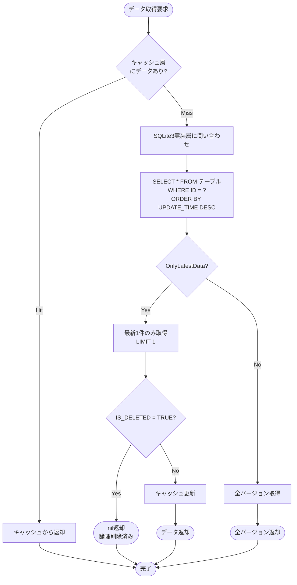
```mermaid
flowchart TD
    Start([データ取得要求]) --> CachedCheck{キャッシュ層<br>にデータあり?}

    CachedCheck -->|Hit| ReturnCached[キャッシュから返却]
    CachedCheck -->|Miss| SQLite3[SQLite3実装層に問い合わせ]

    SQLite3 --> Query[SELECT * FROM テーブル<br>WHERE ID = ?<br>ORDER BY UPDATE_TIME DESC]
    Query --> LatestCheck{OnlyLatestData?}

    LatestCheck -->|Yes| Latest[最新1件のみ取得<br>LIMIT 1]
    LatestCheck -->|No| AllVersions[全バージョン取得]

    Latest --> DeleteCheck{IS_DELETED = TRUE?}
    AllVersions --> ReturnAll([全バージョン返却])

    DeleteCheck -->|Yes| ReturnNil([nil返却<br>論理削除済み])
    DeleteCheck -->|No| UpdateCache[キャッシュ更新]
    UpdateCache --> ReturnData([データ返却])

    ReturnCached --> End([完了])
    ReturnNil --> End
    ReturnData --> End
    ReturnAll --> End
```

## 4. ファイルアップロード処理フロー

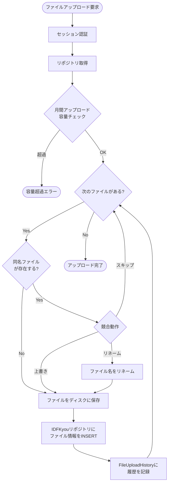
```mermaid
flowchart TD
    Start([ファイルアップロード要求]) --> Auth[セッション認証]
    Auth --> GetRepos[リポジトリ取得]
    GetRepos --> CheckQuota{月間アップロード<br>容量チェック}

    CheckQuota -->|超過| QuotaError([容量超過エラー])
    CheckQuota -->|OK| LoopFiles{次のファイルがある?}

    LoopFiles -->|Yes| CheckConflict{同名ファイル<br>が存在する?}
    CheckConflict -->|No| SaveFile[ファイルをディスクに保存]
    CheckConflict -->|Yes| ConflictBehavior{競合動作}

    ConflictBehavior -->|上書き| SaveFile
    ConflictBehavior -->|スキップ| LoopFiles
    ConflictBehavior -->|リネーム| Rename[ファイル名をリネーム]
    Rename --> SaveFile

    SaveFile --> AddIDF[IDFKyouリポジトリに<br>ファイル情報をINSERT]
    AddIDF --> AddHistory[FileUploadHistoryに<br>履歴を記録]
    AddHistory --> LoopFiles

    LoopFiles -->|No| Success([アップロード完了])
```

## 5. Dnote 集計処理フロー

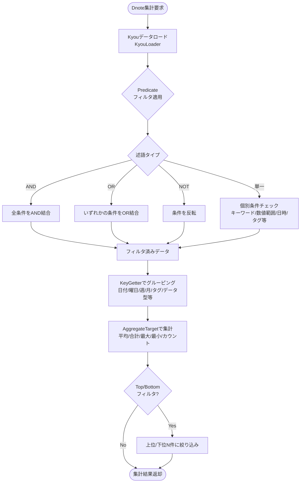
```mermaid
flowchart TD
    Start([Dnote集計要求]) --> LoadKyous[Kyouデータロード<br>KyouLoader]

    LoadKyous --> ApplyPredicate{Predicate<br>フィルタ適用}
    ApplyPredicate --> CheckPredType{述語タイプ}

    CheckPredType -->|AND| ApplyAND[全条件をAND結合]
    CheckPredType -->|OR| ApplyOR[いずれかの条件をOR結合]
    CheckPredType -->|NOT| ApplyNOT[条件を反転]
    CheckPredType -->|単一| ApplySingle[個別条件チェック<br>キーワード/数値範囲/日時/タグ等]

    ApplyAND --> Filtered[フィルタ済みデータ]
    ApplyOR --> Filtered
    ApplyNOT --> Filtered
    ApplySingle --> Filtered

    Filtered --> GroupBy[KeyGetterでグルーピング<br>日付/曜日/週/月/タグ/データ型等]

    GroupBy --> Aggregate[AggregateTargetで集計<br>平均/合計/最大/最小/カウント]

    Aggregate --> TopBottomFilter{Top/Bottom<br>フィルタ?}
    TopBottomFilter -->|Yes| ApplyFilter[上位/下位N件に絞り込み]
    TopBottomFilter -->|No| Return
    ApplyFilter --> Return([集計結果返却])
```

### トレンドグラフの時系列集計フロー（DnoteTrendAggregator）

集計要素「トレンドグラフ」は、KeyGetter によるグルーピングの代わりに集計粒度（日/週/月）で時系列バケットに振り分けて集計する。サーバーAPIは使用せず、すべてクライアント側で処理する。

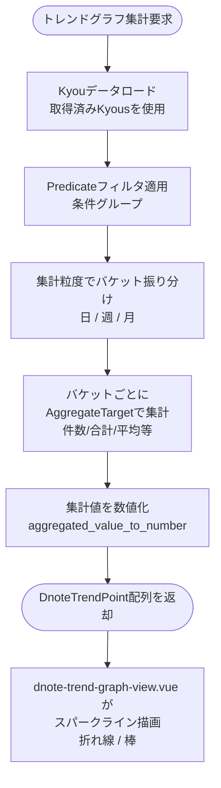
```mermaid
flowchart TD
    Start([トレンドグラフ集計要求]) --> LoadKyous[Kyouデータロード<br>取得済みKyousを使用]
    LoadKyous --> ApplyPredicate[Predicateフィルタ適用<br>条件グループ]
    ApplyPredicate --> Bucketize[集計粒度でバケット振り分け<br>日 / 週 / 月]
    Bucketize --> AggregatePerBucket[バケットごとに<br>AggregateTargetで集計<br>件数/合計/平均等]
    AggregatePerBucket --> ToNumber[集計値を数値化<br>aggregated_value_to_number]
    ToNumber --> Points([DnoteTrendPoint配列を返却])
    Points --> Render[dnote-trend-graph-view.vue が<br>スパークライン描画<br>折れ線 / 棒]
```

### 相関グラフの集計フロー（DnoteCorrelationAggregator）

集計要素「相関グラフ」は、指標（2〜10個）それぞれをトレンドグラフと同じ時系列集計に掛けたうえで、
全指標の総当たりで相関行列を作る。粒度と時間ずれ（lag）は全指標共通。
これもサーバーAPIは使用せず、すべてクライアント側で処理する。

対応付けはバケットの添字で行う。lag が正なら「行の指標が先、列の指標が後」を意味し、
日・週・月のどの粒度でも同じ意味になる。記録が1件も無いバケットの0は観測値ではないため、
どちらか片方でも空なら、その対は相関から除外する（0埋めしたまま相関を取ると相関が水増しされる）。

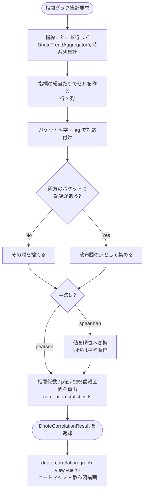
```mermaid
flowchart TD
    Start([相関グラフ集計要求]) --> PerMetric[指標ごとに並行して<br>DnoteTrendAggregatorで時系列集計]
    PerMetric --> Pairwise[指標の総当たりでセルを作る<br>行 x 列]
    Pairwise --> Align[バケット添字 + lag で対応付け]
    Align --> DropUnobserved{両方のバケットに<br>記録がある?}
    DropUnobserved -->|No| SkipPair[その対を捨てる]
    DropUnobserved -->|Yes| Collect[散布図の点として集める]
    SkipPair --> Method
    Collect --> Method{手法は?}
    Method -->|spearman| Rank[値を順位へ変換<br>同値は平均順位]
    Method -->|pearson| Stats
    Rank --> Stats[相関係数 / p値 / 95%信頼区間を算出<br>correlation-statistics.ts]
    Stats --> Cells([DnoteCorrelationResult を返却])
    Cells --> RenderCorr[dnote-correlation-graph-view.vue が<br>ヒートマップ + 散布図描画]
```

## 6. ZIP内容閲覧処理フロー

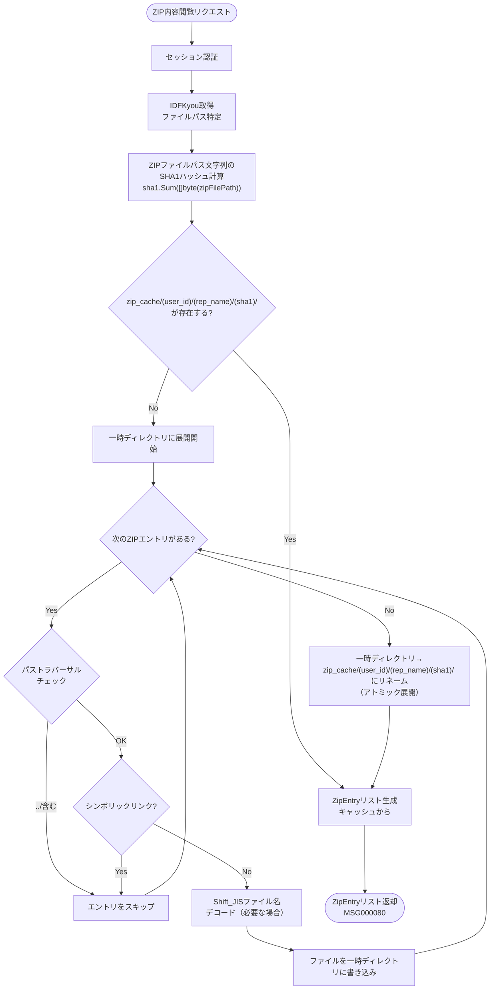
```mermaid
flowchart TD
    Start([ZIP内容閲覧リクエスト]) --> Auth[セッション認証]
    Auth --> GetIDFKyou[IDFKyou取得<br>ファイルパス特定]
    GetIDFKyou --> CalcHash["ZIPファイルパス文字列のSHA1ハッシュ計算<br>sha1.Sum([]byte(zipFilePath))"]
    CalcHash --> CacheCheck{"zip_cache/(user_id)/(rep_name)/(sha1)/<br>が存在する?"}

    CacheCheck -->|Yes| BuildEntries[ZipEntryリスト生成<br>キャッシュから]
    CacheCheck -->|No| ExtractToTemp[一時ディレクトリに展開開始]

    ExtractToTemp --> LoopEntries{次のZIPエントリがある?}
    LoopEntries -->|Yes| TraversalCheck{パストラバーサル<br>チェック}

    TraversalCheck -->|../含む| SkipEntry[エントリをスキップ]
    SkipEntry --> LoopEntries
    TraversalCheck -->|OK| SymlinkCheck{シンボリックリンク?}

    SymlinkCheck -->|Yes| SkipEntry
    SymlinkCheck -->|No| DecodeFilename[Shift_JISファイル名<br>デコード（必要な場合）]

    DecodeFilename --> WriteFile[ファイルを一時ディレクトリに書き込み]
    WriteFile --> LoopEntries

    LoopEntries -->|No| AtomicRename["一時ディレクトリ→<br>zip_cache/(user_id)/(rep_name)/(sha1)/ にリネーム<br>（アトミック展開）"]
    AtomicRename --> BuildEntries

    BuildEntries --> ReturnEntries([ZipEntryリスト返却<br>MSG000080])
```

> **キャッシュキーは ZIP の中身ではなくパス文字列のハッシュ。**
> `sha1.Sum([]byte(zipFilePath))` なので、同じパスのまま ZIP を差し替えても
> 既存のキャッシュディレクトリが再利用され、古い内容が表示される。

## 7. ログイン認証フロー

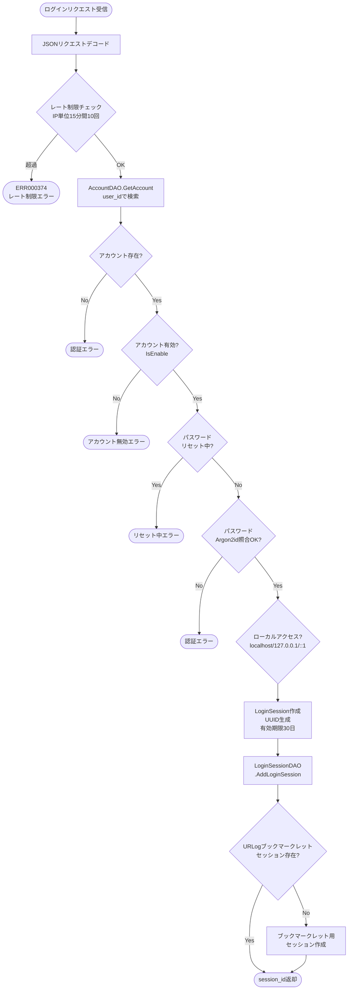
```mermaid
flowchart TD
    Start([ログインリクエスト受信]) --> DecodeReq[JSONリクエストデコード]
    DecodeReq --> RateLimit{レート制限チェック<br>IP単位15分間10回}
    RateLimit -->|超過| ErrorRate([ERR000374<br>レート制限エラー])
    RateLimit -->|OK| GetAccount[AccountDAO.GetAccount<br>user_idで検索]

    GetAccount --> AccountExists{アカウント存在?}
    AccountExists -->|No| Error401([認証エラー])
    AccountExists -->|Yes| IsEnabled{アカウント有効?<br>IsEnable}

    IsEnabled -->|No| Error403([アカウント無効エラー])
    IsEnabled -->|Yes| ResetPending{パスワード<br>リセット中?}

    ResetPending -->|Yes| Error403b([リセット中エラー])
    ResetPending -->|No| PasswordMatch{パスワード<br>Argon2id照合OK?}

    PasswordMatch -->|No| Error401b([認証エラー])
    PasswordMatch -->|Yes| CheckLocal{ローカルアクセス?<br>localhost/127.0.0.1/::1}

    CheckLocal --> CreateSession[LoginSession作成<br>UUID生成<br>有効期限30日]
    CreateSession --> SaveSession[LoginSessionDAO<br>.AddLoginSession]
    SaveSession --> CheckBookmarklet{URLogブックマークレット<br>セッション存在?}

    CheckBookmarklet -->|No| CreateBookmarklet[ブックマークレット用<br>セッション作成]
    CheckBookmarklet -->|Yes| ReturnSession
    CreateBookmarklet --> ReturnSession([session_id返却])
```

## 8. データ更新（Append-Only）フロー

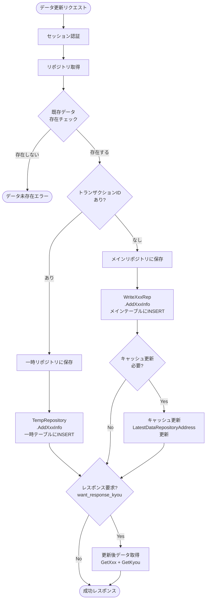
```mermaid
flowchart TD
    Start([データ更新リクエスト]) --> Auth[セッション認証]
    Auth --> GetRepos[リポジトリ取得]
    GetRepos --> ExistCheck{既存データ<br>存在チェック}

    ExistCheck -->|存在しない| Error404([データ未存在エラー])
    ExistCheck -->|存在する| CheckTxID{トランザクションID<br>あり?}

    CheckTxID -->|あり| UseTempRep[一時リポジトリに保存]
    CheckTxID -->|なし| UseMainRep[メインリポジトリに保存]

    UseTempRep --> InsertTemp[TempRepository<br>.AddXxxInfo<br>一時テーブルにINSERT]
    UseMainRep --> InsertMain[WriteXxxRep<br>.AddXxxInfo<br>メインテーブルにINSERT]

    InsertTemp --> ResponseCheck{レスポンス要求?<br>want_response_kyou}
    InsertMain --> UpdateCache{キャッシュ更新<br>必要?}

    UpdateCache -->|Yes| DoCache[キャッシュ更新<br>LatestDataRepositoryAddress更新]
    UpdateCache -->|No| ResponseCheck

    DoCache --> ResponseCheck
    ResponseCheck -->|Yes| FetchResult[更新後データ取得<br>GetXxx + GetKyou]
    ResponseCheck -->|No| Return([成功レスポンス])
    FetchResult --> Return
```

## 9. プラグインコンテンツ HTML の描画フロー

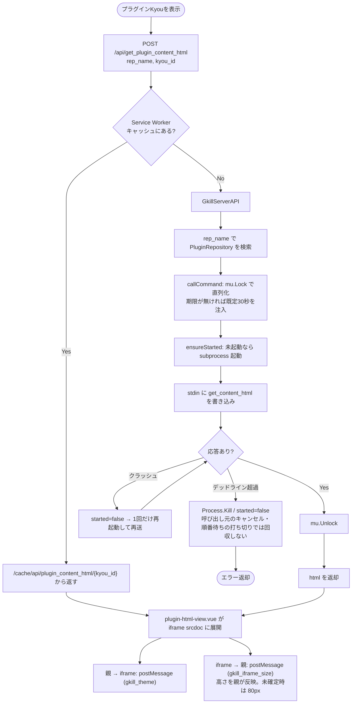
```mermaid
flowchart TD
    Start([プラグインKyouを表示]) --> Req[POST /api/get_plugin_content_html<br>rep_name, kyou_id]
    Req --> SW{Service Worker<br>キャッシュにある?}
    SW -->|Yes| FromCache["/cache/api/plugin_content_html/{kyou_id} から返す"]
    SW -->|No| Server[GkillServerAPI]

    Server --> FindRep[rep_name で PluginRepository を検索]
    FindRep --> Lock[callCommand: mu.Lock で直列化<br>期限が無ければ既定30秒を注入]
    Lock --> Ensure[ensureStarted: 未起動なら subprocess 起動]
    Ensure --> Send[stdin に get_content_html を書き込み]
    Send --> Recv{応答あり?}

    Recv -->|デッドライン超過| Kill[Process.Kill / started=false<br>呼び出し元のキャンセル・順番待ちの打ち切りでは回収しない]
    Kill --> ErrOut([エラー返却])
    Recv -->|クラッシュ| Retry[started=false → 1回だけ再起動して再送]
    Retry --> Recv
    Recv -->|Yes| Unlock[mu.Unlock]

    Unlock --> Html[html を返却]
    FromCache --> Render
    Html --> Render[plugin-html-view.vue が iframe srcdoc に展開]

    Render --> Theme["親 → iframe: postMessage (gkill_theme)"]
    Render --> Size["iframe → 親: postMessage (gkill_iframe_size)<br>高さを親が反映。未確定時は 80px"]
```

iframe は `sandbox="allow-scripts allow-forms"`（`allow-same-origin` なし）で動くため
セッション Cookie にアクセスできない。テーマとサイズの受け渡しに postMessage を使うのはこのため。

## 10. プラグイン設定の保存フロー

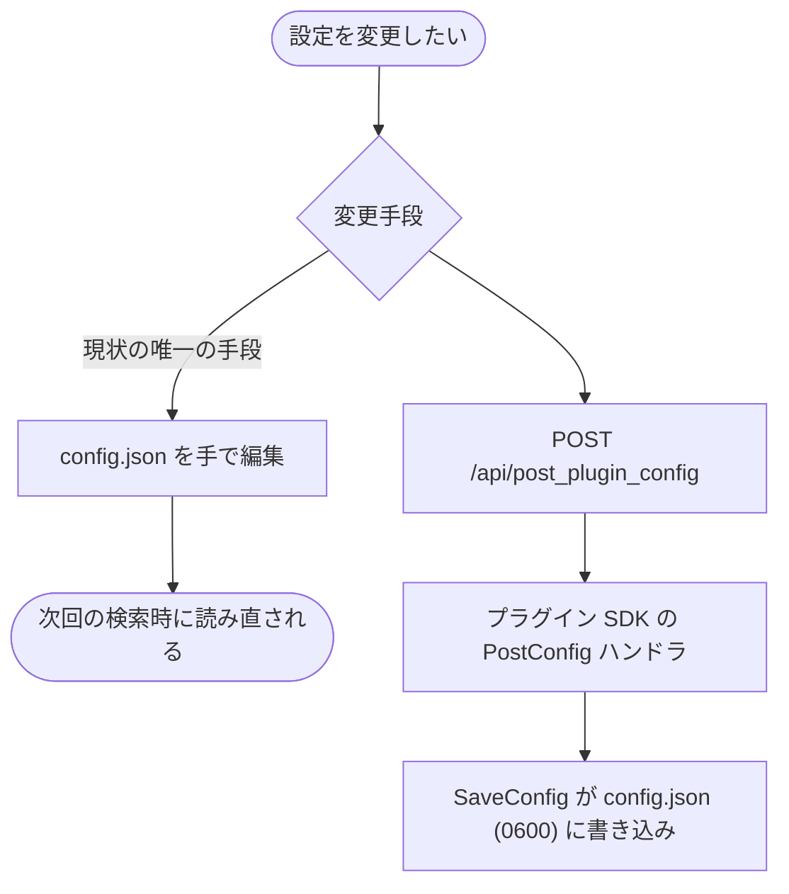
```mermaid
flowchart TD
    Start([設定を変更したい]) --> Which{変更手段}

    Which -->|現状の唯一の手段| EditFile[config.json を手で編集]
    EditFile --> Reload([次回の検索時に読み直される])

    Which --> Api[POST /api/post_plugin_config]
    Api --> Sdk[プラグイン SDK の PostConfig ハンドラ]
    Sdk --> Save["SaveConfig が config.json (0600) に書き込み"]
```

保存はプラグイン Kyou のコンテキストメニュー「プラグイン設定」→ `plugin-config-dialog.vue` から行う。
iframe には `allow-same-origin` を与えていないため、iframe 内のフォームは
`postMessage({ gkill_plugin_config: {...} })` で親に保存を依頼し、親が `post_plugin_config` を呼ぶ。
MCP のプラグインツールは読み取り専用で `post_plugin_config` を公開していない。

## 11. クリップボードからファイル保存するフロー

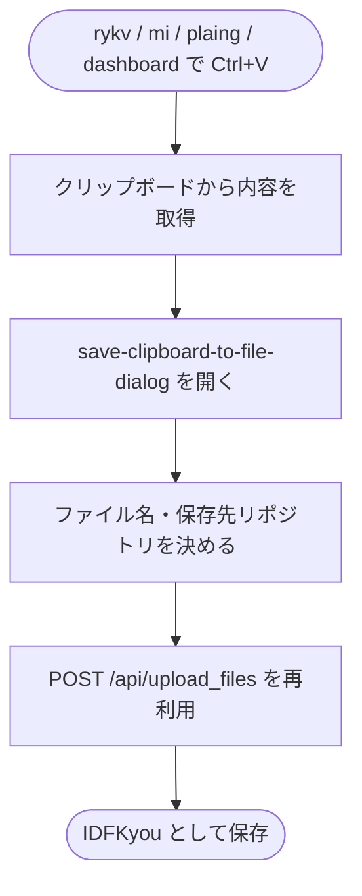
```mermaid
flowchart TD
    Start([rykv / mi / plaing / dashboard で Ctrl+V]) --> Read[クリップボードから内容を取得]
    Read --> Dialog[save-clipboard-to-file-dialog を開く]
    Dialog --> Name[ファイル名・保存先リポジトリを決める]
    Name --> Upload[POST /api/upload_files を再利用]
    Upload --> Done([IDFKyou として保存])
```

実装は `classes/use-save-clipboard-to-file-dialog.ts` と
`classes/use-scoped-ctrl-v-for-clipboard.ts`。専用の API は追加していない。

## 12. MiReKyou 作成フロー

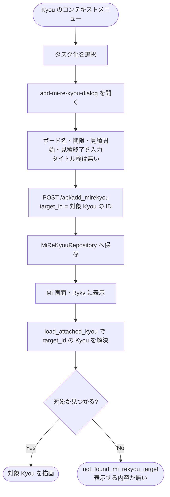
```mermaid
flowchart TD
    Start([Kyou のコンテキストメニュー]) --> Menu[タスク化を選択]
    Menu --> Dialog[add-mi-re-kyou-dialog を開く]
    Dialog --> Fields[ボード名・期限・見積開始・見積終了を入力<br>タイトル欄は無い]
    Fields --> Api[POST /api/add_mirekyou<br>target_id = 対象 Kyou の ID]
    Api --> Save[MiReKyouRepository へ保存]
    Save --> Show[Mi 画面・Rykv に表示]

    Show --> Load[load_attached_kyou で target_id の Kyou を解決]
    Load --> Found{対象が見つかる?}
    Found -->|Yes| Render([対象 Kyou を描画])
    Found -->|No| NotFound([not_found_mi_rekyou_target<br>表示する内容が無い])
```

MiReKyou はタイトルを持たないため、対象 Kyou が削除されると表示できるものが無くなる。
ただし**画面から対象 Kyou を削除した場合は、その MiReKyou も連鎖して論理削除される**ので、
この状態は通常見えない（`classes/cascade-delete-kyou.ts`。→ 本資料「Kyou 連鎖削除フロー」）。
見えるのは連鎖削除が途中で失敗して部分確定した場合や、MCP・他クライアントから対象 Kyou だけを消した場合。
また `DATA_TYPE` は `mirekyou_create` / `_check` / `_limit` / `_start` / `_end` の5種に射影され、
いずれも `mi` で始まるので前方一致判定では `mirekyou` を先に評価する必要がある。

## 13. Kyou 連鎖削除フロー

Kyou を削除すると、付随する Tag / Text / Notification と、それを参照している ReKyou / MiReKyou も
まとめて論理削除する（`classes/cascade-delete-kyou.ts`）。**探索（read）と削除（write）を完全に分ける**のが要点で、
サーバの `FindKyous` は参照先が削除済みの ReKyou を検索結果から外すため、先に消してしまうと参照元を辿れなくなる。

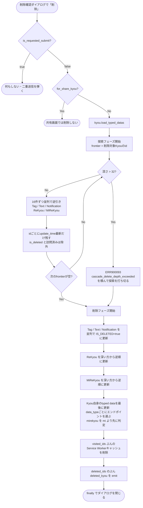
```mermaid
flowchart TD
    Start([削除確認ダイアログで「削除」]) --> Guard{is_requested_submit?}
    Guard -->|true| Ignore([何もしない・二重送信を弾く])
    Guard -->|false| Share{for_share_kyou?}
    Share -->|Yes| NoOp([共有画面では削除しない])
    Share -->|No| Load[kyou.load_typed_datas]
    Load --> Discover[探索フェーズ開始<br>frontier = 削除対象Kyouのid]

    Discover --> DepthCheck{深さ > 32?}
    DepthCheck -->|Yes| DepthErr[ERR900093<br>cascade_delete_depth_exceeded<br>を積んで探索を打ち切る]
    DepthCheck -->|No| Fetch[16件ずつ並列で逆引き<br>Tag / Text / Notification<br>ReKyou / MiReKyou]
    Fetch --> Dedupe[idごとにupdate_time最新だけ残す<br>is_deleted と訪問済みは除外]
    Dedupe --> More{次のfrontierが空?}
    More -->|No| DepthCheck
    More -->|Yes| Mutate[削除フェーズ開始]
    DepthErr --> Mutate

    Mutate --> Attached[Tag / Text / Notification を<br>並列で IS_DELETED=true に更新]
    Attached --> ReKyou[ReKyou を深い方から逆順に更新]
    ReKyou --> MiReKyou[MiReKyou を深い方から逆順に更新]
    MiReKyou --> Body[Kyou自身のtyped dataを最後に更新<br>data_typeごとにエンドポイントを選ぶ<br>mirekyou を mi より先に判定]
    Body --> Cache[visited_ids ぶんの<br>Service Workerキャッシュを削除]
    Cache --> Emit[deleted_ids のぶん deleted_kyou を emit]
    Emit --> Close([finally でダイアログを閉じる])
```

**Tag / Text / Notification の逆引きだけ `force_reget=true`。** Service Worker が `target_id` 単位で
キャッシュしているため、古い一覧のまま消すと取りこぼす（ReKyou / MiReKyou の逆引きには付けていない）。

**原子性は無い。** TXID / commit_tx は使わない。1本失敗しても止めずに全部投げ、
エラーは `ERR900094 cascade_delete_failed` として集約して返す。途中で失敗しても
Kyou 自身が最後まで生きていれば、同じダイアログをもう一度開くだけで残骸を再発見できる。
