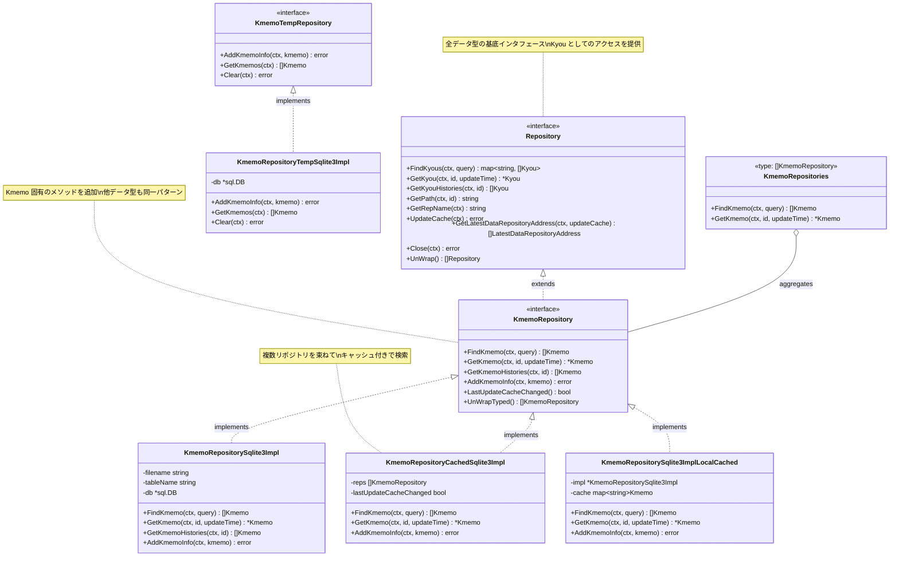
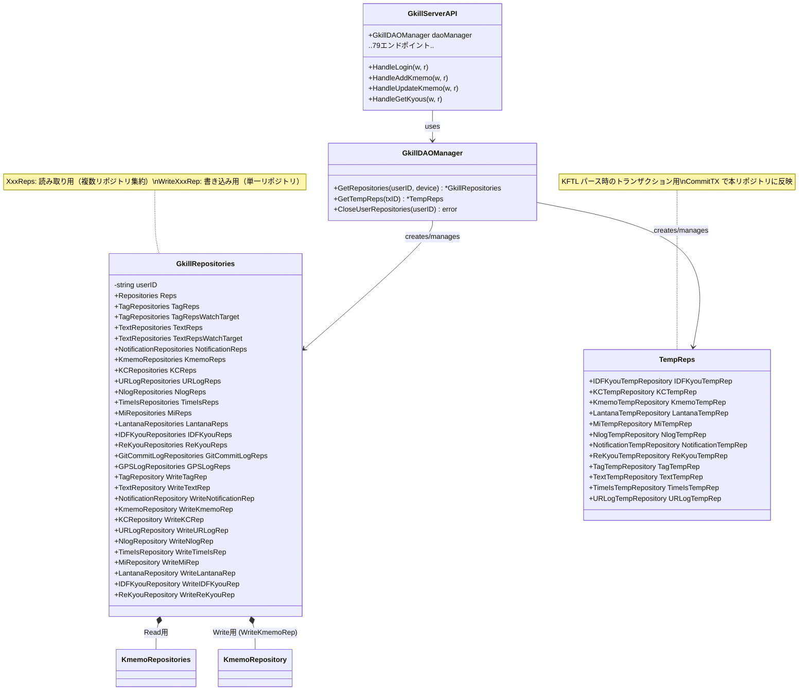
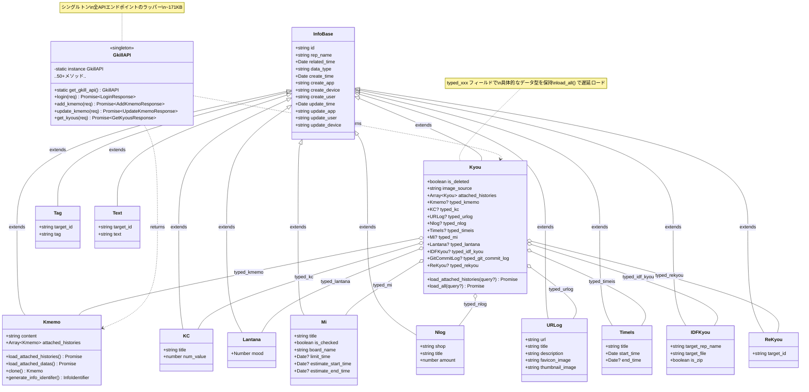

# gkill クラス図

コードの struct/interface 定義から抽出したクラス図。

## 1. Kyou エンティティ階層（Go バックエンド）

全データ型は共通フィールドを持つ。Go には継承がないため、各構造体が独立して同一フィールドを定義する設計。

```mermaid
classDiagram
    class Kyou {
        +bool IsDeleted
        +string ID
        +string RepName
        +time.Time RelatedTime
        +string DataType
        +time.Time CreateTime
        +string CreateApp
        +string CreateDevice
        +string CreateUser
        +time.Time UpdateTime
        +string UpdateApp
        +string UpdateUser
        +string UpdateDevice
        +bool IsImage
        +bool IsVideo
    }

    class Kmemo {
        +bool IsDeleted
        +string ID
        +string RepName
        +time.Time RelatedTime
        +string DataType
        +string Content
        +time.Time CreateTime
        +time.Time UpdateTime
        ..共通メタフィールド省略..
    }

    class KC {
        +bool IsDeleted
        +string ID
        +string Title
        +json.Number NumValue
        +time.Time RelatedTime
        ..共通メタフィールド省略..
    }

    class Lantana {
        +bool IsDeleted
        +string ID
        +int Mood
        +time.Time RelatedTime
        ..共通メタフィールド省略..
    }

    class Mi {
        +bool IsDeleted
        +string ID
        +string Title
        +bool IsChecked
        +string BoardName
        +*time.Time LimitTime
        +*time.Time EstimateStartTime
        +*time.Time EstimateEndTime
        ..共通メタフィールド省略..
    }

    class Nlog {
        +bool IsDeleted
        +string ID
        +string Shop
        +string Title
        +json.Number Amount
        +time.Time RelatedTime
        ..共通メタフィールド省略..
    }

    class URLog {
        +bool IsDeleted
        +string ID
        +string URL
        +string Title
        +string Description
        +string FaviconImage
        +string ThumbnailImage
        +time.Time RelatedTime
        ..共通メタフィールド省略..
    }

    class TimeIs {
        +bool IsDeleted
        +string ID
        +string Title
        +time.Time StartTime
        +*time.Time EndTime
        ..共通メタフィールド省略..
    }

    class Tag {
        +bool IsDeleted
        +string ID
        +string TargetID
        +string Tag
        +time.Time RelatedTime
        ..共通メタフィールド省略..
    }

    class Text {
        +bool IsDeleted
        +string ID
        +string TargetID
        +string Text
        +time.Time RelatedTime
        ..共通メタフィールド省略..
    }

    class Notification {
        +bool IsDeleted
        +string ID
        +string TargetID
        +time.Time NotificationTime
        +string Content
        +bool IsNotificated
        ..共通メタフィールド省略..
    }

    class ReKyou {
        +bool IsDeleted
        +string ID
        +string TargetID
        +time.Time RelatedTime
        ..共通メタフィールド省略..
    }

    class IDFKyou {
        +bool IsDeleted
        +string ID
        +string TargetRepName
        +string TargetFile
        +bool IsZip
        +time.Time RelatedTime
        ..共通メタフィールド省略..
    }

    Tag --> Kyou : TARGET_ID で紐づく
    Text --> Kyou : TARGET_ID で紐づく
    Notification --> Kyou : TARGET_ID で紐づく
    ReKyou --> Kyou : TARGET_ID でリポスト

    note for Kyou "全データ型の集約ビュー表現\nDataType フィールドで型を識別\nAPI レスポンスで統一的に返却"
```



### 共通フィールドの説明

全エンティティが持つ共通フィールド（`Kyou` の DataType/IsImage/IsVideo 以外）:

| フィールド | 型 | 説明 |
|-----------|---|------|
| `IsDeleted` | bool | 論理削除フラグ |
| `ID` | string | UUID（主キーではない） |
| `RepName` | string | 所属リポジトリ名 |
| `RelatedTime` | time.Time | 関連日時（時系列表示用）。Mi/TimeIs/NotificationではDBカラムとして存在せず動的導出 |
| `CreateTime` | time.Time | 作成日時 |
| `CreateApp` | string | 作成アプリケーション名 |
| `CreateDevice` | string | 作成デバイス名 |
| `CreateUser` | string | 作成ユーザ名 |
| `UpdateTime` | time.Time | 更新日時（Append-Only のバージョン識別子） |
| `UpdateApp` | string | 更新アプリケーション名 |
| `UpdateDevice` | string | 更新デバイス名 |
| `UpdateUser` | string | 更新ユーザ名 |

## 2. Repository 4層パターン

Kmemo を例に4層の実装構造を示す。他のデータ型（KC, Lantana, Mi, Nlog, URLog, TimeIs, Tag, Text, Notification, ReKyou, IDFKyou）も同一パターン。



### 他データ型のリポジトリ（同一パターン）

| データ型 | Repository Interface | SQLite3 Impl | Cached Impl | Temp Repository |
|---------|---------------------|-------------|-------------|-----------------|
| KC | KCRepository | KCRepositorySqlite3Impl | KCRepositoryCachedSqlite3Impl | KCTempRepository |
| Lantana | LantanaRepository | LantanaRepositorySqlite3Impl | LantanaRepositoryCachedSqlite3Impl | LantanaTempRepository |
| Mi | MiRepository | MiRepositorySqlite3Impl | MiRepositoryCachedSqlite3Impl | MiTempRepository |
| Nlog | NlogRepository | NlogRepositorySqlite3Impl | NlogRepositoryCachedSqlite3Impl | NlogTempRepository |
| URLog | URLogRepository | URLogRepositorySqlite3Impl | URLogRepositoryCachedSqlite3Impl | URLogTempRepository |
| TimeIs | TimeIsRepository | TimeIsRepositorySqlite3Impl | TimeIsRepositoryCachedSqlite3Impl | TimeIsTempRepository |
| Tag | TagRepository | TagRepositorySqlite3Impl | TagRepositoryCachedSqlite3Impl | TagTempRepository |
| Text | TextRepository | TextRepositorySqlite3Impl | TextRepositoryCachedSqlite3Impl | TextTempRepository |
| Notification | NotificationRepository | NotificationRepositorySqlite3Impl | NotificationRepositoryCachedSqlite3Impl | NotificationTempRepository |
| ReKyou | ReKyouRepository | ReKyouRepositorySqlite3Impl | ReKyouRepositoryCachedSqlite3Impl | ReKyouTempRepository |
| IDFKyou | IDFKyouRepository | IDFKyouRepositorySqlite3Impl | IDFKyouRepositoryCachedSqlite3Impl | IDFKyouTempRepository |
| GitCommitLog | GitCommitLogRepository | GitCommitLogRepositoryLocalDirImpl | GitCommitLogRepositoryCachedSqlite3Impl | — |
| GPSLog | GPSLogRepository | GPSLogRepositoryGpxDirImpl | — | — |

> **注意:** GitCommitLog と GPSLog は他のデータ型と異なるパターンです。
> - **GitCommitLog**: SQLite3ではなくローカルGitリポジトリから直接読み取る実装（`LocalDirImpl`）。キャッシュ層あり、Tempリポジトリなし（KFTL経由の追加がないため）。
> - **GPSLog**: GPXファイルから直接読み取る実装（`GpxDirImpl`）。キャッシュ層・Tempリポジトリともになし（読み取り専用）。

## 3. GkillRepositories 集約構造



## 4. KFTL パーサ クラス構造

```mermaid
classDiagram
    class KFTLStatement {
        +string StatementText
        +GenerateAndExecuteRequests(ctx, repos, config, ...) error
    }

    class kftlFactory {
        -bool prevLineIsMetaInfo
        +reset()
        +generateKmemoConstructor(nextLineText) StatementLineConstructorFunc
        +generateKCConstructor(nextLineText) StatementLineConstructorFunc
        +generateLantanaConstructor(nextLineText) StatementLineConstructorFunc
        +generateMiConstructor(nextLineText) StatementLineConstructorFunc
        +generateNlogConstructor(nextLineText) StatementLineConstructorFunc
        +generateTimeIsConstructor(nextLineText) StatementLineConstructorFunc
        +generateURLogConstructor(nextLineText) StatementLineConstructorFunc
    }

    class KFTLStatementLine {
        <<interface>>
        +ApplyThisLineToRequestMap(ctx, requestMap) error
        +GetLabelName() string
        +GetContext() *KFTLStatementLineContext
        +GetStatementLineText() string
    }

    class KFTLStatementLineContext {
        +time.Time BaseTime
        +int AddSecond
        +string UserID
        +string Device
        +string AppName
        +*GkillRepositories Repos
    }

    class KFTLRequest {
        <<interface>>
        +DoRequest(ctx) error
        +GetRequestID() string
        +GetTags() []string
        +GetTextsMap() map~string,string~
        +GetRelatedTime() time.Time
        +SetRelatedTime(t)
        +AddTag(tag)
        +AddTextLine(textID, line)
    }

    class KFTLRequestBase {
        +string RequestID
        +[]string Tags
        +map~string,string~ TextsMap
        +*string CurrentTextID
        +*time.Time relatedTime
        +*KFTLStatementLineContext Ctx
        +time.Time CreateTime
    }

    class KFTLRequestMap {
        -map~string~KFTLRequest requestMap
        +GetOrCreateRequest(id, factory) KFTLRequest
        +ExecuteAll(ctx) error
    }

    class KFTLKmemoStatementLine {
        +ApplyThisLineToRequestMap(ctx, requestMap) error
    }
    class KFTLKCStatementLine {
        +ApplyThisLineToRequestMap(ctx, requestMap) error
    }
    class KFTLMiStatementLine {
        +ApplyThisLineToRequestMap(ctx, requestMap) error
    }
    class KFTLTagStatementLine {
        +ApplyThisLineToRequestMap(ctx, requestMap) error
    }
    class KFTLTextStatementLine {
        +ApplyThisLineToRequestMap(ctx, requestMap) error
    }
    class KFTLSplitStatementLine {
        +ApplyThisLineToRequestMap(ctx, requestMap) error
    }

    class KFTLKmemoRequest {
        +DoRequest(ctx) error
    }
    class KFTLKCRequest {
        +DoRequest(ctx) error
    }
    class KFTLTimeIsRequest {
        +DoRequest(ctx) error
    }
    class KFTLTimeIsStartRequest {
        +DoRequest(ctx) error
    }
    class KFTLTimeIsEndByTagRequest {
        +DoRequest(ctx) error
    }

    KFTLStatement --> kftlFactory : uses
    KFTLStatement --> KFTLRequestMap : builds
    kftlFactory --> KFTLStatementLine : creates
    KFTLStatementLine <|.. KFTLKmemoStatementLine : implements
    KFTLStatementLine <|.. KFTLKCStatementLine : implements
    KFTLStatementLine <|.. KFTLMiStatementLine : implements
    KFTLStatementLine <|.. KFTLTagStatementLine : implements
    KFTLStatementLine <|.. KFTLTextStatementLine : implements
    KFTLStatementLine <|.. KFTLSplitStatementLine : implements
    KFTLRequest <|.. KFTLRequestBase : base impl
    KFTLRequestBase <|-- KFTLKmemoRequest : extends
    KFTLRequestBase <|-- KFTLKCRequest : extends
    KFTLRequestBase <|-- KFTLTimeIsRequest : extends
    KFTLRequestBase <|-- KFTLTimeIsStartRequest : extends
    KFTLRequestBase <|-- KFTLTimeIsEndByTagRequest : extends
    KFTLRequestMap o-- KFTLRequest : manages
    KFTLStatementLine --> KFTLStatementLineContext : uses

    note for kftlFactory "行頭プレフィックスで\nStatementLine型を決定\nprevLineIsMetaInfo で状態管理"
```



## 5. フロントエンド データモデル（TypeScript）



### ZIP閲覧関連の構造体

| 構造体 (Go) | 説明 |
|-------------|------|
| `ZipEntry` | ZIP内のファイルエントリ情報。ファイル名（`Name`）、サイズ（`Size`）、パス（`Path`）等を含む |
| `BrowseZipContentsRequest` | `/api/browse_zip_contents` のリクエスト構造体。`SessionID`、対象IDFKyouのID等を含む |
| `BrowseZipContentsResponse` | `/api/browse_zip_contents` のレスポンス構造体。`ZipEntries []ZipEntry`、共通の `Messages`/`Errors` を含む |

### Go ↔ TypeScript の対応関係

| Go struct | TypeScript class | 備考 |
|-----------|-----------------|------|
| `reps.Kyou` | `Kyou` | TS 側は `typed_xxx` で型付きデータを保持 |
| `reps.Kmemo` | `Kmemo` | `content` ↔ `Content` |
| `reps.KC` | `KC` | `num_value` ↔ `NumValue` |
| `reps.IDFKyou` | `IDFKyou` | `is_zip` ↔ `IsZip` |
| `reps.Mi` | `Mi` | `is_checked` ↔ `IsChecked` |
| `reps.TimeIs` | `TimeIs` | `start_time` / `end_time` |
| `reps.Tag` | `Tag` | `target_id` ↔ `TargetID` |
| `find.FindQuery` | `FindKyouQuery` | 検索条件 |

命名規則: Go は PascalCase、TypeScript は snake_case。JSON シリアライズ時のキー名で対応。

## 6. DNote 集計システム（TypeScript フロントエンド）

> **スペルについて:** コードベースでは `Agregate`（正しくは `Aggregate`）が一貫して使用されています（`DnoteAgregateTarget`, `AgregateAverageKcNumValue` 等）。本資料ではコードの命名をそのまま記載しています。

```mermaid
classDiagram
    class DnotePredicate {
        <<interface>>
        +is_match(loaded_kyou, target_kyou) Promise~boolean~
        +predicate_struct_to_json() any
    }

    class AndPredicate {
        +Array~DnotePredicate~ predicates
        +is_match(loaded_kyou, target_kyou) Promise~boolean~
    }
    class OrPredicate {
        +Array~DnotePredicate~ predicates
        +is_match(loaded_kyou, target_kyou) Promise~boolean~
    }
    class NotPredicate {
        +DnotePredicate predicate
        +is_match(loaded_kyou, target_kyou) Promise~boolean~
    }
    class TagEqualPredicate {
        +string tag_name
        +is_match(loaded_kyou, target_kyou) Promise~boolean~
    }
    class KmemoContentContainPredicate {
        +string keyword
        +is_match(loaded_kyou, target_kyou) Promise~boolean~
    }
    class LantanaMoodEqualPredicate {
        +number mood
        +is_match(loaded_kyou, target_kyou) Promise~boolean~
    }
    class RelatedTimeBetweenPredicate {
        +Date start
        +Date end
        +is_match(loaded_kyou, target_kyou) Promise~boolean~
    }

    DnotePredicate <|.. AndPredicate : implements
    DnotePredicate <|.. OrPredicate : implements
    DnotePredicate <|.. NotPredicate : implements
    DnotePredicate <|.. TagEqualPredicate : implements
    DnotePredicate <|.. KmemoContentContainPredicate : implements
    DnotePredicate <|.. LantanaMoodEqualPredicate : implements
    DnotePredicate <|.. RelatedTimeBetweenPredicate : implements

    class DnoteAgregateTarget {
        <<interface>>
        +append_agregate_element_value(value, kyou, query) Promise~any~
        +result_to_string(value) Promise~string~
        +to_json() any
    }

    class AgregateAverageKcNumValue {
        +append_agregate_element_value(value, kyou, query) Promise~any~
        +result_to_string(value) Promise~string~
    }
    class AgregateSumNlogAmount {
        +append_agregate_element_value(value, kyou, query) Promise~any~
        +result_to_string(value) Promise~string~
    }
    class AgregateCountKyou {
        +append_agregate_element_value(value, kyou, query) Promise~any~
        +result_to_string(value) Promise~string~
    }

    DnoteAgregateTarget <|.. AgregateAverageKcNumValue : implements
    DnoteAgregateTarget <|.. AgregateSumNlogAmount : implements
    DnoteAgregateTarget <|.. AgregateCountKyou : implements

    class DnoteKeyGetter {
        <<interface>>
        +get_keys(loaded_kyou) Array~string~
        +to_json() any
    }

    class RelatedDateGetter {
        +get_keys(loaded_kyou) Array~string~
    }
    class TagGetter {
        +get_keys(loaded_kyou) Array~string~
    }
    class DataTypeGetter {
        +get_keys(loaded_kyou) Array~string~
    }
    class RelatedWeekDayGetter {
        +get_keys(loaded_kyou) Array~string~
    }

    DnoteKeyGetter <|.. RelatedDateGetter : implements
    DnoteKeyGetter <|.. TagGetter : implements
    DnoteKeyGetter <|.. DataTypeGetter : implements
    DnoteKeyGetter <|.. RelatedWeekDayGetter : implements

    class DnoteAggregator {
        +DnotePredicate predicate
        +DnoteKeyGetter key_getter
        +DnoteAgregateTarget agregate_target
        +aggregate(kyous) Map~string, any~
    }

    DnoteAggregator --> DnotePredicate : フィルタリング
    DnoteAggregator --> DnoteKeyGetter : グルーピング
    DnoteAggregator --> DnoteAgregateTarget : 集計

    note for DnotePredicate "AND/OR/NOT の論理演算で\n組み合わせ可能な述語パターン\n30+種類の具象クラス"
    note for DnoteAgregateTarget "平均/合計/最大/最小/カウント\n22種類の集計対象"
    note for DnoteKeyGetter "日付/曜日/週/月/タグ/データ型等\n9種類のグルーピングキー"
```



### DNote の処理フロー（クラス間の連携）

```
DnoteAggregator
  1. DnotePredicate.is_match() でフィルタリング
  2. DnoteKeyGetter.get_keys() でグルーピング
  3. DnoteAgregateTarget.append_agregate_element_value() で集計
  4. DnoteAgregateTarget.result_to_string() で結果文字列化
```

### DNote 述語の全実装クラス

| カテゴリ | 実装クラス |
|---------|-----------|
| 論理演算 | AndPredicate, OrPredicate, NotPredicate |
| Kmemo | KmemoContentContainPredicate, KmemoContentNotContainPredicate |
| KC | KcTitleContainPredicate, KcTitleNotContainPredicate |
| Lantana | LantanaMoodContainPredicate, LantanaMoodEqualPredicate, LantanaMoodNotContainPredicate |
| Mi | MiTitleContainPredicate, MiTitleNotContainPredicate |
| Nlog | NlogAmountContainPredicate, NlogAmountNotContainPredicate, NlogShopNameContainPredicate, NlogShopNameNotContainPredicate, NlogTitleContainPredicate |
| TimeIs | TimeisTitleContainPredicate, TimeisTitleNotContainPredicate |
| Text | TextContentContainPredicate, TextContentNotContainPredicate |
| GitCommitLog | GitCommitLogCodeAddContainPredicate, GitCommitLogCodeDeleteContainPredicate, GitCommitLogCodeDiffContainPredicate, (+ Not variants) |
| 時刻 | RelatedTimeBetweenPredicate, RelatedTimeNotBetweenPredicate, RelatedTimeInTodayPredicate |
| タグ | TagEqualPredicate |
| データ型 | DataTypePrefixPredicate |
| 対象Kyou | EqualRepDataTypeTargetKyouPredicate, EqualTagsTargetKyouPredicate, EqualTitleTargetKyouPredicate |
