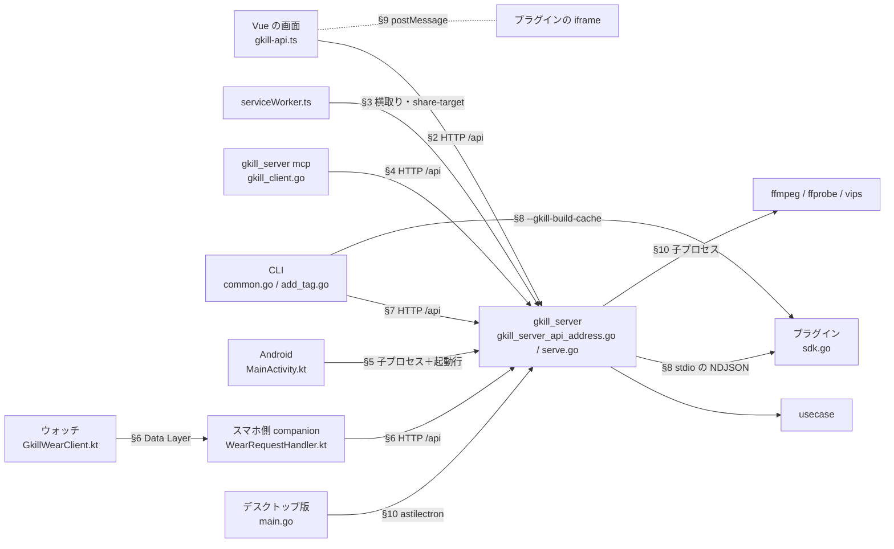

# 言語・プロセス境界の対応表

gkill では、制御やデータが**言語やプロセスの境目を越えるところ**を、呼び出しグラフでは辿れない。
画面の TypeScript が Go のハンドラを呼ぶとき、両者をつないでいるのは `"/api/add_kmemo"` という**文字列だけ**で、
CodeGraph や Graphify のような「関数から関数への呼び出し」を集めた道具には、その先が見えない
（`graphify path "GkillAPI" "HandleGetKyous()"` は「経路なし」になる）。

この資料は、そういう**文字列だけでつながっている箇所を1か所に集めた対応表**である。

- **深さは境目まで。** 境目の手前と向こう（どの画面がそのメソッドを呼ぶか、ハンドラの中で何が起きるか）は、同じ言語の中なので
  CodeGraph（`codegraph explore "<名前>"`）で辿れる。ここには境目をまたぐ1歩だけを書く。
- **表は手書きで、`npm run verify_docs` がコードと突き合わせる**（`src/tools/verify_docs.mjs` の `checkCrossBoundaryDoc`）。
  ルートや呼び出し先が増減すると、どの表のどの行が足りないかをエラーで教える（Web → Go の表は貼ればそのまま通る1行を出す）。
  表をコードから生成しない理由は [ADR-0709](../adr/0709-api-route-table-single-source.md) と同じ（生成は却下し、ソース走査の突き合わせを採った）。
- 各項目の意味や流れの詳細は既存の資料が持つ。API の各フィールドは [api-endpoints.md](api-endpoints.md)、処理の流れは
  [sequence-diagrams.md](sequence-diagrams.md) と [scenario.md](scenario.md)、プラグインの詳細は [plugin-system.md](plugin-system.md)。

## 0. 読み方と凡例

- 表は `<!-- BOUNDARY-TABLE:<名前>:BEGIN -->` 〜 `END` の目印で囲んである（検査がこの範囲を読む）。1列目のバッククォート内がキー。
  表の直後の `|` で始まらない行は注記。
- **※** … 命名規則から外れている箇所。規則は「`/api/xxx` ↔ `handle_xxx.go` ↔ `HandleXxx` ↔ TS の `xxx()` ↔ `UsecaseCtx.Xxx` ↔
  `XxxRequest` / `XxxResponse`」。**※ は外れているときだけ付く**（付け忘れも付けすぎも検査が落とす）ので、※ を追えば名前のずれを全部拾える。
- **— 非Web** … Web クライアントにアドレスが無いルート（MCP か CLI だけが叩く）。
- **— アドレスのみ** … GkillAPI にアドレスはあるが、`gkill_fetch` で叩くメソッドが無いもの（括弧内に使い道）。
- **直接** … ハンドラが usecase を通らず、DAO・リポジトリ・パッケージを直接使う。バッククォート内の字面はハンドラ本体に実在する（検査される）。
- **他経路** … Web の GkillAPI 以外にそのパスを叩く（または横取りする）もの。`SW`＝Service Worker、`MCP`、`CLI`、`Wear`＝スマホ側 companion、
  `配信HTML`＝Go が配る HTML の中のスクリプト。
- **TS 型** … Go と同じ型名なら `=`。
- MCP の表（§4）は、ツール全体と「MCP が叩く /api の全体」の一致を検査する。**ツール1つ1つとパスの対応までは検査しない**（呼び出しグラフが要るため）。

## 1. 境界の全体図

## 2. Web クライアント → Go（HTTP /api、全97ルート）

### 2.1 対応表

ルート表（`src/server/gkill/api/gkill_server_api/gkill_server_api_address.go` の `apiRoutes()`）と同じ並びで、1ルート1行。
TS 側はすべて `src/client/classes/api/gkill-api.ts` の `GkillAPI`、Go 側はすべて `src/server/gkill/api/gkill_server_api/` の中。
要求/応答の型は Go が `src/server/gkill/api/req_res/`、TS が `src/client/classes/api/req_res/`（ファイル名は snake_case ↔ kebab-case）。

<!-- BOUNDARY-TABLE:web-routes:BEGIN -->
| パス | M | 認証 | TS（GkillAPI） | 他経路 | Go ハンドラ | 実装ファイル | 委譲先 | Go 型（req / res） | TS 型 |
|---|---|---|---|---|---|---|---|---|---|
| `/api/login` | POST | authNone | `login()` | MCP Wear | `HandleLogin` | handle_login.go | 直接: `ConfigDAOs.AccountDAO` / `ConfigDAOs.LoginSessionDAO` | LoginRequest / LoginResponse | = |
| `/api/logout` | POST | authNone | `logout()` | — | `HandleLogout` | handle_logout.go | 直接: `getAccountFromSessionID` / `ConfigDAOs.LoginSessionDAO` / `GkillDAOManager.CloseUserRepositories` | LogoutRequest / LogoutResponse | = |
| `/api/reset_password` | POST | authNone | `reset_password()` | — | `HandleResetPassword` | handle_reset_password.go | 直接: `ConfigDAOs.AccountDAO`（リセット用トークンの発行） | ResetPasswordRequest / ResetPasswordResponse | = |
| `/api/set_new_password` | POST | authNone | `set_new_password()` | — | `HandleSetNewPassword` | handle_set_new_password.go | 直接: `ConfigDAOs.AccountDAO` / `ConfigDAOs.LoginSessionDAO`（全セッション失効） | SetNewPasswordRequest / SetNewPasswordResponse | = |
| `/api/get_shared_kyous` | POST | authNone | `get_shared_kyous()` | — | `HandleGetSharedKyous` | handle_get_shared_kyous.go | 直接: `ConfigDAOs.ShareKyouInfoDAO` / `GkillDAOManager.GetRepositories`（共有者の rep を型別に読む） | GetSharedKyousRequest / GetSharedKyousResponse | = |
| `/api/urlog_bookmarklet` | POST | authNone | — アドレスのみ（Go が配る HTML の inline script が叩く） | 配信HTML | `HandleURLogBookmarkletAddress` | handle_urlog_bookmarklet_address.go ※ | 直接: `repositories.WriteURLogRep` / `repositories.WriteThroughURLogCache` / `g.sendWebPushToTarget` | URLogBookmarkletRequest / — ※ | — |
| `/api/urlog_bookmarklet_page` | GET | authNone | — アドレスのみ（`use-application-config-view.ts` がブックマークレットの URL に使う） | — | `HandleURLogBookmarkletPage` | handle_urlog_bookmarklet_page.go | 直接: `urlogBookmarkletPageHTML`（HTML を返すだけ） | — / — ※ | — |
| `/api/get_kyous_mcp` | POST | authNone | — 非Web | MCP | `HandleGetKyousMCP` | handle_get_kyous_mcp.go | 直接: `g.FindFilter.FindKyous`（usecase の GetKyous は通らない） | GetKyousMCPRequest / GetKyousMCPResponse | — |
| `/api/get_rep_infos_mcp` | POST | authNone | — 非Web | MCP | `HandleGetRepInfosMCP` | handle_get_rep_infos_mcp.go | 直接: `repositories.WriteTargetRepNames` と各 rep 群 | GetRepInfosMCPRequest / GetRepInfosMCPResponse | — |
| `/api/upload_files` | POST | authNone | `upload_files()` | — | `HandleUploadFiles` | handle_upload_files.go | 直接: `repositories.WriteIDFKyouRep` / `repositories.WriteThroughIDFKyouCache` | UploadFilesRequest / UploadFilesResponse | = |
| `/api/upload_gpslog_files` | POST | authNone | `upload_gpslog_files()` | — | `HandleUploadGPSLogFiles` | handle_upload_gps_log_files.go ※ | 直接: `repositories.GPSLogReps` / `g.generateGPXFileContent` | UploadGPSLogFilesRequest / UploadGPSLogFilesResponse | = |
| `/api/upload_skill` | POST | authNone | `upload_skill()` | — | `HandleUploadSkill` | handle_upload_skill.go | 直接: `GkillDAOManager.SkillStore` | UploadSkillRequest / UploadSkillResponse | = |
| `/api/browse_zip_contents` | POST | authNone | `browse_zip_contents()` | — | `HandleBrowseZipContents` | handle_browse_zip_contents.go | 直接: `GkillDAOManager.GetRepositories`（ZIP を zip_cache へ展開） | BrowseZipContentsRequest / BrowseZipContentsResponse | = |
| `/api/get_idf_kyou_by_relative_path` | POST | authNone | `get_idf_kyou_by_relative_path()` | — | `HandleGetIDFKyouByRelativePath` | handle_get_idf_kyou_by_relative_path.go | 直接: `repositories.IDFKyouReps` | GetIDFKyouByRelativePathRequest / GetIDFKyouByRelativePathResponse | = |
| `/api/get_application_config` | POST | authSession | `get_application_config()` | SW MCP Wear | `HandleGetApplicationConfig` | handle_get_application_config.go | 直接: `ConfigDAOs.ApplicationConfigDAO` | GetApplicationConfigRequest / GetApplicationConfigResponse | = |
| `/api/get_server_configs` | POST | authSession | `get_server_configs()` | — | `HandleGetServerConfigs` | handle_get_server_configs.go | 直接: `ConfigDAOs.ServerConfigDAO` / `ConfigDAOs.AccountDAO` / `ConfigDAOs.RepositoryDAO` | GetServerConfigsRequest / GetServerConfigsResponse | = |
| `/api/update_application_config` | POST | authSession | `update_application_config()` | — | `HandleUpdateApplicationConfig` | handle_update_application_config.go | 直接: `ConfigDAOs.ApplicationConfigDAO` | UpdateApplicationConfigRequest / UpdateApplicationConfigResponse | = |
| `/api/update_account_status` | POST | authSession | `update_account_status()` | — | `HandleUpdateAccountStatus` | handle_update_account_status.go | 直接: `ConfigDAOs.AccountDAO` | UpdateAccountStatusRequest / UpdateAccountStatusResponse | = |
| `/api/update_user_reps` | POST | authSession | `update_user_reps()` | — | `HandleUpdateUserReps` | handle_update_user_reps.go | 直接: `ConfigDAOs.RepositoryDAO` | UpdateUserRepsRequest / UpdateUserRepsResponse | = |
| `/api/update_server_configs` | POST | authSession | `update_server_config()` ※ `update_server_configs_address` | — | `HandleUpdateServerConfigs` | handle_update_server_configs.go | 直接: `ConfigDAOs.ServerConfigDAO` / `g.ShutdownHTTPServer`（保存後にサーバを作り直す） | UpdateServerConfigsRequest / UpdateServerConfigsResponse | = |
| `/api/add_user` | POST | authSession | `add_account()` ※ | — | `HandleAddAccount` | handle_add_account.go ※ | 直接: `ConfigDAOs.AccountDAO` / `g.initializeNewUserReps` | AddAccountRequest / AddAccountResponse | = |
| `/api/generate_tls_file` | POST | authSession | `generate_tls_file()` | — | `HandleGenerateTLSFile` | handle_generate_tls_file.go | 直接: `g.getTLSFileNames`（自己署名証明書を書き出す） | GenerateTLSFileRequest / GenerateTLSFileResponse | = |
| `/api/get_gkill_notification_public_key` | POST | authSession | `get_gkill_notification_public_key()` | — | `HandleGetGkillNotificationPublicKey` | handle_get_gkill_notification_public_key.go | 直接: `ConfigDAOs.ServerConfigDAO`（VAPID 公開鍵） | GetGkillNotificationPublicKeyRequest / GetGkillNotificationPublicKeyResponse | = |
| `/api/register_gkill_notification` | POST | authSession | `register_gkill_notification()` | — | `HandleRegisterGkillNotification` | handle_register_gkill_notification.go | 直接: `ConfigDAOs.GkillNotificationTargetDAO` | RegisterGkillNotificationRequest / RegisterGkillNotificationResponse | = |
| `/api/open_directory` | POST | authSession | `open_directory()` | — | `HandleOpenDirectory` | handle_open_directory.go | 直接: `exec.Command`（サーバ設定のコマンドで開く） | OpenDirectoryRequest / OpenDirectoryResponse | = |
| `/api/open_file` | POST | authSession | `open_file()` | — | `HandleOpenFile` | handle_open_file.go | 直接: `exec.Command`（サーバ設定のコマンドで開く） | OpenFileRequest / OpenFileResponse | = |
| `/api/reload_repositories` | POST | authSession | `reload_repositories()` | — | `HandleReloadRepositories` | handle_reload_repositories.go | 直接: `GkillDAOManager.CloseUserRepositories` | ReloadRepositoriesRequest / ReloadRepositoriesResponse | = |
| `/api/get_updated_datas_by_time` | POST | authSession | `get_updated_datas_by_time()` | — | `HandleGetUpdatedDatasByTime` | handle_get_updated_datas_by_time.go | 直接: `repositories.LatestDataRepositoryAddressDAO` | GetUpdatedDatasByTimeRequest / GetUpdatedDatasByTimeResponse | = |
| `/api/update_cache` | POST | authSession | — 非Web | CLI | `HandleUpdateCache` | handle_update_cache.go | 直接: `repositories.UpdateCache` | UpdateCacheRequest / UpdateCacheResponse | — |
| `/api/get_plugin_list` | POST | authSession | `get_plugin_list()` | MCP | `HandleGetPluginList` | handle_get_plugin_list.go | 直接: `GetPluginManager` | GetPluginListRequest / GetPluginListResponse | = |
| `/api/get_plugin_content_html` | POST | authSession | `get_plugin_content_html()` | SW MCP | `HandleGetPluginContentHTML` | handle_get_plugin_content_html.go | 直接: `GetPluginManager` / `g.pluginContentHTMLCacheOf`（§8 の get_content_html） | GetPluginContentHTMLRequest / GetPluginContentHTMLResponse | = |
| `/api/parse_kftl_text` | POST | authSession | `parse_kftl_text()` | — | `HandleParseKFTLText` | handle_parse_kftl_text.go | 直接: `kftl.KFTLStatement`（解析だけ。書かない） | ParseKFTLTextRequest / ParseKFTLTextResponse | = |
| `/api/get_plugin_config_html` | POST | authSession | `get_plugin_config_html()` | — | `HandleGetPluginConfigHTML` | handle_get_plugin_config_html.go | 直接: `GetPluginManager`（§8 の get_config_html） | GetPluginConfigHTMLRequest / GetPluginConfigHTMLResponse | = |
| `/api/post_plugin_config` | POST | authSession | `post_plugin_config()` | — | `HandlePostPluginConfig` | handle_post_plugin_config.go | 直接: `GetPluginManager` / `g.pluginContentHTMLCacheOf`（§8 の post_config） | PostPluginConfigRequest / PostPluginConfigResponse | = |
| `/api/get_skill_list` | POST | authSession | `get_skill_list()` | MCP | `HandleGetSkillList` | handle_get_skill_list.go | 直接: `GkillDAOManager.SkillStore` | GetSkillListRequest / GetSkillListResponse | = |
| `/api/get_skill` | POST | authSession | `get_skill()` | MCP | `HandleGetSkill` | handle_get_skill.go | 直接: `GkillDAOManager.SkillStore` | GetSkillRequest / GetSkillResponse | = |
| `/api/download_skill` | POST | authSession | `download_skill()` | — | `HandleDownloadSkill` | handle_download_skill.go | 直接: `GkillDAOManager.SkillStore` | DownloadSkillRequest / DownloadSkillResponse | = |
| `/api/write_skill_file` | POST | authSession | — 非Web | MCP | `HandleWriteSkillFile` | handle_write_skill_file.go | 直接: `GkillDAOManager.SkillStore` | WriteSkillFileRequest / WriteSkillFileResponse | — |
| `/api/delete_skill` | POST | authSession | `delete_skill()` | MCP | `HandleDeleteSkill` | handle_delete_skill.go | 直接: `GkillDAOManager.SkillStore` | DeleteSkillRequest / DeleteSkillResponse | = |
| `/api/add_tag` | POST | authSessionRepos | `add_tag()` | MCP CLI | `HandleAddTag` | handle_add_tag.go | `UsecaseCtx.AddTag` | AddTagRequest / AddTagResponse | = |
| `/api/add_text` | POST | authSessionRepos | `add_text()` | MCP | `HandleAddText` | handle_add_text.go | `UsecaseCtx.AddText` | AddTextRequest / AddTextResponse | = |
| `/api/add_gkill_notification` | POST | authSessionRepos | `add_notification()` ※ | — | `HandleAddNotification` | handle_add_notification.go ※ | `UsecaseCtx.AddNotification` | AddNotificationRequest / AddNotificationResponse | = |
| `/api/add_kmemo` | POST | authSessionRepos | `add_kmemo()` | SW MCP | `HandleAddKmemo` | handle_add_kmemo.go | `UsecaseCtx.AddKmemo` | AddKmemoRequest / AddKmemoResponse | = |
| `/api/add_kc` | POST | authSessionRepos | `add_kc()` | MCP | `HandleAddKC` | handle_add_kc.go | `UsecaseCtx.AddKC` | AddKCRequest / AddKCResponse | = |
| `/api/add_urlog` | POST | authSessionRepos | `add_urlog()` | SW MCP | `HandleAddURLog` | handle_add_urlog.go | `UsecaseCtx.AddURLog` | AddURLogRequest / AddURLogResponse | = |
| `/api/add_nlog` | POST | authSessionRepos | `add_nlog()` | MCP | `HandleAddNlog` | handle_add_nlog.go | `UsecaseCtx.AddNlog` | AddNlogRequest / AddNlogResponse | = |
| `/api/add_timeis` | POST | authSessionRepos | `add_timeis()` | MCP | `HandleAddTimeis` | handle_add_timeis.go | `UsecaseCtx.AddTimeIs` ※ | AddTimeIsRequest / AddTimeIsResponse ※ | AddTimeisRequest / AddTimeisResponse |
| `/api/add_mi` | POST | authSessionRepos | `add_mi()` | MCP | `HandleAddMi` | handle_add_mi.go | `UsecaseCtx.AddMi` | AddMiRequest / AddMiResponse | = |
| `/api/add_lantana` | POST | authSessionRepos | `add_lantana()` | MCP | `HandleAddLantana` | handle_add_lantana.go | `UsecaseCtx.AddLantana` | AddLantanaRequest / AddLantanaResponse | = |
| `/api/add_rekyou` | POST | authSessionRepos | `add_rekyou()` | — | `HandleAddRekyou` | handle_add_rekyou.go | `UsecaseCtx.AddReKyou` ※ | AddReKyouRequest / AddReKyouResponse ※ | = |
| `/api/add_mirekyou` | POST | authSessionRepos | `add_mirekyou()` | — | `HandleAddMiReKyou` | handle_add_mirekyou.go | `UsecaseCtx.AddMiReKyou` | AddMiReKyouRequest / AddMiReKyouResponse | = |
| `/api/update_tag` | POST | authSessionRepos | `update_tag()` | MCP | `HandleUpdateTag` | handle_update_tag.go | `UsecaseCtx.UpdateTag` | UpdateTagRequest / UpdateTagResponse | = |
| `/api/update_text` | POST | authSessionRepos | `update_text()` | MCP | `HandleUpdateText` | handle_update_text.go | `UsecaseCtx.UpdateText` | UpdateTextRequest / UpdateTextResponse | = |
| `/api/update_gkill_notification` | POST | authSessionRepos | `update_notification()` ※ | MCP | `HandleUpdateNotification` | handle_update_notification.go ※ | `UsecaseCtx.UpdateNotification` | UpdateNotificationRequest / UpdateNotificationResponse | = |
| `/api/update_kmemo` | POST | authSessionRepos | `update_kmemo()` | MCP | `HandleUpdateKmemo` | handle_update_kmemo.go | `UsecaseCtx.UpdateKmemo` | UpdateKmemoRequest / UpdateKmemoResponse | = |
| `/api/update_kc` | POST | authSessionRepos | `update_kc()` | MCP | `HandleUpdateKC` | handle_update_kc.go | `UsecaseCtx.UpdateKC` | UpdateKCRequest / UpdateKCResponse | = |
| `/api/update_urlog` | POST | authSessionRepos | `update_urlog()` | MCP | `HandleUpdateURLog` | handle_update_urlog.go | `UsecaseCtx.UpdateURLog` | UpdateURLogRequest / UpdateURLogResponse | = |
| `/api/update_nlog` | POST | authSessionRepos | `update_nlog()` | MCP | `HandleUpdateNlog` | handle_update_nlog.go | `UsecaseCtx.UpdateNlog` | UpdateNlogRequest / UpdateNlogResponse | = |
| `/api/update_timeis` | POST | authSessionRepos | `update_timeis()` | MCP Wear | `HandleUpdateTimeis` | handle_update_timeis.go | `UsecaseCtx.UpdateTimeIs` ※ | UpdateTimeisRequest / UpdateTimeisResponse | = |
| `/api/update_lantana` | POST | authSessionRepos | `update_lantana()` | MCP | `HandleUpdateLantana` | handle_update_lantana.go | `UsecaseCtx.UpdateLantana` | UpdateLantanaRequest / UpdateLantanaResponse | = |
| `/api/update_idf_kyou` | POST | authSessionRepos | `update_idf_kyou()` | — | `HandleUpdateIDFKyou` | handle_update_idf_kyou.go | `UsecaseCtx.UpdateIDFKyou` | UpdateIDFKyouRequest / UpdateIDFKyouResponse | = |
| `/api/update_mi` | POST | authSessionRepos | `update_mi()` | MCP | `HandleUpdateMi` | handle_update_mi.go | `UsecaseCtx.UpdateMi` | UpdateMiRequest / UpdateMiResponse | = |
| `/api/update_rekyou` | POST | authSessionRepos | `update_rekyou()` | MCP | `HandleUpdateRekyou` | handle_update_rekyou.go | `UsecaseCtx.UpdateReKyou` ※ | UpdateReKyouRequest / UpdateReKyouResponse ※ | = |
| `/api/update_mirekyou` | POST | authSessionRepos | `update_mirekyou()` | MCP | `HandleUpdateMiReKyou` | handle_update_mirekyou.go | `UsecaseCtx.UpdateMiReKyou` | UpdateMiReKyouRequest / UpdateMiReKyouResponse | = |
| `/api/get_kyous` | POST | authSessionRepos | `get_kyous()` | CLI Wear | `HandleGetKyous` | handle_get_kyous.go | `UsecaseCtx.GetKyous` | GetKyousRequest / GetKyousResponse | = |
| `/api/get_kyou` | POST | authSessionRepos | `get_kyou()` | SW | `HandleGetKyou` | handle_get_kyou.go | `UsecaseCtx.GetKyouHistories` ※ | GetKyouRequest / GetKyouResponse | = |
| `/api/get_kmemo` | POST | authSessionRepos | `get_kmemo()` | SW MCP | `HandleGetKmemo` | handle_get_kmemo.go | `UsecaseCtx.GetKmemoHistories` ※ | GetKmemoRequest / GetKmemoResponse | = |
| `/api/get_kc` | POST | authSessionRepos | `get_kc()` | SW MCP | `HandleGetKC` | handle_get_kc.go | `UsecaseCtx.GetKCHistories` ※ | GetKCRequest / GetKCResponse | = |
| `/api/get_urlog` | POST | authSessionRepos | `get_urlog()` | SW MCP | `HandleGetURLog` | handle_get_urlog.go | `UsecaseCtx.GetURLogHistories` ※ | GetURLogRequest / GetURLogResponse | = |
| `/api/get_nlog` | POST | authSessionRepos | `get_nlog()` | SW MCP | `HandleGetNlog` | handle_get_nlog.go | `UsecaseCtx.GetNlogHistories` ※ | GetNlogRequest / GetNlogResponse | = |
| `/api/get_timeis` | POST | authSessionRepos | `get_timeis()` | SW MCP Wear | `HandleGetTimeis` | handle_get_timeis.go | `UsecaseCtx.GetTimeIsHistories` ※ | GetTimeisRequest / GetTimeisResponse | = |
| `/api/get_mi` | POST | authSessionRepos | `get_mi()` | SW MCP | `HandleGetMi` | handle_get_mi.go | `UsecaseCtx.GetMiHistories` ※ | GetMiRequest / GetMiResponse | = |
| `/api/get_lantana` | POST | authSessionRepos | `get_lantana()` | SW MCP | `HandleGetLantana` | handle_get_lantana.go | `UsecaseCtx.GetLantanaHistories` ※ | GetLantanaRequest / GetLantanaResponse | = |
| `/api/get_rekyou` | POST | authSessionRepos | `get_rekyou()` | SW MCP | `HandleGetRekyou` | handle_get_rekyou.go | `UsecaseCtx.GetReKyouHistories` ※ | GetReKyouRequest / GetReKyouResponse ※ | = |
| `/api/get_mirekyou` | POST | authSessionRepos | `get_mirekyou()` | SW MCP | `HandleGetMiReKyou` | handle_get_mirekyou.go | `UsecaseCtx.GetMiReKyouHistories` ※ | GetMiReKyouRequest / GetMiReKyouResponse | = |
| `/api/get_rekyous_by_target_id` | POST | authSessionRepos | `get_rekyous_by_target_id()` | — | `HandleGetReKyousByTargetID` | handle_get_re_kyous_by_target_id.go ※ | `UsecaseCtx.GetReKyousByTargetID` | GetReKyousByTargetIDRequest / GetReKyousByTargetIDResponse | = |
| `/api/get_mirekyous_by_target_id` | POST | authSessionRepos | `get_mirekyous_by_target_id()` | — | `HandleGetMiReKyousByTargetID` | handle_get_mi_re_kyous_by_target_id.go ※ | `UsecaseCtx.GetMiReKyousByTargetID` | GetMiReKyousByTargetIDRequest / GetMiReKyousByTargetIDResponse | = |
| `/api/get_git_commit_log` | POST | authSessionRepos | `get_git_commit_log()` | SW | `HandleGetGitCommitLog` | handle_get_git_commit_log.go | `UsecaseCtx.GetGitCommitLog` | GetGitCommitLogRequest / GetGitCommitLogResponse | = |
| `/api/get_idf_kyou` | POST | authSessionRepos | `get_idf_kyou()` | SW | `HandleGetIDFKyou` | handle_get_idf_kyou.go | `UsecaseCtx.GetIDFKyouHistories` ※ | GetIDFKyouRequest / GetIDFKyouResponse | = |
| `/api/get_mi_board_list` | POST | authSessionRepos | `get_mi_board_list()` | SW MCP | `HandleGetMiBoardList` | handle_get_mi_board_list.go | `UsecaseCtx.GetMiBoardList` | GetMiBoardRequest / GetMiBoardResponse ※ | = |
| `/api/get_all_tag_names` | POST | authSessionRepos | `get_all_tag_names()` | SW MCP | `HandleGetAllTagNames` | handle_get_all_tag_names.go | `UsecaseCtx.GetAllTagNames` | GetAllTagNamesRequest / GetAllTagNamesResponse | = |
| `/api/get_all_rep_names` | POST | authSessionRepos | `get_all_rep_names()` | SW MCP CLI | `HandleGetAllRepNames` | handle_get_all_rep_names.go | `UsecaseCtx.GetAllRepNames` | GetAllRepNamesRequest / GetAllRepNamesResponse | = |
| `/api/get_tags_by_id` | POST | authSessionRepos | `get_tags_by_target_id()` ※ | SW | `HandleGetTagsByTargetID` | handle_get_tags_by_target_id.go ※ | `UsecaseCtx.GetTagsByTargetID` | GetTagsByTargetIDRequest / GetTagsByTargetIDResponse | = |
| `/api/get_tag_histories_by_tag_id` | POST | authSessionRepos | `get_tag_histories_by_tag_id()` | MCP | `HandleGetTagHistoriesByTagID` | handle_get_tag_histories_by_tag_id.go | `UsecaseCtx.GetTagHistoriesByTagID` | GetTagHistoryByTagIDRequest / GetTagHistoryByTagIDResponse ※ | = |
| `/api/get_texts_by_id` | POST | authSessionRepos | `get_texts_by_target_id()` ※ | SW | `HandleGetTextsByTargetID` | handle_get_texts_by_target_id.go ※ | `UsecaseCtx.GetTextsByTargetID` | GetTextsByTargetIDRequest / GetTextsByTargetIDResponse | = |
| `/api/get_gkill_notifications_by_id` | POST | authSessionRepos | `get_notifications_by_target_id()` ※ | SW | `HandleGetNotificationsByTargetID` | handle_get_notifications_by_target_id.go ※ | `UsecaseCtx.GetNotificationsByTargetID` | GetNotificationsByTargetIDRequest / GetNotificationsByTargetIDResponse | = |
| `/api/get_text_histories_by_text_id` | POST | authSessionRepos | `get_text_history_by_text_id()` ※ `get_text_histories_by_text_id_address` | MCP | `HandleGetTextHistoriesByTextID` | handle_get_text_histories_by_text_id.go | `UsecaseCtx.GetTextHistoriesByTextID` | GetTextHistoryByTextIDRequest / GetTextHistoryByTextIDResponse ※ | = |
| `/api/get_gkill_notification_histories_by_notification_id` | POST | authSessionRepos | `get_notification_history_by_notification_id()` ※ `get_notification_histories_by_notification_id_address` | MCP | `HandleGetNotificationHistoriesByNotificationID` | handle_get_notification_histories_by_notification_id.go ※ | `UsecaseCtx.GetNotificationHistoriesByNotificationID` | GetNotificationHistoryByNotificationIDRequest / GetNotificationHistoryByNotificationIDResponse ※ | = |
| `/api/get_gps_log` | POST | authSessionRepos | `get_gps_log()` | MCP | `HandleGetGPSLog` | handle_get_gps_log.go | 直接: `repositories.GPSLogReps` | GetGPSLogRequest / GetGPSLogResponse | = |
| `/api/add_share_kyou_list_info` | POST | authSessionRepos | `add_share_kyou_list_info()` | — | `HandleAddShareKyouListInfo` | handle_add_share_kyou_list_info.go | 直接: `ConfigDAOs.ShareKyouInfoDAO` | AddShareKyouListInfoRequest / AddShareKyouListInfoResponse | = |
| `/api/update_share_kyou_list_info` | POST | authSessionRepos | `update_share_kyou_list_info()` | — | `HandleUpdateShareKyouListInfo` | handle_update_share_kyou_list_info.go | 直接: `ConfigDAOs.ShareKyouInfoDAO` | UpdateShareKyouListInfoRequest / UpdateShareKyouListInfoResponse | = |
| `/api/get_share_kyou_list_infos` | POST | authSessionRepos | `get_share_kyou_list_infos()` | — | `HandleGetShareKyouListInfos` | handle_get_share_kyou_list_infos.go | 直接: `ConfigDAOs.ShareKyouInfoDAO` | GetShareKyouListInfosRequest / GetShareKyouListInfosResponse | = |
| `/api/delete_share_kyou_list_infos` | POST | authSessionRepos | `delete_share_kyou_list_infos()` | — | `HandleDeleteShareKyouListInfos` | handle_delete_share_kyou_list_infos.go | 直接: `ConfigDAOs.ShareKyouInfoDAO` | DeleteShareKyouListInfoRequest / DeleteShareKyouListInfosResponse ※ | DeleteShareKyouListInfosRequest / DeleteShareKyouListInfosResponse |
| `/api/get_repositories` | POST | authSessionRepos | `get_repositories()` | — | `HandleGetRepositories` | handle_get_repositories.go | 直接: `ConfigDAOs.RepositoryDAO` | GetRepositoriesRequest / GetRepositoriesResponse | = |
| `/api/commit_tx` | POST | authSessionRepos | `commit_tx()` | — | `HandleCommitTx` | handle_commit_tx.go | 直接: `repositories.CommitTx`（1つの SQLite トランザクション） | CommitTxRequest / CommitTxResponse | CommitTXRequest / CommitTXResponse |
| `/api/discard_tx` | POST | authSessionRepos | `discard_tx()` | — | `HandleDiscardTX` | handle_discard_tx.go | 直接: `repositories.DiscardTx` | DiscardTxRequest / DiscardTxResponse ※ | DiscardTXRequest / DiscardTXResponse |
| `/api/submit_kftl_text` | POST | authSessionRepos | `submit_kftl_text()` | MCP Wear | `HandleSubmitKFTLText` | handle_submit_kftl_text.go | 直接: `kftl.KFTLStatement` / `kftlIdempotencyStore`（冪等キー） | SubmitKFTLTextRequest / SubmitKFTLTextResponse | = |
<!-- BOUNDARY-TABLE:web-routes:END -->

### 2.2 共有ページ（GkillAPIForSharedKyou）の振る舞い

共有リンクで開く画面は、`GkillAPI` を継承した `GkillAPIForSharedKyou`（同じ `gkill-api.ts`）を使う。上の表の TS メソッドは次のように振る舞いが変わる。

- **書き込み・認証・設定の書き換え**（add / update 系、login、サーバ設定、共有リストの操作など）は `not implements` を投げる。
- **読み取り**（種類ごとの取得、`get_kyous`、タグ・テキスト・通知、GPS ログ、アプリ設定など）は、最初に受け取った共有データの配列から返し、サーバへは行かない。
- `get_shared_kyous()` だけは親のメソッドを呼んでサーバへ行く（共有データそのものを取る）。
- 上書きしていないもの（通知の購読、ファイル・フォルダを開く、`reload_repositories`、`commit_tx` / `discard_tx`、KFTL、ZIP、IDF の相対パス、
  プラグイン、スキル）は親のまま、表のとおりサーバへ行く。

### 2.3 名前がずれる種類

表の ※ が正本。ここでは種類ごとに例を1つ2つだけ挙げる（全件の一覧は作らない。表とずれるので）。

- **パスとハンドラ・ファイル名**: `/api/add_user` → `HandleAddAccount`（handle_add_account.go）、`/api/get_tags_by_id` → `HandleGetTagsByTargetID`。
- **TS のメソッド名とフィールド名**: `get_text_history_by_text_id()` が `get_text_histories_by_text_id_address` を使う。`/api/add_user` の TS は `add_account()`。
- **usecase**: 1件の取得は `Get<型>Histories`（`/api/get_kmemo` → `UsecaseCtx.GetKmemoHistories`）。大文字小文字だけの違い（`HandleAddTimeis` → `UsecaseCtx.AddTimeIs`）。
- **型名**: TS の `CommitTXRequest` と Go の `CommitTxRequest`、TS の `AddTimeisRequest` と Go の `AddTimeIsRequest`。
- **要求/応答のファイルが対にならないもの**は §12。

## 3. ブラウザの中で GkillAPI を通らない経路

### 3.1 Service Worker

`src/client/serviceWorker.ts` は、画面の `fetch` を横取りしてキャッシュから返すほか、Web Share Target の受け口として自分で `/api` を叩く。
キャッシュのキーは Service Worker と画面側（delete-gkill-cache.ts）がそれぞれ文字列で組むので、片方だけ変えると古いキャッシュが返り続ける。

<!-- BOUNDARY-TABLE:service-worker:BEGIN -->
| パス | Service Worker の扱い | 備考 |
|---|---|---|
| `/api/get_kyou` `/api/get_kmemo` `/api/get_kc` `/api/get_urlog` `/api/get_nlog` `/api/get_timeis` `/api/get_mi` `/api/get_lantana` `/api/get_rekyou` `/api/get_mirekyou` `/api/get_git_commit_log` `/api/get_idf_kyou` `/api/get_tags_by_id` `/api/get_texts_by_id` `/api/get_gkill_notifications_by_id` | キャッシュ `gkill-post-kyou-cache`、キー `/cache/api/<型>/<id>`。`force_reget` なら素通し | 増やしたら delete-gkill-cache.ts の種類の一覧にも足す |
| `/api/get_plugin_content_html` | 同じキャッシュ、キー `/cache/api/plugin_content_html/<kyou_id>` | |
| `/api/get_all_rep_names` `/api/get_all_tag_names` `/api/get_mi_board_list` `/api/get_application_config` | キャッシュ `gkill-post-config-cache` | `/api/get_application_config` は share-target の保存でも自分で叩く |
| `/api/add_urlog` `/api/add_kmemo` | share-target（`/share-target` への POST）を受けて自分で `fetch` する。セッションは Cookie `gkill_session_id` | 保存後に `/saihate?...` へ 303。二重保存は share-target-dedup.ts の台帳で確認へ回す |
<!-- BOUNDARY-TABLE:service-worker:END -->

### 3.2 /api 以外のサーバの経路

`src/server/gkill/api/gkill_server_api/serve.go` が `/api` の表とは別に登録する経路。画面のパスは vue-router（`src/client/router/index.ts`）と対になる。

<!-- BOUNDARY-TABLE:server-prefix:BEGIN -->
| 接頭辞 | serve.go での登録 | 対になるもの |
|---|---|---|
| `/files/` | `HandleFileServe`（handle_file_serve.go。認証は Cookie `gkill_session_id` か共有 ID） | URL を組むのは Go の idf_file_url.go。画面の idf-kyou-view.vue の img / video / audio / a、MCP の `gkill_get_idf_file` |
| `/zip_cache/` | `HandleZipCacheFileServe`（handle_browse_zip_contents.go） | URL は `/api/browse_zip_contents` の応答に入る。browse-zip-contents-dialog.vue が使う |
| `/resources/manual/` | 埋め込んだマニュアル（`embed/manual`） | use-help-dialog.ts / use-tutorial-dialog.ts の iframe |
| `/serviceWorker.js` | 定数 `serviceWorkerJSPath` | 登録は main.ts の `registerSW`（vite-plugin-pwa） |
| `/rykv` `/kftl` `/mi` `/kyou` `/dashboard` `/rudbeckia` `/saihate` `/playing` `/mkfl` `/shared_page` `/shared_mi` | 埋め込んだ画面（`embed/html`）。管理者が未設定なら初回登録へ回す | vue-router の同名の path |
| `/shared_rykv` | 同上 | vue-router に無い古い入口（開くと画面側のルートが無い） |
| `/set_new_password` `/register_first_account` `/regist_first_account` | 埋め込んだ画面（初回登録へ回す検査なし） | vue-router の同名の path |
| `/` | 残り全部（`/manifest.webmanifest`、`/assets/*` を含む） | vue-router の `/` |
<!-- BOUNDARY-TABLE:server-prefix:END -->

### 3.3 そのほかの経路

- **マニュアル**: use-help-dialog.ts と use-tutorial-dialog.ts が `/resources/manual/<言語>/<ページ>.html` を組み、help-dialog.vue / tutorial-dialog.vue の iframe で開く。
- **ブックマークレット**: 設定画面（use-application-config-view.ts）が作るブックマークレットは GET `/api/urlog_bookmarklet_page` を開き、
  Go が返す HTML（handle_urlog_bookmarklet_page.go の定数）の中のスクリプトが `/api/urlog_bookmarklet` を叩く。どちらも TS のメソッドは無い。
- **Web Push の購読**: 各画面（use-kftl-page.ts・use-rykv-page.ts など6画面）が `pushManager.subscribe` の前後で
  `get_gkill_notification_public_key()` と `register_gkill_notification()` を呼ぶ。届いた通知は serviceWorker.ts の `push` が表示する
  （中身の形は §11 の Web Push の行）。

## 4. MCP サーバ → /api

`gkill_server mcp`（`src/server/gkill/mcp/`）は gkill_server の**外から** HTTP で `/api` を叩くクライアントで、`gkill/api` を import しない
（import_graph_test.go が禁止している）。パスも JSON のキーも文字列だけでつながる。叩く入口は gkill_client.go の `GkillClient.CallApi`
（`session_id` と `locale_name` を本文に足し、認証切れなら1回だけログインし直す）。

### 4.1 ツール

公開ツール37本。「載るサーバ」は `server_read.go` / `server_write.go` / `server_readwrite.go` の `composeTools(...)` から決まる。

<!-- BOUNDARY-TABLE:mcp-tools:BEGIN -->
| ツール | 載るサーバ | 叩く /api | 入口 |
|---|---|---|---|
| `gkill_status` | read write readwrite | `/api/get_application_config` `/api/get_skill_list` | read_handlers.go の `buildStatusPayload` |
| `gkill_get_mcp_help` | read write readwrite | —（help_topics.go の固定の文面を返す） | read_handlers.go |
| `gkill_get_kyous` | read readwrite | `/api/get_kyous_mcp`（`include_plugin_content` なら `/api/get_plugin_content_html` も） | read_handlers.go の `handleGetKyous` |
| `gkill_get_mi_board_list` | read write readwrite | `/api/get_mi_board_list` | read_handlers.go |
| `gkill_get_all_tag_names` | read write readwrite | `/api/get_all_tag_names` | read_handlers.go |
| `gkill_get_all_rep_names` | read write readwrite | `/api/get_all_rep_names` | read_handlers.go |
| `gkill_get_gps_log` | read readwrite | `/api/get_gps_log` | read_handlers.go |
| `gkill_get_application_config` | read write readwrite | `/api/get_application_config` | read_handlers.go |
| `gkill_get_rep_infos` | read readwrite | `/api/get_rep_infos_mcp` | read_handlers.go |
| `gkill_get_idf_file` | read readwrite | —（GET で gkill の `/files/` を読む。§4.4） | read_handlers.go |
| `gkill_get_kyou_history` | read write readwrite | §4.2 の取得 | read_handlers.go |
| `gkill_get_skill_list` | read write readwrite | `/api/get_skill_list` | skill_handlers.go |
| `gkill_get_skill` | read write readwrite | `/api/get_skill` | skill_handlers.go |
| `gkill_get_plugin_list` | read write readwrite | `/api/get_plugin_list` | plugin_tools.go |
| `gkill_add_kmemo` | write readwrite | `/api/add_kmemo` | write_handlers.go |
| `gkill_add_urlog` | write readwrite | `/api/add_urlog` | write_handlers.go |
| `gkill_add_nlog` | write readwrite | `/api/add_nlog` | write_handlers.go |
| `gkill_add_lantana` | write readwrite | `/api/add_lantana` | write_handlers.go |
| `gkill_add_timeis` | write readwrite | `/api/add_timeis` | write_handlers.go |
| `gkill_add_mi` | write readwrite | `/api/add_mi`（先に `/api/get_mi_board_list` か `/api/get_application_config` で板を確かめる） | write_handlers.go |
| `gkill_add_kc` | write readwrite | `/api/add_kc` | write_handlers.go |
| `gkill_add_tag` | write readwrite | `/api/add_tag` | write_handlers.go |
| `gkill_add_text` | write readwrite | `/api/add_text` | write_handlers.go |
| `gkill_submit_kftl` | write readwrite | `/api/submit_kftl_text`（冪等キー付き） | write_handlers.go |
| `gkill_delete_kyou` | write readwrite | §4.2 の取得 → 更新（`is_deleted` を立てる） | write_handlers.go |
| `gkill_update_kmemo` | write readwrite | §4.2 の取得 → 更新 | write_handlers.go の `runUpdate` |
| `gkill_update_urlog` | write readwrite | §4.2 の取得 → 更新 | write_handlers.go の `runUpdate` |
| `gkill_update_nlog` | write readwrite | §4.2 の取得 → 更新 | write_handlers.go の `runUpdate` |
| `gkill_update_lantana` | write readwrite | §4.2 の取得 → 更新 | write_handlers.go の `runUpdate` |
| `gkill_update_timeis` | write readwrite | §4.2 の取得 → 更新 | write_handlers.go の `runUpdate` |
| `gkill_update_mi` | write readwrite | §4.2 の取得 → 更新（先に `/api/get_mi_board_list`） | write_handlers.go の `runUpdate` |
| `gkill_update_kc` | write readwrite | §4.2 の取得 → 更新 | write_handlers.go の `runUpdate` |
| `gkill_update_tag` | write readwrite | §4.2 の取得 → 更新 | write_handlers.go の `runUpdate` |
| `gkill_update_text` | write readwrite | §4.2 の取得 → 更新 | write_handlers.go の `runUpdate` |
| `gkill_restore_kyou` | write readwrite | §4.2 の取得 → 更新（`is_deleted` を戻す） | write_handlers.go |
| `gkill_add_skill` | write readwrite | `/api/write_skill_file` | skill_handlers.go |
| `gkill_update_skill` | write readwrite | `/api/write_skill_file` | skill_handlers.go |
非公開の `gkill_delete_skill`（skill_delete_tool.go）は `/api/delete_skill` を叩く実装があるが、どのサーバにも載っていない（write_handlers.go でコメントアウト）。
<!-- BOUNDARY-TABLE:mcp-tools:END -->

### 4.2 data_type と取得・更新の対応

履歴の取得・削除・復元・更新のツールは、data_type からこの表（constants.go の `EntityTargets`）で叩く先を選ぶ。

<!-- BOUNDARY-TABLE:mcp-entities:BEGIN -->
| data_type | 取得（get） | 更新（update） |
|---|---|---|
| `kmemo` | `/api/get_kmemo` | `/api/update_kmemo` |
| `urlog` | `/api/get_urlog` | `/api/update_urlog` |
| `nlog` | `/api/get_nlog` | `/api/update_nlog` |
| `lantana` | `/api/get_lantana` | `/api/update_lantana` |
| `timeis` | `/api/get_timeis` | `/api/update_timeis` |
| `mi` | `/api/get_mi` | `/api/update_mi` |
| `kc` | `/api/get_kc` | `/api/update_kc` |
| `tag` | `/api/get_tag_histories_by_tag_id` | `/api/update_tag` |
| `text` | `/api/get_text_histories_by_text_id` | `/api/update_text` |
| `rekyou` | `/api/get_rekyou` | `/api/update_rekyou` |
| `mirekyou` | `/api/get_mirekyou` | `/api/update_mirekyou` |
| `notification` | `/api/get_gkill_notification_histories_by_notification_id` | `/api/update_gkill_notification` |
<!-- BOUNDARY-TABLE:mcp-entities:END -->

### 4.3 HTTP トランスポートの経路

`--transport http` のとき MCP サーバ自身が受ける経路（http_transport.go の `parseRoute`）。

<!-- BOUNDARY-TABLE:mcp-http:BEGIN -->
| 経路 | 役割 |
|---|---|
| `/.well-known/oauth-protected-resource` `/.well-known/oauth-protected-resource/mcp` | 保護リソースのメタデータ |
| `/.well-known/oauth-authorization-server` | 認可サーバのメタデータ（oauth_server.go の `GetMetadata`） |
| `/oauth/authorize` `/authorize` | 認可画面。パスワードはブラウザで SHA-256 にしてから送り、MCP サーバが gkill の `/api/login` を叩いて確かめる |
| `/oauth/token` `/token` | トークン発行（認可コードとリフレッシュトークン） |
| `/oauth/register` `/register` | 動的クライアント登録 |
| `/mcp` | JSON-RPC（POST）と SSE（GET） |
| `/files/` | ファイルリンク `/files/{token}` を解いて gkill の `/files/` を GET する（read と readwrite だけ） |
MCP 自身のログイン（stdio でも HTTP でも。gkill_client.go の `GkillClient.Login`）も `/api/login` を叩く。
<!-- BOUNDARY-TABLE:mcp-http:END -->

### 4.4 IDF（ファイル）の3つの渡し方

- **file_path**: gkill が `/api/get_kyous_mcp` の応答に入れるのはローカルからの要求のときだけ（handle_get_kyous_mcp.go の `isLocalRequest`）。
  MCP は HTTP のクライアントへ返す前に消す（payload.go の `StripFilePaths`）。
- **file_url**: HTTP で `include_file_urls` を付けたときだけ、file_link_store.go の `MintLink` が期限付きトークンの URL を作る。開くと §4.3 の `/files/` を通る。
- **base64**: `gkill_get_idf_file` が gkill の `/files/` から取って埋め込む（上限は `GKILL_MCP_MAX_FILE_BYTES`）。

## 5. Android APK ↔ 同梱の gkill_server

- APK（`src/android/`）は gkill_server を `jniLibs/arm64-v8a/libgkill_server.so` として同梱し、MainActivity.kt が子プロセスとして起動する。
  渡す引数は `--gkill_home_dir /sdcard/gkill --log debug` だけ（待受アドレスと TLS はサーバ設定に従う）。
- **URL は標準出力の1行から取る。** Go の close.go の `PrintStartedMessage` が出す `Access your record space at : ...` を、
  MainActivity.kt の `parseServerUrlLine` が拾って WebView で開く（字面の契約は §11）。
- Kotlin から `/api` を直接叩く箇所も、WebView と JavaScript の橋渡し（`addJavascriptInterface`）も無い。画面はすべて §2 の経路。
- 逆向き: Go 側が端末のタイムゾーンを `getprop persist.sys.timezone` で読む（fix_timezone.go）。

## 6. Wear OS

### 6.1 時計 ↔ スマホ（Wearable Data Layer）

パスは時計（watch_app の GkillWearClient.kt）とスマホ（phone_companion の WearRequestHandler.kt）に**同じ定数が2回**書いてある。
スマホ側は GkillWearableListenerService.kt が受け、WorkManager（WearRequestWorker.kt）経由で WearRequestHandler.kt が処理する。
KFTL 送信にはメッセージ1件ごとに冪等キー（UUID）が付く。

<!-- BOUNDARY-TABLE:wear-datalayer:BEGIN -->
| パス | 向き | 時計側 | スマホ側 |
|---|---|---|---|
| `/gkill/get_templates` | 時計 → スマホ（本文なし） | `sendGetTemplatesRequest()` | `handleGetTemplates()` → `/gkill/templates` |
| `/gkill/templates` | スマホ → 時計（テンプレート木の JSON） | 受信 | |
| `/gkill/submit` | 時計 → スマホ（KFTL テキスト） | `sendSubmitRequest(kftlText, force = false)` | `handleSubmit(force = false)` → `/gkill/submit_result` |
| `/gkill/submit_force` | 時計 → スマホ（重複確認のあとの明示的な再送） | `sendSubmitRequest(kftlText, force = true)` | `handleSubmit(force = true)` |
| `/gkill/submit_result` | スマホ → 時計（`OK` / `DUPLICATE` / `ERROR:` + コード） | 受信 | |
| `/gkill/get_playing_timeis` | 時計 → スマホ（本文なし） | 実行中一覧の取得 | `handleGetPlayingTimeis()` → `/gkill/playing_timeis` |
| `/gkill/playing_timeis` | スマホ → 時計（実行中の打刻の JSON 配列） | 受信 | |
| `/gkill/end_timeis` | 時計 → スマホ（`id` と `rep_name` を改行でつなぐ） | 終了の要求 | `handleEndTimeis()` → `/gkill/end_timeis_result` |
| `/gkill/end_timeis_result` | スマホ → 時計 | 受信 | |
<!-- BOUNDARY-TABLE:wear-datalayer:END -->

### 6.2 スマホ側 companion → /api

<!-- BOUNDARY-TABLE:wear-api:BEGIN -->
| パス | GkillApiClient.kt の関数 | 備考 |
|---|---|---|
| `/api/login` | `loginWithError()` `login()` | パスワードは SHA-256 の 64 桁 hex（§11） |
| `/api/get_application_config` | `getKftlTemplateStructJson()` | テンプレート木を取り出す。セッションの生存確認にも使う |
| `/api/get_kyous` | `getPlayingTimeis()` | 検索条件は `playing_time` だけ |
| `/api/get_timeis` | `getPlayingTimeis()` `endTimeis()` | 履歴はサーバが新しい順に返すので先頭が最新版 |
| `/api/update_timeis` | `endTimeis()` | 最新版に `end_time` を付けて書き戻す |
| `/api/submit_kftl_text` | `submitKFTLText()` | `idempotency_key` と `create_app` を付ける（§11） |
<!-- BOUNDARY-TABLE:wear-api:END -->

## 7. CLI → 起動中のサーバ

`gkill_server` のサブコマンドのうち、次は**起動中のサーバの HTTP クライアント**として動く。接続先は common.go の `ResolveLocalServerEndpoint` が
`server_config.db` から組む。セッションは password_admin.go が `account_state.db` に直接書いて自己発行する（ファイル越しにサーバへ渡る）。

<!-- BOUNDARY-TABLE:cli-api:BEGIN -->
| パス | サブコマンド | 置き場所 |
|---|---|---|
| `/api/update_cache` | `update_cache` | common.go |
| `/api/get_all_rep_names` | `add_tag` | add_tag.go |
| `/api/get_kyous` | `add_tag`（ルールの検索条件で2回） | add_tag.go |
| `/api/add_tag` | `add_tag` | add_tag.go |
<!-- BOUNDARY-TABLE:cli-api:END -->

`generate_plugin_cache` は HTTP ではなく、プラグインを `--gkill-build-cache` 付きで直接起動する（§8）。

## 8. Go 本体 ↔ プラグイン（stdio の NDJSON）

本体（`src/server/gkill/dao/reps/plugin_repository_impl.go`）がプラグインのバイナリを子プロセスとして起動し、標準入出力に1行1つの JSON を流す。
プラグインは SDK（`src/server/gkill/plugin/sdk/`）の `Run` で受ける。**SDK は本体の型を import しない**ので、要求・応答は JSON のキーだけでつながる。

### 8.1 コマンド

すべて本体 → プラグインの要求で、応答は `id` で対にする。

<!-- BOUNDARY-TABLE:plugin-commands:BEGIN -->
| コマンド | 本体側（plugin_repository_impl.go） | SDK 側（sdk.go の dispatch → Handler） |
|---|---|---|
| `find_kyous` | `findPluginKyous` | `FindKyous` |
| `get_kyou` | `GetKyou` | `GetKyou`（無ければ `FindKyous`） |
| `get_rep_name` | `fetchRepNames` | `RepName` / `RepNames` |
| `get_gps_logs` | `GetPluginGPSLogs`（ページ分け） | `GetGPSLogs` |
| `get_content_html` | `GetContentHTML` | `GetContentHTML` |
| `get_config_html` | `GetConfigHTML` | `GetConfigHTML` |
| `post_config` | `PostConfig` | `PostConfig`（そのあと config.json へ保存） |
| `ping` | `IsAlive` | 即答 |
| `close` | `Close` | 終了 |
<!-- BOUNDARY-TABLE:plugin-commands:END -->

### 8.2 起動フラグとファイル

<!-- BOUNDARY-TABLE:plugin-flags:BEGIN -->
| フラグ | 意味 | 渡す側 |
|---|---|---|
| `--gkill-plugin-dir` | プラグインの置き場所（manifest.json と config.json がある） | 本体・generate_plugin_cache |
| `--gkill-user-id` | 利用者 ID | 本体・generate_plugin_cache |
| `--gkill-protocol-version` | プロトコルの版 | 本体・generate_plugin_cache |
| `--gkill-build-cache` | キャッシュを同期で作って終了する（stdio のループに入らない） | generate_plugin_cache だけ |
<!-- BOUNDARY-TABLE:plugin-flags:END -->

- 結果行: `--gkill-build-cache` のときプラグインは標準出力に `built` か `no_cache` を1行出し、generate_plugin_cache.go がそれで成否を決める（§11）。
- 個別のプラグインは `--gkill-print-manifest` / `--gkill-print-config` を自分で見る（SDK の外）。
- 環境変数: `GKILL_HOME`（キャッシュの置き場所を決める。cache_path.go）、`GKILL_LOG_LEVEL`・`GKILL_LOG_ROTATE_MAX_BYTES`・`GKILL_LOG_ROTATE_KEEP`（ログ）。
- ファイル: `$GKILL_HOME/plugins/<利用者>/<プラグイン>/manifest.json`（項目は plugin_manifest.go）と `config.json`、
  `$GKILL_HOME/caches/plugin_cache/<利用者>/<プラグイン>/cache.db`（本体の `clear_cache` も同じ場所を組む）。

## 9. iframe と postMessage

プラグインの本文と設定画面は iframe（`sandbox="allow-scripts allow-forms"`）に入れる。親の画面とのやりとりは postMessage のキーだけでつながる。
親側は plugin-html-view.vue・plugin-config-dialog.vue・use-plugin-config-dialog.ts、プラグイン側は各プラグインの render.go / html.go が書く HTML。

<!-- BOUNDARY-TABLE:post-message:BEGIN -->
| キー | 向き | 送る側 → 受ける側 |
|---|---|---|
| `gkill_plugin_loader_ready` | iframe → 親 | 読み込み用の小さな HTML → plugin-html-view.vue |
| `gkill_plugin_html` | 親 → iframe | plugin-html-view.vue → 読み込み用 HTML（本文を差し込む） |
| `gkill_iframe_dblclick` | iframe → 親 | 差し込んだスクリプト → plugin-html-view.vue |
| `gkill_iframe_size` | iframe → 親 | プラグインの HTML → plugin-html-view.vue（高さの調整） |
| `gkill_theme` | 親 → iframe | plugin-html-view.vue / use-plugin-config-dialog.ts → プラグインの HTML |
| `gkill_plugin_config` | iframe → 親 | 設定画面の HTML → use-plugin-config-dialog.ts（親が `/api/post_plugin_config` を叩く） |
| `gkill_plugin_config_result` | 親 → iframe | use-plugin-config-dialog.ts → 設定画面の HTML |
<!-- BOUNDARY-TABLE:post-message:END -->

## 10. デスクトップ版と子プロセス

- **デスクトップ版**（`src/server/gkill/main/gkill/main.go`）: astilectron のウィンドウで gkill を開き、注入したスクリプトが
  `open_in_default_browser: <URL>` を送ると、Go がそれを受けて既定のブラウザで開く（common.go の `Openbrowser`）。
- **サーバが起動する外部コマンド**: サムネイルと動画は ffmpeg / ffprobe / vips（idf_thumb_file_server.go、idf_video_file_server.go）、
  ファイル・フォルダを開くのはサーバ設定のコマンド（handle_open_file.go、handle_open_directory.go）、Android の `getprop`（§5）。

## 11. 両言語で揃え続ける契約

呼び出しではないが、両側が同じ値を持っていないと黙って壊れるもの。**1列目に字面がある行は、検査が置き場所の全ファイルにその字面があるかを見る**
（置き場所はパスの末尾）。字面で見られない契約は `—` にし、守っているテストがあれば4列目に書く。

<!-- BOUNDARY-TABLE:contracts:BEGIN -->
| 字面 | 契約 | 置き場所 | 守るもの |
|---|---|---|---|
| `Access your record space at :` | Android が WebView で開く URL を拾う起動行 | `gkill_server_api/close.go` `mt3hr/gkill/MainActivity.kt` | MainActivityUnitTest.kt（Kotlin 側だけ） |
| `ERR000002` `ERR000013` `ERR000238` `ERR000373` | 認証切れのエラーコード（再ログインの合図） | `message/error_codes.go` `api/gkill-api.ts` `mcp/gkill_client.go` | — |
| `gkill_session_id` | `/files/` の認証に使う Cookie 名 | `gkill_server_api/handle_file_serve.go` `api/gkill-api.ts` `client/serviceWorker.ts` `mcp/gkill_client.go` | — |
| `password_sha256` | ログイン要求のキー（パスワードの SHA-256、64 桁 hex） | `req_res/login_request.go` `req_res/login-request.ts` `companion/GkillApiClient.kt` `mcp/gkill_client.go` | — |
| `idempotency_key` `create_app` | KFTL 送信の任意項目（冪等キーと記録元アプリ） | `req_res/submit_kftl_text_request.go` `companion/GkillApiClient.kt` | handle_submit_kftl_text_test.go |
| `/mood` | 気分記録の ASCII 接頭辞（時計が組む KFTL テキスト） | `kftl/kftl_factory.go` `kftl/kftl-prefixes.ts` `data/LantanaKftl.kt` | kftl_statement_test.go（Go が同じ文字列を読めること） |
| `/share-target` | Web Share Target の受け口 | `vite.config.ts` `classes/share-target-dedup.ts` | — |
| `/gkill/` | スマホ側が受ける Data Layer の接頭辞 | `phone_companion/src/main/AndroidManifest.xml` `companion/WearRequestHandler.kt` | — |
| `built` `no_cache` | generate_plugin_cache の結果行 | `plugin/sdk/sdk.go` `common/generate_plugin_cache.go` | — |
| — | i18n の文言。`src/locales/*.json` を TS は import し、Go は `copy_i18n_to_app_embed` で埋め込みへ複写して読む（embed.go） | i18n.ts / embed.go | i18n-completeness.test.ts（ロケール間のキーの一致だけ。Go が使う ID の実在は未検査） |
| — | エラーコードの帯。サーバは `ERR000xxx`、クライアント専用は `ERR9xxxxx` | error_codes.go / gkill_error.ts | — |
| — | error_kind（誰の問題か）と reason（何が起きたか）の語彙 | error_kind.go・error_reason.go / error-hints.ts | error-hints.test.ts（Go の定数を読んで突き合わせる） |
| — | 検索条件 FindQuery の JSON（null は未使用、`[]` は0件指定） | find_query.go / find-kyou-query.ts / MCP の constants.go / CLI の add_tag.go / companion は `playing_time` だけ | 突き合わせのテストは無い |
| — | 旧形式（`use_*`）の検索条件の移行を3実装で揃える | find_query_legacy_json.go / normalize-legacy-find-kyou-query-json.ts / MCP の constants.go | 各テストが自前のキー一覧を持つ（互いには読まない） |
| — | KFTL の日本語の接頭辞（`ーー` など）は i18n の `KFTL_*` と同じ値を Go が持つ | kftl_factory.go / src/locales | — |
| — | data_type の文字列（`kmemo`、`mirekyou_create` など） | Go の各 rep・MCP の constants.go / kyou.ts ほか | 突き合わせのテストは無い |
| — | `create_app` の値（`gkill_kftl`・`gkill_wear`・`gkill_share`・`gkill_add_tag`・`gkill_mcp_*`） | handle_submit_kftl_text.go / GkillApiClient.kt / serviceWorker.ts / add_tag.go / MCP | — |
| — | KFTL テンプレートの木。Go は中身を解釈せず保存し、形の正本は TS | application_config.go / kftl-template-element-data.ts / TemplateNode.kt | — |
| — | パスワードを SHA-256 の 64 桁 hex にする処理（3実装） | use-login-view.ts / companion の MainActivity.kt / oauth_html.go | — |
| — | Web Push の中身（通知と更新通知の2つの形） | gkill_notificater.go・web_push.go / serviceWorker.ts の `push` | — |
| — | サーバ設定の JSON のキー | server_config の Go の構造体 / gkill-api.ts | gkill-api.test.ts |
| — | デスクトップ版の `open_in_default_browser:`（注入スクリプトと受け手が同じ main.go にある） | main.go | — |
<!-- BOUNDARY-TABLE:contracts:END -->

## 12. 要求/応答のファイル名が対にならない組

§2 の型はふつう `get_kyous_request.go` ↔ `get-kyous-request.ts` のように名前で対になる。対にならないものと理由。

<!-- BOUNDARY-TABLE:req-res-files:BEGIN -->
| ファイル | 側 | 相手・理由 |
|---|---|---|
| `account.go` | Go だけ | 他の要求に埋め込む構造体 |
| `add_kyou_info_request.go` | Go だけ | どのハンドラも使っていない（エラーコードの定数名にだけ名前が残る） |
| `add_kyou_info_response.go` | Go だけ | 同上 |
| `add_share_kyou_list_info_request.go` | Go だけ | TS は add-share-kyou-list-infos-request.ts（複数形） |
| `add_time_is_request.go` | Go だけ | TS は add-timeis-request.ts（型名も `AddTimeis` と `AddTimeIs` で違う） |
| `add_time_is_response.go` | Go だけ | TS は add-timeis-response.ts |
| `delete_share_kyou_list_info_request.go` | Go だけ | TS は delete-share-kyou-list-infos-request.ts（複数形） |
| `file_data.go` | Go だけ | アップロードの要求に埋め込む構造体 |
| `get_kyous_mcp_request.go` | Go だけ | MCP 専用 |
| `get_kyous_mcp_response.go` | Go だけ | MCP 専用 |
| `get_notification_history_by_text_id_response.go` | Go だけ | 中の型は `GetTextHistoryByTextIDResponse`。get_text_history_by_text_id_response.go と中身が入れ替わっている |
| `get_notifications_history_by_text_id_request.go` | Go だけ | 中の型は `GetNotificationHistoryByNotificationIDRequest`。TS は get-notification-history-by-notification-id-request.ts |
| `get_rep_infos_mcp_request.go` | Go だけ | MCP 専用 |
| `get_rep_infos_mcp_response.go` | Go だけ | MCP 専用 |
| `kyou_mcp_dto.go` | Go だけ | MCP の応答の部品 |
| `reload_repositoriers_request.go` | Go だけ | ファイル名の綴り誤り。TS は reload-repositories-request.ts |
| `share_kyou_list_info.go` | Go だけ | 共有リストの要求に埋め込む構造体 |
| `skill_types.go` | Go だけ | スキルの部品の型をまとめたもの（TS は各応答のファイルに持つ） |
| `update_cache_request.go` | Go だけ | CLI 専用 |
| `update_cache_response.go` | Go だけ | CLI 専用 |
| `update_server_config_request.go` | Go だけ | TS は update-server-configs-request.ts（複数形） |
| `update_server_config_response.go` | Go だけ | TS は update-server-configs-response.ts |
| `update_share_kyou_list_infos_response.go` | Go だけ | どのハンドラも使っていない（ハンドラは `UpdateShareKyouListInfoResponse` を使う） |
| `urlog_bookmarklet_request.go` | Go だけ | ブックマークレット（Go が配る HTML）専用 |
| `write_skill_file_request.go` | Go だけ | MCP 専用 |
| `write_skill_file_response.go` | Go だけ | MCP 専用 |
| `add-share-kyou-list-infos-request.ts` | TS だけ | Go は add_share_kyou_list_info_request.go |
| `add-timeis-request.ts` | TS だけ | Go は add_time_is_request.go |
| `add-timeis-response.ts` | TS だけ | Go は add_time_is_response.go |
| `delete-share-kyou-list-infos-request.ts` | TS だけ | Go は delete_share_kyou_list_info_request.go |
| `get-notification-history-by-notification-id-request.ts` | TS だけ | Go は get_notifications_history_by_text_id_request.go |
| `get-notification-history-by-notification-id-response.ts` | TS だけ | Go で同じ型を定義しているのは get_text_history_by_text_id_response.go（ファイル名が入れ替わっている） |
| `reload-repositories-request.ts` | TS だけ | Go は reload_repositoriers_request.go |
| `update-server-configs-request.ts` | TS だけ | Go は update_server_config_request.go |
| `update-server-configs-response.ts` | TS だけ | Go は update_server_config_response.go |
<!-- BOUNDARY-TABLE:req-res-files:END -->
