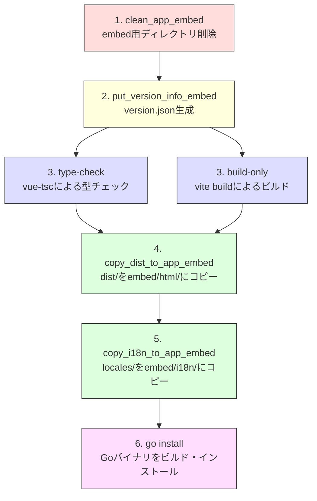

# 環境構築資料（開発者向け）

## 1. 前提ソフトウェア

gkillの開発・ビルドに必要なソフトウェアは以下の通りです。

### 必須

| ソフトウェア | バージョン | 用途 |
|---|---|---|
| Go | 1.26.0以上 | バックエンドビルド |
| Node.js | 20.15.1以上 | フロントエンドビルド、ビルドスクリプト実行 |
| npm | Node.js付属 | パッケージ管理、ビルドスクリプト実行 |
| Cコンパイラ | — | CGO（mattn/go-sqlite3に必要） |
| Git | — | ソースコード管理、バージョン情報取得 |

### Cコンパイラのプラットフォーム別設定

CGOが必要なため（SQLite3バインディング）、プラットフォームに応じたCコンパイラが必要です。

| プラットフォーム | 推奨コンパイラ | インストール方法 |
|---|---|---|
| Windows | MinGW-w64 または TDM-GCC | [MinGW-w64](https://www.mingw-w64.org/)からインストール。PATHに追加 |
| Linux (Ubuntu/Debian) | GCC (build-essential) | `sudo apt-get install build-essential` |
| macOS | Xcode Command Line Tools | `xcode-select --install` |

### オプション（クロスコンパイル・リリースビルド用）

| ソフトウェア | 用途 |
|---|---|
| MinGW-w64 (x86_64-w64-mingw32-gcc) | Linux上でのWindows向けクロスコンパイル |
| aarch64-linux-gnu-gcc | Linux ARM64向けクロスコンパイル |
| arm-linux-gnueabihf-gcc | Linux ARM向けクロスコンパイル |
| Android NDK | Android向けクロスコンパイル |
| Android SDK | Android APKビルド |
| Java JDK | Gradleビルド（Android/Wear OS） |
| 7-Zip (7za) | リリースZIP作成 |
| rsrc | Windowsリソース埋め込み（`go install github.com/akavel/rsrc@latest`） |

## 2. リポジトリクローン〜初回ビルド

### 手順

```bash
# 1. リポジトリのクローン
git clone https://github.com/mt3hr/gkill.git
cd gkill

# 2. npm依存パッケージのインストール
npm install

# 3. Goモジュールの初期化（初回のみ、またはgo.modを再生成する場合）
npm run go_mod

# 4. ビルド＆インストール（サーバーモード）
npm run install_server

# 5. または、デスクトップアプリモード（Windows限定）
npm run install_app
```

### 確認

```bash
# インストール成功の確認
gkill_server version
```

## 3. npm scripts一覧

### 開発

| コマンド | 説明 |
|---|---|
| `npm run dev` | Vite開発サーバー起動（フロントエンドのみ、HMR対応） |
| `npm run build` | フロントエンドビルド（vue-tsc型チェック + vite build を並列実行） |
| `npm run lint` | ESLintによるコード検査・自動修正（.vue/.ts/.js対象） |
| `npm run preview` | ビルド済みフロントエンドのプレビュー |
| `npm run type-check` | TypeScript型チェックのみ実行 |

### ビルド・インストール

| コマンド | 説明 |
|---|---|
| `npm run install_server` | フルビルド → `go install`（ヘッドレスHTTPサーバー） |
| `npm run install_app` | フルビルド → `go install`（デスクトップアプリ、`-H windowsgui`付き） |
| `npm run go_install` | Goのみインストール（フロントエンド再ビルドなし） |
| `npm run go_mod` | `go.mod`と`go.sum`を再生成 |

### ビルドパイプライン補助

| コマンド | 説明 |
|---|---|
| `npm run clean_app_embed` | embed用ディレクトリをクリーン |
| `npm run put_version_info_embed` | `version.json`（コミットハッシュ+ビルド日時+バージョン）を生成 |
| `npm run copy_dist_to_app_embed` | `dist/`をembedディレクトリにコピー |
| `npm run copy_i18n_to_app_embed` | `src/locales/`をembedディレクトリにコピー |
| `npm run prepare_install` | 上記4つを順次実行（clean → version → build → copy） |

### クロスコンパイル

| コマンド | ターゲット |
|---|---|
| `npm run build_windows_amd64` | Windows x86_64（gkill_server.exe） |
| `npm run build_windows_amd64_app` | Windows x86_64（gkill.exe、デスクトップアプリ） |
| `npm run build_linux_amd64` | Linux x86_64 |
| `npm run build_linux_arm64` | Linux ARM64（aarch64-linux-gnu-gcc必須） |
| `npm run build_linux_arm` | Linux ARM（arm-linux-gnueabihf-gcc必須） |
| `npm run build_android_arm` | Android ARM（NDK環境変数必須） |
| `npm run build_android_arm64` | Android ARM64（NDK環境変数必須） |
| `npm run build_android_apk` | Android APKビルド（Gradle） |
| `npm run build_wear_os` | Wear OSビルド（companion + watch） |
| `npm run release` | 全プラットフォームのリリースビルド一括実行 |

### Wear OS

| コマンド | 説明 |
|---|---|
| `npm run setup_wear_os_gradle` | android/からgradlewをwear_os/にコピー |
| `npm run build_wear_os_companion` | コンパニオンアプリAPKビルド |
| `npm run build_wear_os_watch` | ウォッチアプリAPKビルド |
| `npm run install_wear_os_companion` | adb経由でコンパニオンアプリをインストール |
| `npm run install_wear_os_watch` | adb経由でウォッチアプリをインストール |

### その他

| コマンド | 説明 |
|---|---|
| `npm run setup_gkill_develop_env` | Ubuntu/WSL用の開発環境一括セットアップ |
| `npm run mcp:gkill-read` | MCPサーバー起動（stdioモード） |
| `npm run mcp:gkill-read-http` | MCPサーバー起動（HTTPモード） |

## 4. ビルドパイプライン詳細

`npm run install_server` は以下の7ステップを順次実行します。



**注記:**
- ステップ3の`type-check`と`build-only`は`npm-run-all2`により並列実行されます
- `go install`でフロントエンドの成果物が`//go:embed`によりバイナリに埋め込まれます

### version.json の構造

```json
{
  "commit_hash": "0c9fe181...",
  "build_time": "2026-03-19T10:30:00+09:00",
  "version": "1.1.0-dev"
}
```

## 5. クロスコンパイル設定

### 環境変数

全クロスコンパイルで`CGO_ENABLED=1`が必須です（SQLite3のため）。

| ターゲット | GOOS | GOARCH | CC（クロスコンパイラ） |
|---|---|---|---|
| Windows x86_64 | windows | amd64 | x86_64-w64-mingw32-gcc |
| Linux x86_64 | linux | amd64 | （ネイティブgcc） |
| Linux ARM64 | linux | arm64 | aarch64-linux-gnu-gcc |
| Linux ARM | linux | arm | arm-linux-gnueabihf-gcc |
| Android ARM | android | arm | `$NDK/toolchains/llvm/prebuilt/linux-x86_64/bin/armv7a-linux-androideabi21-clang` |
| Android ARM64 | android | arm64 | `$NDK/toolchains/llvm/prebuilt/linux-x86_64/bin/aarch64-linux-android21-clang` |

### Windows向けビルド時の追加処理

- `rsrc`ツールでアイコン（`public/favicon.ico`）をリソースとして埋め込み
- デスクトップアプリ（gkill.exe）は`-ldflags "-s -w -H windowsgui"`でコンソールウィンドウを非表示に
- ビルド後に`strip`コマンドでバイナリサイズを削減（失敗しても続行）

## 6. 開発サーバー起動

### フロントエンド開発サーバー

```bash
npm run dev
```

Viteの開発サーバーが起動し、HMR（Hot Module Replacement）が有効になります。フロントエンドのみの開発時に使用します。

### バックエンド起動

```bash
cd src/server/gkill/main/gkill_server
go run .
```

デフォルトでポート9999で起動します。起動オプションは以下の通りです。

| フラグ | デフォルト | 説明 |
|---|---|---|
| `--gkill_home_dir` | `$HOME/gkill` | ホームディレクトリ |
| `--disable_tls` | `false` | TLSを無効化 |
| `--cache_in_memory` | `true` | インメモリキャッシュ有効化 |
| `--cache_reps_local` | `false` | ローカルキャッシュ有効化 |
| `--goroutine_pool` | `runtime.NumCPU()` | ゴルーチンプール数 |
| `--log` | （なし） | ログレベル: none/error/warn/info/debug/trace/trace_sql |

### フロント＋バック同時開発

フロントエンド開発サーバー（`npm run dev`）とバックエンド（`go run`）を同時に起動して開発できます。フロントエンドからバックエンドAPIへのプロキシ設定は`vite.config.ts`を確認してください。

## 7. Android NDK/SDK設定

Android向けビルドには以下の環境変数が必要です。

| 環境変数 | 説明 |
|---|---|
| `NDK` | Android NDKのルートパス |
| `ANDROID_HOME` または `ANDROID_SDK_ROOT` | Android SDKのパス（APKビルド時） |

```bash
# 例（Linux）
export NDK=/path/to/android-ndk-r26b
export ANDROID_HOME=/path/to/android-sdk
```

## 8. Wear OSビルド前準備

Wear OSプロジェクト（`src/wear_os/`）はGradleラッパーを含んでいません。ビルド前に`src/android/`からコピーする必要があります。

```bash
# 自動コピー
npm run setup_wear_os_gradle

# 手動の場合
cp src/android/gradlew src/wear_os/
cp src/android/gradlew.bat src/wear_os/
mkdir -p src/wear_os/gradle/wrapper
cp src/android/gradle/wrapper/gradle-wrapper.jar src/wear_os/gradle/wrapper/
```

### Wear OSビルド

```bash
# コンパニオンアプリ + ウォッチアプリ一括ビルド
npm run build_wear_os

# 個別ビルド
npm run build_wear_os_companion
npm run build_wear_os_watch

# adb経由でインストール
npm run install_wear_os_companion
npm run install_wear_os_watch
```

## 9. Ubuntu/WSL一括セットアップ

Ubuntu/WSL環境では以下のコマンドで必要なパッケージを一括インストールできます。

```bash
npm run setup_gkill_develop_env
```

このスクリプトは以下を実行します。

1. aptパッケージのインストール: `build-essential`, `gcc-mingw-w64-x86-64`, `gcc-aarch64-linux-gnu`, `gcc-arm-linux-gnueabihf`, `p7zip-full`, `default-jdk`
2. Goツールのインストール: `rsrc`（Windowsリソース埋め込み用）
3. 環境変数チェック: `NDK`, `ANDROID_HOME`/`ANDROID_SDK_ROOT`の設定確認

## 10. トラブルシューティング

### よくある問題

| 症状 | 原因 | 解決方法 |
|---|---|---|
| `cgo: C compiler not found` | Cコンパイラ未インストール | プラットフォームに応じたCコンパイラをインストール |
| `vue-tsc`でメモリ不足 | Node.jsのヒープメモリ制限 | `npm run type-check`は`--max-old-space-size=4096`付きで実行されます |
| `go.mod`のエラー | モジュール定義の不整合 | `npm run go_mod`で再生成 |
| Wear OSビルドで`gradlew not found` | Gradleラッパー未コピー | `npm run setup_wear_os_gradle`を実行 |
| Android NDKエラー | NDK環境変数未設定 | `export NDK=/path/to/ndk`を設定 |

## 関連資料

- [folder-structure.md](folder-structure.md) — プロジェクトのディレクトリ構成
- [operations-guide.md](operations-guide.md) — デプロイ・運用手順
- [program-spec.md](program-spec.md) — プログラム仕様（アーキテクチャ詳細）
