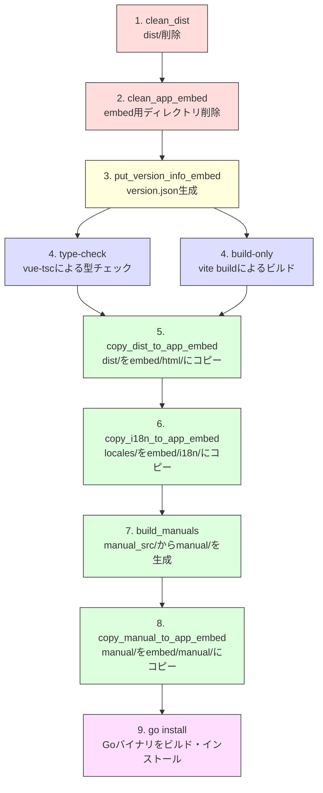

# 環境構築資料（開発者向け）

## 1. 前提ソフトウェア

gkillの開発・ビルドに必要なソフトウェアは以下の通りです。

### 必須

| ソフトウェア | バージョン | 用途 |
|---|---|---|
| Go | 1.26.4以上 | バックエンドビルド（`src/server/go.mod` の `go` ディレクティブ） |
| Node.js | 20.19以上（24.x推奨） | フロントエンドビルド、ビルドスクリプト実行。`package.json` に `engines` は無いため強制はされない |
| npm | Node.js付属 | パッケージ管理、ビルドスクリプト実行 |
| Git | — | ソースコード管理、バージョン情報取得 |

> **Note:** SQLite3 ドライバは `modernc.org/sqlite`（pure Go）を使用しているため、CGO およびCコンパイラは不要です。

### オプション（クロスコンパイル・リリースビルド用）

| ソフトウェア | 用途 |
|---|---|
| Android SDK | Android APKビルド |
| Java JDK | Gradleビルド（Android/Wear OS） |
| 7-Zip (7za) | リリースZIP作成 |
| rsrc | Windowsリソース埋め込み（`go install github.com/akavel/rsrc@latest`） |

## 2. リポジトリクローン〜初回ビルド

### 手順

```bash
# 1. リポジトリのクローン
git clone https://github.com/mt3hr/gkill.git
cd gkill

# 2. npm依存パッケージのインストール
npm install

# 3. Goモジュールの初期化（初回のみ、またはgo.modを再生成する場合）
npm run go_mod

# 4. ビルド＆インストール（サーバーモード）
npm run install_server

# 5. または、デスクトップアプリモード（Windows限定）
npm run install_app
```

### 確認

```bash
# インストール成功の確認
gkill_server version
```

## 3. npm scripts一覧

### 開発

| コマンド | 説明 |
|---|---|
| `npm run dev` | Vite開発サーバー起動（フロントエンドのみ、HMR対応）。`-- --api=<url>` で接続先gkill_serverを指定 |
| `npm run build` | フロントエンドビルド（vue-tsc型チェック + vite build を並列実行） |
| `npm run build-only` | 型チェックを行わず `vite build` のみ実行 |
| `npm run lint` | ESLintによるコード検査・自動修正（.vue/.ts/.js対象） |
| `npm run preview` | ビルド済みフロントエンドのプレビュー |
| `npm run type-check` | TypeScript型チェックのみ実行 |

### ビルド・インストール

| コマンド | 説明 |
|---|---|
| `npm run install_server` | フルビルド → `go install`（ヘッドレスHTTPサーバー） |
| `npm run install_app` | フルビルド → `go install`（デスクトップアプリ、`-H windowsgui`付き） |
| `npm run go_install` | Goのみインストール（フロントエンド再ビルドなし） |
| `npm run go_mod` | `go.mod`と`go.sum`を再生成 |

### ビルドパイプライン補助

| コマンド | 説明 |
|---|---|
| `npm run clean_app_embed` | embed用ディレクトリをクリーン |
| `npm run put_version_info_embed` | `version.json`（コミットハッシュ+ビルド日時+バージョン）を生成 |
| `npm run copy_dist_to_app_embed` | `dist/`をembedディレクトリにコピー |
| `npm run copy_i18n_to_app_embed` | `src/locales/`をembedディレクトリにコピー |
| `npm run build_manuals` | `resources/manual_src/` の原稿から `resources/manual/`（7言語HTMLマニュアル）を生成 |
| `npm run copy_manual_to_app_embed` | `resources/manual/`（7言語HTMLマニュアル）をembedディレクトリにコピー |
| `npm run clean_dist` | `dist/`をクリーン |
| `npm run prepare_install` | 上記を順次実行（clean_dist → clean_app_embed → version生成 → build → copy html / i18n → build_manuals → copy manual） |

### リリース

| コマンド | 説明 |
|---|---|
| `npm run release` | 全プラットフォーム向けクロスコンパイル → zip 化 → サンプルデータ生成 → 成果物検証 |
| `npm run build_x_compile` | 全ターゲットのクロスコンパイル |
| `npm run build_go_parallel` | Go ビルドの並列実行 |
| `npm run copy_android_release` | Android APK をリリースディレクトリへコピー |
| `npm run prepare_gkill_sample_data` | サンプルデータ入り配布物の生成 |
| `npm run clean_release_zip_src` | zip 化後の中間ディレクトリを削除 |
| `npm run verify_release_artifacts` | リリース成果物の検証 |

### ドキュメント・マニュアルのツール

ドキュメントとマニュアルの整合性を保つためのツール群（いずれも Node 標準のみ・依存なし）。

| コマンド / スクリプト | 説明 |
|---|---|
| `npm run vet_plugins` | `src/plugins/` の各 Go モジュールへ `go vet`（CI の `plugins` ジョブが `test_plugins` の前に回す。`npm test` には入っていない） |
| `npm run verify_docs` | ドキュメント検証（`src/tools/verify_docs.mjs`）。件数（handler/req_res/view/dialog/endpoint/i18nキー）をコードから突合、reverse資料の相互リンク・参照パス・Mermaid、マニュアルの生成鮮度・アクセシビリティ（`<main>`/`<caption>`/`th scope`）・言語構成一致・リンクを検査。**`npm test` に組み込まれている**（`install_server` の直後） |
| `node src/tools/verify_docs.mjs --list` | 実測メトリクスを表示して終了（件数を更新するときの参照元） |
| `node src/tools/verify_docs.mjs --parity` | 構造パリティ・レポート（日本語=正本に対する各言語マニュアルの見出し/表構造のズレを表示） |
| `npm run build_manuals` | `resources/manual_src/{lang}/{page}.html`（原稿フラグメント）＋ `_layout.html`（共有レイアウト）から 154 マニュアル（7言語 × 22ページ）を生成。`<main>`/表 `<caption>`/`th scope` を自動付与 |
| `src/tools/manual_build.mjs` | マニュアル生成の実体。`build_manuals.mjs` と `verify_docs.mjs` の両方から import される |
| `node src/tools/manual_a11y.mjs` | マニュアルのアクセシビリティ検査 |
| `node src/tools/manual_ascii_fix.mjs` | fr/es マニュアルの ASCII 代替表記（アクセント欠落）を辞書ベースで是正（コード/pre/href は保護。要ネイティブレビューの初回パス） |
| `npm run verify_release_artifacts` | リリース成果物（zip/apk）の検証。`npm run release` の最後に実行される |
| `src/tools/license_getter.mjs` | 依存パッケージのライセンス情報収集（`npm run license_getter` で `LICENSES_DEPENDENCE` を生成。Go 8モジュール（`src/server` + `src/plugins` の各プラグイン。自動発見）+ npm 本番依存 + Android / Wear OS の Gradle 依存。Gradle 環境が無ければ `--skip-gradle`） |

**マニュアル編集の流儀:** マニュアルは手書きHTMLではなく `resources/manual_src/` の原稿（HTMLフラグメント）を編集し、`npm run build_manuals` で `resources/manual/` を再生成する。`resources/manual/` を直接編集しても `verify_docs` の生成鮮度チェックで検出される。共通の head/style/テーマスクリプトは `_layout.html` に集約されている。

> **注意:** `src/tools/extract_manual_src.mjs` は「元の手書きマニュアル」から原稿を切り出す**一度きりの移行専用**ツール。生成済み（`<main>` を含む）マニュアルに対しては安全ガードで実行を拒否する。

### クロスコンパイル

| コマンド | ターゲット |
|---|---|
| `npm run build_windows_amd64` | Windows x86_64（gkill_server.exe、CGO_ENABLED=0） |
| `npm run build_windows_amd64_app` | Windows x86_64（gkill.exe、デスクトップアプリ、CGO_ENABLED=0） |
| `npm run build_linux_amd64` | Linux x86_64（CGO_ENABLED=0） |
| `npm run build_linux_arm64` | Linux ARM64（CGO_ENABLED=0、クロスコンパイラ不要） |
| `npm run build_linux_arm` | Linux ARM（CGO_ENABLED=0、クロスコンパイラ不要） |
| `npm run build_android_arm` | Android ARM（NDK環境変数必須） |
| `npm run build_android_arm64` | Android ARM64（NDK環境変数必須） |
| `npm run build_android_apk` | Android APKビルド（Gradle） |
| `npm run build_wear_os` | Wear OSビルド（companion + watch） |
| `npm run release` | 全プラットフォームのリリースビルド一括実行 |

### Wear OS

| コマンド | 説明 |
|---|---|
| `npm run setup_wear_os_gradle` | android/からgradlewをwear_os/にコピー（通常は不要。ラッパーはコミット済み） |
| `npm run build_wear_os_companion` | コンパニオンアプリAPKビルド |
| `npm run build_wear_os_watch` | ウォッチアプリAPKビルド |
| `npm run install_wear_os_companion` | adb経由でコンパニオンアプリをインストール |
| `npm run install_wear_os_watch` | adb経由でウォッチアプリをインストール |

### その他

| コマンド | 説明 |
|---|---|
| `npm run setup_gkill_develop_env` | Ubuntu/WSL用の開発環境一括セットアップ |
| `npm run mcp:gkill-read` | Read MCPサーバー起動 |
| `npm run mcp:gkill-read-http` | 同上（HTTPモード。`MCP_TRANSPORT=http MCP_PORT=8808`） |
| `npm run mcp:gkill-write` | Write MCPサーバー起動 |
| `npm run mcp:gkill-write-http` | 同上（HTTPモード。`MCP_TRANSPORT=http MCP_PORT=8809`） |
| `npm run mcp:gkill-readwrite` | Read/Write統合MCPサーバー起動 |
| `npm run mcp:gkill-readwrite-http` | 同上（HTTPモード。`MCP_TRANSPORT=http MCP_PORT=8810`） |

> `-http` 付きスクリプトは `cross-env` で `MCP_TRANSPORT=http` と `MCP_PORT`
> （Read 8808 / Write 8809 / ReadWrite 8810）を設定してから起動する。
> 接続先や OAuth 発行者は下記の環境変数で指定する。

### MCP HTTPモード開発用環境変数

```bash
export GKILL_BASE_URL=http://127.0.0.1:9999
export GKILL_USER=admin
export GKILL_PASSWORD_SHA256="<sha256 hex>"  # or GKILL_PASSWORD
export MCP_TRANSPORT=http
export MCP_PORT=8808   # Read: 8808, Write: 8809, ReadWrite: 8810
export MCP_OAUTH_ISSUER=http://localhost:8808  # リモート時は公開URL
# export MCP_LOG=info          # MCPアクセスログレベル（デフォルト: info）
# export GKILL_INSECURE=true  # 自己署名証明書使用時
```

## 4. ビルドパイプライン詳細

`npm run install_server`（内部で `prepare_install`）は以下のステップを順次実行します。埋め込みコピーは html / i18n / manual の3系統です。


```mermaid
graph TD
    Z["1. clean_dist<br/>dist/削除"] --> A["2. clean_app_embed<br/>embed用ディレクトリ削除"]
    A --> B["3. put_version_info_embed<br/>version.json生成"]
    B --> C["4. type-check<br/>vue-tscによる型チェック"]
    B --> D["4. build-only<br/>vite buildによるビルド"]
    C --> E["5. copy_dist_to_app_embed<br/>dist/をembed/html/にコピー"]
    D --> E
    E --> F["6. copy_i18n_to_app_embed<br/>locales/をembed/i18n/にコピー"]
    F --> M["7. build_manuals<br/>manual_src/からmanual/を生成"]
    M --> H["8. copy_manual_to_app_embed<br/>manual/をembed/manual/にコピー"]
    H --> G["9. go install<br/>Goバイナリをビルド・インストール"]

    style Z fill:#fdd,stroke:#333
    style A fill:#fdd,stroke:#333
    style B fill:#ffd,stroke:#333
    style C fill:#ddf,stroke:#333
    style D fill:#ddf,stroke:#333
    style E fill:#dfd,stroke:#333
    style F fill:#dfd,stroke:#333
    style M fill:#dfd,stroke:#333
    style H fill:#dfd,stroke:#333
    style G fill:#fdf,stroke:#333
```

**注記:**
- ステップ4の`type-check`と`build-only`は`npm-run-all2`により並列実行されます
- `go install`でフロントエンドの成果物が`//go:embed`によりバイナリに埋め込まれます

### version.json の構造

```json
{
  "commit_hash": "0c9fe181...",
  "build_time": "2026-03-19T10:30:00+09:00",
  "version": "1.0.0"
}
```

## 5. クロスコンパイル設定

### 環境変数

SQLite3 ドライバは pure Go 実装（`modernc.org/sqlite`）のため、CGO およびクロスコンパイラ（CC）は不要です。

| ターゲット | GOOS | GOARCH |
|---|---|---|
| Windows x86_64 | windows | amd64 |
| Linux x86_64 | linux | amd64 |
| Linux ARM64 | linux | arm64 |
| Linux ARM | linux | arm |
| Android ARM | android | arm |
| Android ARM64 | android | arm64 |

> **Note:** `GOOS=android` の場合、CGO が有効（`CGO_ENABLED=1`）で NDK の clang をクロスコンパイラ（CC）として使用します。環境変数 `NDK` に Android NDK のパスを設定してください。

### Windows向けビルド時の追加処理

- `rsrc`ツールでアイコン（`public/favicon.ico`）をリソースとして埋め込み
- デスクトップアプリ（gkill.exe）は`-ldflags "-s -w -H windowsgui"`でコンソールウィンドウを非表示に

バイナリサイズの削減は `strip` コマンドではなく、ビルド時の `-trimpath -ldflags "-s -w"` で行っている。

## 6. 開発サーバー起動

### フロントエンド開発サーバー

```bash
npm run dev
```

Viteの開発サーバーが起動し、HMR（Hot Module Replacement）が有効になります。フロントエンドのみの開発時に使用します。

接続先のgkill_serverは`--api`で指定できます（既定は`http://localhost:9999`）。

```bash
npm run dev -- --api=http://127.0.0.1:19999
npm run dev -- --api=19999          # ポート番号だけなら 127.0.0.1 を補完
npm run dev -- --api=example.com:9999   # host:port 形式も可
npm run dev -- --api-target=19999   # --api のエイリアス
npm run dev -- --api=19999 --port 5180  # --api以外の引数はそのままviteへ渡る
```

`npm run dev`は`src/tools/dev.mjs`経由でViteを起動します（Viteは未知のCLIオプションをエラーにするため）。`--api`の値は環境変数`GKILL_API_PROXY_TARGET`としてViteに渡され、`vite.config.ts`のproxyが`/api`・`/files`・`/zip_cache`・`/resources/manual`をまとめてその宛先へ転送します。環境変数を直接指定しても同じです（`--api`のほうが優先）。

### バックエンド起動

```bash
cd src/server/gkill/main/gkill_server
go run .
```

デフォルトでポート9999で起動します。起動オプションは以下の通りです。

| フラグ | デフォルト | 説明 |
|---|---|---|
| `--gkill_home_dir` | `$HOME/gkill` | ホームディレクトリ |
| `--address` | （なし） | リッスンアドレスを上書き（例: `:19999`, `127.0.0.1:19999`）。未指定なら設定DBの値 |
| `--disable_tls` | `false` | TLSを無効化 |
| `--cache_in_memory` | `true` | インメモリキャッシュ有効化 |
| `--cache_reps_local` | `false` | ローカルキャッシュ有効化 |
| `--goroutine_pool` | `runtime.NumCPU()` | ゴルーチンプール数 |
| `--cache_clear_count_limit` | `3000` | キャッシュクリアまでのアイテム数上限 |
| `--cache_update_duration` | `1m` | キャッシュ更新間隔 |
| `--pre_load_users` | （なし） | 起動時にリポジトリを先読みするユーザ（複数指定可） |
| `--log` | `none` | ログレベル: none/error/warn/info/access/debug/trace/trace_sql |

### フロント＋バック同時開発

フロントエンド開発サーバー（`npm run dev`）とバックエンド（`go run`）を同時に起動して開発できます。バックエンドを既定以外のポートで立てた場合は`npm run dev -- --api=<url>`で向き先を合わせてください。プロキシ設定の実体は`vite.config.ts`の`server.proxy`です。

## 7. Android NDK/SDK設定

Android向けビルドには以下の環境変数が必要です。

| 環境変数 | 説明 |
|---|---|
| `NDK` | Android NDKのルートパス |
| `ANDROID_HOME` または `ANDROID_SDK_ROOT` | Android SDKのパス（APKビルド時） |

```bash
# 例（Linux）
export NDK=/path/to/android-ndk-r26b
export ANDROID_HOME=/path/to/android-sdk
```

## 8. Wear OSビルド前準備

Gradleラッパー（`gradlew` / `gradlew.bat` / `gradle/wrapper/gradle-wrapper.jar` /
`gradle/wrapper/gradle-wrapper.properties`）は`src/wear_os/`にコミット済みなので、
通常このステップは不要です。`src/android/`側とバージョンを揃え直したいときだけ実行してください。

```bash
npm run setup_wear_os_gradle
```

### Wear OSビルド

```bash
# コンパニオンアプリ + ウォッチアプリ一括ビルド
npm run build_wear_os

# 個別ビルド
npm run build_wear_os_companion
npm run build_wear_os_watch

# adb経由でインストール
npm run install_wear_os_companion
npm run install_wear_os_watch
```

## 9. Ubuntu/WSL一括セットアップ

Ubuntu/WSL環境では以下のコマンドで必要なパッケージを一括インストールできます。

```bash
npm run setup_gkill_develop_env
```

このスクリプトは以下を実行します。

1. aptパッケージのインストール: `p7zip-full`, `default-jdk`
2. Goツールのインストール: `rsrc`（Windowsリソース埋め込み用）
3. 環境変数チェック: `ANDROID_HOME`/`ANDROID_SDK_ROOT`の設定確認

## 10. トラブルシューティング

### よくある問題

| 症状 | 原因 | 解決方法 |
|---|---|---|
| `vue-tsc`でメモリ不足 | Node.jsのヒープメモリ制限 | `npm run type-check`は`--max-old-space-size=8192`付きで実行されます |
| `go.mod`のエラー | モジュール定義の不整合 | `npm run go_mod`で再生成 |
| Wear OSビルドで`gradlew not found` | ラッパーが壊れている/消えている（通常はコミット済み） | `npm run setup_wear_os_gradle`で`src/android/`から入れ直す |

## 関連資料

- [folder-structure.md](folder-structure.md) — プロジェクトのディレクトリ構成
- [operations-guide.md](operations-guide.md) — デプロイ・運用手順
- [program-spec.md](program-spec.md) — プログラム仕様（アーキテクチャ詳細）
