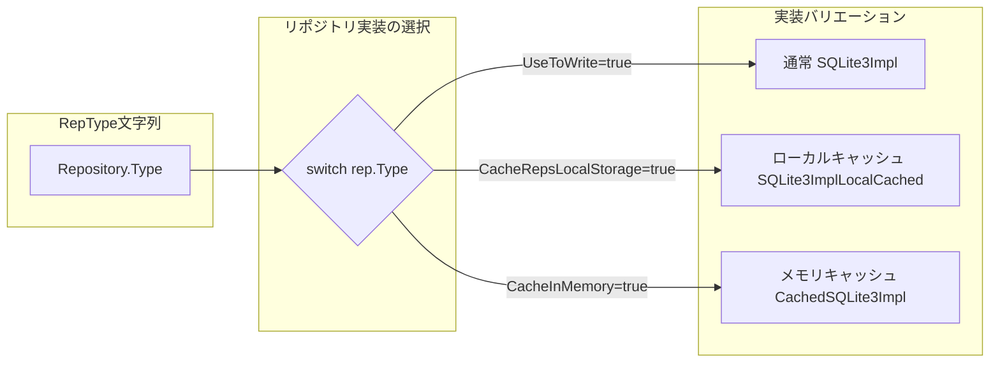
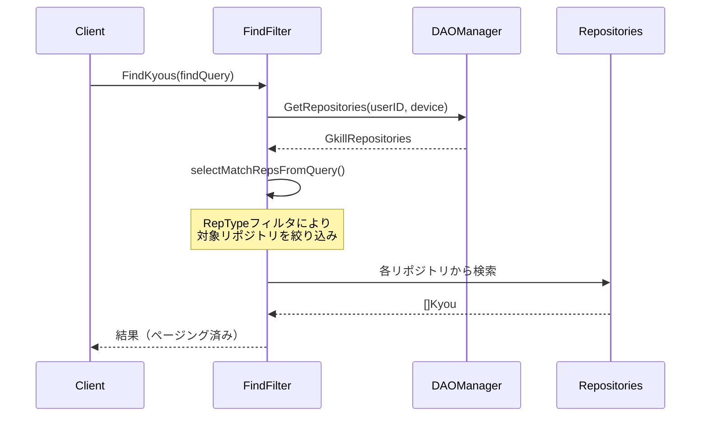
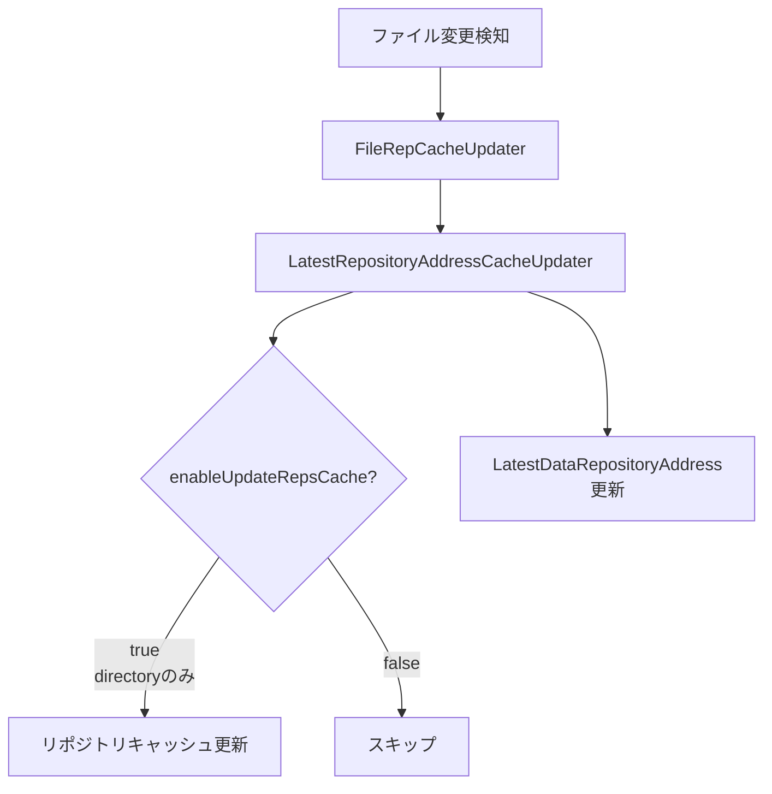

# DVNF/RepType仕様

## 1. DVNFの概要

DVNF（Data Versioning and Naming Framework）は、gkillで使用されるファイル/ディレクトリの命名規則フレームワークです。データリポジトリのファイルをタイムスタンプベースで管理し、バージョニングを実現します。

### ソースコード

- パッケージ: `gkill/dvnf/dvnf.go`
- コマンド: `gkill/dvnf/cmd/`

## 2. DVNF命名規則

### タイムスタンプ命名パターン

DVNFファイル名は以下の形式で構成されます。

```
{Name}_{Device}_{Timestamp}{Extension}
```

各要素はアンダースコア `_` で区切られます。省略可能な要素もあります。

### Option構造体

```go
type Option struct {
    Directory  string   // 対象ディレクトリ
    Name       string   // 名前部分
    Device     string   // デバイス識別子
    TimeLength int      // タイムスタンプの桁数（0, 4, 6, 8）
    Extension  string   // 拡張子
}
```

### タイムスタンプ桁数と精度

| TimeLength | フォーマット | 精度 | 例 |
|---|---|---|---|
| 8 | `YYYYMMDD` | 日単位 | `20260319` |
| 6 | `YYYYMM` | 月単位 | `202603` |
| 4 | `YYYY` | 年単位 | `2026` |
| 0 | なし | タイムスタンプなし | — |

上記以外の値はバリデーションエラーとなります。

### 命名例

```
# Name=data, Device=desktop, TimeLength=8, Extension=.db
data_desktop_20260319.db

# Name=kmemo, Device=phone, TimeLength=6, Extension=.db
kmemo_phone_202603.db

# Name=backup, Device=server, TimeLength=4
backup_server_2026
```

## 3. DVNFの主要操作

| 関数 | 説明 |
|---|---|
| `GetOrCreateLatestDVNFDir` | 最新のDVNFディレクトリを取得。なければ作成 |
| `GetOrCreateLatestDVNFFile` | 最新のDVNFファイルを取得。なければ作成 |
| `GetLatestDVNF` | 最新のDVNFを取得（作成なし） |
| `CreateNewDVNF` | 現在時刻で新規DVNF作成（ファイルまたはディレクトリ） |
| `GetDVNFs` | パターンに一致するDVNF一覧を取得 |
| `NewDVNF` | 現在時刻のDVNFパスを生成（ファイル/ディレクトリ作成なし） |
| `SortDVNFs` | DVNFを日時降順でソート |

### パターンマッチング

`GetDVNFs`はOptionから正規表現パターンを生成し、ディレクトリ内のファイルをマッチングします。

```
# Option{Name: "data", Device: "desktop", TimeLength: 8, Extension: ".db"}
# → 生成される正規表現: ^data_desktop_\d{8}\.db$
```

### DVNFコマンド（CLI）

`gkill dvnf` サブコマンドで以下の操作が可能です。

| コマンド | 説明 |
|---|---|
| `dvnf get` | 条件に一致するDVNFファイル/ディレクトリの一覧取得 |
| `dvnf copy` | DVNFファイルのコピー |
| `dvnf move` | DVNFファイルの移動 |

## 4. RepType（リポジトリ種別）

### RepTypeの定義

RepTypeは、gkillのデータリポジトリの種類を表す文字列識別子です。リポジトリ定義（`user_config.Repository`構造体）の`Type`フィールドに格納されます。

### Repository構造体

```go
// user_config パッケージ
type Repository struct {
    ID                       string `json:"id"`
    UserID                   string `json:"user_id"`
    Device                   string `json:"device"`
    Type                     string `json:"type"`           // RepType文字列
    File                     string `json:"file"`           // ファイルパス（glob対応）
    UseToWrite               bool   `json:"use_to_write"`   // 書き込み先として使用
    IsExecuteIDFWhenReload   bool   `json:"is_execute_idf_when_reload"`
    IsWatchTargetForUpdateRep bool  `json:"is_watch_target_for_update_rep"`
    IsEnable                 bool   `json:"is_enable"`      // 有効/無効
    RepName                  string `json:"rep_name"`       // 表示名
}
```

### RepType一覧

`gkill_dao_manager.go`の`GetRepositories`メソッド内のswitch文で定義されている全14種のRepTypeです。

| RepType | データ型 | リポジトリインターフェース | 説明 |
|---|---|---|---|
| `kmemo` | テキストメモ | `KmemoRepository` | フリーテキストのメモ記録 |
| `kc` | 数値 | `KCRepository` | 数値記録（体重、回数等） |
| `urlog` | ブックマーク | `URLogRepository` | URL/ウェブサイトメモ |
| `timeis` | 打刻 | `TimeIsRepository` | 時間帯記録（開始〜終了） |
| `mi` | タスク | `MiRepository` | 軽量TODO管理 |
| `nlog` | 支出 | `NlogRepository` | 金銭の出入り記録 |
| `lantana` | 気分 | `LantanaRepository` | 気分値（0〜10段階） |
| `tag` | タグ | `TagRepository` | 記録へのタグ付け |
| `text` | テキスト | `TextRepository` | 記録への補足テキスト |
| `notification` | 通知 | `NotificationRepository` | プッシュ通知設定 |
| `rekyou` | リポスト | `ReKyouRepository` | 既存記録の再投稿 |
| `directory` | ファイル | `IDFKyouRepository` | ファイル管理（IDF対応） |
| `gpslog` | GPS | `GPSLogRepository`（GPXDirRep） | GPSログ（GPXファイル） |
| `git_commit_log` | Gitコミット | `GitCommitLogRepository`（GitRep） | Gitリポジトリのコミット履歴 |

### RepType → Repository マッピング

`GkillDAOManager.GetRepositories()`内のswitch文により、RepTypeに応じた適切なリポジトリ実装が生成されます。



### 実装バリエーションの選択ロジック

各RepType（`directory`, `gpslog`, `git_commit_log`を除く）は以下の条件で実装が選択されます。

1. **書き込み用（`UseToWrite=true`）**: 常に通常の`SQLite3Impl`を使用
2. **ローカルキャッシュ（`CacheRepsLocalStorage=true`）**: `SQLite3ImplLocalCached`を使用
3. **それ以外**: 通常の`SQLite3Impl`を使用
4. **メモリキャッシュ（`CacheInMemory`フラグ有効時）**: 上記に加え`CachedSQLite3Impl`でラップ

### 特殊なRepType

#### `directory`（ファイル管理）

- `IDFKyouRepository`（`IDFDirRep`）を生成
- `.gkill/gkill_id.db`を各ディレクトリ内に作成してID管理
- `autoIDF`フラグ（`IsExecuteIDFWhenReload`）でリロード時の自動IDF実行を制御
- ファイル監視時は`enableUpdateRepsCache=true`（他のRepTypeは`false`）

#### `gpslog`（GPSログ）

- `GPXDirRep`を生成（SQLite3ではなくGPXファイルを直接読み書き）
- キャッシュ/監視の仕組みは適用されない

#### `git_commit_log`（Gitコミットログ）

- `GitRep`を生成（SQLite3ではなくgitリポジトリを直接読み取り）
- 書き込み用リポジトリの設定なし（読み取り専用）
- キャッシュ/監視の仕組みは適用されない

## 5. リポジトリの4層パターン

RepTypeごとに以下の4層でリポジトリが実装されています（`directory`, `gpslog`, `git_commit_log`を除く）。

| 層 | ファイル名パターン | 役割 |
|---|---|---|
| インターフェース | `*_repository.go` | 操作の抽象定義 |
| SQLite3実装 | `*_repository_sqlite3_impl.go` | SQLite3データベースへの直接CRUD |
| キャッシュ付き実装 | `*_repository_cached_sqlite3_impl.go` | インメモリキャッシュ付き（複数リポジトリを1つに集約） |
| テンポラリ実装 | `*_repository_temp_sqlite3_impl.go` | トランザクション用一時リポジトリ |

加えて、ローカルキャッシュ版（`*_sqlite3_impl_local_cached.go`）が存在するRepTypeもあります。

## 6. FindQueryでのRepTypeフィルタリング

検索時に`FindQuery`のRepType指定により、対象リポジトリを絞り込むことができます。

### FindFilter の処理フロー



### フィルタリングの仕組み

`FindFilter.selectMatchRepsFromQuery()`で、FindQueryに指定されたRepType条件に一致するリポジトリのみが検索対象となります。

```go
// FindKyouContext 内で管理
type FindKyouContext struct {
    MatchReps    map[string]reps.Repository  // マッチしたリポジトリ
    // ...
}
```

## 7. RepTypeStructとApplicationConfig

アプリケーション設定（`ApplicationConfig`）内にRepTypeの構造情報が含まれています。

### RepTypeStructの用途

- フロントエンドでの表示名・アイコン制御
- 検索フィルタのUI生成
- KFTLパーサーでの型判定

### フロントエンドでの利用

フロントエンドの`GkillAPI.getApplicationConfig()`で取得される`ApplicationConfig`オブジェクト内に、`rep_type_struct`として各RepTypeの表示設定が含まれます。

## 8. ファイル監視とキャッシュ更新

リポジトリ定義で`IsWatchTargetForUpdateRep=true`の場合、ファイル変更を検知してキャッシュを自動更新します。



## 関連資料

- [glossary.md](glossary.md) — 用語集（Kyou、RepType等の定義）
- [er-diagram.md](er-diagram.md) — エンティティ関連図
- [class-diagrams.md](class-diagrams.md) — リポジトリクラス階層
- [program-spec.md](program-spec.md) — プログラム仕様（GkillDAOManager詳細）
- [operations-guide.md](operations-guide.md) — 運用ガイド（ディレクトリ構成）
