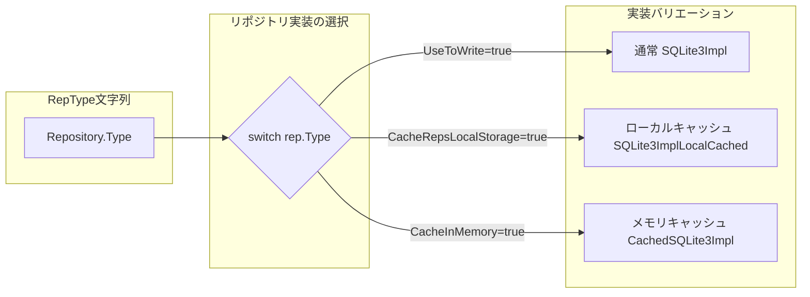
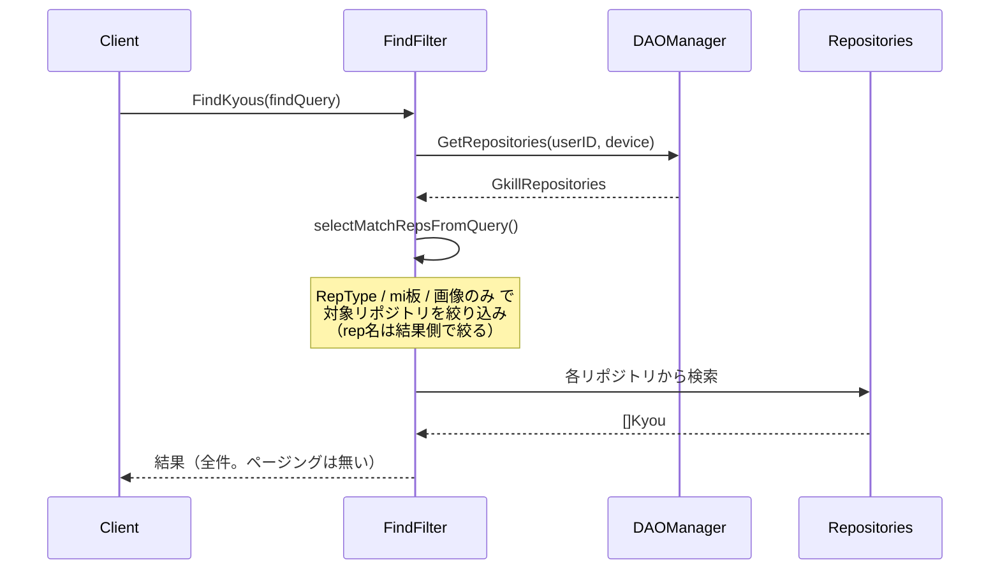
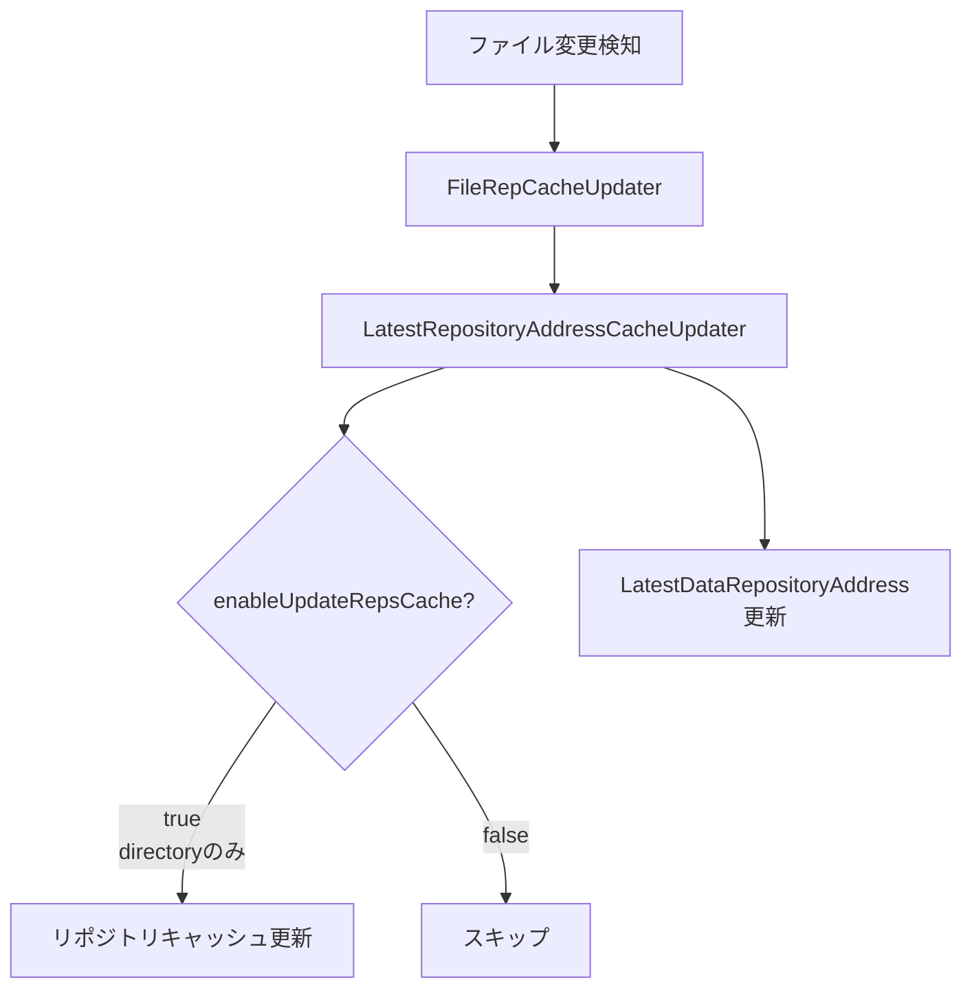

# DVNF/RepType仕様

## 1. DVNFの概要

DVNF（DeVice Name Folder Naming Framework）は、gkillで使用されるファイル/ディレクトリの命名規則フレームワークです。データリポジトリのファイルをタイムスタンプベースで管理し、バージョニングを実現します。

### ソースコード

- パッケージ: `src/server/gkill/dvnf/dvnf.go`
- コマンド: `src/server/gkill/dvnf/cmd/`

## 2. DVNF命名規則

### タイムスタンプ命名パターン

DVNFファイル名は以下の形式で構成されます。

```
{Name}_{Device}_{Timestamp}{Extension}
```

各要素はアンダースコア `_` で区切られます。省略可能な要素もあります。

### Option構造体

```go
type Option struct {
    Directory  string   // 対象ディレクトリ
    Name       string   // 名前部分
    Device     string   // デバイス識別子
    TimeLength int      // タイムスタンプの桁数（0, 4, 6, 8）
    Extension  string   // 拡張子
}
```

### タイムスタンプ桁数と精度

| TimeLength | フォーマット | 精度 | 例 |
|---|---|---|---|
| 8 | `YYYYMMDD` | 日単位 | `20260319` |
| 6 | `YYYYMM` | 月単位 | `202603` |
| 4 | `YYYY` | 年単位 | `2026` |
| 0 | なし | タイムスタンプなし | — |

上記以外の値はバリデーションエラーとなります。

### 命名例

```
# Name=data, Device=desktop, TimeLength=8, Extension=.db
data_desktop_20260319.db

# Name=kmemo, Device=phone, TimeLength=6, Extension=.db
kmemo_phone_202603.db

# Name=backup, Device=server, TimeLength=4
backup_server_2026
```

## 3. DVNFの主要操作

| 関数 | 説明 |
|---|---|
| `GetOrCreateLatestDVNFDir` | 最新のDVNFディレクトリを取得。なければ作成 |
| `GetOrCreateLatestDVNFFile` | 最新のDVNFファイルを取得。なければ作成 |
| `GetLatestDVNF` | 最新のDVNFを取得（作成なし） |
| `CreateNewDVNF` | 現在時刻で新規DVNF作成（ファイルまたはディレクトリ） |
| `GetDVNFs` | パターンに一致するDVNF一覧を取得 |
| `NewDVNF` | 現在時刻のDVNFパスを生成（ファイル/ディレクトリ作成なし） |
| `SortDVNFs` | DVNFを日時降順でソート |

### パターンマッチング

`GetDVNFs`はOptionから正規表現パターンを生成し、ディレクトリ内のファイルをマッチングします。

```
# Option{Name: "data", Device: "desktop", TimeLength: 8, Extension: ".db"}
# → 生成される正規表現: ^data_desktop_\d{8}\.db$
```

### DVNFコマンド（CLI）

`gkill dvnf` サブコマンドで以下の操作が可能です。

| コマンド | 引数 | 説明 |
|---|---|---|
| `dvnf get [dvnfPath]` | 0〜1 | **dvnfディレクトリのパスを取得する**。引数を省略した場合は dvnf のルートフォルダを返す |
| `dvnf move src target` | 2 | ファイルやディレクトリを **dvnfディレクトリへ移動する**。移動元が存在しないときは何もせず、移動先の親ディレクトリが無ければ作成する |
| `dvnf copy src target` | 2 | ファイルやディレクトリを **dvnfディレクトリへコピーする** |

> 3コマンドとも「dvnfディレクトリを起点に」動く。ファイルを検索して一覧するコマンドではない点に注意。

#### 共通（永続）フラグ

| フラグ | 短縮 | 既定 | 説明 |
|---|---|---|---|
| `--new` | `-n` | `false` | 新たに dvnf を作成する |
| `--auto_create` | — | `true` | 1つも存在しなかったときに自動で作成する |
| `--device` | — | （この端末名） | dvnf名に使う端末名。**生成する名前の端末部分だけ**を差し替える（dvnfのルートはこの端末のものを使う）。他の端末で集めたものを端末名を保ったまま取り込むときに指定する |

> **`--device` が必須になるケース:** この端末に対応する有効な `ServerConfig` が存在しない場合、
> `--device` を指定しないとコマンドは
> `this device has no enabled server config. specify --device` で終了する
> （`dvnf/cmd/dvnf_cmd.go:60-68`）。このとき dvnf のルートは `$HOME/{device}`、TimeLength は 8 になる。

#### コマンド別フラグ

| コマンド | フラグ |
|---|---|
| `get` | `--all`/`-a`（最新だけでなくマッチする全 dvnf を取得）、`--create_sub_directory`/`-s`、`--ext`/`-e`（既定 `true`） |
| `copy` | `--ignore`/`-i`、`--override`/`-w`（既定 `true`）、`--fast`（既定 `true`）、`--file`/`-f`、`--ext`/`-e`、`--copy_lastmod`（既定 `true`）、`--robo` |
| `move` | `--ignore`/`-i`、`--delete_directory`/`-d`、`--override`/`-w`、`--file`/`-f`、`--ext`/`-e`、`--robo` |

## 4. RepType（リポジトリ種別）

### RepTypeの定義

RepTypeは、gkillのデータリポジトリの種類を表す文字列識別子です。リポジトリ定義（`user_config.Repository`構造体）の`Type`フィールドに格納されます。

### Repository構造体

```go
// user_config パッケージ
type Repository struct {
    ID                       string `json:"id"`
    UserID                   string `json:"user_id"`
    Device                   string `json:"device"`
    Type                     string `json:"type"`           // RepType文字列
    File                     string `json:"file"`           // ファイルパス（glob対応）
    UseToWrite               bool   `json:"use_to_write"`   // 書き込み先として使用
    IsExecuteIDFWhenReload   bool   `json:"is_execute_idf_when_reload"`
    IsWatchTargetForUpdateRep bool  `json:"is_watch_target_for_update_rep"`
    IsEnable                 bool   `json:"is_enable"`      // 有効/無効
    RepName                  string `json:"rep_name"`       // 表示名
}
```

### RepType一覧

`gkill_dao_manager.go`の`GetRepositories`メソッド内のswitch文で定義されている全15種のRepTypeです。

| RepType | データ型 | リポジトリインターフェース | 説明 |
|---|---|---|---|
| `kmemo` | テキストメモ | `KmemoRepository` | フリーテキストのメモ記録 |
| `kc` | 数値 | `KCRepository` | 数値記録（体重、回数等） |
| `urlog` | ブックマーク | `URLogRepository` | URL/ウェブサイトメモ |
| `timeis` | 打刻 | `TimeIsRepository` | 時間帯記録（開始〜終了） |
| `mi` | タスク | `MiRepository` | 軽量TODO管理 |
| `nlog` | 支出 | `NlogRepository` | 金銭の出入り記録 |
| `lantana` | 気分 | `LantanaRepository` | 気分値（0〜10段階） |
| `tag` | タグ | `TagRepository` | 記録へのタグ付け |
| `text` | テキスト | `TextRepository` | 記録への補足テキスト |
| `notification` | 通知 | `NotificationRepository` | プッシュ通知設定 |
| `rekyou` | リポスト | `ReKyouRepository` | 既存記録の再投稿 |
| `mirekyou` | タスク化した記録 | `MiReKyouRepository` | 既存記録をタスク化したもの（`target_id` + Mi のスケジュール項目。タイトルは持たない） |
| `directory` | ファイル | `IDFKyouRepository` | ファイル管理（IDF対応） |
| `gpslog` | GPS | `GPSLogRepository`（GPXDirRep） | GPSログ（GPXファイル） |
| `git_commit_log` | Gitコミット | `GitCommitLogRepository`（GitRep） | Gitリポジトリのコミット履歴 |

### RepType → Repository マッピング

`GkillDAOManager.GetRepositories()`内のswitch文により、RepTypeに応じた適切なリポジトリ実装が生成されます。

> **プラグインリポジトリは switch 文の外で生成されます。** `RepType` を持たず、リポジトリ定義（`user_config.Repository`）の行も持ちません。`PluginManager.DiscoverPlugins()` が `$GKILL_HOME/plugins/{userID}/` を走査し、`manifest.json` を持つディレクトリを `PluginRepository` として登録して `repositories.PluginReps` と `repositories.Reps` の両方に追加します（`gkill_dao_manager.go:1081-1087`）。詳細は [plugin-system.md](plugin-system.md) を参照。


```mermaid
graph LR
    subgraph "RepType文字列"
        RT[Repository.Type]
    end
    subgraph "リポジトリ実装の選択"
        SW{switch rep.Type}
    end
    subgraph "実装バリエーション"
        N[通常 SQLite3Impl]
        LC[ローカルキャッシュ SQLite3ImplLocalCached]
        MC[メモリキャッシュ CachedSQLite3Impl]
    end

    RT --> SW
    SW -->|UseToWrite=true| N
    SW -->|CacheRepsLocalStorage=true| LC
    SW -->|CacheInMemory=true| MC
```

### 実装バリエーションの選択ロジック

各RepType（`directory`, `gpslog`, `git_commit_log` と、RepType を持たないプラグインを除く）は以下の条件で実装が選択されます。

1. **書き込み用（`UseToWrite=true`）**: 常に通常の`SQLite3Impl`を使用
2. **ローカルキャッシュ（`CacheRepsLocalStorage=true`）**: `SQLite3ImplLocalCached`を使用
3. **それ以外**: 通常の`SQLite3Impl`を使用
4. **メモリキャッシュ（`CacheInMemory`フラグ有効時）**: 上記に加え`CachedSQLite3Impl`でラップ

### 特殊なRepType

#### `directory`（ファイル管理）

- `IDFKyouRepository`（`IDFDirRep`）を生成
- `.gkill/gkill_id.db`を各ディレクトリ内に作成してID管理
- `autoIDF`フラグ（`IsExecuteIDFWhenReload`）でリロード時の自動IDF実行を制御
- ファイル監視時は`enableUpdateRepsCache=true`（他のRepTypeは`false`）

#### `gpslog`（GPSログ）

- `GPXDirRep`を生成（SQLite3ではなくGPXファイルを直接読み書き）
- キャッシュ/監視の仕組みは適用されない

#### `git_commit_log`（Gitコミットログ）

- `GitRep`を生成（SQLite3ではなくgitリポジトリを直接読み取り）
- 書き込み用リポジトリの設定なし（読み取り専用）
- キャッシュ/監視の仕組みは適用されない

## 5. リポジトリの4層パターン

RepTypeごとに以下の4層でリポジトリが実装されています（`directory`, `gpslog`, `git_commit_log` と、RepType を持たないプラグインを除く）。

| 層 | ファイル名パターン | 役割 |
|---|---|---|
| インターフェース | `*_repository.go` | 操作の抽象定義 |
| SQLite3実装 | `*_repository_sqlite3_impl.go` | SQLite3データベースへの直接CRUD |
| キャッシュ付き実装 | `*_repository_cached_sqlite3_impl.go` | インメモリキャッシュ付き（複数リポジトリを1つに集約） |
| テンポラリ実装 | `*_repository_temp_sqlite3_impl.go` | トランザクション用一時リポジトリ |

加えて、ローカルキャッシュ版（`*_sqlite3_impl_local_cached.go`）が存在するRepTypeもあります。

## 6. FindQueryでのRepTypeフィルタリング

検索時に`FindQuery`のRepType指定により、対象リポジトリを絞り込むことができます。

### FindFilter の処理フロー


```mermaid
sequenceDiagram
    participant Client
    participant FindFilter
    participant DAOManager
    participant Repositories

    Client->>FindFilter: FindKyous(findQuery)
    FindFilter->>DAOManager: GetRepositories(userID, device)
    DAOManager-->>FindFilter: GkillRepositories
    FindFilter->>FindFilter: selectMatchRepsFromQuery()
    Note over FindFilter: RepType / mi板 / 画像のみ で<br/>対象リポジトリを絞り込み<br/>（rep名は結果側で絞る）
    FindFilter->>Repositories: 各リポジトリから検索
    Repositories-->>FindFilter: []Kyou
    FindFilter-->>Client: 結果（全件。ページングは無い）
```

### フィルタリングの仕組み

`FindFilter.selectMatchRepsFromQuery()`で、FindQuery に指定された **RepType 条件**に一致するリポジトリのみが検索対象となります。

**rep 名（`FindQuery.Reps`）はここでは絞り込みません。** rep 名は「1つでも選ばれた実rep を含むラッパを
残す」枝刈りにだけ使い、実際にどの記録を残すかは検索**結果**の `Kyou.RepName` で決めます
（`find_filter.go` の `filterKyousByRepName`）。インメモリキャッシュでは型ごとに1個のキャッシュrepへ
畳まれているので、rep 名でラッパを剥がすとキャッシュを丸ごとバイパスしてしまうためです。
詳細は [sequence-diagrams.md](sequence-diagrams.md) の「7. Kyou 検索」を参照。

```go
// FindKyouContext 内で管理
type FindKyouContext struct {
    MatchReps    map[string]reps.Repository  // マッチしたリポジトリ
    // ...
}
```

## 7. RepTypeStructとApplicationConfig

アプリケーション設定（`ApplicationConfig`）内にRepTypeの構造情報が含まれています。

### RepTypeStructの用途

- フロントエンドでの表示名・アイコン制御
- 検索フィルタのUI生成
- KFTLパーサーでの型判定

### フロントエンドでの利用

フロントエンドの`GkillAPI.getApplicationConfig()`で取得される`ApplicationConfig`オブジェクト内に、`rep_type_struct`として各RepTypeの表示設定が含まれます。

## 8. ファイル監視とキャッシュ更新

リポジトリ定義で`IsWatchTargetForUpdateRep=true`の場合、ファイル変更を検知してキャッシュを自動更新します。


```mermaid
graph TD
    A[ファイル変更検知] --> B[FileRepCacheUpdater]
    B --> C[LatestRepositoryAddressCacheUpdater]
    C --> D{enableUpdateRepsCache?}
    D -->|true<br/>directoryのみ| E[リポジトリキャッシュ更新]
    D -->|false| F[スキップ]
    C --> G[LatestDataRepositoryAddress更新]
```

## 9. RepTypeとユーザーUI操作の対応

各RepTypeは、フロントエンドのFABボタンメニュー（記録追加メニュー）・コンテキストメニュー（編集メニュー）と対応している。

### FABメニュー（新規追加）とRepTypeの対応

RykvPageのフローティングアクションボタン（FAB）を押すと表示されるメニューと、対応するRepTypeの関係：

| FABメニュー項目 | 作成されるデータ型 | 対応RepType | 備考 |
|---|---|---|---|
| テキストメモ | Kmemo | `kmemo` | フリーテキスト入力 |
| 数値記録 | KC | `kc` | 数値 + 単位名 |
| 気分 | Lantana | `lantana` | 0〜10のスライダー |
| 支出 | Nlog | `nlog` | 金額 + 店名 |
| ブックマーク | URLog | `urlog` | URL + タイトル |
| タスク | Mi | `mi` | タイトル + ボード名 |
| 打刻（開始） | TimeIs | `timeis` | 名前 + 開始時刻 |
| ファイルアップロード | IDFKyou | `directory` | ファイル選択ダイアログ |
| GPSログアップロード | GPSLog | `gpslog` | GPXファイル選択 |

既存のKyouからは、コンテキストメニュー経由で MiReKyou（`mirekyou`）を作成できる。
FABからの新規作成ではなく「既存の記録をタスク化する」操作なので、上表には含まれない。

### コンテキストメニュー（編集操作）とRepTypeの対応

Kyouの長押し/右クリックで表示されるコンテキストメニューの編集項目は、`data_type`フィールド（=RepType）に応じて動的に表示/非表示が切り替わる：

全データ型に共通の項目として、**内容コピー**、**IDコピー** がある。
**タスク化（MiReKyou追加）** も `mirekyou_*` を除く全データ型にある（MiReKyou 自身をさらにタスク化する導線は無い）。
また `application_config.session_is_local` が真のときのみ **フォルダを開く / ファイルを開く** が表示される。
下表は、それらに加えてデータ型ごとに変わる部分を示す。

| data_type | 表示される操作 |
|---|---|
| `kmemo` | 編集、削除、タグ追加、テキスト追加、通知追加、リポスト、履歴確認 |
| `kc` / `lantana` / `nlog` | 編集、削除、タグ追加、テキスト追加、通知追加、リポスト、履歴確認 |
| `urlog` | 編集、削除、タグ追加、テキスト追加、通知追加、リポスト、履歴確認、URLを開く |
| `timeis` | 編集、削除、タグ追加、テキスト追加、通知追加、リポスト、履歴確認、終了（進行中の場合） |
| `mi` | 編集、削除、タグ追加、テキスト追加、通知追加、リポスト、履歴確認 |
| `mirekyou_*` | 編集、削除、タグ追加、テキスト追加、通知追加、リポスト、履歴確認（対象Kyouも併せて描画される。タスク化は無い） |
| `directory`（IDFKyou） | 編集、削除、タグ追加、テキスト追加、通知追加、リポスト、履歴確認、ファイルを開く、ZIPを閲覧（is_zip=true時） |
| `git_commit_log` | タグ追加、テキスト追加、通知追加、リポスト、タスク化（編集・削除・履歴確認なし） |
| `rekyou` | 編集、削除、タグ追加、テキスト追加、通知追加、リポスト、タスク化、履歴確認（対象Kyouも併せて描画される） |
| プラグイン（`claude_conversation` 等） | タグ追加、テキスト追加、リポスト、タスク化、通知追加、内容コピー、IDコピー、プラグイン設定（編集・削除なし。`plugin-html-context-menu.vue`） |

> **`gpslog` はこの表に載らない。** GPSログは Kyou ではなく（`gps_log_repository.go` のインターフェースコメント参照）、
> ID・更新時刻・削除フラグを持たない。タイムライン上に Kyou として並ばないため、コンテキストメニュー自体が存在しない。
> GPX の取り込みは `/api/upload_gpslog_files` 経由で、表示は `gps-log-map.vue` の地図描画のみ。

> **`mirekyou` の data_type は前方一致に注意。** 実際の値は `mirekyou_create` / `mirekyou_check` /
> `mirekyou_limit` / `mirekyou_start` / `mirekyou_end` の5種で、いずれも `mi` で始まる。
> プレフィックスで判定する箇所では **`mirekyou` を `mi` より先に**評価しないと Mi として誤判定される。

## 10. 特殊RepTypeのディレクトリレイアウト

### `directory`（ファイル管理）のディレクトリ構造

`directory`型リポジトリの`file`フィールドにはglob対応のパス（例：`/home/user/photos/**`）を指定する。指定ディレクトリ内の各ファイルが1件のIDFKyouとして認識される。

```
/home/user/photos/          ← file フィールドに指定するディレクトリ（glob可）
├── .gkill/
│   └── gkill_id.db         ← IDFKyouのIDとファイルパスのマッピングDB（自動生成）
├── 2026/
│   ├── 01/
│   │   ├── photo_001.jpg   ← IDFKyouとして1件ずつ認識される
│   │   └── photo_002.jpg
│   └── 06/
│       └── photo_100.jpg
└── archive/
    └── old_data.zip         ← is_zip=true でZIPブラウズ対象となる
```

IDFKyouの`file`フィールドは`{rep_name}/{相対パス}`の形式で格納される。

### `gpslog`（GPSログ）のディレクトリ構造

`gpslog`型リポジトリの`file`フィールドにはGPXファイルを格納するディレクトリを指定する。SQLite3は使用せず、GPXファイルを直接読み書きする。

```
/home/user/gps_logs/        ← file フィールドに指定するディレクトリ
├── 2026-01-15.gpx           ← 1ファイル=1日分のGPSトラック（複数トラック含む場合あり）
├── 2026-01-16.gpx
└── 2026-06-21.gpx
```

DVNFコマンドでGPXファイルをアップロード後、`/api/upload_gpslog_files`経由でgpslogリポジトリに保存される。

### `git_commit_log`（Gitコミットログ）のディレクトリ構造

`git_commit_log`型リポジトリの`file`フィールドにはGitリポジトリのルートディレクトリを指定する。go-gitライブラリで`.git/`を直接読み取り、コミット履歴をGitCommitLogとして表示する（書き込みなし）。

```
/home/user/my_project/      ← file フィールドに指定するGitリポジトリ
├── .git/                   ← go-gitがここを読み取る
│   ├── HEAD
│   ├── objects/
│   └── refs/
├── src/
└── README.md
```

## 11. DVNFコマンドの使用例

`gkill dvnf` サブコマンドの実際の使用例：

```bash
# dvnfのルートフォルダのパスを取得する
gkill_server dvnf get

# dvnf配下の photos ディレクトリのパスを取得する（無ければ自動作成）
gkill_server dvnf get photos

# マッチするすべてのdvnfを取得する（既定は最新のみ）
gkill_server dvnf get photos --all

# ファイルをdvnfディレクトリへコピーする
gkill_server dvnf copy /home/user/photo.jpg photos

# ファイルをdvnfディレクトリへ移動し、空になった移動元ディレクトリを削除する
gkill_server dvnf move /home/user/photo.jpg photos --delete_directory

# 他の端末で集めたものを、端末名を保ったままこの端末のdvnfへ取り込む
gkill_server dvnf copy /mnt/share/photo.jpg photos --device desktop
```

## 関連資料

- [glossary.md](glossary.md) — 用語集（Kyou、RepType等の定義）
- [er-diagram.md](er-diagram.md) — エンティティ関連図
- [class-diagrams.md](class-diagrams.md) — リポジトリクラス階層
- [program-spec.md](program-spec.md) — プログラム仕様（GkillDAOManager詳細）
- [operations-guide.md](operations-guide.md) — 運用ガイド（ディレクトリ構成）
