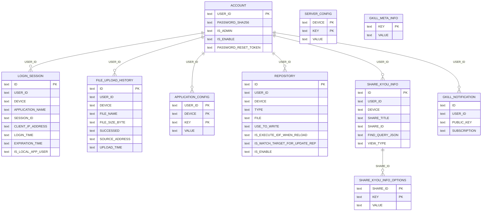
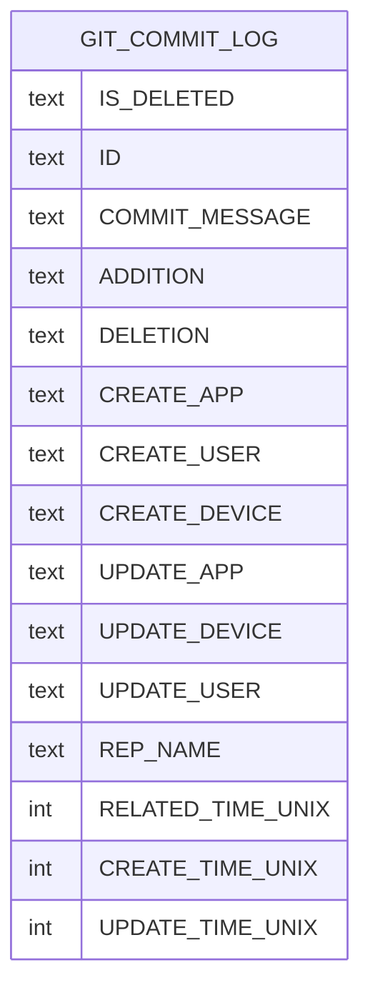

# gkill ER 図

本ドキュメントはコードの SQLite3 実装（`*_sqlite3_impl.go`）から抽出した正確なテーブル定義に基づく。

## 1. Kyou データ型 ER 図（全体関係）

```mermaid
erDiagram
    KMEMO {
        text IS_DELETED
        text ID
        text CONTENT
        text RELATED_TIME
        text CREATE_TIME
        text CREATE_APP
        text CREATE_USER
        text CREATE_DEVICE
        text UPDATE_TIME
        text UPDATE_APP
        text UPDATE_DEVICE
        text UPDATE_USER
    }

    KC {
        text IS_DELETED
        text ID
        text TITLE
        text NUM_VALUE
        text RELATED_TIME
        text CREATE_TIME
        text CREATE_APP
        text CREATE_USER
        text CREATE_DEVICE
        text UPDATE_TIME
        text UPDATE_APP
        text UPDATE_DEVICE
        text UPDATE_USER
    }

    LANTANA {
        text IS_DELETED
        text ID
        text MOOD
        text RELATED_TIME
        text CREATE_TIME
        text CREATE_APP
        text CREATE_USER
        text CREATE_DEVICE
        text UPDATE_TIME
        text UPDATE_APP
        text UPDATE_DEVICE
        text UPDATE_USER
    }

    MI {
        text IS_DELETED
        text ID
        text TITLE
        text IS_CHECKED
        text BOARD_NAME
        text LIMIT_TIME
        text ESTIMATE_START_TIME
        text ESTIMATE_END_TIME
        text CREATE_TIME
        text CREATE_APP
        text CREATE_USER
        text CREATE_DEVICE
        text UPDATE_TIME
        text UPDATE_APP
        text UPDATE_DEVICE
        text UPDATE_USER
    }

    NLOG {
        text IS_DELETED
        text ID
        text SHOP
        text TITLE
        text AMOUNT
        text RELATED_TIME
        text CREATE_TIME
        text CREATE_APP
        text CREATE_USER
        text CREATE_DEVICE
        text UPDATE_TIME
        text UPDATE_APP
        text UPDATE_DEVICE
        text UPDATE_USER
    }

    URLOG {
        text IS_DELETED
        text ID
        text URL
        text TITLE
        text DESCRIPTION
        text FAVICON_IMAGE
        text THUMBNAIL_IMAGE
        text RELATED_TIME
        text CREATE_TIME
        text CREATE_APP
        text CREATE_USER
        text CREATE_DEVICE
        text UPDATE_TIME
        text UPDATE_APP
        text UPDATE_DEVICE
        text UPDATE_USER
    }

    TIMEIS {
        text IS_DELETED
        text ID
        text TITLE
        text START_TIME
        text END_TIME
        text CREATE_TIME
        text CREATE_APP
        text CREATE_USER
        text CREATE_DEVICE
        text UPDATE_TIME
        text UPDATE_APP
        text UPDATE_DEVICE
        text UPDATE_USER
    }

    IDF {
        text IS_DELETED
        text ID
        text TARGET_REP_NAME
        text TARGET_FILE
        text RELATED_TIME
        text CREATE_TIME
        text CREATE_APP
        text CREATE_USER
        text CREATE_DEVICE
        text UPDATE_TIME
        text UPDATE_APP
        text UPDATE_DEVICE
        text UPDATE_USER
    }

    REKYOU {
        text IS_DELETED
        text ID
        text TARGET_ID
        text RELATED_TIME
        text CREATE_TIME
        text CREATE_APP
        text CREATE_USER
        text CREATE_DEVICE
        text UPDATE_TIME
        text UPDATE_APP
        text UPDATE_DEVICE
        text UPDATE_USER
    }

    TAG {
        text IS_DELETED
        text ID
        text TARGET_ID
        text TAG
        text RELATED_TIME
        text CREATE_TIME
        text CREATE_APP
        text CREATE_USER
        text CREATE_DEVICE
        text UPDATE_TIME
        text UPDATE_APP
        text UPDATE_DEVICE
        text UPDATE_USER
    }

    TEXT {
        text IS_DELETED
        text ID
        text TARGET_ID
        text TEXT
        text RELATED_TIME
        text CREATE_TIME
        text CREATE_APP
        text CREATE_USER
        text CREATE_DEVICE
        text UPDATE_TIME
        text UPDATE_APP
        text UPDATE_DEVICE
        text UPDATE_USER
    }

    NOTIFICATION {
        text IS_DELETED
        text ID
        text TARGET_ID
        text NOTIFICATION_TIME
        text CONTENT
        text IS_NOTIFICATED
        text CREATE_TIME
        text CREATE_APP
        text CREATE_USER
        text CREATE_DEVICE
        text UPDATE_TIME
        text UPDATE_APP
        text UPDATE_DEVICE
        text UPDATE_USER
    }

    KMEMO ||--o{ TAG : "TARGET_ID"
    KMEMO ||--o{ TEXT : "TARGET_ID"
    KMEMO ||--o{ NOTIFICATION : "TARGET_ID"
    KC ||--o{ TAG : "TARGET_ID"
    KC ||--o{ TEXT : "TARGET_ID"
    KC ||--o{ NOTIFICATION : "TARGET_ID"
    LANTANA ||--o{ TAG : "TARGET_ID"
    LANTANA ||--o{ TEXT : "TARGET_ID"
    LANTANA ||--o{ NOTIFICATION : "TARGET_ID"
    MI ||--o{ TAG : "TARGET_ID"
    MI ||--o{ TEXT : "TARGET_ID"
    MI ||--o{ NOTIFICATION : "TARGET_ID"
    NLOG ||--o{ TAG : "TARGET_ID"
    NLOG ||--o{ TEXT : "TARGET_ID"
    NLOG ||--o{ NOTIFICATION : "TARGET_ID"
    URLOG ||--o{ TAG : "TARGET_ID"
    URLOG ||--o{ TEXT : "TARGET_ID"
    URLOG ||--o{ NOTIFICATION : "TARGET_ID"
    TIMEIS ||--o{ TAG : "TARGET_ID"
    TIMEIS ||--o{ TEXT : "TARGET_ID"
    TIMEIS ||--o{ NOTIFICATION : "TARGET_ID"
    IDF ||--o{ TAG : "TARGET_ID"
    IDF ||--o{ TEXT : "TARGET_ID"
    IDF ||--o{ NOTIFICATION : "TARGET_ID"
    REKYOU ||--o{ TAG : "TARGET_ID"
    REKYOU ||--o{ TEXT : "TARGET_ID"
    REKYOU ||--o{ NOTIFICATION : "TARGET_ID"
    REKYOU }o--|| KMEMO : "TARGET_ID (repost)"
    REKYOU }o--|| KC : "TARGET_ID (repost)"
    REKYOU }o--|| MI : "TARGET_ID (repost)"
```

### 説明

- 全データ型は共通フィールド（IS_DELETED, ID, CREATE_*, UPDATE_*）を持つ
- **ID は主キーではない**（Append-Only 方式のため、同一 ID が複数行存在）
- TAG, TEXT, NOTIFICATION は `TARGET_ID` で任意の Kyou に紐づく
- REKYOU は `TARGET_ID` で他の Kyou をリポスト

## 2. アカウント・設定系 ER 図

### 説明

- **ACCOUNT**: ユーザ認証。USER_ID が主キー
- **LOGIN_SESSION**: セッション管理。30日有効期限
- **FILE_UPLOAD_HISTORY**: ファイルアップロード履歴（月間容量制限のため）
- **SERVER_CONFIG**: サーバ設定。DEVICE + KEY の複合主キー（Key-Value 形式）
- **APPLICATION_CONFIG**: ユーザ別アプリ設定。USER_ID + DEVICE + KEY の複合主キー
- **REPOSITORY**: データ保存先定義。TYPE でデータ型、FILE で SQLite3 ファイルパスを指定
- **SHARE_KYOU_INFO**: Kyou 共有リンク設定
- **GKILL_NOTIFICATION**: Web Push 通知購読情報
- **GKILL_META_INFO**: スキーマバージョン等のメタ情報

## 3. Git コミットログ（キャッシュテーブル）

### 説明

- テーブル名はリポジトリごとに動的生成
- ローカル Git リポジトリからコミットログを読み取ってキャッシュ
- 時刻は UNIX タイムスタンプ（他テーブルとは異なる形式）
- ADDITION / DELETION はコード変更行数

## 4. テーブル設計の特徴

### Append-Only テーブル（主キーなし）

以下のテーブルは **ID に主キー制約がない**:
- KMEMO, KC, LANTANA, MI, NLOG, URLOG, TIMEIS
- TAG, TEXT, NOTIFICATION, REKYOU, IDF
- GIT_COMMIT_LOG

同一 ID のレコードが複数行存在し、`UPDATE_TIME` が最新のものが有効。

### 通常テーブル（主キーあり）

以下のテーブルは通常の主キーを持つ:
- ACCOUNT（USER_ID）
- LOGIN_SESSION（ID）
- FILE_UPLOAD_HISTORY（ID）
- SERVER_CONFIG（DEVICE, KEY）
- APPLICATION_CONFIG（USER_ID, DEVICE, KEY）
- REPOSITORY（ID）
- SHARE_KYOU_INFO（ID）
- GKILL_META_INFO（KEY）

### データ型カラムなし

テーブルにはデータ型を示すカラムが存在しない。
データ型は**どのテーブルに格納されているか**で暗黙的に決まる（KMEMO テーブルのレコードは Kmemo 型）。
API レスポンスでは `DataType` フィールドとしてコード側で付与される。
