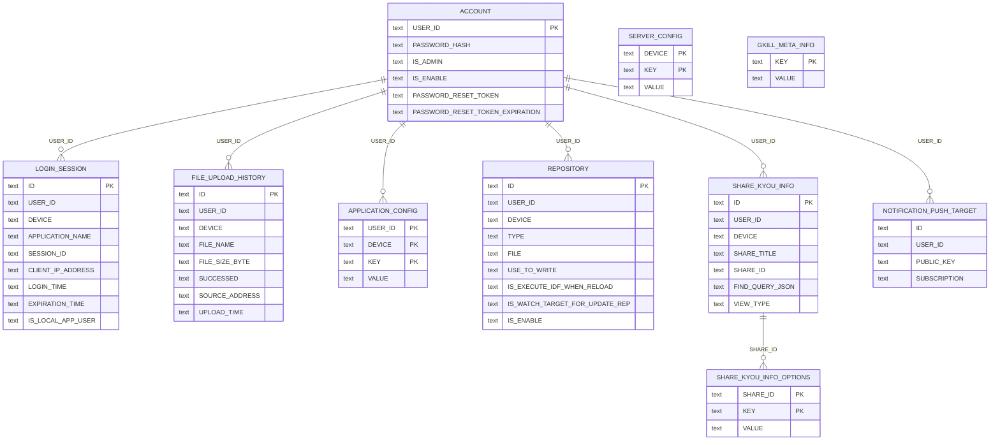
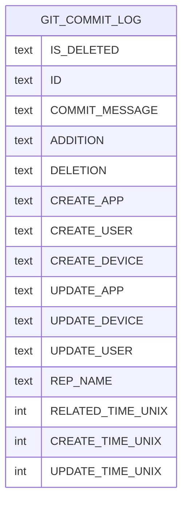

# gkill ER 図

本ドキュメントはコードの SQLite3 実装（`*_sqlite3_impl.go`）から抽出した正確なテーブル定義に基づく。

## 1. Kyou データ型 ER 図（全体関係）


```mermaid
erDiagram
    KMEMO {
        text IS_DELETED
        text ID
        text CONTENT
        text RELATED_TIME
        text CREATE_TIME
        text CREATE_APP
        text CREATE_USER
        text CREATE_DEVICE
        text UPDATE_TIME
        text UPDATE_APP
        text UPDATE_DEVICE
        text UPDATE_USER
    }

    KC {
        text IS_DELETED
        text ID
        text TITLE
        text NUM_VALUE
        text RELATED_TIME
        text CREATE_TIME
        text CREATE_APP
        text CREATE_USER
        text CREATE_DEVICE
        text UPDATE_TIME
        text UPDATE_APP
        text UPDATE_DEVICE
        text UPDATE_USER
    }

    LANTANA {
        text IS_DELETED
        text ID
        text MOOD
        text RELATED_TIME
        text CREATE_TIME
        text CREATE_APP
        text CREATE_USER
        text CREATE_DEVICE
        text UPDATE_TIME
        text UPDATE_APP
        text UPDATE_DEVICE
        text UPDATE_USER
    }

    MI {
        text IS_DELETED
        text ID
        text TITLE
        text IS_CHECKED
        text BOARD_NAME
        text LIMIT_TIME
        text ESTIMATE_START_TIME
        text ESTIMATE_END_TIME
        text CREATE_TIME
        text CREATE_APP
        text CREATE_USER
        text CREATE_DEVICE
        text UPDATE_TIME
        text UPDATE_APP
        text UPDATE_DEVICE
        text UPDATE_USER
    }

    NLOG {
        text IS_DELETED
        text ID
        text SHOP
        text TITLE
        text AMOUNT
        text RELATED_TIME
        text CREATE_TIME
        text CREATE_APP
        text CREATE_USER
        text CREATE_DEVICE
        text UPDATE_TIME
        text UPDATE_APP
        text UPDATE_DEVICE
        text UPDATE_USER
    }

    URLOG {
        text IS_DELETED
        text ID
        text URL
        text TITLE
        text DESCRIPTION
        text FAVICON_IMAGE
        text THUMBNAIL_IMAGE
        text RELATED_TIME
        text CREATE_TIME
        text CREATE_APP
        text CREATE_USER
        text CREATE_DEVICE
        text UPDATE_TIME
        text UPDATE_APP
        text UPDATE_DEVICE
        text UPDATE_USER
    }

    TIMEIS {
        text IS_DELETED
        text ID
        text TITLE
        text START_TIME
        text END_TIME
        text CREATE_TIME
        text CREATE_APP
        text CREATE_USER
        text CREATE_DEVICE
        text UPDATE_TIME
        text UPDATE_APP
        text UPDATE_DEVICE
        text UPDATE_USER
    }

    IDF {
        text IS_DELETED
        text ID
        text TARGET_REP_NAME
        text TARGET_FILE
        text RELATED_TIME
        text CREATE_TIME
        text CREATE_APP
        text CREATE_USER
        text CREATE_DEVICE
        text UPDATE_TIME
        text UPDATE_APP
        text UPDATE_DEVICE
        text UPDATE_USER
    }

    REKYOU {
        text IS_DELETED
        text ID
        text TARGET_ID
        text RELATED_TIME
        text CREATE_TIME
        text CREATE_APP
        text CREATE_USER
        text CREATE_DEVICE
        text UPDATE_TIME
        text UPDATE_APP
        text UPDATE_DEVICE
        text UPDATE_USER
    }

    MIREKYOU {
        text IS_DELETED
        text ID
        text TARGET_ID
        text IS_CHECKED
        text BOARD_NAME
        text LIMIT_TIME
        text ESTIMATE_START_TIME
        text ESTIMATE_END_TIME
        text CREATE_TIME
        text CREATE_APP
        text CREATE_USER
        text CREATE_DEVICE
        text UPDATE_TIME
        text UPDATE_APP
        text UPDATE_DEVICE
        text UPDATE_USER
    }

    TAG {
        text IS_DELETED
        text ID
        text TARGET_ID
        text TAG
        text RELATED_TIME
        text CREATE_TIME
        text CREATE_APP
        text CREATE_USER
        text CREATE_DEVICE
        text UPDATE_TIME
        text UPDATE_APP
        text UPDATE_DEVICE
        text UPDATE_USER
    }

    TEXT {
        text IS_DELETED
        text ID
        text TARGET_ID
        text TEXT
        text RELATED_TIME
        text CREATE_TIME
        text CREATE_APP
        text CREATE_USER
        text CREATE_DEVICE
        text UPDATE_TIME
        text UPDATE_APP
        text UPDATE_DEVICE
        text UPDATE_USER
    }

    NOTIFICATION {
        text IS_DELETED
        text ID
        text TARGET_ID
        text NOTIFICATION_TIME
        text CONTENT
        text IS_NOTIFICATED
        text CREATE_TIME
        text CREATE_APP
        text CREATE_USER
        text CREATE_DEVICE
        text UPDATE_TIME
        text UPDATE_APP
        text UPDATE_DEVICE
        text UPDATE_USER
    }

    KMEMO ||--o{ TAG : "TARGET_ID"
    KMEMO ||--o{ TEXT : "TARGET_ID"
    KMEMO ||--o{ NOTIFICATION : "TARGET_ID"
    KC ||--o{ TAG : "TARGET_ID"
    KC ||--o{ TEXT : "TARGET_ID"
    KC ||--o{ NOTIFICATION : "TARGET_ID"
    LANTANA ||--o{ TAG : "TARGET_ID"
    LANTANA ||--o{ TEXT : "TARGET_ID"
    LANTANA ||--o{ NOTIFICATION : "TARGET_ID"
    MI ||--o{ TAG : "TARGET_ID"
    MI ||--o{ TEXT : "TARGET_ID"
    MI ||--o{ NOTIFICATION : "TARGET_ID"
    NLOG ||--o{ TAG : "TARGET_ID"
    NLOG ||--o{ TEXT : "TARGET_ID"
    NLOG ||--o{ NOTIFICATION : "TARGET_ID"
    URLOG ||--o{ TAG : "TARGET_ID"
    URLOG ||--o{ TEXT : "TARGET_ID"
    URLOG ||--o{ NOTIFICATION : "TARGET_ID"
    TIMEIS ||--o{ TAG : "TARGET_ID"
    TIMEIS ||--o{ TEXT : "TARGET_ID"
    TIMEIS ||--o{ NOTIFICATION : "TARGET_ID"
    IDF ||--o{ TAG : "TARGET_ID"
    IDF ||--o{ TEXT : "TARGET_ID"
    IDF ||--o{ NOTIFICATION : "TARGET_ID"
    REKYOU ||--o{ TAG : "TARGET_ID"
    REKYOU ||--o{ TEXT : "TARGET_ID"
    REKYOU ||--o{ NOTIFICATION : "TARGET_ID"
    REKYOU }o--|| KMEMO : "TARGET_ID (repost)"
    REKYOU }o--|| KC : "TARGET_ID (repost)"
    REKYOU }o--|| MI : "TARGET_ID (repost)"
    MIREKYOU ||--o{ TAG : "TARGET_ID"
    MIREKYOU ||--o{ TEXT : "TARGET_ID"
    MIREKYOU ||--o{ NOTIFICATION : "TARGET_ID"
    MIREKYOU }o--|| KMEMO : "TARGET_ID (task)"
    MIREKYOU }o--|| KC : "TARGET_ID (task)"
    MIREKYOU }o--|| URLOG : "TARGET_ID (task)"
```

### 説明

- 全データ型は共通フィールド（IS_DELETED, ID, CREATE_*, UPDATE_*）を持つ
- **ID は主キーではない**（Append-Only 方式のため、同一 ID が複数行存在）
- TAG, TEXT, NOTIFICATION は `TARGET_ID` で任意の Kyou に紐づく
- REKYOU は `TARGET_ID` で他の Kyou をリポスト
- MIREKYOU は `TARGET_ID` で他の Kyou をタスク化する。MI と同じ板名・期限・開始/終了予定・チェック状態を持ち、タイトルは持たない

## 2. アカウント・設定系 ER 図


```mermaid
erDiagram
    ACCOUNT {
        text USER_ID PK
        text PASSWORD_HASH
        text IS_ADMIN
        text IS_ENABLE
        text PASSWORD_RESET_TOKEN
        text PASSWORD_RESET_TOKEN_EXPIRATION
    }

    LOGIN_SESSION {
        text ID PK
        text USER_ID
        text DEVICE
        text APPLICATION_NAME
        text SESSION_ID
        text CLIENT_IP_ADDRESS
        text LOGIN_TIME
        text EXPIRATION_TIME
        text IS_LOCAL_APP_USER
    }

    FILE_UPLOAD_HISTORY {
        text ID PK
        text USER_ID
        text DEVICE
        text FILE_NAME
        text FILE_SIZE_BYTE
        text SUCCESSED
        text SOURCE_ADDRESS
        text UPLOAD_TIME
    }

    SERVER_CONFIG {
        text DEVICE PK
        text KEY PK
        text VALUE
    }

    APPLICATION_CONFIG {
        text USER_ID PK
        text DEVICE PK
        text KEY PK
        text VALUE
    }

    REPOSITORY {
        text ID PK
        text USER_ID
        text DEVICE
        text TYPE
        text FILE
        text USE_TO_WRITE
        text IS_EXECUTE_IDF_WHEN_RELOAD
        text IS_WATCH_TARGET_FOR_UPDATE_REP
        text IS_ENABLE
    }

    SHARE_KYOU_INFO {
        text ID PK
        text USER_ID
        text DEVICE
        text SHARE_TITLE
        text SHARE_ID
        text FIND_QUERY_JSON
        text VIEW_TYPE
    }

    SHARE_KYOU_INFO_OPTIONS {
        text SHARE_ID PK
        text KEY PK
        text VALUE
    }

    NOTIFICATION_PUSH_TARGET {
        text ID
        text USER_ID
        text PUBLIC_KEY
        text SUBSCRIPTION
    }

    GKILL_META_INFO {
        text KEY PK
        text VALUE
    }

    ACCOUNT ||--o{ LOGIN_SESSION : "USER_ID"
    ACCOUNT ||--o{ FILE_UPLOAD_HISTORY : "USER_ID"
    ACCOUNT ||--o{ APPLICATION_CONFIG : "USER_ID"
    ACCOUNT ||--o{ REPOSITORY : "USER_ID"
    ACCOUNT ||--o{ SHARE_KYOU_INFO : "USER_ID"
    ACCOUNT ||--o{ NOTIFICATION_PUSH_TARGET : "USER_ID"
    SHARE_KYOU_INFO ||--o{ SHARE_KYOU_INFO_OPTIONS : "SHARE_ID"
```

### 説明

- **ACCOUNT**: ユーザ認証。USER_ID が主キー。`PASSWORD_HASH` は Argon2id の PHC 文字列（`$argon2id$v=19$m=65536,t=3,p=4$<ソルト>$<ハッシュ>`）で、nullable。NULL はパスワード未設定＝ログイン不可を意味する。`PASSWORD_RESET_TOKEN_EXPIRATION` はリセットトークンの期限（既定72時間）で、トークンが NULL のときは NULL
- **LOGIN_SESSION**: セッション管理。30日有効期限。パスワードを設定しなおすと、そのユーザの行はすべて削除される
- **FILE_UPLOAD_HISTORY**: ファイルアップロード履歴（月間容量制限のため）
- **SERVER_CONFIG**: サーバ設定。DEVICE + KEY の複合主キー（Key-Value 形式）
- **APPLICATION_CONFIG**: ユーザ別アプリ設定。USER_ID + DEVICE + KEY の複合主キー。主な KEY 値は以下の通り:

  | KEY | DEVICE | 説明 |
  |---|---|---|
  | `DASHBOARD_JSON_DATA` | `ALL` | ダッシュボード設定（`DashboardConfig` の JSON 文字列）。`ignoreDeviceNameConfigKey` リストに含まれるためデバイス非依存で保存される |
  | その他設定キー | デバイス名 or `ALL` | テーマ・表示日数・テンプレート等のアプリ設定 |
- **REPOSITORY**: データ保存先定義。TYPE でデータ型、FILE で SQLite3 ファイルパスを指定
- **SHARE_KYOU_INFO**: Kyou 共有リンク設定
- **NOTIFICATION_PUSH_TARGET**: Web Push 通知購読情報。**実際のテーブル名は `NOTIFICATION`**（`dao/gkill_notification/gkill_notificate_target_dao_sqlite3_impl.go`）で、Kyou のメタ情報である `NOTIFICATION` テーブル（`dao/reps/notification_repository_sqlite3_impl.go`）と同名だが**別DBファイル**。本図では区別のため `NOTIFICATION_PUSH_TARGET` と表記している
- **GKILL_META_INFO**: スキーマバージョン等のメタ情報。DBファイルごとに存在し、キーは `SCHEMA_VERSION_<DAO名>`。**`account.db` だけが `SCHEMA_VERSION_ACCOUNT = 1.1.0`** で、他はいずれも `1.0.0`。1.1.0 で `PASSWORD_SHA256` を `PASSWORD_HASH` にリネームし `PASSWORD_RESET_TOKEN_EXPIRATION` を追加した。**1.1.0 の account.db を 1.0.0 のバイナリで開くと `invalid db schema version` で起動を拒否する**（ダウングレード不可）

## 3. Git コミットログ（キャッシュテーブル）


```mermaid
erDiagram
    GIT_COMMIT_LOG {
        text IS_DELETED
        text ID
        text COMMIT_MESSAGE
        text ADDITION
        text DELETION
        text CREATE_APP
        text CREATE_USER
        text CREATE_DEVICE
        text UPDATE_APP
        text UPDATE_DEVICE
        text UPDATE_USER
        text REP_NAME
        int RELATED_TIME_UNIX
        int CREATE_TIME_UNIX
        int UPDATE_TIME_UNIX
    }
```

### 説明

- テーブル名はリポジトリごとに動的生成
- ローカル Git リポジトリからコミットログを読み取ってキャッシュ
- 時刻は UNIX タイムスタンプ（`*_TIME_UNIX`）。これは GitCommitLog 固有ではなく**キャッシュ層全体の共通規約**で、すべての `*_repository_cached_sqlite3_impl.go` が同じ形式を使う
- ADDITION / DELETION はコード変更行数

## 4. ApplicationConfig Go 構造体

定義: `src/server/gkill/dao/user_config/application_config.go`

ApplicationConfig は Go 側で以下のフィールドを持つ（抜粋）。

```go
type ApplicationConfig struct {
    // ... 既存フィールド ...
    DashboardJSONData *json.RawMessage `json:"dashboard_json_data"`
}
```

`DashboardJSONData` フィールドは `*json.RawMessage` 型で、フロントエンドの `DashboardConfig` クラスを JSON として格納する。`DASHBOARD_JSON_DATA` キーで `APPLICATION_CONFIG` テーブルに保存され、デバイス名 `ALL` で読み書きされる（デバイス非依存設定）。

SQLite3 実装（`application_config_dao_sqlite3_impl.go`）では、SELECT/INSERT ともに `DASHBOARD_JSON_DATA` キーへの対応が追加されている。

## 5. テーブル設計の特徴

### Append-Only テーブル（主キーなし）

以下のテーブルは **ID に主キー制約がない**:
- KMEMO, KC, LANTANA, MI, NLOG, URLOG, TIMEIS
- TAG, TEXT, NOTIFICATION, REKYOU, MIREKYOU, IDF
- GIT_COMMIT_LOG

同一 ID のレコードが複数行存在し、`UPDATE_TIME` が最新のものが有効。

### 通常テーブル（主キーあり）

以下のテーブルは通常の主キーを持つ:
- ACCOUNT（USER_ID）
- LOGIN_SESSION（ID）
- FILE_UPLOAD_HISTORY（ID）
- SERVER_CONFIG（DEVICE, KEY）
- APPLICATION_CONFIG（USER_ID, DEVICE, KEY）
- REPOSITORY（ID）
- SHARE_KYOU_INFO（ID）
- GKILL_META_INFO（KEY）

### データ型カラムなし

テーブルにはデータ型を示すカラムが存在しない。
データ型は**どのテーブルに格納されているか**で暗黙的に決まる（KMEMO テーブルのレコードは Kmemo 型）。
API レスポンスでは `DataType` フィールドとしてコード側で付与される。

### RELATED_TIME の導出ルール

多くのデータ型は `RELATED_TIME` カラムをテーブルに持つが、以下の3型は **DBカラムとして存在せず、SQLクエリ内で他カラムから動的に導出**される。

| データ型 | 導出元カラム | 説明 |
|---|---|---|
| **Mi** | `CREATE_TIME`, `UPDATE_TIME`, `LIMIT_TIME`, `ESTIMATE_START_TIME`, `ESTIMATE_END_TIME` | 5つのカラムからそれぞれ `AS RELATED_TIME` でエイリアスし、UNION で結合。作成日時・チェック日時・期限・開始予定・終了予定の各観点で検索・表示される |
| **TimeIs** | `START_TIME`, `END_TIME` | 2つのカラムからそれぞれ `AS RELATED_TIME` でエイリアスし、UNION で結合。開始時刻と終了時刻の両方でタイムライン上に表示される |
| **Notification** | `UPDATE_TIME`（通常検索）, `NOTIFICATION_TIME`（日時範囲検索） | コンテキストに応じて使い分け。通常のfindでは `UPDATE_TIME`、通知日時の範囲指定では `NOTIFICATION_TIME` を使用 |
| **MiReKyou** | `CREATE_TIME`, `UPDATE_TIME`, `LIMIT_TIME`, `ESTIMATE_START_TIME`, `ESTIMATE_END_TIME` | Mi と同じ5観点。`mi_re_kyou_sql.go` の射影ごとに `mirekyou_create` / `mirekyou_check` / `mirekyou_limit` / `mirekyou_start` / `mirekyou_end` の `DATA_TYPE` が付く |

## 6. 派生テーブル（キャッシュ層・一時層）

前節までは各データ型の**元テーブル**の定義。実際には同じデータに対して、用途別に別スキーマのテーブルが生成される。

### キャッシュ版テーブル

`*_repository_cached_sqlite3_impl.go` が生成する。元テーブルとの差分:

- `RELATED_TIME` / `CREATE_TIME` / `UPDATE_TIME` の TEXT カラムを持たない
- 代わりに `REP_NAME` と `RELATED_TIME_UNIX` / `CREATE_TIME_UNIX` / `UPDATE_TIME_UNIX`（INTEGER）を持つ

UNIX 秒にすることで範囲検索とソートを高速化し、`REP_NAME` で複数リポジトリを1テーブルに集約する。

### 一時（Temp）テーブル

`*_repository_temp_sqlite3_impl.go` が生成する。元テーブルの全カラムに加えて:

| カラム | 説明 |
|---|---|
| `USER_ID` | 所有ユーザ |
| `DEVICE` | 記録した端末 |
| `TX_ID` | トランザクションID。`commit_tx` / `discard_tx` の単位 |

KFTL のプレビューなど、確定前のデータを保持するために使う。

### LATEST_DATA_REPOSITORY_ADDRESS_{userID}

定義: `dao/reps/cache/latest_data_repository_address_dao_sqlite3_impl.go`

同一 ID のデータが複数リポジトリに存在するとき、どのリポジトリが最新版を持つかを記録する索引。

| カラム | 説明 |
|---|---|
| `IS_DELETED` | 論理削除フラグ |
| `TARGET_ID_IN_DATA` | データ内での対象ID |
| `TARGET_ID` (PK) | 対象ID |
| `LATEST_DATA_REPOSITORY_NAME` | 最新版を持つリポジトリ名 |
| `DATA_UPDATE_TIME_UNIX` | データの更新時刻（Unix秒） |
| `LATEST_DATA_REPOSITORY_ADDRESS_UPDATED_TIME_UNIX` | この索引自体の更新時刻（Unix秒） |

### {dbName}_REF_HASHES

定義: `dao/reps/git_commit_log_repository_cached_sqlite3_impl.go`

Git リポジトリの ref がどのコミットを指していたかを記録し、差分更新の判定に使う。

| カラム | 説明 |
|---|---|
| `REP_NAME` (PK) | リポジトリ名 |
| `REF_NAME` (PK) | ref 名 |
| `REF_HASH` | コミットハッシュ |
