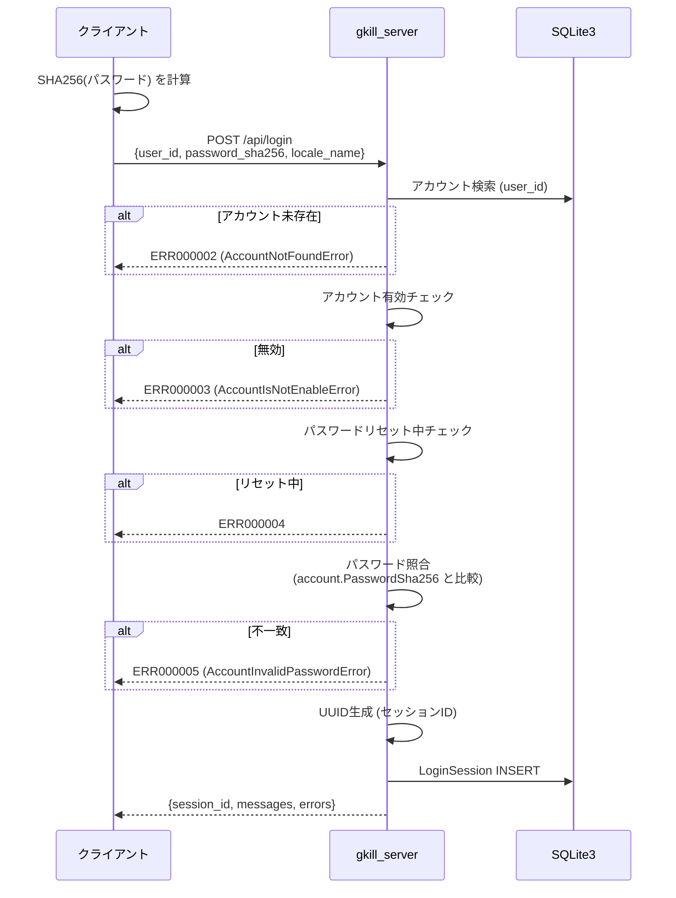

# エラーハンドリング・セキュリティ設計

## 1. エラーハンドリング方針

### 1.1 レスポンス構造

全APIレスポンスは共通の `messages` と `errors` 配列を持つ。

```go
// src/server/gkill/api/message/gkill_error.go
type GkillError struct {
    ErrorCode    string `json:"error_code"`
    ErrorMessage string `json:"error_message"`
}

// src/server/gkill/api/message/gkill_message.go
type GkillMessage struct {
    MessageCode string `json:"message_code"`
    Message     string `json:"message"`
}
```

**判定ルール:**
- `errors` が空配列 → 正常
- `errors` に要素あり → 業務エラー（`error_code` で判別）
- HTTP 403 → アクセス拒否（ローカルアクセス制限）
- HTTP 500 → サーバー内部エラー

### 1.2 エラーコード体系

エラーコードは `ERR??????`（6桁数字）形式で、`src/server/gkill/api/message/error_codes.go` に定数として定義されている。合計 **373件** のエラーコードが存在する（ERR000001〜ERR000374、ERR000243は欠番）。

#### 認証系（ERR000001〜ERR000017）

| コード | 名前 | 説明 |
|---|---|---|
| `ERR000001` | AccountInvalidLoginRequestDataError | ログインリクエストのJSONパースエラー |
| `ERR000002` | AccountNotFoundError | アカウントが存在しない |
| `ERR000003` | AccountIsNotEnableError | アカウントが無効化されている |
| `ERR000004` | AccountPasswordResetTokenIsNotNilError | パスワードリセット処理中 |
| `ERR000005` | AccountInvalidPasswordError | パスワード不一致 |
| `ERR000006` | AccountLoginInternalServerError | ログイン内部エラー |
| `ERR000007` | AccountInvalidLoginResponseDataError | レスポンスエンコードエラー |
| `ERR000008` | AccountInvalidLogoutRequestDataError | ログアウトリクエストパースエラー |
| `ERR000009` | AccountInvalidLogoutResponseDataError | ログアウトレスポンスエンコードエラー |
| `ERR000010` | AccountLogoutInternalServerError | ログアウト内部エラー |
| `ERR000013` | AccountSessionNotFoundError | セッションIDが無効 |
| `ERR000014` | AccountNotHasAdminError | 管理者権限なし |

#### その他の主要エラーコード

| コード | 名前 | 説明 |
|---|---|---|
| `ERR000220` | GetDeviceError | デバイス情報取得失敗 |
| `ERR000238` | AccountDisabledError | アカウント無効（セッション検証時） |
| `ERR000271` | GenerateVAPIDKeysError | VAPID鍵生成失敗 |
| `ERR000348` | GetAccountSessionsError | セッション取得失敗 |
| `ERR000350` | InvalidSubmitKFTLTextRequestDataError | KFTLテキスト送信リクエストパースエラー |
| `ERR000351` | SubmitKFTLTextError | KFTLテキスト処理エラー |

### 1.3 HTTPステータスコードの使い分け

| ステータス | 使用場面 |
|---|---|
| 200 | 正常レスポンス（業務エラーもHTTP 200、`errors`配列で判別） |
| 403 | `filterLocalOnly` によるアクセス拒否 |
| 500 | 予期しないサーバーエラー |

**注意:** 業務エラー（認証失敗、バリデーションエラー等）はHTTP 200で返し、レスポンスボディの `errors` 配列で判別する設計。

### 1.4 ハンドラ内のエラー処理パターン

各ハンドラは以下の共通パターンに従う：

```
1. defer r.Body.Close()
2. JSONリクエストパース → 失敗時: エラーコード + return
3. セッション検証（getAccountFromSessionID） → 失敗時: エラーコード + return
4. 業務処理 → 失敗時: エラーコード + return
5. defer json.NewEncoder(w).Encode(response) でレスポンス返却
```

### 1.5 ログ出力

**ログライブラリ:** Go 標準 `slog`（構造化ログ）

**ログレベル:** `trace_sql` > `trace` > `debug` > `info` > `warn` > `error` > `none`

**ログファイル:**（`$HOME/gkill/logs/` 配下）

| ファイル | 内容 |
|---|---|
| `gkill_error.log` | ERRORレベル |
| `gkill_warn.log` | WARNレベル |
| `gkill_info.log` | INFOレベル |
| `gkill_debug.log` | DEBUGレベル |
| `gkill_trace.log` | TRACEレベル |
| `gkill_trace_sql.log` | SQL文トレース |
| `gkill.log` | 全レベル統合 |

**ログフォーマット:** JSON形式、ソース位置追跡有効、静的フィールド `{"app": "gkill"}`

---

## 2. 認証・セキュリティ設計

### 2.1 ログインフロー



### 2.2 パスワード管理

| 項目 | 実装 |
|---|---|
| ハッシュアルゴリズム | SHA256（クライアント側で計算） |
| ソルト | なし |
| 保存形式 | SHA256 hex文字列（nullable） |
| 初期状態 | `nil`（パスワード未設定 → パスワードなしでログイン可） |
| 比較方式 | 文字列直接比較（`!=`） |

> **セキュリティ上の注記:** SHA256（ソルトなし）はパスワードハッシュとしては脆弱であり、レインボーテーブル攻撃のリスクがあります。gkillはスタンドアロン利用を前提とした設計のため現状の実装となっていますが、リモート公開環境で運用する場合は、bcrypt/scrypt/Argon2等のソルト付きハッシュへの移行を検討すべきです。

### 2.3 セッション管理

**セッション作成時の情報:**

| フィールド | 内容 |
|---|---|
| `SessionID` | UUID（google/uuid で生成） |
| `UserID` | ログインユーザーID |
| `Device` | デバイス名 |
| `ApplicationName` | `"gkill"` または `"urlog_bookmarklet"` |
| `ClientIPAddress` | `r.RemoteAddr` から抽出 |
| `IsLocalAppUser` | localhost/127.0.0.1/[::1] の場合 true |
| `ExpirationTime` | ログインから30日後 |
| `LoginTime` | ログイン時刻 |

**セッション検証フロー** (`getAccountFromSessionID`):

1. `SessionID` で `LoginSession` を検索
2. 見つからない → `ERR000013` (AccountSessionNotFoundError)
3. `ExpirationTime` が現在時刻を超過していないか検証 → 期限切れなら `ERR000373` (AccountSessionExpiredError)
4. `ApplicationName` が `"gkill"` であることを確認
5. `UserID` でアカウント検索
6. アカウント有効チェック → 無効なら `ERR000238` (AccountDisabledError)

**ストレージ:** インメモリキャッシュ + SQLite3 (`account_state.db`)

### 2.4 アクセス制御

#### ローカルアクセス制限 (filterLocalOnly)

`ServerConfig.IsLocalOnlyAccess` が有効な場合、以下のIPアドレスのみ許可：
- `localhost`
- `127.0.0.1`
- `[::1]`（IPv6ループバック）
- `::1`

上記以外からのリクエストには HTTP 403 Forbidden を返す。

**実装箇所:** `src/server/gkill/api/gkill_server_api.go` (`filterLocalOnly` メソッド)

#### エンドポイント別アクセス制御

| エンドポイント群 | 認証 | ローカル制限 |
|---|---|---|
| `/api/login` | 不要 | なし |
| `/api/get_shared_kyous` | 不要（共有リンク） | なし |
| `/api/urlog_bookmarklet` | 独自セッション | なし |
| その他全エンドポイント | `session_id` 必須 | ServerConfig依存 |
| `/api/open_directory`, `/api/open_file` | `session_id` 必須 | filterLocalOnly適用 |

### 2.5 TLS設定

| 項目 | 内容 |
|---|---|
| デフォルト | 無効（HTTP） |
| 有効化 | `ServerConfig.EnableTLS = true` |
| 証明書パス | `$HOME/gkill/tls/cert.cer` |
| 秘密鍵パス | `$HOME/gkill/tls/key.pem` |
| 自動生成 | `/api/generate_tls_file` で自己署名証明書生成可能 |
| CLI無効化 | `--disable_tls` フラグ |

### 2.6 Web Push通知 (VAPID)

| 項目 | 内容 |
|---|---|
| ライブラリ | `github.com/SherClockHolmes/webpush-go` |
| 鍵生成タイミング | 初回サーバー起動時に自動生成 |
| 鍵保存先 | `server_config.db` (ServerConfig テーブル) |
| 公開鍵取得 | `/api/get_gkill_notification_public_key` |
| 通知登録 | `/api/register_gkill_notification` |

### 2.7 CORS

**明示的なCORSヘッダーは設定されていない。** 全レスポンスに `Content-Type: application/json` のみ設定。

- 同一オリジン（`http://localhost:9999`）からのアクセスは問題なし
- クロスオリジンアクセスはブラウザにブロックされる
- デスクトップアプリ（go-astilectron）は同一オリジンで動作
- MCP HTTPサーバー（`src/mcp/gkill-read-server.mjs`）は別プロセスで動作するため、gkill_server APIへのアクセスはサーバー間通信（fetch）であり、ブラウザのCORS制約は適用されない。ただし、MCP HTTPサーバー自体がOAuth 2.1の認可エンドポイントを提供する際、Claude.ai/ChatGPT等のクライアントからのリダイレクトはブラウザ経由で行われるため、CORS設定は不要（リダイレクトベースのフローのため）

### 2.8 初期セットアップのセキュリティ

初回起動時：
1. `admin` アカウントが自動作成される（`PasswordSha256 = nil`）
2. **パスワード未設定状態ではパスワードなしでログイン可能**
3. VAPID鍵ペアが自動生成される
4. デフォルトデバイス `"gkill"` が作成される

→ 初回起動後、速やかにパスワードを設定することを推奨。

---

## 3. フロントエンドのエラーハンドリング

### 3.1 GkillAPI クラスのパターン

`src/client/classes/api/gkill-api.ts` のシングルトン `GkillAPI` は以下のパターンでエラーを処理：

1. `fetch()` でPOSTリクエスト送信
2. レスポンスJSON をパース
3. `response.errors` 配列を確認
4. エラーあり → UIにエラーメッセージ表示
5. 正常 → データをコンポーネントに返却

### 3.2 ネットワークエラーハンドリング

`GkillAPI` クラスに `gkill_fetch()` ヘルパーを導入し、全API呼び出しのネットワークエラーを統一的に処理：
- `navigator.onLine` が false、または `TypeError`（fetch失敗）を検出
- エラーコード `NETWORK_ERROR` の `GkillError` を含むモックレスポンスを返却
- 呼び出し元の既存エラーハンドリングパスでユーザーに通知

`App.vue` にオフラインバナーを追加（`navigator.onLine` + `online`/`offline` イベント監視）。

### 3.3 Share Target エラーハンドリング

`serviceWorker.ts` の share-target POST ハンドラを try-catch で囲み、例外発生時は `is_saved=false` でリダイレクト。

### 3.4 Service Worker のキャッシュエラー処理

`src/client/serviceWorker.ts` では：
- キャッシュヒット時: `_histories` フィールドの存在と `errors` 配列の空チェックでキャッシュの有効性を検証
- `force_reget` パラメータでキャッシュバイパス可能
- キャッシュ名: `gkill-post-kyou-cache`（データ系）、`gkill-post-config-cache`（設定系）

### 3.5 セッション有効期限・レート制限

- **セッション有効期限**: API呼び出し時にセッションの `ExpirationTime` を検証。期限切れの場合は `ERR000373`（`AccountSessionExpiredError`）を返し、クライアント側でログイン画面にリダイレクト
- **ログインレート制限**: IP単位で15分間に10回までのログイン試行を許可。超過時は `ERR000374`（`LoginRateLimitError`）を返却。`loginRateLimiter` 構造体でスライディングウィンドウ方式を実装。インメモリのみで永続化されないため、サーバー再起動でリセットされる
