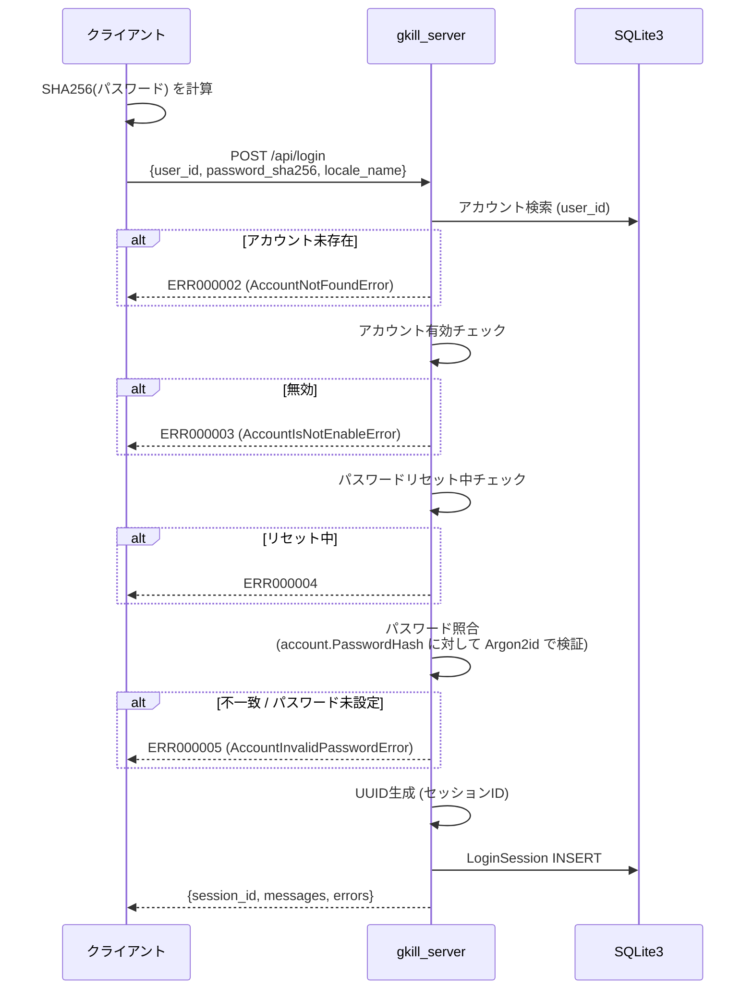

# エラーハンドリング・セキュリティ設計

## 1. エラーハンドリング方針

### 1.1 レスポンス構造

全APIレスポンスは共通の `messages` と `errors` 配列を持つ。

```go
// src/server/gkill/api/message/gkill_error.go
type GkillError struct {
    ErrorCode    string `json:"error_code"`
    ErrorMessage string `json:"error_message"`
}

// src/server/gkill/api/message/gkill_message.go
type GkillMessage struct {
    MessageCode string `json:"message_code"`
    Message     string `json:"message"`
}
```

**判定ルール:**
- `errors` が `null` または空配列 → 正常
- `errors` に要素あり → 業務エラー（`error_code` で判別）
- HTTP 403 → アクセス拒否（ローカルアクセス制限）
- HTTP 500 → サーバー内部エラー

> **成功時の `errors` は空配列ではなく `null` で返る。** レスポンス構造体のタグは `json:"errors"` で `omitempty` が付いておらず（`src/server/gkill/api/req_res/` 配下 90 箇所すべて）、ハンドラは `response := &req_res.XxxResponse{}` と初期化してエラー時だけ `append` するため、成功時は nil slice がそのまま `null` になる。クライアントで `[...res.errors]` のように素のスプレッドをすると `TypeError` で落ち、呼び出し元のダイアログクローズまで巻き添えになるので、必ず `res.errors ?? []` を通すこと（`cascade-delete-kyou.ts` 参照）。

### 1.2 エラーコード体系

エラーコードは `ERR??????`（6桁数字）形式で、`src/server/gkill/api/message/error_codes.go` に定数として定義されている。合計 **409件** のエラーコードが存在する（ERR000001〜ERR000410、ERR000243は欠番）。クライアントだけで発生するエラーには別系統の `ERR9xxxxx` を割り当てている（3.6 参照）。

```bash
# 数え直すとき
grep -oE 'ERR[0-9]{6}' src/server/gkill/api/message/error_codes.go | sort -u | wc -l
```

#### 認証系（ERR000001〜ERR000017）

| コード | 名前 | 説明 |
|---|---|---|
| `ERR000001` | AccountInvalidLoginRequestDataError | ログインリクエストのJSONパースエラー |
| `ERR000002` | AccountNotFoundError | アカウントが存在しない |
| `ERR000003` | AccountIsNotEnableError | アカウントが無効化されている |
| `ERR000004` | AccountPasswordResetTokenIsNotNilError | パスワードリセット処理中 |
| `ERR000005` | AccountInvalidPasswordError | パスワード不一致 |
| `ERR000006` | AccountLoginInternalServerError | ログイン内部エラー |
| `ERR000007` | AccountInvalidLoginResponseDataError | レスポンスエンコードエラー |
| `ERR000008` | AccountInvalidLogoutRequestDataError | ログアウトリクエストパースエラー |
| `ERR000009` | AccountInvalidLogoutResponseDataError | ログアウトレスポンスエンコードエラー |
| `ERR000010` | AccountLogoutInternalServerError | ログアウト内部エラー |
| `ERR000013` | AccountSessionNotFoundError | セッションIDが無効 |
| `ERR000014` | AccountNotHasAdminError | 管理者権限なし |

#### その他の主要エラーコード

| コード | 名前 | 説明 |
|---|---|---|
| `ERR000220` | GetDeviceError | デバイス情報取得失敗 |
| `ERR000238` | AccountDisabledError | アカウント無効（セッション検証時） |
| `ERR000271` | GenerateVAPIDKeysError | VAPID鍵生成失敗 |
| `ERR000348` | GetAccountSessionsError | セッション取得失敗 |
| `ERR000350` | InvalidSubmitKFTLTextRequestDataError | KFTLテキスト送信リクエストパースエラー |
| `ERR000351` | SubmitKFTLTextError | KFTLテキスト処理エラー |
| `ERR000375` | InvalidBrowseZipContentsRequestDataError | ZIP内容閲覧リクエストパースエラー |
| `ERR000376` | BrowseZipContentsError | ZIP内容閲覧処理エラー（展開失敗、パストラバーサル検出等） |
| `ERR000377`〜`ERR000384` | Invalid〜/GetPluginListError, GetPluginContentHTMLError, GetPluginConfigHTMLError, PostPluginConfigError | プラグイン系エンドポイント（一覧取得・コンテンツHTML・設定HTML・設定保存）のパース/処理エラー |
| `ERR000385`〜`ERR000386` | InvalidGetIDFKyouByRelativePathRequestDataError / GetIDFKyouByRelativePathError | Markdown相対リンク解決（IDFKyou相対パス解決）のパース/処理エラー |
| `ERR000387`〜`ERR000388` | InvalidGetIDFFilePathRequestDataError / GetIDFFilePathError | IDFファイル絶対パス解決のパース/処理エラー |
| `ERR000389` | GetIDFFilePathNotLocalRequestError | IDFファイル絶対パス解決を localhost 以外からリクエストした場合の拒否エラー |
| `ERR000390`〜`ERR000401` | InvalidAddMiReKyouRequestDataError 〜 CommitTxGetMiReKyouError | MiReKyou（既存記録のタスク化）系の追加・取得・更新・トランザクションのパース/処理エラー（12件） |
| `ERR000402`〜`ERR000407` | InvalidGetReKyousByTargetIDRequestDataError 〜 GetMiReKyousByTargetIDError | 逆引き取得（`get_rekyous_by_target_id` / `get_mirekyous_by_target_id`）のパース/処理エラー（6件）。クライアントの連鎖削除が参照元を辿るのに使う |
| `ERR000408` | ExpiredPasswordResetTokenError | パスワードリセットトークンが一致したが期限切れ（72時間）。汎用の失敗と区別して「再発行してもらえばよい」と伝えるためのコード |
| `ERR000409` | CannotDisableOwnAccountError | ログイン中のアカウント自身を無効化しようとした。管理者が自分を締め出す事故を防ぐ |

### 1.3 HTTPステータスコードの使い分け

| ステータス | 使用場面 |
|---|---|
| 200 | 正常レスポンス（業務エラーもHTTP 200、`errors`配列で判別） |
| 403 | `filterLocalOnly` によるアクセス拒否 |
| 500 | 予期しないサーバーエラー |

**注意:** 業務エラー（認証失敗、バリデーションエラー等）はHTTP 200で返し、レスポンスボディの `errors` 配列で判別する設計。

### 1.4 ハンドラ内のエラー処理パターン

各ハンドラは以下の共通パターンに従う：

```
1. defer r.Body.Close()
2. JSONリクエストパース → 失敗時: エラーコード + return
3. セッション検証 → 失敗時: エラーコード + return
   （`wrapAuth` / `wrapAuthRepos` のミドルウェアが済ませており、ハンドラは `AuthFromContext(r.Context())`
    を読むだけ。ハンドラ内で `getAccountFromSessionID` を直接呼ぶのは `wrapNoAuth` 系だけ）
4. 業務処理 → 失敗時: エラーコード + return
5. defer json.NewEncoder(w).Encode(response) でレスポンス返却
```

### 1.5 ログ出力

**ログライブラリ:** Go 標準 `slog`（構造化ログ）

**ログレベル:** `trace_sql` > `trace` > `debug` > `access` > `info` > `warn` > `error` > `none`

**ログファイル:**（`$HOME/gkill/logs/` 配下）

| ファイル | 内容 |
|---|---|
| `gkill_error.log` | ERRORレベル |
| `gkill_warn.log` | WARNレベル |
| `gkill_info.log` | INFOレベル |
| `gkill_access.log` | ACCESSレベル（HTTPアクセスログ: リモートIP、メソッド、パス、ステータス、所要時間、ユーザID） |
| `gkill_debug.log` | DEBUGレベル |
| `gkill_trace.log` | TRACEレベル |
| `gkill_trace_sql.log` | SQL文トレース |
| `gkill.log` | 全レベル統合 |
| `gkill_mcp_read_access.log` | Read MCPサーバのアクセスログ（`MCP_LOG`環境変数で制御） |
| `gkill_mcp_write_access.log` | Write MCPサーバのアクセスログ |
| `gkill_mcp_readwrite_access.log` | Read/Write統合MCPサーバのアクセスログ |

**ログフォーマット:** JSON形式、ソース位置追跡有効、静的フィールド `{"app": "gkill"}`

**機密値のマスク:** TraceSQL ログ（`gkill_trace_sql.log`）に出力される SQL バインド値のうち、機密値（Google Map 等の APIキー、TLS 秘密鍵、パスワードハッシュ、パスワードリセットトークン、セッションID）はマスクされて記録される（`account_dao_sqlite3_impl.go`・`server_config_dao_sqlite3_impl.go`・`sqlite3impl_util.go`）。

---

## 2. 認証・セキュリティ設計

### 2.1 ログインフロー


```mermaid
sequenceDiagram
    participant C as クライアント
    participant S as gkill_server
    participant DB as SQLite3

    C->>C: SHA256(パスワード) を計算
    C->>S: POST /api/login<br/>{user_id, password_sha256, locale_name}
    S->>DB: アカウント検索 (user_id)
    alt アカウント未存在
        S-->>C: ERR000002 (AccountNotFoundError)
    end
    S->>S: アカウント有効チェック
    alt 無効
        S-->>C: ERR000003 (AccountIsNotEnableError)
    end
    S->>S: パスワードリセット中チェック
    alt リセット中
        S-->>C: ERR000004
    end
    S->>S: パスワード照合<br/>(account.PasswordHash に対して Argon2id で検証)
    alt 不一致 / パスワード未設定
        S-->>C: ERR000005 (AccountInvalidPasswordError)
    end
    S->>S: UUID生成 (セッションID)
    S->>DB: LoginSession INSERT
    S-->>C: {session_id, messages, errors}
```

### 2.2 パスワード管理

| 項目 | 実装 |
|---|---|
| ワイヤ形式 | クライアントが `SHA256(パスワード)` を64桁小文字hexにして送る（`password_sha256` / `new_password_sha256`） |
| サーバ側のハッシュ | Argon2id（`m=65536 KiB, t=3, p=4`、ソルト16バイト、鍵長32バイト） |
| ソルト | アカウントごとに `crypto/rand` で生成 |
| 保存形式 | PHC文字列 `$argon2id$v=19$m=65536,t=3,p=4$<ソルト>$<ハッシュ>`（nullable） |
| 保存先カラム | `ACCOUNT.PASSWORD_HASH` |
| 初期状態 | `PasswordHash = nil` かつ `PasswordResetToken` 設定済み（→ パスワードリセット登録が必要。パスワードなしではログイン不可） |
| 比較方式 | Argon2idで再計算し `crypto/subtle.ConstantTimeCompare` |
| 未設定時の挙動 | 常に不一致として扱う（fail-closed） |
| 新パスワードの検証 | 64桁小文字hexでなければ拒否 |

実装は `src/server/gkill/dao/account/password_hash.go`。パラメータはPHC文字列自身に埋め込むので、
後からコストを変えても既存の保存値はそのまま照合できる。

> **クライアント側SHA256の位置づけ:** サーバは受け取った64桁hexを「資格情報」として扱い、
> その上にArgon2idをかける。前段のSHA256はArgon2idの強度を下げない（攻撃者はオフライン総当たりでも
> 候補ごとに SHA256（安価）→ Argon2id（高価）を計算する必要があり、コストはArgon2idが支配する）。
> 副次的に、Argon2idへの入力が64桁hex固定になるため長大入力によるDoSも塞がる。
> またサーバが平文パスワードを一切見ないので、他サービスとのパスワード使い回しがgkillに露出しない。

> **残る留意点:** ワイヤを流れる64桁hexは、それ自体がリプレイ可能な資格情報である。
> 外部公開する場合はTLSが前提になる。MCPサーバ・Wear OSコンパニオン・gkill_autolog は
> この値を長期資格情報として保存しているため、失効させたい場合はパスワードの再設定が必要になる。

**パスワードリセットトークン:**

| 項目 | 実装 |
|---|---|
| 生成 | UUIDv4（`crypto/rand` 由来、122ビット） |
| 有効期限 | 発行から72時間（`account.PasswordResetTokenTTL`）。`ACCOUNT.PASSWORD_RESET_TOKEN_EXPIRATION` に保存 |
| 比較方式 | `crypto/subtle.ConstantTimeCompare`（`Account.IsPasswordResetTokenValid`） |
| 使用回数 | 1回（`/api/set_new_password` 成功時に期限ごとNULLにする） |
| 発行経路 | 初回起動時のadmin自動作成、`/api/add_user`、`/api/reset_password`、CLIの `reset_password` |
| 失効の副作用 | パスワード設定に成功すると、その利用者の `LOGIN_SESSION` を全削除する |

管理者が全員ぶんのトークンを失った場合や期限が切れた場合は、サーバと同じマシンで
`gkill_server reset_password <user_id...>` を実行するとトークンを再発行してURLを表示する。
Argon2id化によりDBを読んでもログインはできないため、これが唯一の復帰経路になる。

**スキーマ1.0.0からの移行:**

1.0.0では `ACCOUNT.PASSWORD_SHA256` に無塩SHA-256をそのまま保持していた。つまり
DBの値がそのままログインに使える状態で、`update_cache` サブコマンドが実際にそうしていた。
1.1.0への移行（`account_dao_sqlite3_impl.go` の `migrateAccountSchemaFrom100`）は単一トランザクションで

1. `PASSWORD_SHA256` を `PASSWORD_HASH` にリネーム
2. `PASSWORD_RESET_TOKEN_EXPIRATION` を追加
3. 全アカウントのパスワードを無効化し、リセットトークンを発行しなおす
4. スキーマ版を更新

を行い、発行したリセットURLを標準出力に印字する。既存ハッシュをArgon2idで包み直すのではなく
全員に再設定してもらうのは、包み直しても「DBを読めた者がログインできる」状態が続くため。
移行後のDBを1.0.0のバイナリで開くと `invalid db schema version` で起動を拒否する。

### 2.3 セッション管理

**セッション作成時の情報:**

| フィールド | 内容 |
|---|---|
| `SessionID` | UUID（google/uuid で生成） |
| `UserID` | ログインユーザーID |
| `Device` | デバイス名 |
| `ApplicationName` | `"gkill"` または `"urlog_bookmarklet"` |
| `ClientIPAddress` | `r.RemoteAddr` から抽出 |
| `IsLocalAppUser` | localhost/127.0.0.1/[::1] の場合 true |
| `ExpirationTime` | ログインから30日後 |
| `LoginTime` | ログイン時刻 |

**セッション検証フロー** (`getAccountFromSessionID`):

1. `SessionID` で `LoginSession` を検索
2. 見つからない → `ERR000013` (AccountSessionNotFoundError)
3. `ExpirationTime` が現在時刻を超過していないか検証 → 期限切れなら `ERR000373` (AccountSessionExpiredError)
4. `ApplicationName` が `"gkill"` であることを確認
5. `UserID` でアカウント検索
6. アカウント有効チェック → 無効なら `ERR000238` (AccountDisabledError)

**ストレージ:** インメモリキャッシュ + SQLite3 (`account_state.db`)

### 2.4 アクセス制御

#### ローカルアクセス制限 (filterLocalOnly)

`ServerConfig.IsLocalOnlyAccess` が有効な場合、以下のIPアドレスのみ許可：
- `localhost`
- `127.0.0.1`
- `[::1]`（IPv6ループバック）
- `::1`

上記以外からのリクエストには HTTP 403 Forbidden を返す。

**実装箇所:** `src/server/gkill/api/gkill_server_api/filter_local_only.go` (`filterLocalOnly` メソッド)

#### エンドポイント別アクセス制御

| エンドポイント群 | 認証 | ローカル制限 |
|---|---|---|
| `/api/login` | 不要 | なし |
| `/api/get_shared_kyous` | 不要（共有リンク） | なし |
| `/api/urlog_bookmarklet` | 独自セッション | なし |
| `/api/logout` | ルーティング上は不要だがハンドラ内でセッションを解決し、解決できなければ何も削除しない | なし |
| `/api/set_new_password` | 不要（リセットトークンで認可）。IP単位のレート制限あり | なし |
| その他全エンドポイント | `session_id` 必須 | ServerConfig依存 |
| `/api/open_directory`, `/api/open_file` | `session_id` 必須 | filterLocalOnly適用 |

#### 派生キャッシュの配信

| パス | 認証 | 利用者の分離 |
|---|---|---|
| `/files/` | Cookie `gkill_session_id`（共有ページは `gkill_shared_id`） | セッションの利用者のリポジトリを読み込み、URL中のrep名がその利用者のIDF repに無ければ404（`handle_file_serve.go`） |
| `/zip_cache/` | Cookie `gkill_session_id` | 配信の起点をセッションから引いた利用者のディレクトリ（`caches/zip_cache/{userID}/`）に固定する。利用者IDはURLに現れないので他人のディレクトリを指名できない（`handle_browse_zip_contents.go`） |
| サムネイル / 互換動画 | `/files/` と同じ（**専用ルートは無い**） | `/files/{rep_name}/...?thumb=` 経由でのみ到達する。上記の rep 名照合に加えて、`idf_thumb_file_server.go` が**自分の contentDir に同じ相対パスの実ファイルが存在すること**を要求する。保存先も `caches/{thumb,video}_cache/{userID}/{rep_name}/` と利用者ごとに分けている |

**rep名は利用者間で一意ではない。** `REPOSITORY` に UNIQUE 制約は無く、rep名は
`filepath.Base(contentDir)` で決まるため、別のディレクトリを指す同名 rep が複数の利用者に存在しうる。
そのため `/zip_cache/` は rep名の照合ではなくディレクトリの分離で担保している。
rep名だけを照合すると、同名repを持つ利用者が他人のファイルのハッシュを含むURLを要求したときに通ってしまう。

サムネイル・互換動画も同じ理由で `caches/{thumb,video}_cache/{userID}/` と利用者ごとに分けている。
キャッシュ名は `{sha1(相対パス)}_{ファイルサイズ}_{W}x{H}.jpg`（動画は `_compat_720p.mp4`）で、
rep名だけで分けると「同名rep × 同一相対パス × 同一ファイルサイズ」で他人のキャッシュと衝突する。
`Clear{Thumb,Video,Zip}Cache(userID)` の3種とも同じ構成をたどって削除する。

#### 初回セットアップ時のリセットトークン

アカウントが `admin` 1件だけでパスワード未設定という初期状態のとき、`/` へのHTMLナビゲーションは
`/register_first_account?reset_token=<UUID>` へ307リダイレクトされる。このトークンはadminを丸ごと取れる秘密なので、
**接続元がループバックで、かつ転送ヘッダ（`X-Forwarded-For` / `X-Real-Ip` / `Forwarded` / `X-Forwarded-Host`）が
付いていない場合に限って**渡す（`utils.go` の `ifRedirectResetAdminAccountIsNotFound`）。
それ以外は通常のログイン画面を返す。ループバック以外から初回セットアップする場合は、
起動時に標準出力へ出るURL（`close.go` の `printInitialSetupURLs`）を使う。

### 2.5 TLS設定

| 項目 | 内容 |
|---|---|
| デフォルト | 無効（HTTP） |
| 有効化 | `ServerConfig.EnableTLS = true` |
| 証明書パス | `$HOME/gkill/tls/cert.cer` |
| 秘密鍵パス | `$HOME/gkill/tls/key.pem` |
| 自動生成 | `/api/generate_tls_file` で自己署名証明書生成可能 |
| CLI無効化 | `--disable_tls` フラグ |
| 非TLSで外部bind | 起動時に標準出力へ警告を出す（起動は妨げない）。`close.go` の `printInsecureBindWarning` |

### 2.6 Web Push通知 (VAPID)

| 項目 | 内容 |
|---|---|
| ライブラリ | `github.com/SherClockHolmes/webpush-go` |
| 鍵生成タイミング | 初回サーバー起動時に自動生成 |
| 鍵保存先 | `server_config.db` (ServerConfig テーブル) |
| 公開鍵取得 | `/api/get_gkill_notification_public_key` |
| 通知登録 | `/api/register_gkill_notification` |

### 2.7 CORS

**明示的なCORSヘッダーは設定されていない。** 全レスポンスに `Content-Type: application/json` のみ設定。

- 同一オリジン（`http://localhost:9999`）からのアクセスは問題なし
- クロスオリジンアクセスはブラウザにブロックされる
- デスクトップアプリ（go-astilectron）は同一オリジンで動作
- MCP HTTPサーバー（`src/mcp/gkill-read-server.mjs`）は別プロセスで動作するため、gkill_server APIへのアクセスはサーバー間通信（fetch）であり、ブラウザのCORS制約は適用されない。ただし、MCP HTTPサーバー自体がOAuth 2.1の認可エンドポイントを提供する際、Claude.ai/ChatGPT等のクライアントからのリダイレクトはブラウザ経由で行われるため、CORS設定は不要（リダイレクトベースのフローのため）

### 2.7.1 CSRF と2系統の認証

**CSRF トークンは実装していない**（コードベースに `csrf` の語は1つも無い）。
gkill には認証経路が2系統あり、CSRF に対する強さが異なる。

| 経路 | 認証情報の運び方 | CSRF 耐性 |
|---|---|---|
| JSON API（`/api/*`） | `session_id` を**リクエストボディ**に入れる（`auth_middleware.go`） | 高い。クロスサイトから `Content-Type: application/json` の任意ボディを送るにはプリフライトが必要で、ブラウザが遮る |
| ファイル配信（`/files/*`, `/zip_cache/*`） | **cookie**（`gkill_session_id`） | cookie 依存のため相対的に弱い |

JSON API 側がボディで `session_id` を運ぶ設計になっているため、CSRF トークンが無くても
主要な書き込み操作は保護される。一方 cookie 側には以下の性質がある
（`gkill-api.ts` の `set_session_id()` が `document.cookie` で設定している）。

- `SameSite` / `Secure` / `HttpOnly` のいずれも指定していない
- `max-age` が **400日**。サーバ側のセッション有効期限（30日）より長い
- JavaScript から設定しているため `HttpOnly` は原理的に付けられない

この cookie で守られているのはファイル配信（GET）のみで、データ変更操作は行えない。

### 2.8 ZIPファイル展開のセキュリティ

`/api/browse_zip_contents` エンドポイントは、IDFKyouのZIPファイルを展開してブラウジングする機能を提供する。以下のセキュリティ対策が実装されている。

| 脅威 | 対策 |
|------|------|
| **パストラバーサル** | 一時展開ディレクトリ配下に収まることを `reps.SecureJoin` で検証し、`../` 等を含むエントリは拒否しスキップする。成功時のみ `caches/zip_cache/{user_id}/{rep_name}/{sha1}/` にリネームする |
| **シンボリックリンク** | シンボリックリンクエントリはスキップする |
| **Shift_JISファイル名** | ZIP内のファイル名がShift_JISでエンコードされている場合にUTF-8にデコードして正しく表示する |
| **アトミック展開** | 一時ディレクトリに展開後、成功時のみ最終パスにリネームする。展開途中で失敗した場合は中間ファイルが残らない |
| **認証** | `/zip_cache/` ファイルサーバーはルータ上は `wrapNoAuth` で登録され、認証は**ハンドラ内部で cookie**（`gkill_session_id`）を読んで行う。`/files/` も同様 |
| **キャッシュパス** | リポジトリ名と**ZIPファイルパス文字列**のSHA1ハッシュをキーとして `$HOME/gkill/caches/zip_cache/{user_id}/{rep_name}/{sha1}/` に展開。ファイル内容のハッシュではないため、同じパスのまま中身を差し替えると古いキャッシュが再利用される。利用者IDをパスの先頭に置くのは、rep名が利用者間で一意でないため（2.4節参照） |

### 2.9 初期セットアップのセキュリティ

初回起動時：
1. `admin` アカウントが自動作成される（`PasswordHash = nil`、かつ `PasswordResetToken` が設定される）
2. **`PasswordResetToken` が非nilのため、パスワードなしではログインできない**。ログイン処理はパスワード照合の前に `ERR000004`（`AccountPasswordResetTokenIsNotNilError`）で拒否する（`handle_login.go`）
3. VAPID鍵ペアが自動生成される
4. デフォルトデバイス `"gkill"` が作成される

→ 初回アクセス時は初回アカウント登録画面（`/register_first_account`）で `admin` のパスワードを設定して登録を完了する必要がある。

### 2.10 外部URL取得のSSRF対策

URLog 等で外部URLのコンテンツを取得する `httpGetBase64Data`（`gkill_server_api/utils.go`）には以下のSSRF対策が実装されている（テスト: `utils_ssrf_test.go`）:

| 対策 | 内容 |
|------|------|
| **スキーム制限** | `http` / `https` のみ許可 |
| **内部アドレス拒否** | `Dialer.Control` で接続先IPを検査し、ループバック・プライベート・リンクローカル等の内部アドレスへの接続を拒否（DNSリバインディング対策を含む） |
| **サイズ上限** | レスポンスボディの読み取りサイズに上限を設定 |
| **タイムアウト** | リクエスト全体にタイムアウトを設定 |

### 2.11 パストラバーサル対策の集約（SecureJoin）

ユーザ入力由来のパス結合は `reps.SecureJoin` に統一されている。結合結果がベースディレクトリ配下に収まることを検証し、`../` 等による脱出を拒否する。ZIP展開（`handle_browse_zip_contents.go`）、サムネイル/動画キャッシュ配信（`idf_thumb_file_server.go`・`idf_video_file_server.go`）等で使用される。また `plugin_manager.go` は userID をパス要素として使用する前に検証する。

### 2.12 Wear OS 通信の証明書検証

Wear OS companion アプリの gkill サーバー接続は、デフォルトで標準の証明書検証を行う。自己署名証明書の信頼は opt-in 設定でのみ有効化できる。

---

## 3. フロントエンドのエラーハンドリング

### 3.1 GkillAPI クラスのパターン

`src/client/classes/api/gkill-api.ts` のシングルトン `GkillAPI` は以下のパターンでエラーを処理：

1. `fetch()` でPOSTリクエスト送信
2. レスポンスJSON をパース
3. `response.errors` 配列を確認
4. エラーあり → UIにエラーメッセージ表示
5. 正常 → データをコンポーネントに返却

### 3.2 ネットワークエラーハンドリング

`GkillAPI` クラスに `gkill_fetch()` ヘルパーを導入し、全API呼び出しのネットワークエラーを統一的に処理：
- `navigator.onLine` が false、または `TypeError`（fetch失敗）を検出
- エラーコード `ERR900088`（`network_error`）の `GkillError` を含むモックレスポンスを返却。メッセージは i18n キー `NETWORK_ERROR_MESSAGE`
- 呼び出し元の既存エラーハンドリングパスでユーザーに通知

`App.vue` にオフラインバナーを追加（`navigator.onLine` + `online`/`offline` イベント監視）。

### 3.3 Share Target エラーハンドリング

`serviceWorker.ts` の share-target POST ハンドラを try-catch で囲み、例外発生時は `is_saved=false` でリダイレクト。
保存 API の応答も `is_successful_gkill_response`（HTTP ok かつ `errors` 空）で検査し、失敗した共有は
重複台帳へ載せない（載せると保存できていないのに次の共有が24時間弾かれる）。最果ては `is_saved=false` を
`ERR900099 failed_save_shared_data` として `show_keep` 付きで表示し、画面を閉じない（黙って閉じると
共有が失われたことに気づけないため）。

### 3.4 Service Worker のキャッシュエラー処理

`src/client/serviceWorker.ts` では：
- キャッシュヒット時: `_histories` フィールドの存在と `errors` 配列の空チェックでキャッシュの有効性を検証
- `force_reget` パラメータでキャッシュバイパス可能
- キャッシュ名: `gkill-post-kyou-cache`（データ系）、`gkill-post-config-cache`（設定系）

### 3.5 セッション有効期限・レート制限

- **セッション有効期限**: API呼び出し時にセッションの `ExpirationTime` を検証。期限切れの場合は `ERR000373`（`AccountSessionExpiredError`）を返し、クライアント側でログイン画面にリダイレクト
- **ログインレート制限**: IP単位で15分間に10回までのログイン試行を許可。超過時は `ERR000374`（`LoginRateLimitError`）を返却。`loginRateLimiter` 構造体でスライディングウィンドウ方式を実装。インメモリのみで永続化されないため、サーバー再起動でリセットされる

### 3.6 クライアント側エラーコード（ERR9xxxxx）

サーバの `ERR0xxxxx` とは別系統で、クライアントだけで発生するエラーに `ERR9xxxxx` を割り当てている。定義は `src/client/classes/api/message/gkill_error.ts` の `GkillErrorCodes` enum（`ERR900001`〜`ERR900099` の99件）。サーバには存在しないコードで、`received_errors` イベントに乗ってそのまま画面に出る。

| コード | 名前 | 説明 |
|---|---|---|
| `ERR900088` | network_error | `gkill_fetch()` がオフライン/fetch 失敗を検出したときに合成する |
| `ERR900093` | cascade_delete_depth_exceeded | 連鎖削除の参照の深さが上限（32、`max_cascade_depth`）を超えたので途中で打ち切った |
| `ERR900094` | cascade_delete_failed | 連鎖削除が想定外の例外で失敗した |
| `ERR900095` | failed_delete_tag | タグ削除の確認ダイアログが例外で落ちた |
| `ERR900096` | failed_delete_text | テキスト削除の確認ダイアログが例外で落ちた |
| `ERR900097` | failed_delete_notification | 通知削除の確認ダイアログが例外で落ちた |
| `ERR900098` | failed_add_rekyou | リポスト追加の確認ダイアログが例外で落ちた |

`ERR900095`〜`ERR900098` は確認ダイアログの `catch` 専用で、表示文言は既存の `FAILED_UPDATE_*_MESSAGE` を流用する（論理削除は実際には update なので嘘にならない）。
