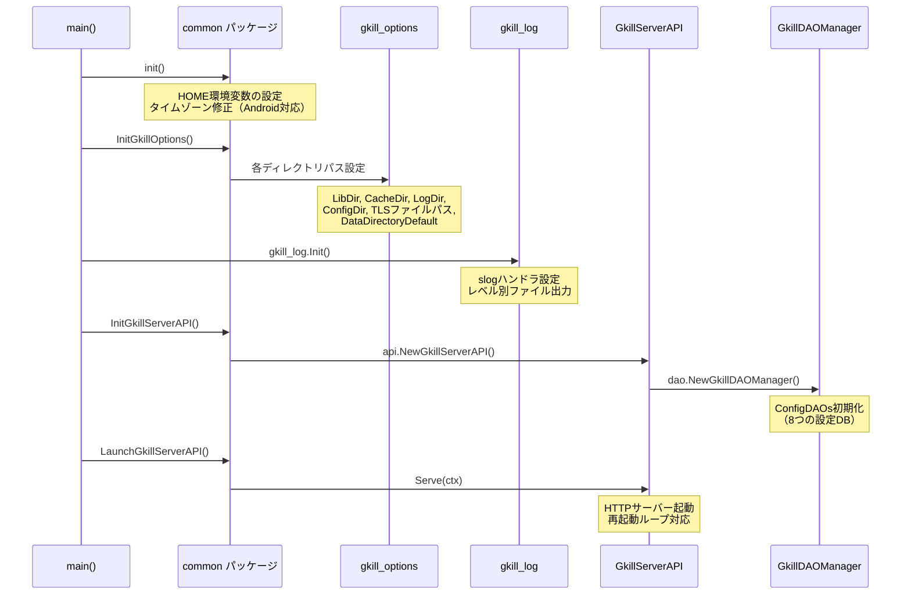
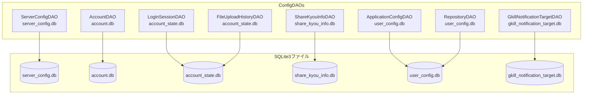
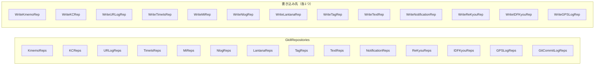
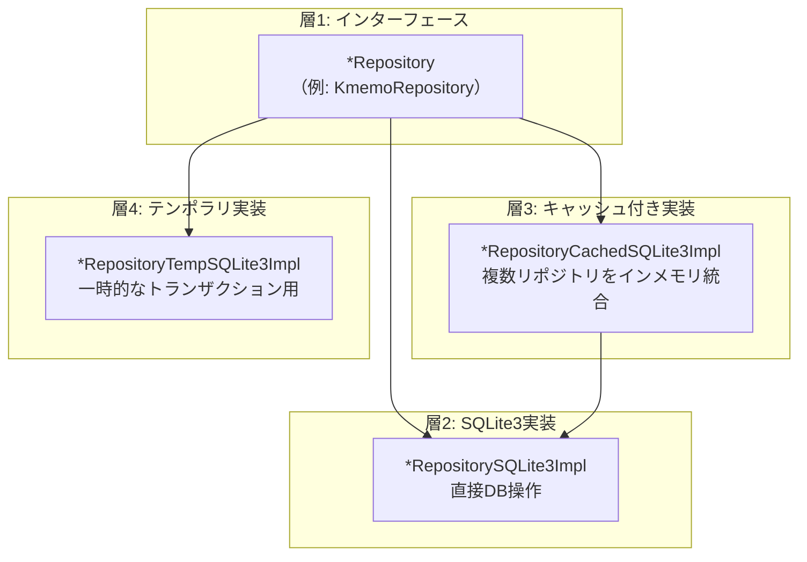
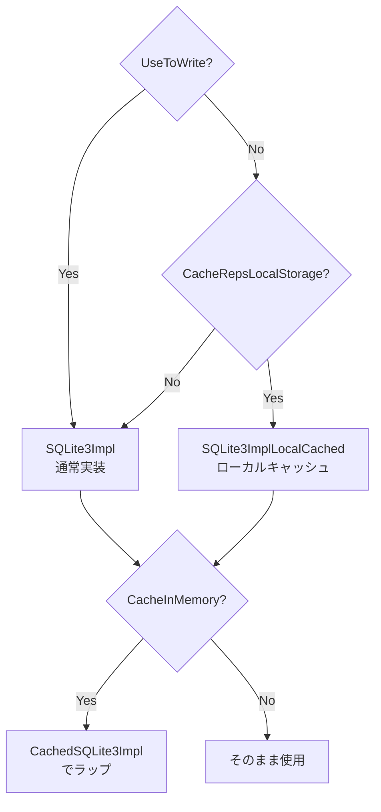
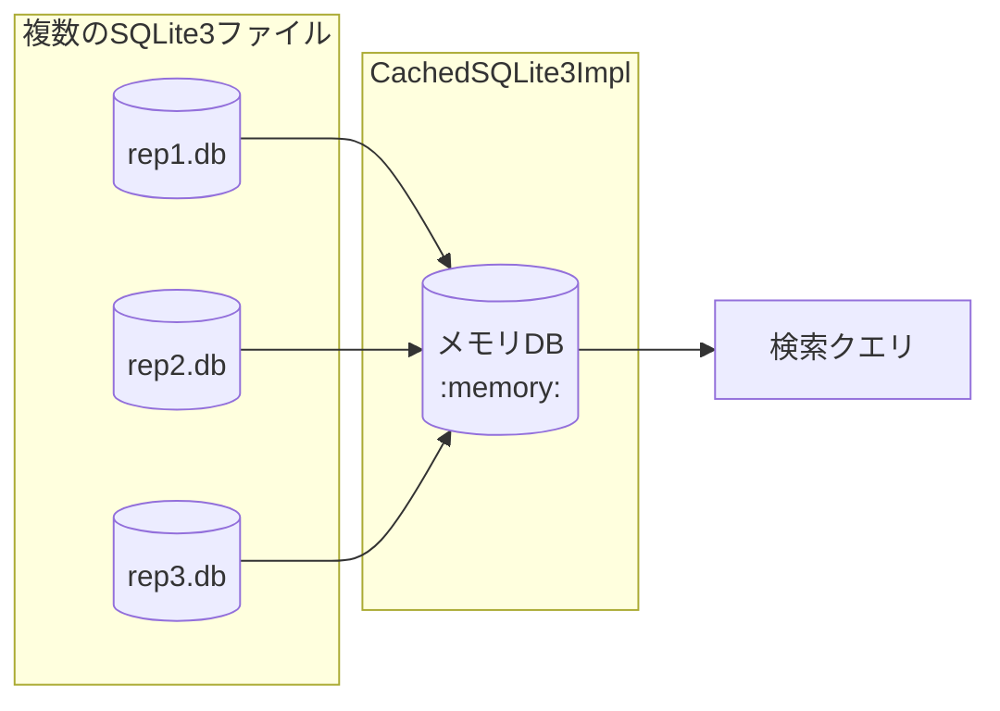
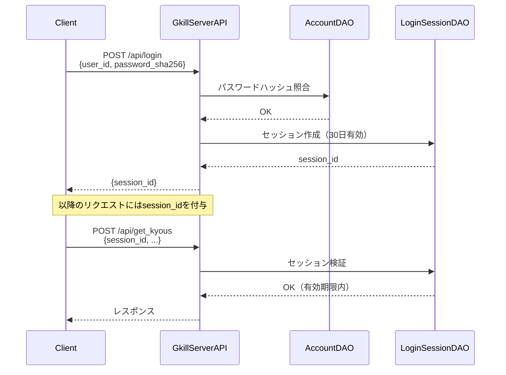

# 主要プログラム仕様説明資料

## 1. 概要

本資料では、gkillの主要なプログラム構成要素と処理フローについて説明します。バックエンド（Go）とフロントエンド（Vue 3 + TypeScript）の両面をカバーします。

## 2. サーバー初期化フロー

### エントリーポイント

gkillには2つのエントリーポイントがあります。

| バイナリ | ソース | 特徴 |
|---|---|---|
| `gkill_server` | `gkill/main/gkill_server/main.go` | ヘッドレスHTTPサーバー |
| `gkill` | `gkill/main/gkill/main.go` | デスクトップアプリ（go-astilectron） |

両者とも`gkill/main/common/`パッケージの共通初期化ロジックを使用します。

### 初期化シーケンス



### InitGkillOptions の詳細

`gkill_options`パッケージで定義されるディレクトリ構造を`$GKILL_HOME`配下に初期化します。

```go
func InitGkillOptions() {
    os.Setenv("GKILL_HOME", filepath.Clean(os.ExpandEnv(gkill_options.GkillHomeDir)))
    gkill_options.LibDir      = "$GKILL_HOME/lib/base_directory"
    gkill_options.CacheDir    = "$GKILL_HOME/caches"
    gkill_options.LogDir      = "$GKILL_HOME/logs"
    gkill_options.ConfigDir   = "$GKILL_HOME/configs"
    gkill_options.TLSCertFileDefault = "$GKILL_HOME/tls/cert.cer"
    gkill_options.TLSKeyFileDefault  = "$GKILL_HOME/tls/key.pem"
    gkill_options.DataDirectoryDefault = "$GKILL_HOME/datas"
}
```

### サーバー再起動メカニズム

`LaunchGkillServerAPI`はサーバー設定変更時の再起動をサポートしています。

```go
func LaunchGkillServerAPI(ctx context.Context) error {
    for {
        err = gkillServerAPI.Serve(ctx)
        if errors.Is(err, http.ErrServerClosed) {
            if ctx.Err() != nil {
                return nil  // SIGINT/SIGTERM → 終了
            }
            // HandleUpdateServerConfigs → リスタート（ループ継続）
        }
        err = InitGkillServerAPI()  // 新しいインスタンスで再初期化
    }
}
```

## 3. GkillDAOManager構成

### 構造体定義

```go
type GkillDAOManager struct {
    initializingMutex        map[string]map[string]*sync.RWMutex  // ユーザー×デバイス別初期化ロック
    gkillRepositories        map[string]map[string]*reps.GkillRepositories  // ユーザー×デバイス別リポジトリ
    gkillNotificators        map[string]map[string]*GkillNotificator        // 通知マネージャ
    fileRepWatchCacheUpdater rep_cache_updater.FileRepCacheUpdater           // ファイル監視キャッシュ更新

    ConfigDAOs    *ConfigDAOs        // 設定データベース群
    router        *mux.Router        // HTTPルーター
    IDFIgnore     []string           // IDF無視パターン
    skipUpdateCache *bool            // キャッシュ更新スキップフラグ
}
```

### ConfigDAOs（8つの設定データベース）



| DAO | DBファイル | 管理対象 |
|---|---|---|
| ServerConfigDAO | server_config.db | サーバーアドレス、TLS設定、デバイス名 |
| AccountDAO | account.db | ユーザーアカウント、パスワードハッシュ |
| LoginSessionDAO | account_state.db | ログインセッション（30日有効） |
| FileUploadHistoryDAO | account_state.db | ファイルアップロード履歴 |
| ShareKyouInfoDAO | share_kyou_info.db | 記録の共有設定 |
| ApplicationConfigDAO | user_config.db | アプリケーション設定 |
| RepositoryDAO | user_config.db | リポジトリ定義（RepType、パス等） |
| GkillNotificationTargetDAO | gkill_notification_target.db | プッシュ通知ターゲット |

### GkillRepositories

ユーザー×デバイスの組み合わせごとに生成されるデータリポジトリの集合です。



各RepTypeに対して、読み取り用は複数のリポジトリを保持可能ですが、書き込み先（`Write*Rep`）は1つだけです。同じRepTypeで複数の`UseToWrite=true`があるとエラーになります。

## 4. APIハンドラ構造

### GkillServerAPI

`gkill/api/gkill_server_api.go`（約14,000行）がAPIの中心です。

#### 主な責務

- HTTPサーバーの起動・停止
- 全79 POSTエンドポイントのハンドリング
- GkillDAOManagerの保持・提供
- セッション検証
- レスポンス構築

### エンドポイント分類（79 POST）

| カテゴリ | エンドポイント数 | 例 |
|---|---|---|
| 認証 | 5 | login, logout, regist_account, set_new_password |
| データ取得 | 15+ | get_kyous, get_kmemos, get_timeis_list, get_mi_board_list |
| データ追加 | 10+ | add_kmemo_info, add_timeis_info, add_mi_info |
| データ更新 | 10+ | update_kmemo_info, update_timeis_info, update_mi_info |
| データ削除 | 10+ | delete_kmemo_info, delete_timeis_info, delete_mi_info |
| 検索 | 3 | get_kyous（FindFilter使用）, get_kyous_at_shared |
| 共有 | 3 | share_kyou_info_with_me, get_shared_kyou_infos |
| 通知 | 3 | register_notification_target, get_notification_targets |
| 設定 | 8 | get_server_configs, update_server_configs, get_repositories |
| Git | 2 | get_git_commit_logs |
| KFTL | 1 | submit_kftl_text |
| キャッシュ | 2 | update_cache |
| ファイル | 3 | upload_file, get_file, get_thumbnail |

### ルーティング定義

`gkill_server_api_address.go`で全エンドポイントのルートが定義されます。すべて`POST /api/{endpoint}`形式です。

### レスポンス構造

すべてのAPIレスポンスは以下の共通構造を持ちます。

```go
type Response struct {
    Messages []GkillMessage `json:"messages"`
    Errors   []GkillError   `json:"errors"`
    // + エンドポイント固有のフィールド
}

type GkillError struct {
    ErrorCode    string `json:"error_code"`
    ErrorMessage string `json:"error_message"`
}
```

- HTTP 200: 正常応答（`errors`配列で業務エラーを返す）
- HTTP 403: アクセス拒否
- HTTP 500: 予期しないサーバーエラー

## 5. リポジトリパターン（4層実装）

各データ型のリポジトリは、以下の4層で実装されています。



加えて、ローカルストレージキャッシュ版（`*SQLite3ImplLocalCached`）があります。

### キャッシュの適用条件



## 6. KFTLパーサー

### 概要

KFTL（gkill独自のテキスト形式）は、テキストベースで複数種類の記録を一括入力するための書式です。

### kftlFactoryの構造

`gkill/api/kftl/kftl_factory.go`が中心です。

```go
type kftlFactory struct {
    // KFTLテキストからリクエストを生成するファクトリ
}
```

#### 処理フロー

1. KFTLテキストを受け取る
2. テキストをステートメントに分割（スプリッタ定数で区切り）
3. 各ステートメントを型判定
4. 型に応じたリクエスト（Add/Update）を生成
5. リクエストを実行

### ステートメント型（35+種類）

KFTLは以下のステートメント型をサポートしています。

| カテゴリ | ステートメント型 | 説明 |
|---|---|---|
| メモ | kmemo | テキストメモの追加 |
| 打刻 | timeis_start, timeis_end | 打刻の開始/終了 |
| タスク | mi | タスクの追加 |
| 数値 | kc | 数値記録 |
| 気分 | lantana | 気分値の記録 |
| 支出 | nlog | 支出記録 |
| ブックマーク | urlog | URL記録 |
| タグ | tag | タグ付け |
| テキスト | text | テキスト付与 |
| 通知 | notification | 通知設定 |
| 制御 | template, time_set | テンプレート展開、時刻設定 |

### プレフィックスの二重対応

サーバ側パーサ（`kftl_factory.go`）は、日本語プレフィックスと ASCII プレフィックスの**両方**を常に受理する。例: タグは `。tag` でも `#tag` でも受理される。セーブ文字は `！` でも `!` でも受理される。これにより非日本語ロケールのユーザも問題なく KFTL を使用できる。

Mi の時間フィールド（limitTime, estimateStartTime, estimateEndTime）でも、全角 `？` と ASCII `?` の両方を関連時刻プレフィックスとして受理する。

### nowFromCtx

KFTLパーサーはコンテキストから現在時刻を計算します。

```
nowFromCtx(ctx) = ctx.BaseTime + AddSecond * second
```

テンプレート内の時刻指定により、記録時刻をオフセットできます。

## 7. キャッシュシステム

### 3種類のキャッシュ

| キャッシュ種別 | フラグ | 説明 |
|---|---|---|
| インメモリ | `--cache_in_memory` (デフォルトtrue) | 全リポジトリデータをメモリ上のSQLite3に集約 |
| ローカルストレージ | `--cache_reps_local` | ローカルファイルにキャッシュコピーを保持 |
| LatestDataRepositoryAddress | — | 各データのIDから最新リポジトリアドレスを引くキャッシュ |

### インメモリキャッシュ（CachedSQLite3Impl）



複数のリポジトリファイルのデータを1つのインメモリSQLite3データベースに集約し、検索パフォーマンスを向上させます。

### キャッシュ制御パラメータ

| パラメータ | デフォルト | 説明 |
|---|---|---|
| `--cache_clear_count_limit` | 3000 | キャッシュアイテム数上限 |
| `--cache_update_duration` | 1m | キャッシュ自動更新間隔 |

### ファイル監視によるキャッシュ更新

`FileRepCacheUpdater`が対象リポジトリファイルの変更を`fsnotify`で監視し、変更を検出するとキャッシュを自動更新します。

## 8. セッション・認証

### 認証フロー



### セッション仕様

| 項目 | 値 |
|---|---|
| パスワードハッシュ | SHA256 |
| セッション有効期限 | 30日 |
| 初期ユーザー | `admin`（パスワードなし） |
| セッションストレージ | account_state.db（SQLite3） |

## 9. フロントエンド構造

### 技術スタック

| 技術 | バージョン | 用途 |
|---|---|---|
| Vue 3 | ^3.4.29 | UIフレームワーク |
| Vuetify 3 | ^3.11.1 | UIコンポーネントライブラリ |
| Vue Router | ^4.3.3 | ルーティング |
| vue-i18n | ^9.14.4 | 国際化（7言語） |
| Vite | ^5.3.1 | ビルドツール |
| TypeScript | ~5.4.0 | 型安全性 |
| vite-plugin-pwa | ^0.21.1 | PWA対応 |

### ルート構成（12ルート）

| パス | コンポーネント | 説明 |
|---|---|---|
| `/` | login-page | ログイン画面 |
| `/kftl` | kftl-page | KFTL入力画面（メイン入力） |
| `/mi` | mi-page | タスクボード画面 |
| `/rykv` | rykv-page | 履歴閲覧画面（Kyou一覧） |
| `/kyou` | kyou-page | 記録詳細画面 |
| `/mkfl` | mkfl-page | ファイル管理画面 |
| `/plaing` | plaing-timeis-page | 打刻一覧画面 |
| `/saihate` | saihate-page | 設定画面 |
| `/set_new_password` | set-new-password-page | パスワード変更画面 |
| `/regist_first_account` | regist-first-account-page | 初回アカウント登録画面 |
| `/shared_page` | shared-page | 共有ページ |
| `/shared_mi` | old-shared-mi-page | 共有タスクページ |

### GkillAPI シングルトン

`src/client/classes/api/gkill-api.ts`（約3,400行）は、バックエンドAPIとの通信を一元管理するシングルトンクラスです。

#### 主な責務

- 全77エンドポイントへのHTTPリクエスト送信
- セッションIDの管理
- リクエスト/レスポンスの型変換
- エラーハンドリング

### 状態管理

gkillはPiniaやVuexを使用せず、**Props/Emit**パターンのみで状態を管理しています。

- 親→子: Propsでデータ渡し
- 子→親: Emitでイベント通知
- API通信: `GkillAPI`シングルトン経由

### コンポーネント構成

| 種別 | 数 | 配置 |
|---|---|---|
| ページ | 12 | `pages/*.vue` |
| ビュー | 170+ | `pages/views/*.vue` |
| ダイアログ | 90+ | `pages/dialogs/*.vue` |

### テーマ

Vuetifyで2つのテーマを定義しています。

| テーマ名 | 種類 |
|---|---|
| `gkill_theme` | ライトテーマ |
| `gkill_dark_theme` | ダークテーマ |

### PWA対応

- `vite-plugin-pwa`と`Workbox`によるプレキャッシュ
- POSTリクエストのオフラインキャッシュ
- プッシュ通知（VAPID）
- Web Share Target（他アプリからの共有受け取り）

## 10. CLIサブコマンド

`cobra`ライブラリで定義されているCLIサブコマンド一覧です。

| コマンド | 説明 |
|---|---|
| `version` | バージョン情報表示（バージョン、ビルド日時、コミットハッシュ） |
| `idf` | 指定ディレクトリのIDF（IDファイル）生成 |
| `dvnf` | DVNFファイル操作（get/copy/move） |
| `generate_thumb_cache` | サムネイルキャッシュ生成 |
| `generate_video_cache` | 動画キャッシュ生成 |
| `optimize` | リポジトリ最適化 |
| `update_cache` | キャッシュ更新（稼働中サーバーにHTTPリクエスト） |

## 関連資料

- [folder-structure.md](folder-structure.md) — ディレクトリ構成
- [dvnf-rep-type-spec.md](dvnf-rep-type-spec.md) — DVNF/RepType仕様
- [class-diagrams.md](class-diagrams.md) — クラス階層図
- [sequence-diagrams.md](sequence-diagrams.md) — シーケンス図
- [api-endpoints.md](api-endpoints.md) — APIエンドポイント一覧
- [frontend-architecture.md](frontend-architecture.md) — フロントエンド設計ガイド
