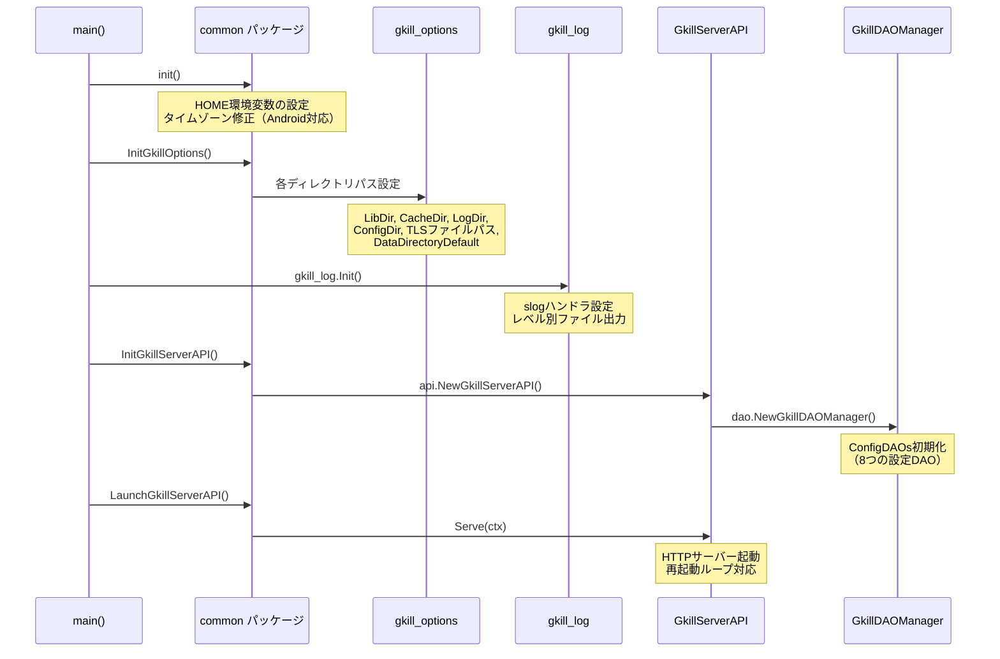
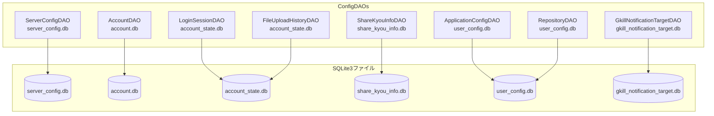
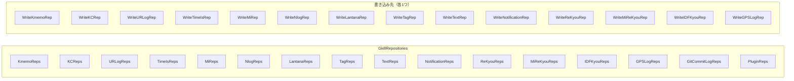
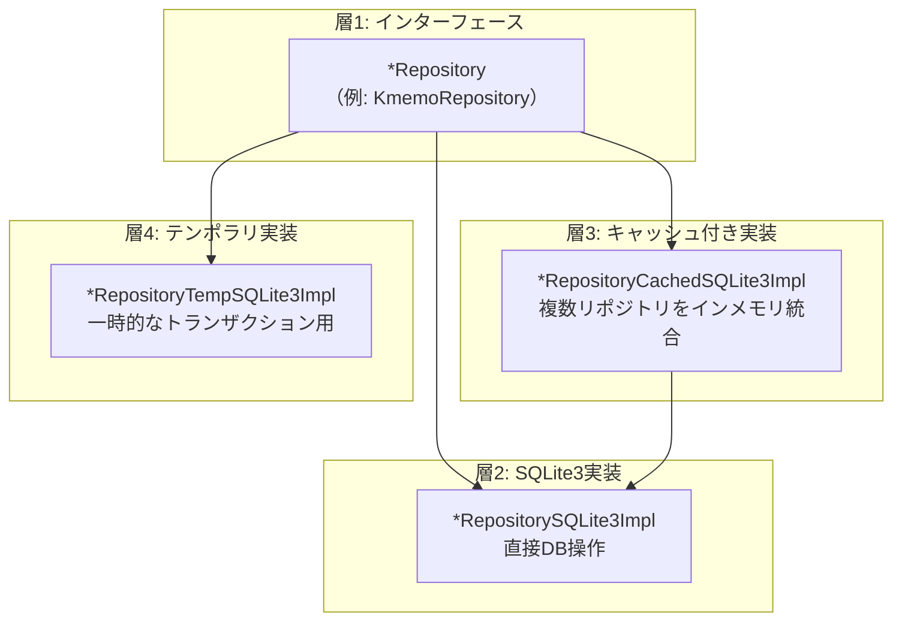
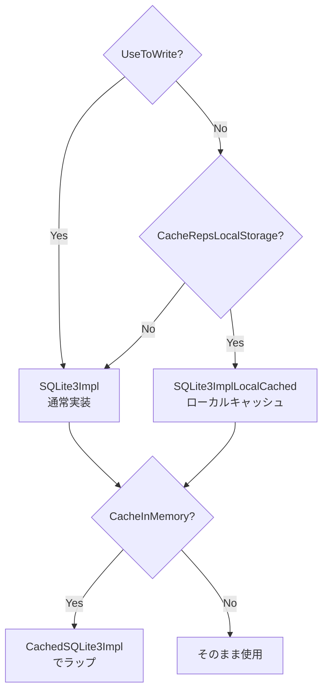
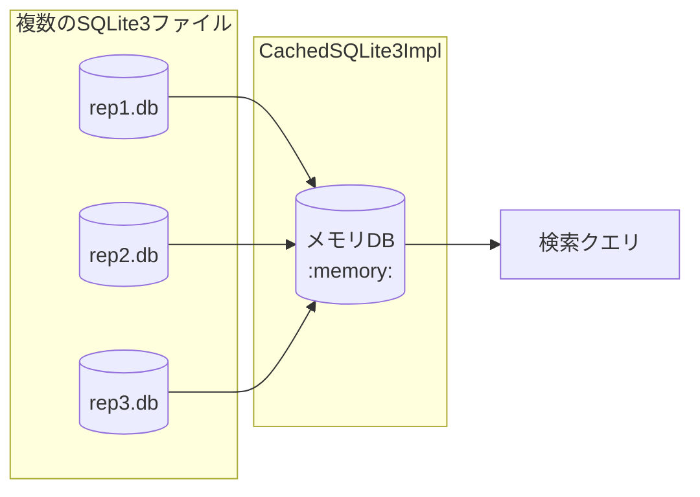
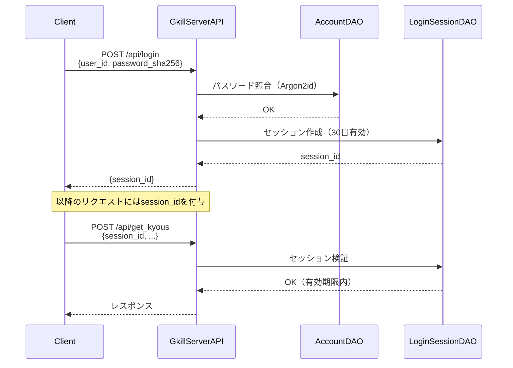

# 主要プログラム仕様説明資料

## 1. 概要

本資料では、gkillの主要なプログラム構成要素と処理フローについて説明します。バックエンド（Go）とフロントエンド（Vue 3 + TypeScript）の両面をカバーします。

## 2. サーバー初期化フロー

### エントリーポイント

gkillには2つのエントリーポイントがあります。

| バイナリ | ソース | 特徴 |
|---|---|---|
| `gkill_server` | `gkill/main/gkill_server/main.go` | ヘッドレスHTTPサーバー |
| `gkill` | `gkill/main/gkill/main.go` | デスクトップアプリ（go-astilectron） |

両者とも`gkill/main/common/`パッケージの共通初期化ロジックを使用します。

### 初期化シーケンス


```mermaid
sequenceDiagram
    participant Main as main()
    participant Common as common パッケージ
    participant Options as gkill_options
    participant Log as gkill_log
    participant API as GkillServerAPI
    participant DAO as GkillDAOManager

    Main->>Common: init()
    Note over Common: HOME環境変数の設定<br/>タイムゾーン修正（Android対応）

    Main->>Common: InitGkillOptions()
    Common->>Options: 各ディレクトリパス設定
    Note over Options: LibDir, CacheDir, LogDir,<br/>ConfigDir, TLSファイルパス,<br/>DataDirectoryDefault

    Main->>Log: gkill_log.Init()
    Note over Log: slogハンドラ設定<br/>レベル別ファイル出力

    Main->>Common: InitGkillServerAPI()
    Common->>API: api.NewGkillServerAPI()
    API->>DAO: dao.NewGkillDAOManager()
    Note over DAO: ConfigDAOs初期化<br/>（8つの設定DAO）

    Main->>Common: LaunchGkillServerAPI()
    Common->>API: Serve(ctx)
    Note over API: HTTPサーバー起動<br/>再起動ループ対応
```

### InitGkillOptions の詳細

`gkill_options`パッケージで定義されるディレクトリ構造を`$GKILL_HOME`配下に初期化します。

```go
func InitGkillOptions() {
    os.Setenv("GKILL_HOME", filepath.Clean(os.ExpandEnv(gkill_options.GkillHomeDir)))
    gkill_options.LibDir      = "$GKILL_HOME/lib/base_directory"
    gkill_options.CacheDir    = "$GKILL_HOME/caches"
    gkill_options.LogDir      = "$GKILL_HOME/logs"
    gkill_options.ConfigDir   = "$GKILL_HOME/configs"
    gkill_options.TLSCertFileDefault = "$GKILL_HOME/tls/cert.cer"
    gkill_options.TLSKeyFileDefault  = "$GKILL_HOME/tls/key.pem"
    gkill_options.DataDirectoryDefault = "$GKILL_HOME/datas"
}
```

### サーバー再起動メカニズム

`LaunchGkillServerAPI`はサーバー設定変更時の再起動をサポートしています。

```go
func LaunchGkillServerAPI(ctx context.Context) error {
    for {
        err = gkillServerAPI.Serve(ctx)
        if errors.Is(err, http.ErrServerClosed) {
            if ctx.Err() != nil {
                return nil  // SIGINT/SIGTERM → 終了
            }
            // HandleUpdateServerConfigs → リスタート（ループ継続）
        }
        err = InitGkillServerAPI()  // 新しいインスタンスで再初期化
    }
}
```

## 3. GkillDAOManager構成

### 構造体定義

```go
type GkillDAOManager struct {
    initializingMutex        map[string]map[string]*sync.RWMutex  // ユーザー×デバイス別初期化ロック
    gkillRepositories        map[string]map[string]*reps.GkillRepositories  // ユーザー×デバイス別リポジトリ
    gkillNotificators        map[string]map[string]*GkillNotificator        // 通知マネージャ
    fileRepWatchCacheUpdater rep_cache_updater.FileRepCacheUpdater           // ファイル監視キャッシュ更新

    ConfigDAOs    *ConfigDAOs        // 設定データベース群
    router        *mux.Router        // HTTPルーター
    IDFIgnore     []string           // IDF無視パターン
    skipUpdateCache *bool            // キャッシュ更新スキップフラグ
}
```

### ConfigDAOs（8つの設定DAO、6つのSQLite3ファイル）


```mermaid
graph TD
    subgraph ConfigDAOs
        SC[ServerConfigDAO<br/>server_config.db]
        AC[AccountDAO<br/>account.db]
        LS[LoginSessionDAO<br/>account_state.db]
        FU[FileUploadHistoryDAO<br/>account_state.db]
        SK[ShareKyouInfoDAO<br/>share_kyou_info.db]
        AP[ApplicationConfigDAO<br/>user_config.db]
        RP[RepositoryDAO<br/>user_config.db]
        NT[GkillNotificationTargetDAO<br/>gkill_notification_target.db]
    end

    subgraph "SQLite3ファイル"
        F1[(server_config.db)]
        F2[(account.db)]
        F3[(account_state.db)]
        F4[(share_kyou_info.db)]
        F5[(user_config.db)]
        F6[(gkill_notification_target.db)]
    end

    SC --> F1
    AC --> F2
    LS --> F3
    FU --> F3
    SK --> F4
    AP --> F5
    RP --> F5
    NT --> F6
```

| DAO | DBファイル | 管理対象 |
|---|---|---|
| ServerConfigDAO | server_config.db | サーバーアドレス、TLS設定、デバイス名 |
| AccountDAO | account.db | ユーザーアカウント、パスワードハッシュ |
| LoginSessionDAO | account_state.db | ログインセッション（30日有効） |
| FileUploadHistoryDAO | account_state.db | ファイルアップロード履歴 |
| ShareKyouInfoDAO | share_kyou_info.db | 記録の共有設定 |
| ApplicationConfigDAO | user_config.db | アプリケーション設定 |
| RepositoryDAO | user_config.db | リポジトリ定義（RepType、パス等） |
| GkillNotificationTargetDAO | gkill_notification_target.db | プッシュ通知ターゲット |

### GkillRepositories

ユーザー×デバイスの組み合わせごとに生成されるデータリポジトリの集合です。


```mermaid
graph LR
    subgraph GkillRepositories
        K[KmemoReps]
        KC[KCReps]
        U[URLogReps]
        T[TimeIsReps]
        M[MiReps]
        N[NlogReps]
        L[LantanaReps]
        TG[TagReps]
        TX[TextReps]
        NF[NotificationReps]
        RK[ReKyouReps]
        MRK[MiReKyouReps]
        ID[IDFKyouReps]
        GP[GPSLogReps]
        GC[GitCommitLogReps]
        PL[PluginReps]
    end

    subgraph "書き込み先（各1つ）"
        WK[WriteKmemoRep]
        WKC[WriteKCRep]
        WU[WriteURLogRep]
        WT[WriteTimeIsRep]
        WM[WriteMiRep]
        WN[WriteNlogRep]
        WL[WriteLantanaRep]
        WTG[WriteTagRep]
        WTX[WriteTextRep]
        WNF[WriteNotificationRep]
        WRK[WriteReKyouRep]
        WMRK[WriteMiReKyouRep]
        WID[WriteIDFKyouRep]
        WGP[WriteGPSLogRep]
    end
```

各RepTypeに対して、読み取り用は複数のリポジトリを保持可能ですが、書き込み先（`Write*Rep`）は1つだけです。同じRepTypeで複数の`UseToWrite=true`があるとエラーになります。

`PluginReps` だけは他と性質が異なります。`RepType` の switch 文では生成されず、
`PluginManager.DiscoverPlugins()` が `$GKILL_HOME/plugins/{userID}/` を走査して登録し、
`PluginReps` に追加されます（`gkill_dao_manager.go` の `DiscoverPlugins` 後の登録ループ）。書き込み先はありません。

**`Reps`（Kyou 検索の対象）へ入るかは `manifest.json` の `emits_kyou` 次第です。**
`emits_kyou: false`（位置情報履歴プラグインのような GPSLog 専用のもの）は `PluginReps`（設定・死活確認）と
`GPSLogReps` にだけ入り、`Reps` には入りません。Kyou を1件も返さないプラグインを
記録保管場所の一覧に出さないためです。

## 4. APIハンドラ構造

### GkillServerAPI

`gkill/api/gkill_server_api/`パッケージ（handle_*.go 119ファイル、1ハンドラ1ファイル）がAPIの中心です。旧`gkill/api/gkill_server_api.go`（約3,500行）から分割・移動されました。

#### 主な責務

- HTTPサーバーの起動・停止（`serve.go`, `close.go`）
- 全97エンドポイント（96 POST + 1 GET）のハンドリング（`handle_*.go`）。GETは `urlog_bookmarklet_page` のみ。ルート表（`gkill_server_api_address.go` の `apiRoutes()`）が正本で、`serve.go` とテストハーネスがそのまま登録する
- GkillDAOManagerの保持・提供
- 認証ミドルウェアによるセッション検証（`auth_middleware.go`）
- レスポンス構築
- アクセスログミドルウェア（gorilla/mux `Use()` で全ルートに適用。リモートIP・メソッド・パス・ステータス・所要時間・ユーザIDを `ACCESS` レベルで記録。実装: `gkill_server_api_access_log.go`）
- gzip圧縮ミドルウェア（`gzip_middleware.go`。recover・アクセスログの次に `Use()` で登録。**`/api/` 前方一致かつリクエストの `Accept-Encoding` に gzip があるときだけ**圧縮する。Range配信する `/files/` `/zip_cache/`（既に圧縮済みのメディアが主）と静的アセットは対象外。`Content-Length` は付けず、`Flush()` は gzip バッファを掃いてから下位の Flusher へ委譲するのでストリーミング応答も壊れない）

### 認証ミドルウェアパターン

ハンドラ登録時に3つのラッパー関数を使い分けて認証レベルを指定します。

| ラッパー関数 | 件数 | 認証レベル | AuthContextの内容 | 用途 |
|---|---|---|---|---|
| `wrapNoAuth` | 14 | ミドルウェアでの認証なし（`filterLocalOnly` は通る）。ボディを読む13本は `wrapNoAuthCapped` で経路別のボディ上限つき | — | `login`, `logout`, `reset_password`, `set_new_password`, `get_shared_kyous`, `urlog_bookmarklet` 等 |
| `wrapAuth` | 25 | セッション認証 | Account, UserID, Device | `get_application_config`, `update_server_configs`, `add_user`, `generate_tls_file`, `update_cache`, プラグイン4本 等 |
| `wrapAuthRepos` | 58 | セッション＋リポジトリ | Account, UserID, Device, Repositories | データCRUD系ハンドラ |

> **`logout` / `reset_password` / `set_new_password` は `wrapAuth` ではなく `wrapNoAuth`** です
> （ルート表では `Auth: authNone`）。セッションの検証はハンドラ内で行います。
>
> また `wrapNoAuth` は「認証を一切しない」という意味ではありません。ルータ上は未認証ですが、
> `upload_files` / `upload_gpslog_files` / `browse_zip_contents` /
> `get_idf_kyou_by_relative_path` / `get_kyous_mcp` / `get_rep_infos_mcp` の6本は
> **ハンドラ内部の `getAccountFromSessionID` でセッションを検証**します。
> `/files/` と `/zip_cache/` はボディではなく **cookie**（`gkill_session_id`）で認証します。

#### AuthContext構造体

`auth_context.go`で定義。認証ミドルウェアが抽出した情報を格納し、各ハンドラに渡します。

```go
type AuthContext struct {
    Account      *account.Account
    UserID       string
    Device       string
    Repositories *reps.GkillRepositories // Auth-onlyルートではnil
}
```

`Device` は `*reps.Device` ではなく**端末名の文字列**です。

#### ミドルウェアの処理フロー

1. `authMiddleware`: リクエストからsession_idを取得 → LoginSessionDAOでセッション検証 → AccountDAO からアカウント取得 → `g.GetDevice()`（ServerConfig 参照）で端末名を取得 → `AuthContext.Account` / `UserID` / `Device` に設定
2. `authWithReposMiddleware`: 上記に加え → GkillDAOManager.GetRepositories() → `AuthContext.Repositories` に設定

DeviceDAO というDAOは存在せず、両ミドルウェアとも `g.GetDevice()` を使います。
`Device` は auth-only ルートでも設定され、`wrapAuthRepos` との差は `Repositories` の有無だけです。

`GetRepositories()` は、書き込み先ではない記録保管場所の組み立てに失敗した場合、その1本だけを切り離し、
利用可能な場所で処理を続ける。設定の `IsEnable` は書き換えない。切り離した場所は Web 検索では
`MSG000090`、MCP検索では `warnings` で通知し、利用可能な場所だけを一覧・検索対象へ載せる。
個別の切り離しと構築完了時の集約はともに Error レベルで記録する。正常時には集約エラーを出さない。
書き込み先の組み立て失敗や、切り離せない全体障害は従来どおり認証処理を失敗させ、
`ERR000018`、HTTP 500、Error ログの3経路へ同じ障害を伝播する。

### usecaseレイヤー

`gkill/usecase/`パッケージ（17ファイル）は、ハンドラから抽出されたHTTP非依存のビジネスロジックを提供します。

- DAO/リポジトリ型を直接操作する関数群
- HTTPリクエスト/レスポンスに依存しない
- ハンドラとMCPサーバーの両方から再利用可能

### エンドポイント分類（97件 = 96 POST + 1 GET。カテゴリは排他で、合計がルート表の行数と一致する）

| カテゴリ | エンドポイント数 | 内訳 |
|---|---|---|
| 認証 | 6 | login, logout, reset_password, set_new_password, add_user, update_account_status |
| データ取得 | 25 | get_kyous, get_kyou, get_kmemo, get_kc, get_urlog, get_nlog, get_timeis, get_mi, get_lantana, get_rekyou, get_mirekyou, get_rekyous_by_target_id, get_mirekyous_by_target_id, get_git_commit_log, get_idf_kyou, get_mi_board_list, get_all_tag_names, get_all_rep_names, get_tags_by_id, get_tag_histories_by_tag_id, get_texts_by_id, get_text_histories_by_text_id, get_gkill_notifications_by_id, get_gkill_notification_histories_by_notification_id, get_idf_kyou_by_relative_path |
| データ追加 | 12 | add_kmemo, add_kc, add_urlog, add_nlog, add_timeis, add_mi, add_lantana, add_tag, add_text, add_gkill_notification, add_rekyou, add_mirekyou |
| データ更新 | 13 | update_kmemo, update_kc, update_urlog, update_nlog, update_timeis, update_mi, update_lantana, update_tag, update_text, update_gkill_notification, update_rekyou, update_mirekyou, update_idf_kyou |
| 共有 | 5 | get_share_kyou_list_infos, add_share_kyou_list_info, update_share_kyou_list_info, delete_share_kyou_list_infos, get_shared_kyous |
| 通知 | 2 | get_gkill_notification_public_key, register_gkill_notification |
| 設定 | 7 | get_application_config, update_application_config, get_server_configs, update_server_configs, get_repositories, update_user_reps, reload_repositories |
| KFTL | 2 | submit_kftl_text, parse_kftl_text |
| トランザクション | 2 | commit_tx, discard_tx |
| キャッシュ | 1 | update_cache |
| ファイル | 4 | upload_files, upload_gpslog_files, get_gps_log, browse_zip_contents |
| プラグイン | 4 | get_plugin_list, get_plugin_content_html, get_plugin_config_html, post_plugin_config |
| スキル | 6 | get_skill_list, get_skill, download_skill, upload_skill, write_skill_file, delete_skill |
| その他 | 8 | generate_tls_file, open_directory, open_file, urlog_bookmarklet, urlog_bookmarklet_page（唯一の GET）, get_updated_datas_by_time, get_kyous_mcp, get_rep_infos_mcp |

### ルーティング定義

`gkill/api/gkill_server_api/gkill_server_api_address.go` の `apiRoutes()` が返すルート表で定義されます（97件。パス・HTTPメソッド・認証区分・無認証ボディ上限・ハンドラを1行1ルート）。大半は`POST /api/{endpoint}`形式ですが、`urlog_bookmarklet_page` のみ `GET` です。`serve.go` の `registerAPIRoutes` が表の認証区分（`authNone` / `authSession` / `authSessionRepos`）から `wrapNoAuth`（capped 含む）/ `wrapAuth` / `wrapAuthRepos` を選んで登録し、テストハーネス（`gkill_server_api_test.go` の `setupTestRouter`）も同じ関数を呼びます。表・ハンドラ・doc コメント・認証区分の整合は `api_routes_test.go` が、Web クライアント（`gkill-api.ts`）との整合は `gkill-api.test.ts` が機械検査します（[ADR-0709](../adr/0709-api-route-table-single-source.md)）。

API 以外のルートは19件（`PathPrefix` 18 + `Path` 1）で、SPA 配信・`/files/`・`/zip_cache/`・
`/resources/manual/` 等がここに含まれます。

### レスポンス構造

すべてのAPIレスポンスは以下の共通構造を持ちます。

```go
type Response struct {
    Messages []GkillMessage `json:"messages"`
    Errors   []GkillError   `json:"errors"`
    // + エンドポイント固有のフィールド
}

type GkillError struct {
    ErrorCode    string `json:"error_code"`
    ErrorMessage string `json:"error_message"`
}
```

- HTTP 200: 正常応答（`errors` は `null`）
- HTTP 400/401/403/404/409/429/500: 失敗。`error_code` から決まる
  （正本は `src/server/gkill/api/message/http_status.go`、経緯は ADR-0706）
- ボディの形はステータスによらず同じで、`error_code` は本文にしか入っていない

## 5. リポジトリパターン（4層実装）

> **関連資料:** クラス階層の詳細は [class-diagrams.md](class-diagrams.md)（セクション2）、RepTypeごとの実装選択ロジックは [dvnf-rep-type-spec.md](dvnf-rep-type-spec.md)（セクション5）を参照。

各データ型のリポジトリは、以下の4層で実装されています。


```mermaid
graph TD
    subgraph "層1: インターフェース"
        IF["*Repository<br/>（例: KmemoRepository）"]
    end
    subgraph "層2: SQLite3実装"
        S3["*RepositorySQLite3Impl<br/>直接DB操作"]
    end
    subgraph "層3: キャッシュ付き実装"
        CA["*RepositoryCachedSQLite3Impl<br/>複数リポジトリをインメモリ統合"]
    end
    subgraph "層4: テンポラリ実装"
        TM["*RepositoryTempSQLite3Impl<br/>一時的なトランザクション用"]
    end

    IF --> S3
    IF --> CA
    IF --> TM
    CA --> S3
```

加えて、ローカルストレージキャッシュ版（`*SQLite3ImplLocalCached`）があります。

### キャッシュの適用条件


```mermaid
graph TD
    A{UseToWrite?} -->|Yes| B[SQLite3Impl<br/>通常実装]
    A -->|No| C{CacheRepsLocalStorage?}
    C -->|Yes| D[SQLite3ImplLocalCached<br/>ローカルキャッシュ]
    C -->|No| B
    B --> E{CacheInMemory?}
    D --> E
    E -->|Yes| F[CachedSQLite3Impl<br/>でラップ]
    E -->|No| G[そのまま使用]
```

## 6. KFTLパーサー

### 概要

KFTL（gkill独自のテキスト形式）は、テキストベースで複数種類の記録を一括入力するための書式です。

### kftlFactoryの構造

`gkill/api/kftl/kftl_factory.go`が中心です。

```go
type kftlFactory struct {
    // KFTLテキストからリクエストを生成するファクトリ
}
```

#### 処理フロー

1. KFTLテキストを受け取る
2. テキストをステートメントに分割（スプリッタ定数で区切り）
3. 各ステートメントを型判定
4. 型に応じたリクエスト（Add/Update）を生成
5. リクエストを実行

### ステートメント型（Go 50種類 / TypeScript 53種類）

KFTLは以下のステートメント型をサポートしています。

サーバ側の具象型は `src/server/gkill/api/kftl/*.go` の `kftl*StatementLine` 構造体（50個）。
1つのデータ型が複数行で構成されるため、行の役割ごとに型が分かれている。

| カテゴリ | ステートメント型（Go） | 説明 |
|---|---|---|
| メモ | `kftlKmemoStatementLine` | テキストメモの追加 |
| 数値 | `kftlStartKC` / `kftlKCTitle` / `kftlKCNumValue` | 開始 → タイトル → 数値 |
| 気分 | `kftlStartLantana` / `kftlLantanaMood` | 開始 → 気分値 |
| タスク | `kftlStartMi` / `kftlMiTitle` / `kftlMiBoardName` / `kftlMiEstimateStartTime` / `kftlMiEstimateEndTime` / `kftlMiLimitTime` | 開始 → タイトル → ボード名 → 見積開始 → 見積終了 → 期限 |
| 既存の記録をタスク化 | `kftlStartMiReKyou` / `kftlMiReKyouBoardName` / `kftlMiReKyouEstimateStartTime` / `kftlMiReKyouEstimateEndTime` / `kftlMiReKyouLimitTime` / `kftlMiReKyouTag` / `kftlEndMiReKyou` | 開始 → ボード名 → 見積開始 → 見積終了 → 期限 → タグ → 終了（タイトル行は無い。タグは板名の前にも書ける） |
| 支出 | `kftlStartNlog` / `kftlNlogShopName` / `kftlNlogTitle` / `kftlNlogAmount` / `kftlNlogRelatedTime` | 開始 → 店名 →（タイトル → 金額 →（タグ / テキスト））の繰り返し。**支払い1組ごとに1リクエスト**で、金額の行のあとのタグ・テキストはその支払いに付く。関連時刻だけはブロック全体に効く（`ーん` より前のタグ・テキストはエラー） |
| ブックマーク | `kftlStartURLog` / `kftlURLogURL` / `kftlURLogTitle` | 開始 → URL → タイトル |
| 打刻 | `kftlStartTimeIs` / `kftlTimeIsTitle` / `kftlTimeIsStartTime` / `kftlTimeIsEndTime` | 開始+終了を同時指定 |
| 打刻（開始のみ） | `kftlStartTimeIsStart` / `kftlTimeIsStartTitle` | |
| 打刻（終了） | `kftlStartTimeIsEnd` / `kftlTimeIsEndTitle` / `kftlStartTimeIsEndIfExist` | 存在する場合のみ終了する派生あり |
| 打刻（タグで終了） | `kftlStartTimeIsEndByTag` / `kftlStartTimeIsEndByTagIfExist` / `kftlTimeIsEndByTagTag` | |
| タグ | `kftlTagStatementLine` | タグ付け |
| テキスト | `kftlStartText` / `kftlText` / `kftlEndText` | 開始 → 本文 → 終了 |
| 関連時刻 | `kftlRelatedTimeStatementLine` | 関連時刻の指定 |
| 区切り | `kftlSplit` / `kftlSplitAndNextSecond` | ステートメント区切り（`、` / `、、`） |
| その他 | `kftlNoneStatementLine` | 該当なし |

> クライアント側（`src/client/classes/kftl/kftl_*/`）は同じ構成で 53 クラス（Go が旗で共用する「存在時のみ終了」のタイトル行などを別クラスにしている）。
> ただしクライアント側は**行ラベルの分類器だけ**で、解釈（行別エラー・繰り返しの展開）と書き込みはサーバの1実装が担う
> （[ADR-0507](../adr/0507-kftl-single-implementation-on-server.md)）。Web も `POST /api/submit_kftl_text` で送り、
> 「おかしな行」は `POST /api/parse_kftl_text`（`KFTLStatement.Analyze`。submit と同じ `prepareRequests`）の応答で塗る。
> 保存マーカー「！」の行は値の行に数えず、内容の無い記録（種別だけ・店名だけの支出・空の数値）、付け先の無いタグ・関連時刻、
> 読めない予定日時は**書く前に行別エラー**にする（[ADR-0508](../adr/0508-kftl-blank-records-are-input-errors.md)）。
> `notification` / `template` / `time_set` というステートメント型は**存在しません**。

### プレフィックスの二重対応

サーバ側パーサ（`kftl_factory.go`）とクライアント側パーサ（`src/client/classes/kftl/`）は、日本語プレフィックスと ASCII プレフィックスの**両方**を常に受理する。例: タグは `。tag` でも `#tag` でも受理される。セーブ文字は `！` でも `!` でも受理される。これにより非日本語ロケールのユーザも問題なく KFTL を使用できる。クライアント側の ASCII プレフィックス定数と判定・除去ヘルパーは `src/client/classes/kftl/kftl-prefixes.ts` に集約されている。

タグ行の複数タグ区切りは全角 `、` と半角 `,` の両方を受理する（例: `#tag1,tag2`、`。tag1、tag2`）。タグで打刻終了（`ーたえ`/`/endt`、`ーいたえ`/`/endt?`）のタグ名行も同様。

Mi の時間フィールド（limitTime, estimateStartTime, estimateEndTime）と TimeIs（`ーち`/`/timeis`）の開始・終了時刻行でも、全角 `？` と ASCII `?` の両方を関連時刻プレフィックスとして受理する。

### nowFromCtx

KFTLパーサーはコンテキストから現在時刻を計算します。

```
nowFromCtx(ctx) = ctx.BaseTime + AddSecond * second
```

テンプレート内の時刻指定により、記録時刻をオフセットできます。

## 7. キャッシュシステム

### 3種類のキャッシュ

| キャッシュ種別 | フラグ | 説明 |
|---|---|---|
| インメモリ | `--cache_in_memory` (デフォルトtrue) | 全リポジトリデータをメモリ上のSQLite3に集約 |
| ローカルストレージ | `--cache_reps_local` | ローカルファイルにキャッシュコピーを保持 |
| LatestDataRepositoryAddress | — | 各データのIDから最新リポジトリアドレスを引くキャッシュ |

### インメモリキャッシュ（CachedSQLite3Impl）


```mermaid
graph LR
    subgraph "複数のSQLite3ファイル"
        R1[(rep1.db)]
        R2[(rep2.db)]
        R3[(rep3.db)]
    end
    subgraph "CachedSQLite3Impl"
        MC[(メモリDB<br/>:memory:)]
    end
    R1 --> MC
    R2 --> MC
    R3 --> MC
    MC --> Q[検索クエリ]
```

複数のリポジトリファイルのデータを1つのインメモリSQLite3データベースに集約し、検索パフォーマンスを向上させます。
集約後のテーブルは行ごとに実リポジトリ名（`REP_NAME`）を持つので、「どのリポジトリの記録か」は
キャッシュを剥がさなくても判別できます。

> **`UnWrap()` するとキャッシュ層を丸ごと飛び越える。**
> キャッシュrepの `UnWrap()` は配下の生ディスクrepを返します。返ってきたrepをそのまま検索に使うと、
> インメモリキャッシュも `--cache_reps_local` のローカルコピー層も外れ、元のDBファイルを直接舐めることになります。
> 実データの一例では十数個のキャッシュrepが数百個の生rep（大半が端末別の重複登録）に展開され、
> git リポジトリだけで1窓あたり十数秒（実質CPUの過半）を使っていました。
>
> `UnWrap()` を使ってよいのは「そのラッパに該当する実repが1つでもあるか」を判定する**枝刈り**と、
> rep名の一覧（`GetAllRepNames`）だけです。検索対象には**ラッパのまま**入れ、
> 絞り込みは結果側（`Kyou.RepName`）で行います。詳細は
> [sequence-diagrams.md](sequence-diagrams.md) の「7. Kyou 検索」を参照。

### キャッシュ制御パラメータ

| パラメータ | デフォルト | 説明 |
|---|---|---|
| `--cache_clear_count_limit` | 3000 | キャッシュアイテム数上限 |
| `--cache_update_duration` | 1m | キャッシュ自動更新間隔 |

### ファイル監視によるキャッシュ更新

`FileRepCacheUpdater`が対象リポジトリファイルの変更を`fsnotify`で監視し、変更を検出するとキャッシュを自動更新します。

## 8. セッション・認証

### 認証フロー


```mermaid
sequenceDiagram
    participant Client
    participant API as GkillServerAPI
    participant DAO as AccountDAO
    participant Session as LoginSessionDAO

    Client->>API: POST /api/login<br/>{user_id, password_sha256}
    API->>DAO: パスワード照合（Argon2id）
    DAO-->>API: OK
    API->>Session: セッション作成（30日有効）
    Session-->>API: session_id
    API-->>Client: {session_id}

    Note over Client,API: 以降のリクエストにはsession_idを付与

    Client->>API: POST /api/get_kyous<br/>{session_id, ...}
    API->>Session: セッション検証
    Session-->>API: OK（有効期限内）
    API-->>Client: レスポンス
```

### セッション仕様

| 項目 | 値 |
|---|---|
| パスワードハッシュ | Argon2id（クライアントが送るSHA256 hexに対して適用） |
| セッション有効期限 | 30日 |
| セッションのその他の失効契機 | パスワードを設定しなおすと、そのユーザの全セッションを削除する（`DeleteLoginSessionsByUserID`）。他端末のログインも落ちる |
| リセットトークン有効期限 | 72時間（`account.PasswordResetTokenTTL`）。単回使用 |
| 初期ユーザー | `admin`（パスワードなし） |
| セッションストレージ | account_state.db（SQLite3） |

## 9. フロントエンド構造

### 技術スタック

| 技術 | バージョン | 用途 |
|---|---|---|
| Vue 3 | ^3.5.40 | UIフレームワーク |
| Vuetify 4 | ^4.1.7 | UIコンポーネントライブラリ |
| Vue Router 5 | ^5.2.0 | ルーティング |
| vue-i18n 11 | ^11.4.8 | 国際化（7言語） |
| Vite 8 | ^8.2.0 | ビルドツール |
| TypeScript 6 | ~6.0.0 | 型安全性 |
| vite-plugin-pwa | ^1.2.0 | PWA対応 |

バージョンは `package.json` を正とする。詳細な依存一覧は [frontend-architecture.md](frontend-architecture.md) を参照。

### ルート構成（13ルート）

全13ルートの定義一覧は [screen-transition.md](screen-transition.md) を、各画面の項目定義は [screen-specs.md](screen-specs.md) を参照。

主要ルート: `/`（ログイン）, `/kftl`（KFTL入力）, `/mi`（タスクボード）, `/rykv`（履歴閲覧）, `/kyou`（記録詳細）, `/mkfl`（打刻メモ帳）, `/playing`（打刻一覧）, `/dashboard`（日次サマリー）, `/rudbeckia`（ポート）, `/saihate`（記録特化）, `/set_new_password`（パスワード変更）, `/register_first_account`（初回登録）, `/shared_page`（共有）

この13ルートに加えて、コンポーネントを持たないリダイレクト専用ルートが2つある:

| 旧パス | 行き先 | 備考 |
|---|---|---|
| `/regist_first_account` | `/register_first_account` | `reset_token` クエリを引き継ぐ |
| `/shared_mi` | `/shared_page` | `share_id` クエリを引き継ぐ |

サーバ側（`serve.go`）も旧パスの PathPrefix を残しており、SPA を配信して vue-router に寄せる。

> **旧パスの吸収はルータの `redirect` で行うこと。** 空のページを置いて setup から
> `router.replace` してはいけない。共有ページは `<script setup>` に top-level await のある
> 非同期コンポーネントで、初回ナビゲーションの解決中にその中から新しいナビゲーションを始めると
> **遷移が完了しなくなる**（`page.goto` が60秒待っても返らない）。

### GkillAPI シングルトン

`src/client/classes/api/gkill-api.ts`（約3,600行）は、バックエンドAPIとの通信を一元管理するシングルトンクラスです。

#### 主な責務

- 全90登録エンドポイントへのHTTPリクエスト送信
- セッションIDの管理
- リクエスト/レスポンスの型変換
- エラーハンドリング

### 状態管理

gkillはPiniaやVuexを使用せず、**Props/Emit**パターンのみで状態を管理しています。

- 親→子: Propsでデータ渡し
- 子→親: Emitでイベント通知
- API通信: `GkillAPI`シングルトン経由

### Kyou削除の連鎖削除

Kyou の削除は Kyou 単体の論理削除ではなく、`src/client/classes/cascade-delete-kyou.ts` による連鎖削除として実装されています。

1. **探索（readのみ）** — `discover_cascade_delete_targets()` が幅優先で辿ります。1件のidにつき `get_tags_by_target_id` / `get_texts_by_target_id` / `get_notifications_by_target_id` / `get_rekyous_by_target_id` / `get_mirekyous_by_target_id` の5本を並列に投げ、見つかった ReKyou / MiReKyou をさらに辿ります。訪問済みid集合で循環参照を止め、深さ上限は32（`max_cascade_depth`）、1階層あたり16件ずつ（`request_chunk_size`）にファンアウトを絞ります。Tag/Text/Notification は Service Worker が `target_id` 単位でキャッシュしているので `force_reget` を立てます。
2. **削除（write）** — `mutate_cascade_delete_targets()` が Tag/Text/Notification → ReKyou（深い方から）→ MiReKyou → **最後に Kyou 自身**の順で `update_*` に `is_deleted=true` を投げます。Kyou を先に消すとサーバの `FindKyous` が参照元を結果から外し、途中で失敗したときに残骸を再発見できなくなるためです。
3. **全件を1つの `tx_id` で積み、`commit_tx` で確定します**（2026-09-15、[ADR-0410](../adr/0410-bundle-multi-write-operations-in-tx.md)）。`commit_tx` は1つの SQLite トランザクション（[ADR-0219](../adr/0219-commit-tx-is-one-sqlite-transaction.md)）なので、全部消えるか何も消えないかのどちらかです。1本でも積めなければ `discard_tx` してエラーを `received_errors` で返し、行はすべて画面に残します。
4. 共有画面（`application_config.for_share_kyou`）では削除自体を行いません。

エラーコードは `ERR900093`（`cascade_delete_depth_exceeded`）/ `ERR900094`（`cascade_delete_failed`）、文言は `CASCADE_DELETE_DEPTH_EXCEEDED_MESSAGE` / `FAILED_CASCADE_DELETE_KYOU_MESSAGE` です。呼び出し元の `use-confirm-delete-kyou-view.ts` はダイアログのクローズを `finally` に置き、例外が出ても「消えているのに閉じない」状態にならないようにしています。

### コンポーネント構成

| 種別 | 数 | 配置 |
|---|---|---|
| ページ | 15 | `pages/*.vue` |
| ビュー | 207 | `pages/views/*.vue` |
| ダイアログ | 119 | `pages/dialogs/*.vue` |

### テーマ

Vuetifyで2つのテーマを定義しています。

| テーマ名 | 種類 |
|---|---|
| `gkill_theme` | ライトテーマ |
| `gkill_dark_theme` | ダークテーマ |

### PWA対応

- `vite-plugin-pwa`と`Workbox`によるプレキャッシュ
- POSTリクエストのオフラインキャッシュ
- プッシュ通知（VAPID）
- Web Share Target（他アプリからの共有受け取り）

## 10. CLIサブコマンド

`cobra`ライブラリで定義されているCLIサブコマンド一覧です。

| コマンド | 説明 |
|---|---|
| `version` | バージョン情報表示（バージョン、ビルド日時、コミットハッシュ、ビルドした作業ツリーの tree hash。`tree:` 行は E2E の attestation が読む） |
| `idf` | 指定ディレクトリのIDF（IDファイル）生成。`-i`/`--ignore` で除外ファイル名を指定。**`gkill_server` にのみ登録**されており、デスクトップアプリ `gkill` からは使えない |
| `dvnf` | DVNFファイル操作（`get [dvnfPath]` / `copy src target` / `move src target`）。共通フラグ `--new`/`-n`、`--auto_create`、`--device`。詳細は [dvnf-rep-type-spec.md](dvnf-rep-type-spec.md) |
| `generate_thumb_cache` | サムネイルキャッシュ生成 |
| `generate_video_cache` | 動画キャッシュ生成 |
| `optimize` | リポジトリ最適化 |
| `update_cache` | キャッシュ更新（稼働中サーバーにHTTPリクエスト。認証情報の指定は不要で、管理者名義の短命セッションをローカルDBへ自己発行して使う） |
| `clear_cache` | ディスク上の派生キャッシュ削除（`<thumb\|video\|zip\|plugin\|all> <all\|user_id...>`。`all`で全体、user_id指定で該当ユーザー分のみ） |
| `generate_plugin_cache` | プラグインのキャッシュを稼働中サーバ無しで同期構築（`<plugin_name\|all> <user_id...>`。各プラグインバイナリを `--gkill-build-cache` で単独起動して終わるまで待つ。stdout の結果行 `built` / `no_cache` 以外は失敗。`main/common/generate_plugin_cache.go`） |
| `add_tag` | 検索条件 JSON（FindKyouQuery）に一致する Kyou へタグを付与（`<user_id...> --rules_file <path>`。稼働中サーバの HTTP クライアント。`main/common/add_tag.go`） |
| `reset_password` | 指定アカウントのパスワードを無効化し、リセットトークンを再発行してURLを表示（`ユーザーID...`）。account.db を直接開く。管理者がパスワードを忘れたときの唯一の復帰経路 |
| `mcp` | MCP サーバを起動（`--kind read\|write\|readwrite`、`--transport stdio\|http`、`--config <path>`。起動中の gkill_server への HTTP クライアント。`main/common/mcp.go`）。**`gkill_server` にのみ登録**されており、デスクトップアプリ `gkill` からは使えない |
| `mcp schema-budget` | tools/list のバイト量を予算ファイルと突き合わせる（`--update` で書き直す）。`mcp` のサブコマンド |

### パーシステントフラグ

`gkill_server` / `gkill` の両方に定義されるフラグです（`main/gkill_server/main.go:25-36`、`main/gkill/main.go`）。

| フラグ | 既定値 | 説明 |
|---|---|---|
| `--gkill_home_dir` | `$HOME/gkill` | データ/設定/ログのホームディレクトリ |
| `--address` | （なし） | リッスンアドレスを上書き（例: `:19999`）。設定DBの `ADDRESS` は書き換えない実行時オーバーライド |
| `--disable_tls` | `false` | TLS強制を無効化 |
| `--cache_in_memory` | `true` | リポジトリデータをメモリにキャッシュ |
| `--cache_reps_local` | `false` | リポジトリをローカルにキャッシュ |
| `--goroutine_pool` | `runtime.NumCPU()` | ゴルーチンプールサイズ |
| `--cache_clear_count_limit` | `3000` | キャッシュクリアまでのアイテム数上限 |
| `--cache_update_duration` | `1m` | キャッシュ更新間隔 |
| `--pre_load_users` | （なし） | 起動時にリポジトリを先読みするユーザ（複数指定可）。`PreLoadRepositories` が処理する |
| `--log` | `none` | ログレベル: `none`, `error`, `warn`, `info`, `access`, `debug`, `trace`, `trace_sql` |
| `--log_rotate_max_bytes` | `33554432`（32 MiB） | ログファイル1本の上限。超える直前に回転する。0以下で回転を無効化 |
| `--log_rotate_keep` | `5` | 回転した旧ファイルの保持世代数（`.1`〜`.5`）。0以下で旧ファイルを保持しない |

## 11. プラグインリポジトリシステム

`pluginRepositoryImpl` (`src/server/gkill/dao/reps/plugin_repository_impl.go`) がプラグインバイナリをサブプロセスとして管理する。

### 並行制御設計

| 設計判断 | 内容 |
|---|---|
| Mutex の位置 | `pluginRepositoryImpl` struct に `sync.Mutex` を保持。`pluginProcess` struct には置かない |
| ロック範囲 | `callCommand()` が `mu.Lock()` → `ensureStarted()` → `sendRequest()` → `mu.Unlock()` を直列化 |
| プロセス起動 | `exec.CommandContext(context.Background(), ...)` — HTTP リクエストキャンセルによる強制終了を防ぐ |
| 呼び出しタイムアウト | `callCommand()` は呼び出し側 ctx からキャンセルを切り離し（`context.WithoutCancel`）、Deadline だけを引き継ぐ。期限が無ければ**既定 30 秒**を注入する。超過時は `Process.Kill()` でサブプロセスを回収し `started=false` にする |
| 呼び出し元のキャンセル | HTTP クライアントの切断などでは待つのをやめるだけで、**プロセスには触らない**。遅れて届く応答は `resp.ID` の不一致で読み捨てる |
| stdout の読み取り | プロセスごとに常駐リーダー goroutine 1本。`bufio.Scanner` を触るのはリーダーだけ |
| クラッシュ復旧 | `sendRequest()` 失敗時に回収 → `ensureStarted()` → `sendRequest()` を1回リトライ。ただし **打ち切りが原因のときはリトライしない** |

プロセス起動自体は `context.Background()` なので HTTP リクエストのキャンセルでは死にません。
個々の呼び出しも、呼び出し元のキャンセルではプロセスに手を出しません。
順番待ち（実行スロット待ち、既定10秒 `maxPluginQueueWait`）を打ち切った場合も同様で、
`ErrPluginBusy` を返すだけです。
プロセスごと落とされるのは gkill 自身のデッドライン（既定30秒 / `IsAlive` の5秒）を
超えたときだけです。このデッドラインは**実行スロットを取ってから**張ります。
先に張ると行列に並んでいるだけで期限を食い潰し、正常なプラグインを殺してしまいます。

### bufio.Scanner バッファ

大きな HTML レスポンス（会話コンテンツ等）に対応するため、**親側は** 32MB バッファを設定:

```go
scanner.Buffer(make([]byte, 32*1024*1024), 32*1024*1024)
```

プラグイン SDK 側（`plugin/sdk/sdk.go:83-84`）は 1MB のままです。リクエスト JSON は
そこまで大きくならないためで、拡張しているのは親側だけです。

詳細は [plugin-system.md](plugin-system.md) を参照。

---

## 関連資料

- [folder-structure.md](folder-structure.md) — ディレクトリ構成
- [dvnf-rep-type-spec.md](dvnf-rep-type-spec.md) — DVNF/RepType仕様
- [class-diagrams.md](class-diagrams.md) — クラス階層図
- [sequence-diagrams.md](sequence-diagrams.md) — シーケンス図
- [api-endpoints.md](api-endpoints.md) — APIエンドポイント一覧
- [frontend-architecture.md](frontend-architecture.md) — フロントエンド設計ガイド
- [plugin-system.md](plugin-system.md) — プラグインシステム仕様
