# gkill 利用シナリオ

コードのハンドラ実装（`gkill_server_api/handle_*.go`）、フロントエンド composable（`src/client/classes/`）、MCP サーバ実装（`src/mcp/`）、プラグイン実装（`plugin_repository_impl.go`）、モバイル実装（`src/wear_os/`, `src/android/`）から抽出した、**チャネル横断の end-to-end 利用シナリオ集**。

## この資料の位置づけ

既存の設計資料は「1 操作・1 観点」に分解されています。

- [usecase.md](usecase.md) — ユースケースの**カタログ**（84件、1操作ずつ静的に列挙）
- [sequence-diagrams.md](sequence-diagrams.md) — **1操作単位**のシーケンス図（ログイン、データ登録、検索…）
- [activity-diagrams.md](activity-diagrams.md) — 実装レベルの内部処理フローチャート
- [screen-transition.md](screen-transition.md) — 画面遷移

本資料はこれらを**合成**し、「ユーザが実際にどう使い、そのとき裏で何が呼ばれ、どのハンドラ・DAO・サブプロセスがどう連鎖するか」を、**複数操作をまたいだ一連の流れ（journey）**として UML で描きます。個別操作の詳細は上記資料へリンクで委ね、本資料は「つながり」に集中します。

読み進める前に [glossary.md](glossary.md)（Kyou / kmemo / TimeIs / IDF / KFTL 等の用語）と [api-endpoints.md](api-endpoints.md)（全エンドポイント）に目を通しておくと理解が容易です。

---

# 第0部 — 全体像

## S0-1. チャネルとアクターの俯瞰

gkill は単一バイナリ（Go バックエンド + `//go:embed` された Vue SPA）でありながら、複数の入口（チャネル）から利用されます。すべてのチャネルは最終的に同一の `GkillServerAPI` → `GkillDAOManager` → 各種リポジトリ（Reps）へ収束します。

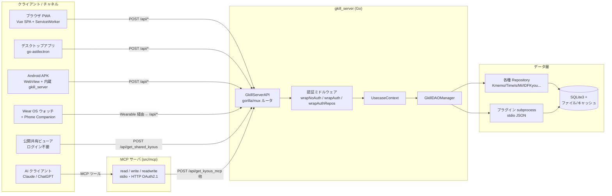
```mermaid
graph LR
    subgraph Clients["クライアント / チャネル"]
        PWA[ブラウザ PWA<br/>Vue SPA + ServiceWorker]
        DESKTOP[デスクトップアプリ<br/>go-astilectron]
        ANDROID[Android APK<br/>WebView + 内蔵 gkill_server]
        WEAR[Wear OS ウォッチ<br/>+ Phone Companion]
        AI[AI クライアント<br/>Claude / ChatGPT]
        VIEWER[公開共有ビューア<br/>ログイン不要]
    end

    subgraph MCP["MCP サーバ (src/mcp)"]
        MCPS[read / write / readwrite<br/>stdio・HTTP OAuth2.1]
    end

    subgraph Server["gkill_server (Go)"]
        API[GkillServerAPI<br/>gorilla/mux ルータ]
        MW[認証ミドルウェア<br/>wrapNoAuth / wrapAuth / wrapAuthRepos]
        UC[UsecaseContext]
        DAOM[GkillDAOManager]
    end

    subgraph Data["データ層"]
        REPS[各種 Repository<br/>Kmemo/TimeIs/Mi/IDFKyou...]
        PLUGIN[プラグイン subprocess<br/>stdio JSON]
        FS[(SQLite3 +<br/>ファイル/キャッシュ)]
    end

    PWA -->|POST /api/*| API
    DESKTOP -->|POST /api/*| API
    ANDROID -->|POST /api/*| API
    WEAR -->|Wearable 経由→ /api/*| API
    VIEWER -->|POST /api/get_shared_kyous| API
    AI -->|MCP ツール| MCPS
    MCPS -->|POST /api/get_kyous_mcp 他| API

    API --> MW --> UC --> DAOM --> REPS
    DAOM --> PLUGIN
    REPS --> FS
    PLUGIN --> FS
```

**要点：** どのチャネルも「HTTP JSON API」に集約されます。Wear OS はスマホの Companion アプリが、AI は MCP サーバが、それぞれ HTTP API へ橋渡しします。認証・データアクセスのロジックはチャネルごとに重複せず、サーバ側の 1 系統に統一されています。

## S0-2. 共通リクエスト・ライフサイクル（全シナリオの前提）

以降の全シナリオは、この共通の「リクエストが認証を通ってハンドラに届くまで」の土台の上に成り立ちます。フロントエンドは `gkill-api.ts` の `gkill_fetch` で送信し、応答を `check_auth` で検査します。サーバは 3 種のラッパ（`wrapNoAuth` / `wrapAuth` / `wrapAuthRepos`）でハンドラを包みます。

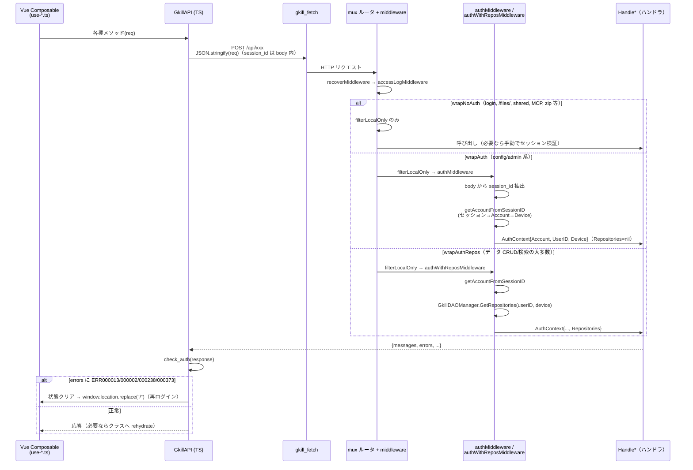
```mermaid
sequenceDiagram
    participant Comp as Vue Composable<br/>(use-*.ts)
    participant GkillAPI as GkillAPI (TS)
    participant Fetch as gkill_fetch
    participant Router as mux ルータ + middleware
    participant Auth as authMiddleware /<br/>authWithReposMiddleware
    participant Handler as Handle*（ハンドラ）

    Comp->>GkillAPI: 各種メソッド(req)
    GkillAPI->>Fetch: POST /api/xxx<br>JSON.stringify(req)（session_id は body 内）
    Fetch->>Router: HTTP リクエスト
    Router->>Router: recoverMiddleware → accessLogMiddleware

    alt wrapNoAuth（login, /files/, shared, MCP, zip 等）
        Router->>Router: filterLocalOnly のみ
        Router->>Handler: 呼び出し（必要なら手動でセッション検証）
    else wrapAuth（config/admin 系）
        Router->>Auth: filterLocalOnly → authMiddleware
        Auth->>Auth: body から session_id 抽出
        Auth->>Auth: getAccountFromSessionID<br>(セッション→Account→Device)
        Auth->>Handler: AuthContext{Account, UserID, Device}（Repositories=nil）
    else wrapAuthRepos（データ CRUD/検索の大多数）
        Router->>Auth: filterLocalOnly → authWithReposMiddleware
        Auth->>Auth: getAccountFromSessionID
        Auth->>Auth: GkillDAOManager.GetRepositories(userID, device)
        Auth->>Handler: AuthContext{..., Repositories}
    end

    Handler-->>GkillAPI: {messages, errors, ...}
    GkillAPI->>GkillAPI: check_auth(response)
    alt errors に ERR000013/000002/000238/000373
        GkillAPI->>Comp: 状態クリア → window.location.replace("/")（再ログイン）
    else 正常
        GkillAPI-->>Comp: 応答（必要ならクラスへ rehydrate）
    end
```

`getAccountFromSessionID`（`auth.go`）の内部判定を補足します。

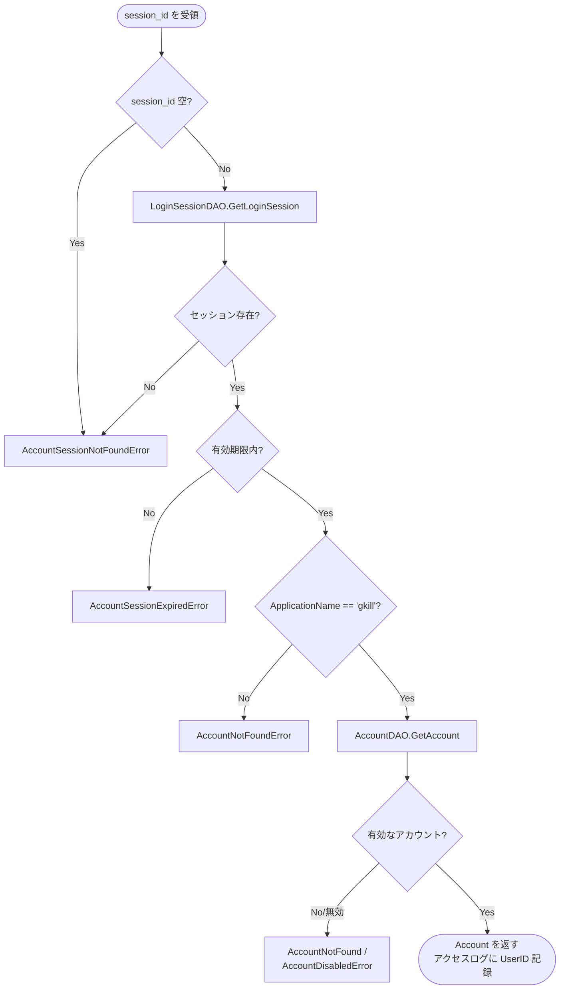
```mermaid
flowchart TD
    Start([session_id を受領]) --> Empty{session_id 空?}
    Empty -->|Yes| ErrNF[AccountSessionNotFoundError]
    Empty -->|No| GetSes[LoginSessionDAO.GetLoginSession]
    GetSes --> SesNil{セッション存在?}
    SesNil -->|No| ErrNF
    SesNil -->|Yes| Exp{有効期限内?}
    Exp -->|No| ErrExp[AccountSessionExpiredError]
    Exp -->|Yes| AppName{"ApplicationName == 'gkill'?"}
    AppName -->|No| ErrNF2[AccountNotFoundError]
    AppName -->|Yes| GetAcc[AccountDAO.GetAccount]
    GetAcc --> AccOK{有効なアカウント?}
    AccOK -->|No/無効| ErrDis[AccountNotFound /<br/>AccountDisabledError]
    AccOK -->|Yes| Ok([Account を返す<br/>アクセスログに UserID 記録])
```

**認証の 2 系統に注意：** 通常の JSON API は **body 内 `session_id`** で認証しますが、ファイルバイトを返す静的ルート（`/files/`, `/zip_cache/`）は **Cookie `gkill_session_id`（共有時は `gkill_shared_id`）** で認証します。このため該当フロントエンド呼び出しは `credentials:'include'` を付けます（→ シナリオ6・10 参照）。

---

# 第1部 — 日常利用シナリオ（ブラウザ / デスクトップ）

## シナリオ1. 初回起動 〜 ログイン

**物語：** ユーザが初めて gkill を起動する。サーバはデフォルト管理者 `admin`（パスワード無し・リセットトークン付き）を自動生成し、ユーザは最初のアカウント登録を経てログインする。

**裏で何が起きるか：**

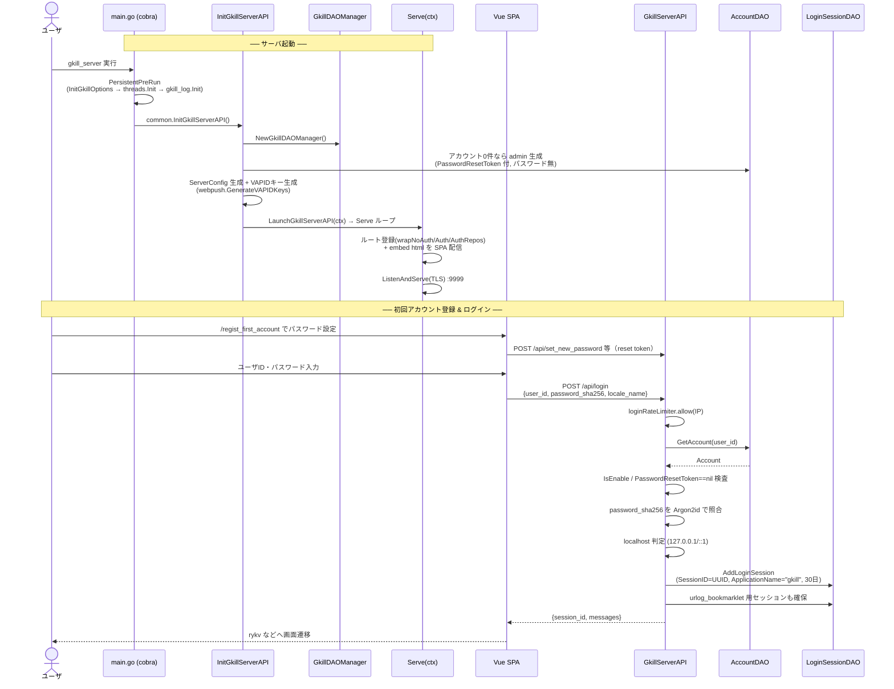
```mermaid
sequenceDiagram
    actor User as ユーザ
    participant Main as main.go (cobra)
    participant Init as InitGkillServerAPI
    participant DAOM as GkillDAOManager
    participant Serve as Serve(ctx)
    participant UI as Vue SPA
    participant API as GkillServerAPI
    participant AccDAO as AccountDAO
    participant SesDAO as LoginSessionDAO

    Note over Main,Serve: ── サーバ起動 ──
    User->>Main: gkill_server 実行
    Main->>Main: PersistentPreRun<br>(InitGkillOptions → threads.Init → gkill_log.Init)
    Main->>Init: common.InitGkillServerAPI()
    Init->>DAOM: NewGkillDAOManager()
    Init->>AccDAO: アカウント0件なら admin 生成<br>(PasswordResetToken 付, パスワード無)
    Init->>Init: ServerConfig 生成 + VAPIDキー生成<br>(webpush.GenerateVAPIDKeys)
    Init->>Serve: LaunchGkillServerAPI(ctx) → Serve ループ
    Serve->>Serve: ルート登録(wrapNoAuth/Auth/AuthRepos)<br>+ embed html を SPA 配信
    Serve->>Serve: ListenAndServe(TLS) :9999

    Note over User,SesDAO: ── 初回アカウント登録 & ログイン ──
    User->>UI: /regist_first_account でパスワード設定
    UI->>API: POST /api/set_new_password 等（reset token）
    User->>UI: ユーザID・パスワード入力
    UI->>API: POST /api/login<br>{user_id, password_sha256, locale_name}
    API->>API: loginRateLimiter.allow(IP)
    API->>AccDAO: GetAccount(user_id)
    AccDAO-->>API: Account
    API->>API: IsEnable / PasswordResetToken==nil 検査
    API->>API: password_sha256 を Argon2id で照合
    API->>API: localhost 判定 (127.0.0.1/::1)
    API->>SesDAO: AddLoginSession<br>(SessionID=UUID, ApplicationName="gkill", 30日)
    API->>SesDAO: urlog_bookmarklet 用セッションも確保
    API-->>UI: {session_id, messages}
    UI-->>User: rykv などへ画面遷移
```

**関連：** ログインの単体詳細は [sequence-diagrams.md](sequence-diagrams.md) の「1. ログイン」、起動・DAO 構成は [program-spec.md](program-spec.md)。

## シナリオ2. 朝のクイック記録 — KFTL 一括入力

**物語：** 出勤前、ユーザは KFTL 画面に「起きた」「今日のタスク3つ」「気分7」などを一気に打ち込み、保存する。1 回の入力から複数種類の Kyou（kmemo / mi / lantana …）がまとめて生成される。

**重要な差別化点：** 対話 UI の KFTL は**ブラウザ側でパース**され、1 つの `TXID` を共有した **N 本の `add_*` API 呼び出しへ fan-out** します（サーバ側 `/api/submit_kftl_text` は使いません。そちらは MCP / モバイルのサーバ側一括パス→シナリオ7・11）。

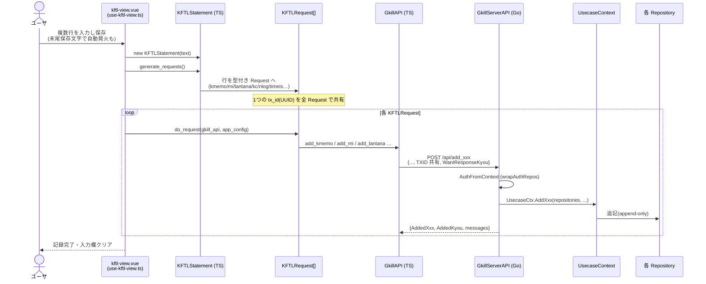
```mermaid
sequenceDiagram
    actor User as ユーザ
    participant View as kftl-view.vue<br>(use-kftl-view.ts)
    participant Stmt as KFTLStatement (TS)
    participant Req as KFTLRequest[]
    participant GkillAPI as GkillAPI (TS)
    participant API as GkillServerAPI (Go)
    participant UC as UsecaseContext
    participant Reps as 各 Repository

    User->>View: 複数行を入力し保存<br>(末尾保存文字で自動発火も)
    View->>Stmt: new KFTLStatement(text)
    View->>Stmt: generate_requests()
    Stmt->>Req: 行を型付き Request へ<br>(kmemo/mi/lantana/kc/nlog/timeis…)
    Note over Req: 1つの tx_id(UUID) を全 Request で共有
    loop 各 KFTLRequest
        View->>Req: do_request(gkill_api, app_config)
        Req->>GkillAPI: add_kmemo / add_mi / add_lantana …
        GkillAPI->>API: POST /api/add_xxx<br>{..., TXID 共有, WantResponseKyou}
        API->>API: AuthFromContext (wrapAuthRepos)
        API->>UC: UsecaseCtx.AddXxx(repositories, ...)
        UC->>Reps: 追記(append-only)
        API-->>GkillAPI: {AddedXxx, AddedKyou, messages}
    end
    View-->>User: 記録完了・入力欄クリア
```

パース〜dispatch の分岐（各行がどの API に振り分けられるか）を補足します。

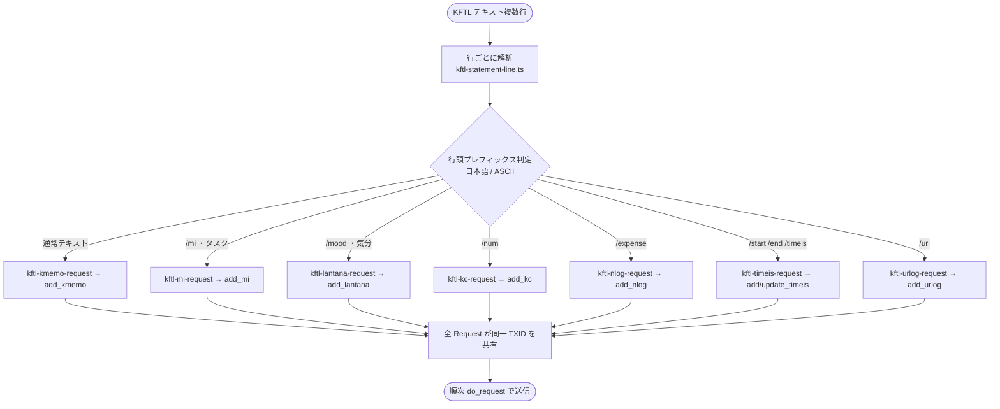
```mermaid
flowchart TD
    Start([KFTL テキスト複数行]) --> Split[行ごとに解析<br/>kftl-statement-line.ts]
    Split --> Prefix{行頭プレフィックス判定<br/>日本語 / ASCII}
    Prefix -->|通常テキスト| Kmemo[kftl-kmemo-request → add_kmemo]
    Prefix -->|/mi ・タスク| Mi[kftl-mi-request → add_mi]
    Prefix -->|/mood ・気分| Lantana[kftl-lantana-request → add_lantana]
    Prefix -->|/num| Kc[kftl-kc-request → add_kc]
    Prefix -->|/expense| Nlog[kftl-nlog-request → add_nlog]
    Prefix -->|/start /end /timeis| TimeIs[kftl-timeis-request → add/update_timeis]
    Prefix -->|/url| Urlog[kftl-urlog-request → add_urlog]
    Kmemo --> Tx[全 Request が同一 TXID を共有]
    Mi --> Tx
    Lantana --> Tx
    Kc --> Tx
    Nlog --> Tx
    TimeIs --> Tx
    Urlog --> Tx
    Tx --> Done([順次 do_request で送信])
```

**関連：** KFTL の文法・プレフィックスは [glossary.md](glossary.md)、パーサ構造は [frontend-architecture.md](frontend-architecture.md)、サーバ側 KFTL は本資料シナリオ7。

## シナリオ3. メモ / ブックマークの単体記録

**物語：** ユーザが単発でメモを 1 件残す。あるいはスマホのブラウザで見ているページを「共有」ボタンから gkill に送り、ブックマーク（urlog）として保存する。

### 3a. 単体メモ追加（`add_kmemo`）

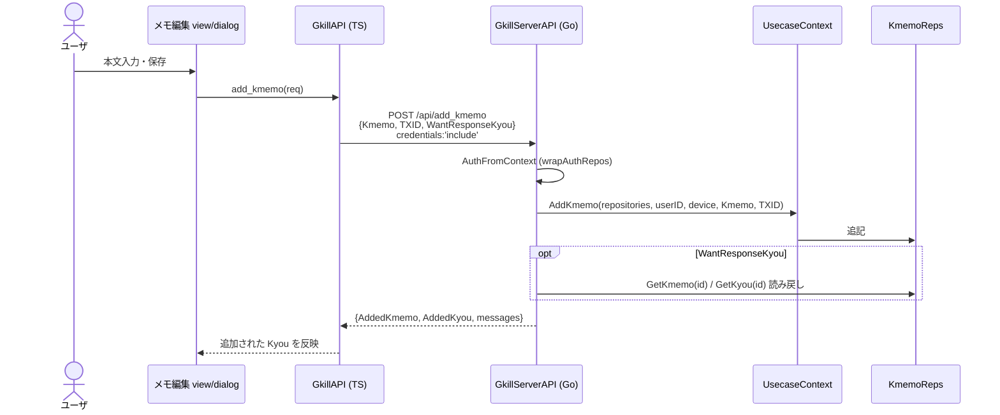
```mermaid
sequenceDiagram
    actor User as ユーザ
    participant UI as メモ編集 view/dialog
    participant GkillAPI as GkillAPI (TS)
    participant API as GkillServerAPI (Go)
    participant UC as UsecaseContext
    participant KRep as KmemoReps

    User->>UI: 本文入力・保存
    UI->>GkillAPI: add_kmemo(req)
    GkillAPI->>API: POST /api/add_kmemo<br>{Kmemo, TXID, WantResponseKyou}<br>credentials:'include'
    API->>API: AuthFromContext (wrapAuthRepos)
    API->>UC: AddKmemo(repositories, userID, device, Kmemo, TXID)
    UC->>KRep: 追記
    opt WantResponseKyou
        API->>KRep: GetKmemo(id) / GetKyou(id) 読み戻し
    end
    API-->>GkillAPI: {AddedKmemo, AddedKyou, messages}
    GkillAPI-->>UI: 追加された Kyou を反映
```

### 3b. ブラウザ共有ターゲット（Web Share Target → urlog/kmemo）

PWA としてインストールされた gkill は、OS の共有シートから受け取ったページを ServiceWorker が横取りして記録します。

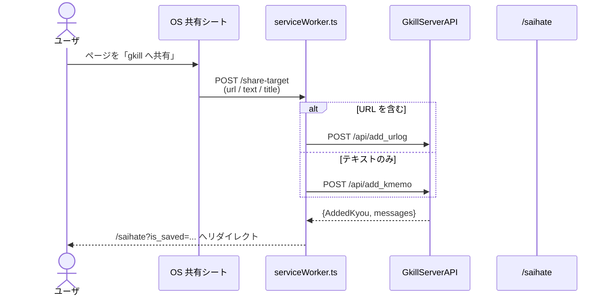
```mermaid
sequenceDiagram
    actor User as ユーザ
    participant OS as OS 共有シート
    participant SW as serviceWorker.ts
    participant API as GkillServerAPI
    participant Saihate as /saihate

    User->>OS: ページを「gkill へ共有」
    OS->>SW: POST /share-target<br>(url / text / title)
    alt URL を含む
        SW->>API: POST /api/add_urlog
    else テキストのみ
        SW->>API: POST /api/add_kmemo
    end
    API-->>SW: {AddedKyou, messages}
    SW-->>User: /saihate?is_saved=... へリダイレクト
```

## シナリオ4. 検索・振り返り（rykv）

**物語：** 夜、ユーザは rykv 画面で「先週の外食の記録」をタグ・期間・キーワードで絞り込んで振り返る。1 回の検索リクエストが全リポジトリ横断で評価され、多数の Kyou が返る。

**裏で何が起きるか：** フロントは `FindQuery`（find_filter）を組み立てて `get_kyous` を呼び、サーバは全 Rep 横断で `FindFilter` を適用します。応答の生 JSON は `Kyou` クラスへ **5000 件チャンクで rehydrate**（`*time` 文字列 → `Date`）されます。

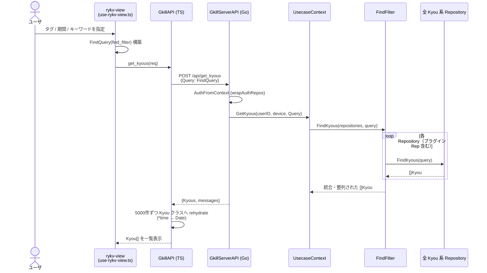
```mermaid
sequenceDiagram
    actor User as ユーザ
    participant View as rykv-view<br>(use-rykv-view.ts)
    participant GkillAPI as GkillAPI (TS)
    participant API as GkillServerAPI (Go)
    participant UC as UsecaseContext
    participant FF as FindFilter
    participant Reps as 全 Kyou 系 Repository

    User->>View: タグ / 期間 / キーワードを指定
    View->>View: FindQuery(find_filter) 構築
    View->>GkillAPI: get_kyous(req)
    GkillAPI->>API: POST /api/get_kyous<br>{Query: FindQuery}
    API->>API: AuthFromContext (wrapAuthRepos)
    API->>UC: GetKyous(userID, device, Query)
    UC->>FF: FindKyous(repositories, query)
    loop 各 Repository（プラグイン Rep 含む）
        FF->>Reps: FindKyous(query)
        Reps-->>FF: []Kyou
    end
    FF-->>UC: 統合・整列された []Kyou
    API-->>GkillAPI: {Kyous, messages}
    GkillAPI->>GkillAPI: 5000件ずつ Kyou クラスへ rehydrate<br>(*time → Date)
    GkillAPI-->>View: Kyou[] を一覧表示
```

検索フィルタの適用ロジック（概念）を補足します。実装レベルの詳細は [activity-diagrams.md](activity-diagrams.md) を参照。

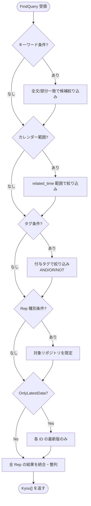
```mermaid
flowchart TD
    Start([FindQuery 受領]) --> Word{キーワード条件?}
    Word -->|あり| WMatch[全文/部分一致で候補絞り込み]
    Word -->|なし| Cal
    WMatch --> Cal{カレンダー範囲?}
    Cal -->|あり| CMatch[related_time 範囲で絞り込み]
    Cal -->|なし| Tag
    CMatch --> Tag{タグ条件?}
    Tag -->|あり| TMatch[付与タグで絞り込み<br/>AND/OR/NOT]
    Tag -->|なし| Rep
    TMatch --> Rep{Rep 種別条件?}
    Rep -->|あり| RMatch[対象リポジトリを限定]
    Rep -->|なし| Latest
    RMatch --> Latest{OnlyLatestData?}
    Latest -->|Yes| LMatch[各 ID の最新版のみ]
    Latest -->|No| Merge
    LMatch --> Merge[全 Rep の結果を統合・整列]
    Merge --> Done(["Kyou[] を返す"])
```

**関連：** find_filter の構造は [program-spec.md](program-spec.md) / `find_filter.go`、画面仕様は [screen-specs.md](screen-specs.md)。

## シナリオ5. タスク管理（mi ボード）

**物語：** ユーザは mi（タスク）をボード上で管理する。ボード一覧を取得し、新規タスクを追加し、状態（未着手 → 進行中 → 完了）を更新していく。

### 5a. ボード一覧の取得とタスク追加

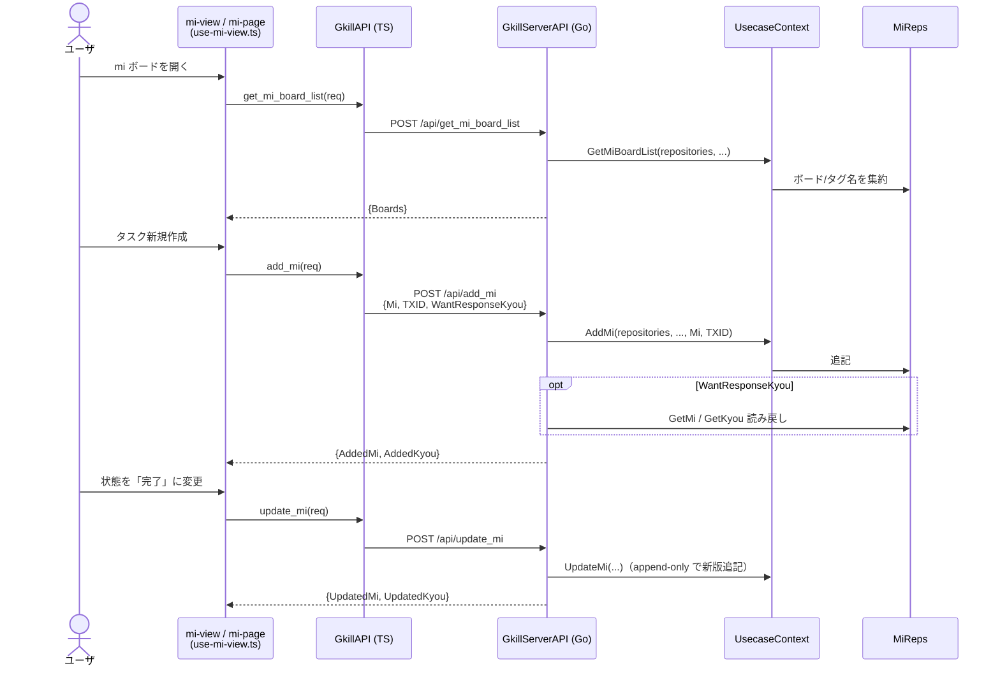
```mermaid
sequenceDiagram
    actor User as ユーザ
    participant View as mi-view / mi-page<br>(use-mi-view.ts)
    participant GkillAPI as GkillAPI (TS)
    participant API as GkillServerAPI (Go)
    participant UC as UsecaseContext
    participant MRep as MiReps

    User->>View: mi ボードを開く
    View->>GkillAPI: get_mi_board_list(req)
    GkillAPI->>API: POST /api/get_mi_board_list
    API->>UC: GetMiBoardList(repositories, ...)
    UC->>MRep: ボード/タグ名を集約
    API-->>View: {Boards}

    User->>View: タスク新規作成
    View->>GkillAPI: add_mi(req)
    GkillAPI->>API: POST /api/add_mi<br>{Mi, TXID, WantResponseKyou}
    API->>UC: AddMi(repositories, ..., Mi, TXID)
    UC->>MRep: 追記
    opt WantResponseKyou
        API->>MRep: GetMi / GetKyou 読み戻し
    end
    API-->>View: {AddedMi, AddedKyou}

    User->>View: 状態を「完了」に変更
    View->>GkillAPI: update_mi(req)
    GkillAPI->>API: POST /api/update_mi
    API->>UC: UpdateMi(...)（append-only で新版追記）
    API-->>View: {UpdatedMi, UpdatedKyou}
```

### 5b. mi（タスク）のライフサイクル

mi は append-only で更新され、状態は各版のフィールドで表現されます。

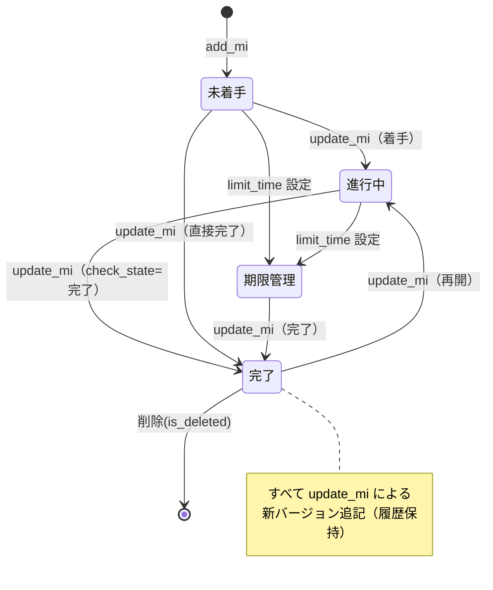
```mermaid
stateDiagram-v2
    [*] --> 未着手: add_mi
    未着手 --> 進行中: update_mi（着手）
    進行中 --> 完了: update_mi（check_state=完了）
    未着手 --> 完了: update_mi（直接完了）
    完了 --> 進行中: update_mi（再開）
    未着手 --> 期限管理: limit_time 設定
    進行中 --> 期限管理: limit_time 設定
    期限管理 --> 完了: update_mi（完了）
    完了 --> [*]: 削除(is_deleted)
    note right of 完了
        すべて update_mi による
        新バージョン追記（履歴保持）
    end note
```

**関連：** mi の状態遷移の詳細は [state-machines.md](state-machines.md)、ボード UI は [screen-specs.md](screen-specs.md)。

## シナリオ6. 添付ファイル閲覧と ZIP 展開

**物語：** ユーザは IDF リポジトリに取り込んだ写真や書類（PDF・画像）を rykv から開く。さらに `.zip` / `.cbz` の中身をアプリ内で一覧・閲覧する。

**ポイント：** メタ情報は JSON API（body の `session_id`）で取得しますが、**ファイルの実バイトは静的ルート `/files/` を Cookie 認証で配信**します。ZIP は初回に展開キャッシュを作り、以後 `/zip_cache/` から配信します。

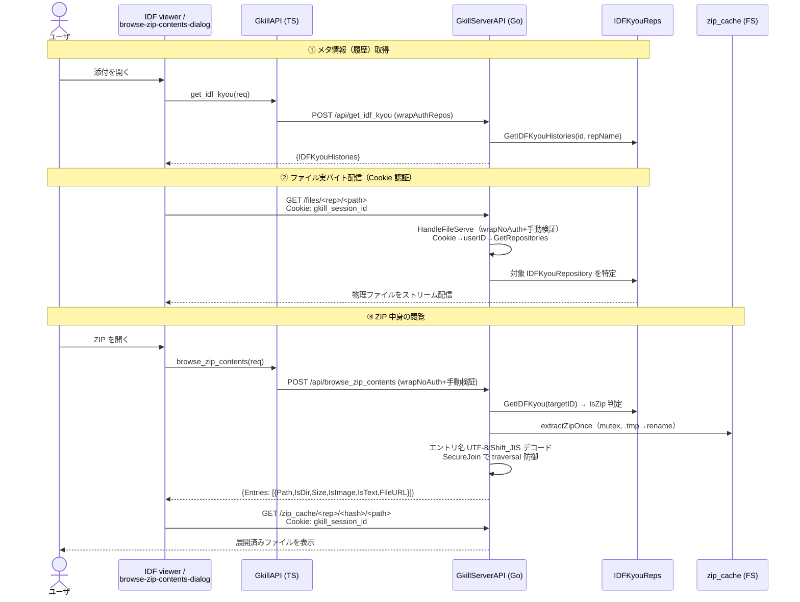
```mermaid
sequenceDiagram
    actor User as ユーザ
    participant UI as IDF viewer /<br>browse-zip-contents-dialog
    participant GkillAPI as GkillAPI (TS)
    participant API as GkillServerAPI (Go)
    participant IRep as IDFKyouReps
    participant Cache as zip_cache (FS)

    Note over User,IRep: ① メタ情報（履歴）取得
    User->>UI: 添付を開く
    UI->>GkillAPI: get_idf_kyou(req)
    GkillAPI->>API: POST /api/get_idf_kyou (wrapAuthRepos)
    API->>IRep: GetIDFKyouHistories(id, repName)
    API-->>UI: {IDFKyouHistories}

    Note over User,IRep: ② ファイル実バイト配信（Cookie 認証）
    UI->>API: GET /files/<rep>/<path><br>Cookie: gkill_session_id
    API->>API: HandleFileServe（wrapNoAuth+手動検証）<br>Cookie→userID→GetRepositories
    API->>IRep: 対象 IDFKyouRepository を特定
    IRep-->>UI: 物理ファイルをストリーム配信

    Note over User,Cache: ③ ZIP 中身の閲覧
    User->>UI: ZIP を開く
    UI->>GkillAPI: browse_zip_contents(req)
    GkillAPI->>API: POST /api/browse_zip_contents (wrapNoAuth+手動検証)
    API->>IRep: GetIDFKyou(targetID) → IsZip 判定
    API->>Cache: extractZipOnce（mutex, .tmp→rename）
    API->>API: エントリ名 UTF-8/Shift_JIS デコード<br>SecureJoin で traversal 防御
    API-->>UI: {Entries: [{Path,IsDir,Size,IsImage,IsText,FileURL}]}
    UI->>API: GET /zip_cache/<rep>/<hash>/<path><br>Cookie: gkill_session_id
    API-->>User: 展開済みファイルを表示
```

ZIP 展開処理の詳細ロジックを補足します。

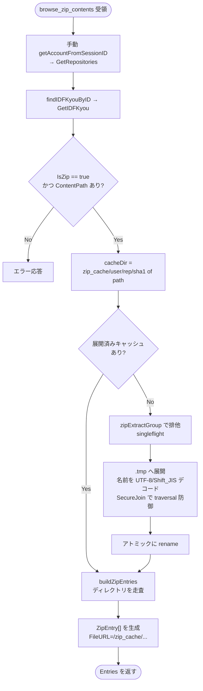
```mermaid
flowchart TD
    Start([browse_zip_contents 受領]) --> Auth[手動 getAccountFromSessionID<br/>→ GetRepositories]
    Auth --> Find[findIDFKyouByID → GetIDFKyou]
    Find --> IsZip{IsZip == true<br/>かつ ContentPath あり?}
    IsZip -->|No| Err[エラー応答]
    IsZip -->|Yes| Hash[cacheDir =<br/>zip_cache/user/rep/sha1 of path]
    Hash --> Exists{展開済みキャッシュ<br/>あり?}
    Exists -->|Yes| Build
    Exists -->|No| Lock[zipExtractGroup で排他<br/>singleflight]
    Lock --> Extract[.tmp へ展開<br/>名前を UTF-8/Shift_JIS デコード<br/>SecureJoin で traversal 防御]
    Extract --> Rename[アトミックに rename]
    Rename --> Build[buildZipEntries<br/>ディレクトリを走査]
    Build --> Entry["ZipEntry[] を生成<br/>FileURL=/zip_cache/..."]
    Entry --> Done([Entries を返す])
```

**関連：** IDF / DVNF の仕組みは [dvnf-rep-type-spec.md](dvnf-rep-type-spec.md)、ZIP 実装の安全策は [error-handling-and-security.md](error-handling-and-security.md)。

---

# 第2部 — クロスデバイス / クロスチャネル

## シナリオ7. Wear OS / Android からの記録

**物語：** ユーザは外出先で、Pixel Watch から声や定型テンプレートで素早く記録する。ウォッチは単独ではサーバに繋がらず、ペアのスマホ（Phone Companion）が橋渡しして、スマホ内 or 家の gkill_server の HTTP API を叩く。

**差別化点：** ここでは**サーバ側 KFTL 一括パス** `POST /api/submit_kftl_text`（`HandleSubmitKFTLText` → `kftl.KFTLStatement.GenerateAndExecuteRequests`）を使います。ブラウザの fan-out（シナリオ2）と対照的に、テキストをサーバへ丸ごと渡し、サーバ側でパース＆書き込みします。

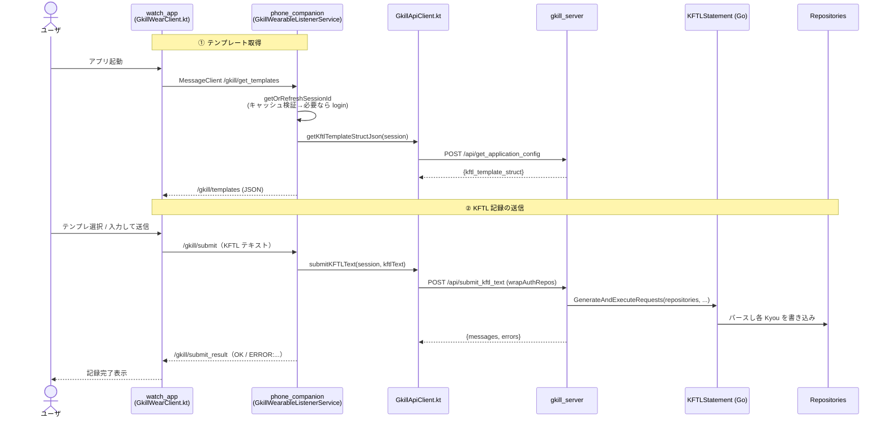
```mermaid
sequenceDiagram
    actor User as ユーザ
    participant Watch as watch_app<br>(GkillWearClient.kt)
    participant Phone as phone_companion<br>(GkillWearableListenerService)
    participant ApiC as GkillApiClient.kt
    participant API as gkill_server
    participant KFTL as KFTLStatement (Go)
    participant Reps as Repositories

    Note over Watch,Phone: ① テンプレート取得
    User->>Watch: アプリ起動
    Watch->>Phone: MessageClient /gkill/get_templates
    Phone->>Phone: getOrRefreshSessionId<br>(キャッシュ検証→必要なら login)
    Phone->>ApiC: getKftlTemplateStructJson(session)
    ApiC->>API: POST /api/get_application_config
    API-->>ApiC: {kftl_template_struct}
    Phone-->>Watch: /gkill/templates (JSON)

    Note over Watch,Reps: ② KFTL 記録の送信
    User->>Watch: テンプレ選択 / 入力して送信
    Watch->>Phone: /gkill/submit（KFTL テキスト）
    Phone->>ApiC: submitKFTLText(session, kftlText)
    ApiC->>API: POST /api/submit_kftl_text (wrapAuthRepos)
    API->>KFTL: GenerateAndExecuteRequests(repositories, ...)
    KFTL->>Reps: パースし各 Kyou を書き込み
    API-->>ApiC: {messages, errors}
    Phone-->>Watch: /gkill/submit_result（OK / ERROR:...）
    Watch-->>User: 記録完了表示
```

**補足（plaing TimeIs）：** 進行中の TimeIs（作業中タイマー）は `/gkill/get_plaing_timeis`（→ `POST /api/get_kyous` + `POST /api/get_timeis`）で取得、終了は `/gkill/end_timeis`（→ `POST /api/get_timeis` + `POST /api/update_timeis`）で行います。Android APK 版は WebView + 内蔵 `libgkill_server.so` を exec して、同じ HTTP API をローカルで利用します。

**関連：** モバイル構成は [folder-structure.md](folder-structure.md)、KFTL 文法は [glossary.md](glossary.md)。

## シナリオ8. リマインダ通知（Web Push）

**物語：** ユーザは「明日 10 時に電話」というリマインダ（notification）を登録しておく。時刻になると、gkill_server がバックグラウンドで Web Push を送り、ブラウザ / PWA に通知が表示され、タップすると該当 Kyou が開く。

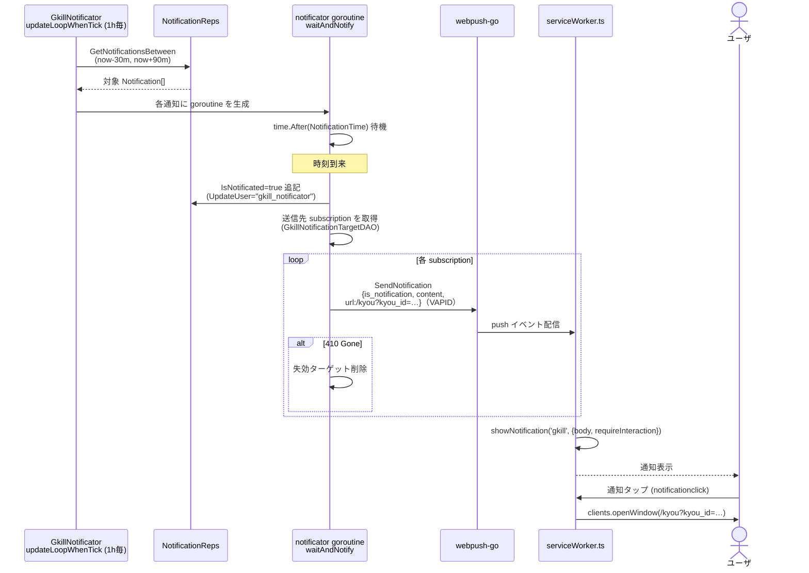
```mermaid
sequenceDiagram
    participant NotifyLoop as GkillNotificator<br>updateLoopWhenTick (1h毎)
    participant NRep as NotificationReps
    participant Notif as notificator goroutine<br>waitAndNotify
    participant Web as webpush-go
    participant SW as serviceWorker.ts
    actor User as ユーザ

    NotifyLoop->>NRep: GetNotificationsBetween<br>(now-30m, now+90m)
    NRep-->>NotifyLoop: 対象 Notification[]
    NotifyLoop->>Notif: 各通知に goroutine を生成
    Notif->>Notif: time.After(NotificationTime) 待機
    Note over Notif: 時刻到来
    Notif->>NRep: IsNotificated=true 追記<br>(UpdateUser="gkill_notificator")
    Notif->>Notif: 送信先 subscription を取得<br>(GkillNotificationTargetDAO)
    loop 各 subscription
        Notif->>Web: SendNotification<br>{is_notification, content,<br>url:/kyou?kyou_id=…}（VAPID）
        Web->>SW: push イベント配信
        alt 410 Gone
            Notif->>Notif: 失効ターゲット削除
        end
    end
    SW->>SW: showNotification('gkill', {body, requireInteraction})
    SW-->>User: 通知表示
    User->>SW: 通知タップ (notificationclick)
    SW->>User: clients.openWindow(/kyou?kyou_id=…)
```

Notification のライフサイクルを補足します。

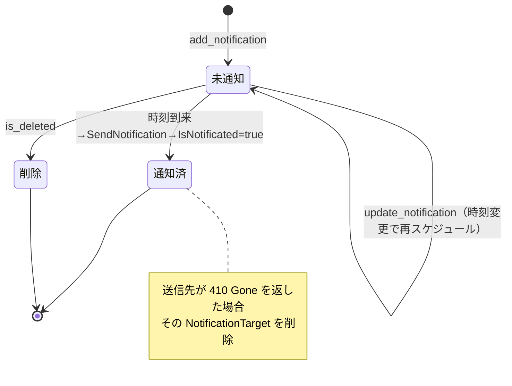
```mermaid
stateDiagram-v2
    [*] --> 未通知: add_notification
    未通知 --> 未通知: update_notification（時刻変更で再スケジュール）
    未通知 --> 通知済: 時刻到来→SendNotification→IsNotificated=true
    未通知 --> 削除: is_deleted
    通知済 --> [*]
    削除 --> [*]
    note right of 通知済
        送信先が 410 Gone を返した場合
        その NotificationTarget を削除
    end note
```

**前提：** VAPID 鍵はサーバ初回起動時（シナリオ1）に生成され `ServerConfig` に保持。クライアントは `HandleGetGkillNotificationPublicKey` で公開鍵を取得し、`HandleRegisterGkillNotification` で PushSubscription を登録済みであること。

## シナリオ9. データ更新のプッシュ同期

**物語：** ユーザが PC とスマホの両方で gkill を開いている。PC でメモを編集すると、スマホ側の古いキャッシュが自動で無効化され、次に開いたとき最新が表示される。

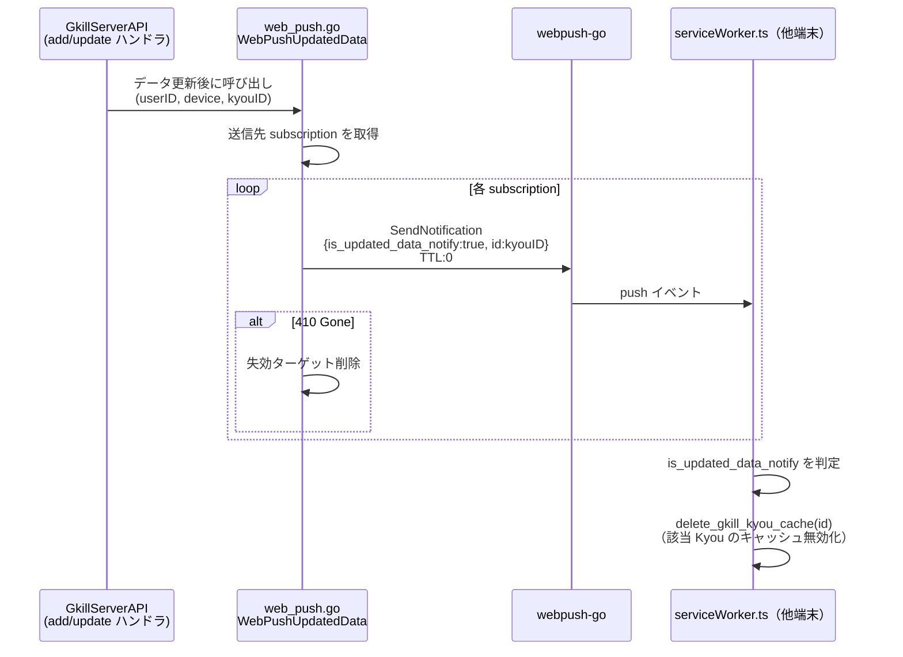
```mermaid
sequenceDiagram
    participant API as GkillServerAPI<br>(add/update ハンドラ)
    participant WP as web_push.go<br>WebPushUpdatedData
    participant Web as webpush-go
    participant SW as serviceWorker.ts（他端末）

    API->>WP: データ更新後に呼び出し<br>(userID, device, kyouID)
    WP->>WP: 送信先 subscription を取得
    loop 各 subscription
        WP->>Web: SendNotification<br>{is_updated_data_notify:true, id:kyouID}<br>TTL:0
        Web->>SW: push イベント
        alt 410 Gone
            WP->>WP: 失効ターゲット削除
        end
    end
    SW->>SW: is_updated_data_notify を判定
    SW->>SW: delete_gkill_kyou_cache(id)<br>（該当 Kyou のキャッシュ無効化）
```

**シナリオ8 との違い：** シナリオ8 はユーザに見える通知（`showNotification`）ですが、こちらは `TTL:0` の**サイレントなキャッシュ無効化**で、UI 通知は出ません。

---

# 第3部 — 連携・共有・拡張

## シナリオ10. 公開共有リンクの閲覧

**物語：** ユーザが旅行の記録一式を、ログイン不要の URL で友人に共有する。友人はリンクを開くだけで、指定された範囲の Kyou（写真・地図・タグ等、共有フラグで許可されたもの）を閲覧できる。

**セキュリティモデル：** `SharedID`（推測困難なトークン）自体が capability です。`HandleGetSharedKyous` は `wrapNoAuth` で登録され、ログイン無しに `SharedID` からオーナーの userID/device を解決して検索を実行します。

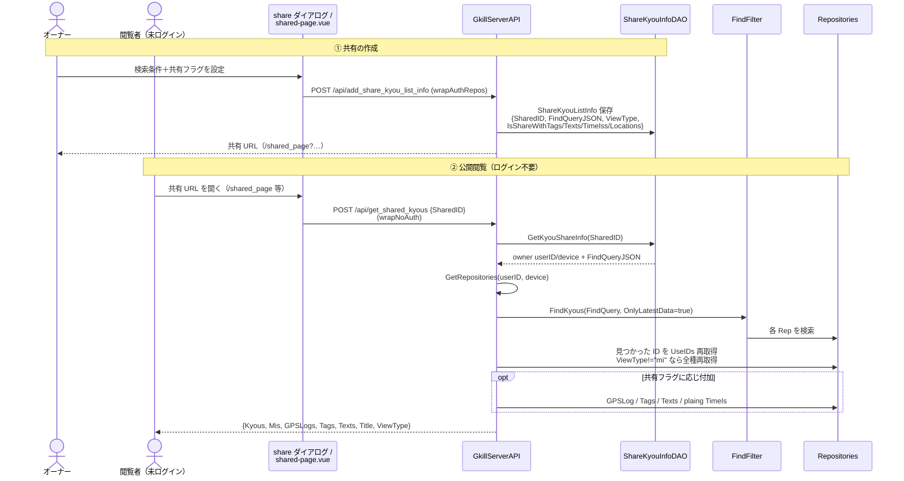
```mermaid
sequenceDiagram
    actor Owner as オーナー
    actor Friend as 閲覧者（未ログイン）
    participant UI as share ダイアログ /<br>shared-page.vue
    participant API as GkillServerAPI
    participant SDAO as ShareKyouInfoDAO
    participant FF as FindFilter
    participant Reps as Repositories

    Note over Owner,SDAO: ① 共有の作成
    Owner->>UI: 検索条件＋共有フラグを設定
    UI->>API: POST /api/add_share_kyou_list_info (wrapAuthRepos)
    API->>SDAO: ShareKyouListInfo 保存<br>{SharedID, FindQueryJSON, ViewType,<br>IsShareWithTags/Texts/TimeIss/Locations}
    API-->>Owner: 共有 URL（/shared_page?…）

    Note over Friend,Reps: ② 公開閲覧（ログイン不要）
    Friend->>UI: 共有 URL を開く（/shared_page 等）
    UI->>API: POST /api/get_shared_kyous {SharedID}<br>(wrapNoAuth)
    API->>SDAO: GetKyouShareInfo(SharedID)
    SDAO-->>API: owner userID/device + FindQueryJSON
    API->>API: GetRepositories(userID, device)
    API->>FF: FindKyous(FindQuery, OnlyLatestData=true)
    FF->>Reps: 各 Rep を検索
    API->>Reps: 見つかった ID を UseIDs 再取得<br>ViewType!="mi" なら全種再取得
    opt 共有フラグに応じ付加
        API->>Reps: GPSLog / Tags / Texts / plaing TimeIs
    end
    API-->>Friend: {Kyous, Mis, GPSLogs, Tags, Texts, Title, ViewType}
```

**補足：** SPA ルート `/shared_page` `/shared_mi` `/shared_rykv` は `filterLocalOnly` を通りますが、データ取得 `HandleGetSharedKyous` は通らないため、`SharedID` さえあれば公開データに到達できます。ファイルバイトは Cookie `gkill_shared_id` 経由で `/files/` から配信されます（シナリオ6 の認証 2 系統を参照）。

## シナリオ11. AI 連携（MCP）

**物語：** ユーザが Claude / ChatGPT に「先月の外食の傾向を教えて」と尋ねる。AI は MCP ツール経由で gkill のライフログを読み、添付画像も参照して回答する。

MCP サーバは stdio（同一マシン・ローカル）と HTTP（OAuth 2.1 リモート）の 2 モードで、いずれも内部的に gkill の HTTP API を叩きます。

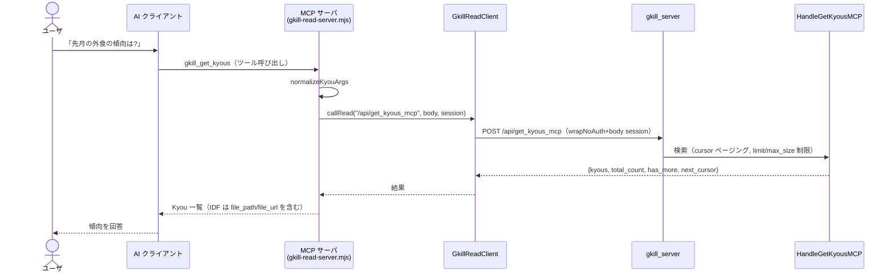
```mermaid
sequenceDiagram
    actor User as ユーザ
    participant AI as AI クライアント
    participant MCP as MCP サーバ<br>(gkill-read-server.mjs)
    participant Client as GkillReadClient
    participant API as gkill_server
    participant Handler as HandleGetKyousMCP

    User->>AI: 「先月の外食の傾向は?」
    AI->>MCP: gkill_get_kyous（ツール呼び出し）
    MCP->>MCP: normalizeKyouArgs
    MCP->>Client: callRead("/api/get_kyous_mcp", body, session)
    Client->>API: POST /api/get_kyous_mcp（wrapNoAuth+body session）
    API->>Handler: 検索（cursor ページング, limit/max_size 制限）
    Handler-->>Client: {kyous, total_count, has_more, next_cursor}
    Client-->>MCP: 結果
    MCP-->>AI: Kyou 一覧（IDF は file_path/file_url を含む）
    AI-->>User: 傾向を回答
```

**IDF ファイル 3 経路（露出ゲートはトランスポート種別）：** AI がライフログ内の画像・ファイルを見る手段は 3 つあり、stdio か HTTP かで出し分けます。

```mermaid
flowchart TD
    Start([get_kyous の IDF ペイロード]) --> Trans{トランスポート種別?}
    Trans -->|stdio ローカル| P1[① file_path<br/>絶対ローカルパスをそのまま渡す]
    Trans -->|HTTP リモート| Strip[stripFilePaths で file_path 削除]
    Strip --> P2[② file_url<br/>FileLinkStore がトークン発行<br/>GET /files 無認証配信<br/>画像は thumb と file_url_full]
    P1 --> Fallback
    P2 --> Fallback{ファイルが必要だが<br/>URL 経由不可?}
    Fallback -->|Yes| P3[③ gkill_get_idf_file<br/>base64 フォールバック・サイズ上限]
    Fallback -->|No| Done([AI が参照])
    P3 --> Done
```

**要点：** ローカル絶対パスがリモートに漏れないよう `stripFilePaths` で除去し、リモートには**トークン化した使い捨て URL** のみを渡します。gkill 本体は非公開のまま、MCP サーバの公開面（`GET /files/{token}`）だけを使います。

**関連：** セットアップは [mcp-setup-guide.md](mcp-setup-guide.md)、ファイルアクセス設計は [program-spec.md](program-spec.md)。

## シナリオ12. プラグインによる外部データ取り込み

**物語：** ユーザが ChatGPT / Claude.ai / Claude Code の会話履歴プラグインを導入すると、外部サービスの会話が gkill の検索結果に「plugin_kyou」として自然に混ざって表示される。

**仕組み：** プラグインは独立バイナリで、gkill は stdio（改行区切り JSON）で子プロセスと通信します。プラグイン Rep は通常の `Repository` として扱われるため、検索時に他の Rep と同列に `FindKyous` が呼ばれます。

```mermaid
sequenceDiagram
    participant DAOM as GkillDAOManager
    participant PM as plugin_manager
    participant FF as FindFilter
    participant PRep as pluginRepositoryImpl
    participant Proc as プラグイン subprocess

    Note over DAOM,PM: ① 発見・合流
    DAOM->>PM: DiscoverPlugins<br>($GKILL_HOME/plugins/{user}/*/manifest.json)
    PM->>PM: manifest 検証（name/executable/<br>rep_name/data_type, ProtocolVersion=="1"）
    PM-->>DAOM: PluginRepository[]
    DAOM->>DAOM: PluginReps を Reps に合流

    Note over FF,Proc: ② 検索時に子プロセスへ問い合わせ
    FF->>PRep: FindKyous(query)
    PRep->>PRep: ensureStarted（初回のみ子プロセス起動）
    PRep->>Proc: {command:"find_kyous", query}\n（mutex 直列化, 30s timeout）
    alt プロセスクラッシュ
        PRep->>Proc: 1回だけ自動再起動して再送
    end
    Proc-->>PRep: {kyous:[PluginKyou...]}\n
    PRep->>PRep: convertPluginKyouToKyou<br>+ pluginKyouMatchesQuery で補助フィルタ
    PRep-->>FF: []Kyou（他 Rep と統合）
```

プラグイン subprocess のライフサイクルを補足します。

```mermaid
stateDiagram-v2
    [*] --> 未起動: DiscoverPlugins で登録
    未起動 --> 起動中: ensureStarted（初回コマンド時）
    起動中 --> 応答待ち: sendRequest（改行区切り JSON）
    応答待ち --> 起動中: 応答受信
    応答待ち --> 再起動: プロセスクラッシュ（1回のみ自動）
    再起動 --> 応答待ち: 再送
    起動中 --> 終了: Close（close コマンド→Wait→kill）
    終了 --> [*]
    note right of 応答待ち
        全コマンドは mutex で直列化
        既定 30s タイムアウト
        buffer 上限 32MB
    end note
```

**関連：** プラグインの詳細仕様（マニフェスト・テーマ連携・PWA キャッシュ）は [plugin-system.md](plugin-system.md)、プロトコル型は `gkill_plugin/plugin_protocol.go`。

---

## シナリオ13. 見返していた記録をそのままタスクにする（MiReKyou）

**物語：** 振り返り中に「この店、今度もう一度行こう」と思った記録が出てくる。内容を書き写して新しいタスクを作るのは面倒なので、その記録を右クリックして「タスクにする」を選び、期限だけ決めて保存する。以後その記録はタスク画面の板にも並び、普通のタスクと同じようにチェックを付けられる。

**裏で何が起きるか：** MiReKyou は **タイトルを持たない Mi** です。`target_id` で元の Kyou を指すだけで、表示内容は常に元の Kyou から引いてきます。`data_type` は `mirekyou_create` / `_check` / `_limit` / `_start` / `_end` の5射影に分かれるため、前方一致で判定するコードは **`mirekyou` を `mi` より先に**評価しなければなりません。元の Kyou を削除すると表示する内容が無くなる点も MiReKyou 特有です。

```mermaid
sequenceDiagram
    actor User as ユーザ
    participant Menu as 各種 ContextMenu<br>(kmemo / idf_kyou / plugin-html …)
    participant Dlg as add-mi-re-kyou-dialog
    participant GkillAPI as GkillAPI (TS)
    participant API as GkillServerAPI (Go)
    participant UC as UsecaseContext
    participant Rep as MiReKyouRepositories

    User->>Menu: 記録を長押し / 右クリック
    Menu-->>User: 「タスクにする」を表示
    User->>Dlg: 板名・期限・開始予定・終了予定を入力
    Dlg->>GkillAPI: add_mi_re_kyou(req)
    GkillAPI->>API: POST /api/add_mirekyou
    API->>API: AuthFromContext (wrapAuthRepos)
    API->>UC: AddMiReKyou(userID, device, mirekyou)
    UC->>Rep: AddMiReKyouInfo（Append-Only）
    Rep-->>UC: OK
    UC->>Rep: GetMiReKyou(id)（保存後の再取得）
    Rep-->>API: MiReKyou
    API-->>GkillAPI: {mi_re_kyou, messages}
    GkillAPI-->>Dlg: 追加後の状態を反映
    Note over Dlg,Rep: 以後 get_kyous / get_mi_board_list の結果に<br>MiReKyou が混ざり、表示時に target_id の Kyou を解決する
```

**関連：** ER 定義は [er-diagram.md](er-diagram.md) の MIREKYOU、`data_type` の前方一致の注意は [dvnf-rep-type-spec.md](dvnf-rep-type-spec.md)、作成フローの詳細は [activity-diagrams.md](activity-diagrams.md) の「MiReKyou 作成フロー」。

---

## シナリオ14. 集計ビューで数字を眺め、推移をグラフにする（Dnote）

**物語：** 月末に「今月いくら使ったか」「気分の平均はどうだったか」を確認したい。ユーザは rykv の集計ビューを開き、集計項目を並べる。さらに「体重の推移を折れ線で見たい」と思い、トレンドグラフを追加して粒度を「日」にする。

**裏で何が起きるか：** **集計はすべてクライアント側で行われます。** 専用の集計 API はありません。`get_kyous` で取得済みの Kyou 配列に対して、`Predicate`（条件）→ `KeyGetter`（グルーピングキー）→ `AggregateTarget`（集計対象）の順にクラス群が適用されます。トレンドグラフも同じ配列を `DnoteTrendAggregator` が時系列にまとめ直すだけで、追加のリクエストは発生しません。定義そのものは `ApplicationConfig` の `dnote_json_data` に JSON で保存され、`update_application_config` で永続化されます。

```mermaid
sequenceDiagram
    actor User as ユーザ
    participant View as dnote-view / dnote-trend-graph-view
    participant Agg as Predicate → KeyGetter → AggregateTarget<br>DnoteTrendAggregator
    participant GkillAPI as GkillAPI (TS)
    participant API as GkillServerAPI (Go)

    User->>View: 集計ビューを開く / トレンドグラフを追加
    View->>Agg: 表示中の Kyou[] を渡す
    Agg->>Agg: Predicate で対象を絞り込み
    Agg->>Agg: KeyGetter でグループ化（日 / 週 / 月・タグ 等）
    Agg->>Agg: AggregateTarget で合計・平均・件数を算出
    Agg-->>View: DnoteItem[] / 時系列データ
    View-->>User: 集計値・リスト・折れ線/棒グラフを描画
    User->>View: 定義を保存
    View->>GkillAPI: update_application_config(dnote_json_data)
    GkillAPI->>API: POST /api/update_application_config
    API-->>GkillAPI: {messages}
    Note over View,API: サーバへ行くのは「定義の保存」だけ。<br>集計計算そのものはネットワークを使わない
```

**関連：** 集計クラス群の一覧は [class-diagrams.md](class-diagrams.md)、処理フローは [activity-diagrams.md](activity-diagrams.md) の「Dnote 集計処理フロー」、用語は [glossary.md](glossary.md) の「Dnote 集計システム用語」。

---

## 関連資料

本資料の各シナリオは、以下の資料の内容を横断的に合成したものです。個別の詳細は各資料を参照してください。

- [usecase.md](usecase.md) — 各操作を単体のユースケースとして定義（UC-ID）
- [sequence-diagrams.md](sequence-diagrams.md) — 1 操作単位のシーケンス図（正常系 / 異常系）
- [activity-diagrams.md](activity-diagrams.md) — 内部処理ロジックのフローチャート
- [state-machines.md](state-machines.md) — エンティティの状態遷移
- [api-endpoints.md](api-endpoints.md) — 全 API エンドポイントのリファレンス
- [program-spec.md](program-spec.md) — 初期化・DAO・キャッシュ・find_filter
- [plugin-system.md](plugin-system.md) — プラグインシステム仕様
- [mcp-setup-guide.md](mcp-setup-guide.md) — MCP セットアップ
- [error-handling-and-security.md](error-handling-and-security.md) — エラーコード・セキュリティ設計

