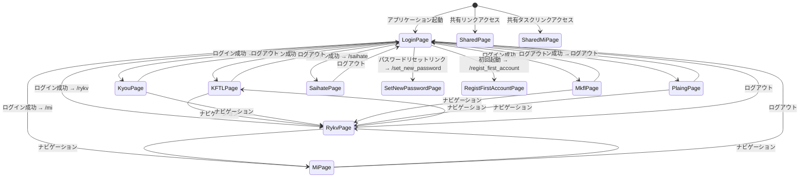
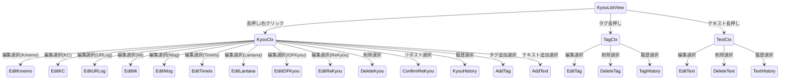
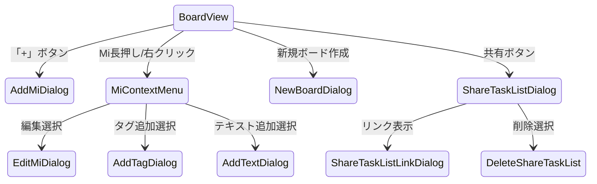
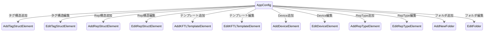
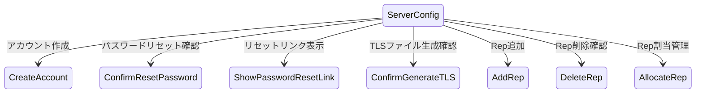
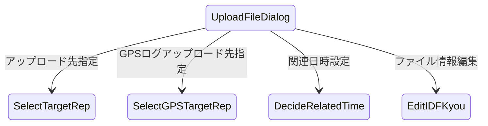

# gkill 画面遷移図（ステートマシン）

コードの `src/client/router/index.ts` と画面設計シートに基づく画面遷移。

## 1. 全体画面遷移

**メイン画面群（認証必要）:** KFTLPage, RykvPage, MiPage, KyouPage, MkflPage, PlaingPage, SaihatePage

**共有ページ（認証不要）:** SharedPage (`/shared_page`), SharedMiPage (`/shared_mi`)

## 2. 各画面の役割と遷移条件

### ルートページ一覧（12ルート）

| パス | ページ | 認証要否 | 役割 |
|-----|-------|---------|------|
| `/` | LoginPage | 不要 | ログイン画面 |
| `/kftl` | KFTLPage | 要 | KFTL テキストベース記録 |
| `/mi` | MiPage | 要 | タスク管理（ボード形式） |
| `/rykv` | RykvPage | 要 | ライフログ閲覧・検索・編集 |
| `/kyou` | KyouPage | 要 | Kyou 記録一覧 |
| `/mkfl` | MkflPage | 要 | 打刻メモ帳（KFTL入力+TimeIs表示） |
| `/plaing` | PlaingPage | 要 | 稼働中 TimeIs 一覧 |
| `/saihate` | SaihatePage | 要 | 記録特化画面（他画面への遷移なし） |
| `/set_new_password` | SetNewPasswordPage | 不要 | 新パスワード設定 |
| `/regist_first_account` | RegistFirstAccountPage | 不要 | 初回アカウント登録 |
| `/shared_page` | SharedPage | 不要 | 共有 Kyou 閲覧 |
| `/shared_mi` | SharedMiPage | 不要 | 共有タスク閲覧 |

## 3. Rykv 画面のダイアログ遷移

Rykv 画面は最も多くのダイアログを呼び出す中心的な画面。

**コンテキストメニュー:** KyouCtx（Kyou用）、TagCtx（タグ用）、TextCtx（テキスト用）

**編集ダイアログ:** データ型ごとに EditKmemo, EditKC, EditURLog, EditMi, EditNlog, EditTimeIs, EditLantana, EditIDFKyou, EditReKyou

**メタデータダイアログ:** AddTag, EditTag, DeleteTag, AddText, EditText, DeleteText

**履歴ダイアログ:** KyouHistory, TagHistory, TextHistory

## 4. Mi 画面のダイアログ遷移

**Mi操作ダイアログ:** AddMiDialog, EditMiDialog, NewBoardDialog

**共有機能:** ShareTaskListDialog → ShareTaskListLinkDialog, DeleteShareTaskList

## 5. 設定画面のダイアログ遷移

**アプリケーション設定（AppConfig）:** TagStruct, RepStruct, KFTLTemplate, DeviceStruct, RepTypeStruct の各構造を編集

**サーバ設定（ServerConfig）:** アカウント管理、パスワードリセット、TLS生成、Rep管理

## 6. ファイルアップロードのダイアログ遷移

