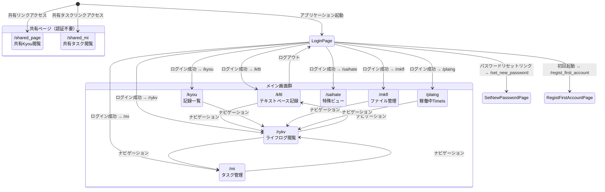
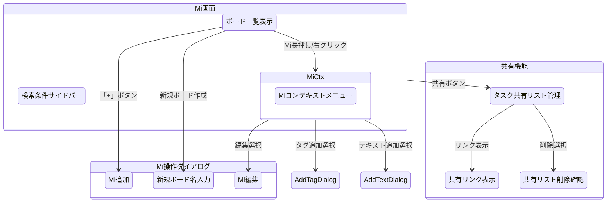
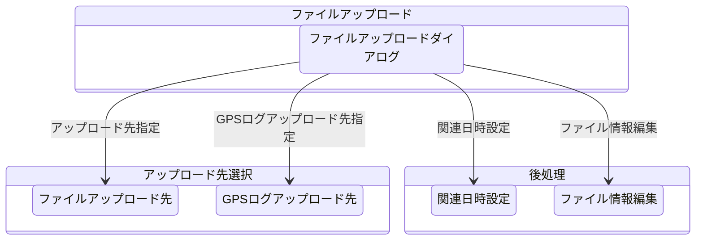

# gkill 画面遷移図（ステートマシン）

コードの `src/client/router/index.ts` と画面設計シートに基づく画面遷移。

## 1. 全体画面遷移



## 2. 各画面の役割と遷移条件

### ルートページ一覧（12ルート）

| パス | ページ | 認証要否 | 役割 |
|-----|-------|---------|------|
| `/` | LoginPage | 不要 | ログイン画面 |
| `/kftl` | KFTLPage | 要 | KFTL テキストベース記録 |
| `/mi` | MiPage | 要 | タスク管理（ボード形式） |
| `/rykv` | RykvPage | 要 | ライフログ閲覧・検索・編集 |
| `/kyou` | KyouPage | 要 | Kyou 記録一覧 |
| `/mkfl` | MkflPage | 要 | ファイル管理 |
| `/plaing` | PlaingPage | 要 | 稼働中 TimeIs 一覧 |
| `/saihate` | SaihatePage | 要 | 特殊ビュー |
| `/set_new_password` | SetNewPasswordPage | 不要 | 新パスワード設定 |
| `/regist_first_account` | RegistFirstAccountPage | 不要 | 初回アカウント登録 |
| `/shared_page` | SharedPage | 不要 | 共有 Kyou 閲覧 |
| `/shared_mi` | SharedMiPage | 不要 | 共有タスク閲覧 |

## 3. Rykv 画面のダイアログ遷移

Rykv 画面は最も多くのダイアログを呼び出す中心的な画面。

```mermaid
stateDiagram-v2
    state "Rykv画面" as Rykv {
        KyouListView: Kyou一覧表示

        state "コンテキストメニュー" as ctx {
            KyouCtx: Kyouコンテキストメニュー
            TagCtx: タグコンテキストメニュー
            TextCtx: テキストコンテキストメニュー
        }

        KyouListView --> KyouCtx: 長押し/右クリック
        KyouListView --> TagCtx: タグ長押し
        KyouListView --> TextCtx: テキスト長押し
    }

    state "編集ダイアログ" as edit {
        EditKmemo: Kmemo編集
        EditKC: KC編集
        EditURLog: URLog編集
        EditMi: Mi編集
        EditNlog: Nlog編集
        EditTimeIs: TimeIs編集
        EditLantana: Lantana編集
        EditIDFKyou: IDFKyou編集
        EditReKyou: ReKyou編集
    }

    state "メタデータダイアログ" as meta {
        AddTag: タグ追加
        EditTag: タグ編集
        DeleteTag: タグ削除確認
        AddText: テキスト追加
        EditText: テキスト編集
        DeleteText: テキスト削除確認
    }

    state "履歴ダイアログ" as history {
        KyouHistory: Kyou履歴
        TagHistory: タグ履歴
        TextHistory: テキスト履歴
    }

    KyouCtx --> edit: 編集選択
    KyouCtx --> DeleteKyou: 削除選択
    KyouCtx --> ConfirmReKyou: リポスト選択
    KyouCtx --> KyouHistory: 履歴選択
    KyouCtx --> AddTag: タグ追加選択
    KyouCtx --> AddText: テキスト追加選択

    TagCtx --> EditTag: 編集選択
    TagCtx --> DeleteTag: 削除選択
    TagCtx --> TagHistory: 履歴選択

    TextCtx --> EditText: 編集選択
    TextCtx --> DeleteText: 削除選択
    TextCtx --> TextHistory: 履歴選択

    state "削除確認" as del {
        DeleteKyou: Kyou削除確認
        ConfirmReKyou: ReKyou確認
    }
```

## 4. Mi 画面のダイアログ遷移



## 5. 設定画面のダイアログ遷移

```mermaid
stateDiagram-v2
    state "アプリケーション設定" as AppConfig {
        TagStruct: タグ構造編集
        RepStruct: Rep構造編集
        KFTLTemplate: KFTLテンプレート構造編集
        DeviceStruct: Device構造編集
        RepTypeStruct: RepType構造編集
    }

    state "サーバ設定" as ServerConfig {
        ServerConfigView: サーバ設定画面
        AccountManage: アカウント管理
        RepManage: Rep管理
    }

    AppConfig --> AddTagStructElement: タグ構造追加
    AppConfig --> EditTagStructElement: タグ構造編集
    AppConfig --> AddRepStructElement: Rep構造追加
    AppConfig --> EditRepStructElement: Rep構造編集
    AppConfig --> AddKFTLTemplateElement: テンプレート追加
    AppConfig --> EditKFTLTemplateElement: テンプレート編集
    AppConfig --> AddDeviceElement: Device追加
    AppConfig --> EditDeviceElement: Device編集
    AppConfig --> AddRepTypeElement: RepType追加
    AppConfig --> EditRepTypeElement: RepType編集
    AppConfig --> AddNewFolder: フォルダ追加
    AppConfig --> EditFolder: フォルダ編集

    ServerConfig --> CreateAccount: アカウント作成
    ServerConfig --> ConfirmResetPassword: パスワードリセット確認
    ServerConfig --> ShowPasswordResetLink: リセットリンク表示
    ServerConfig --> ConfirmGenerateTLS: TLSファイル生成確認
    ServerConfig --> AddRep: Rep追加
    ServerConfig --> DeleteRep: Rep削除確認
    ServerConfig --> AllocateRep: Rep割当管理
```



## 6. ファイルアップロードのダイアログ遷移


