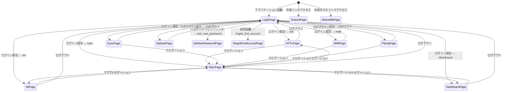
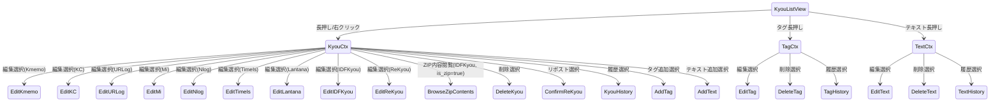
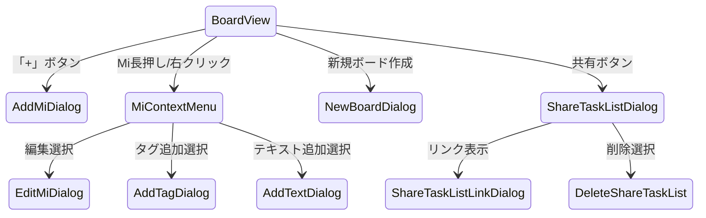
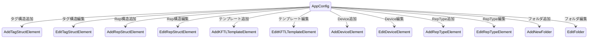
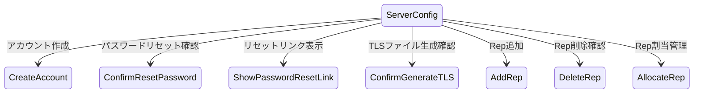
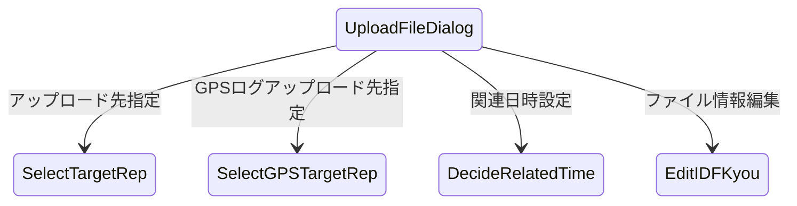

# gkill 画面遷移図（ステートマシン）

コードの `src/client/router/index.ts` と画面設計シートに基づく画面遷移。

## 1. 全体画面遷移

**メイン画面群（認証必要）:** KFTLPage, RykvPage, MiPage, KyouPage, MkflPage, PlaingPage, DashboardPage, SaihatePage

**共有ページ（認証不要）:** SharedPage (`/shared_page`), SharedMiPage (`/shared_mi`)

## 2. 各画面の役割と遷移条件

### ルートページ一覧（13ルート）

| パス | ページ | 認証要否 | 役割 |
|-----|-------|---------|------|
| `/` | LoginPage | 不要 | ログイン画面 |
| `/kftl` | KFTLPage | 要 | KFTL テキストベース記録 |
| `/mi` | MiPage | 要 | タスク管理（ボード形式） |
| `/rykv` | RykvPage | 要 | ライフログ閲覧・検索・編集 |
| `/kyou` | KyouPage | 要 | Kyou 記録一覧 |
| `/mkfl` | MkflPage | 要 | 打刻メモ帳（KFTL入力+TimeIs表示） |
| `/plaing` | PlaingPage | 要 | 稼働中 TimeIs 一覧 |
| `/dashboard` | DashboardPage | 要 | 日次サマリー（Dnote・GPS・MI一覧） |
| `/saihate` | SaihatePage | 要 | 記録特化画面（他画面への遷移なし） |
| `/set_new_password` | SetNewPasswordPage | 不要 | 新パスワード設定 |
| `/regist_first_account` | RegistFirstAccountPage | 不要 | 初回アカウント登録 |
| `/shared_page` | SharedPage | 不要 | 共有 Kyou 閲覧 |
| `/shared_mi` | SharedMiPage | 不要 | 共有タスク閲覧 |

### 2.2 画面グループ分類

画面は機能ごとに以下の4グループに分類される。

| グループ | 画面 | 共通目的 |
|---------|------|---------|
| **記録追加・入力系** | RykvPage（ライフログビュー）、KFTLPage、MkflPage | データの入力と追加。RykvはFABメニューから全データ型の追加が可能で最も汎用的。KFTLはテキスト構文入力、MkflはTimeIsとKFTL入力を同一画面で管理 |
| **閲覧・検索系** | RykvPage（タイムライン表示）、KyouPage、DashboardPage | 記録されたデータの時系列閲覧・検索・フィルタリング。RykvはタイムラインとDnote集計ビューを統合。Dashboardは日次サマリー（Dnote・GPS・Mi一覧） |
| **タスク管理系** | MiPage、PlaingPage | タスク（Mi）の管理。MiPageはカンバンボード形式でタスクを管理。PlaingPageは進行中のTimeIsセッションを一覧表示 |
| **特殊・補助系** | SaihatePage、LoginPage、SetNewPasswordPage、RegistFirstAccountPage、SharedPage、SharedMiPage | SaihatePageはナビゲーション不要の記録追加専用画面（ホーム画面ウィジェット等からの直接記録に使用）。認証フロー（ログイン・初回登録・パスワードリセット）と共有ページがこのグループに含まれる |

### 2.3 各画面の詳細説明

#### LoginPage（ログイン画面）`/`

ユーザーIDとパスワード（SHA256ハッシュ化）でログインする起点画面。パスワードリセットリンク経由でSetNewPasswordPageへ、初回起動時はRegistFirstAccountPageへ自動遷移する。ログイン成功後のリダイレクト先は最後にアクセスした画面（Vue Routerの履歴から復元）。

#### KFTLPage（KFTL入力画面）`/kftl`

KFTL構文によるテキストベースの記録入力画面。テンプレートから定型文を挿入でき、1送信で複数のデータ型（Kmemo・Mi・TimeIs等）を同時に作成できる。記録した内容の確認はRykvPageで行う。

#### MiPage（タスク画面）`/mi`

カンバンボード形式のタスク管理画面。複数のボード（`board_name`で分類）をタブ切り替えで管理する。タスクの追加・編集・完了チェック・ボード間移動・共有リンク発行が可能。フィルター（未完了/完了/全て）とソートで表示制御できる。

#### RykvPage（ライフログビュー）`/rykv`

gkillの中心的な閲覧・操作画面。左サイドバーで検索条件（日付範囲・タグ・リポジトリ・テキスト・データ型）を指定し、メインエリアにタイムライン・Dnote集計ビュー・GPS地図を切り替え表示する。FABボタンから全データ型の新規追加が可能。Kyouを長押し/右クリックするとコンテキストメニューから編集・削除・タグ追加・リポスト・履歴確認・ZIP閲覧などの操作ができる。

#### KyouPage（記録画面）`/kyou`

単一のKyouを詳細表示する画面。主にRykvPageや共有ページから特定の記録を深堀りする際に使用される。コンテキストメニューはRykvPageと共通。

#### MkflPage（打刻メモ帳）`/mkfl`

画面の上半分にKFTL入力エリア、下半分に進行中のTimeIs一覧を同時表示する複合画面。打刻の開始・終了操作とKFTLテキスト送信を行き来する場面に特化している。TimeIsの終了はKFTL構文（`/endt`等）での入力と画面上のボタン操作の両方で対応。

#### PlaingPage（実行中画面）`/plaing`

現在進行中（終了時刻未設定）のTimeIsセッションを一覧表示する画面。各セッションに終了ボタンを表示し、打刻の停止操作に特化する。TimeIsの詳細確認はRykvPageのコンテキストメニューから行う。

#### DashboardPage（ダッシュボード）`/dashboard`

選択した日付の記録を日次サマリーとして統合表示する画面。Dnote集計ビュー・GPS地図・Miタスク一覧を同一画面で確認できる。日付ナビゲーション（前日・次日ボタン）で1日単位の振り返りに使用する。

#### SaihatePage（さいはて画面）`/saihate`

他の画面へのナビゲーションバーを持たない記録追加専用画面。Android/iOSのホーム画面ウィジェットやロック画面からの直接起動を想定し、最低限のUIで素早くデータを追加するシナリオに対応する。記録後に確認する場合はRykvPageで行う。

#### SharedPage / SharedMiPage（共有ページ）`/shared_page` / `/shared_mi`

ログイン不要で閲覧できる公開ページ。`/api/add_share_kyou_list_info` で発行した共有リンク経由でアクセスする。SharedPageはKyouリストの読み取り専用表示、SharedMiPageはMiタスクリストの読み取り専用表示。

## 3. Rykv 画面のダイアログ遷移

**典型的な呼び出しシナリオ：** ユーザーがタイムライン上の記録を確認中に、内容を修正したい・タグを付けたい・削除したいと判断した場合に記録を長押し（モバイル）または右クリック（デスクトップ）してコンテキストメニューを呼び出す。また、FABボタンから新規記録を追加した後、タイムラインの最新エントリーに対してすぐに追加操作（タグ付与・テキスト注釈）を行うシナリオも典型的。

Rykv 画面は最も多くのダイアログを呼び出す中心的な画面。

**コンテキストメニュー:** KyouCtx（Kyou用）、TagCtx（タグ用）、TextCtx（テキスト用）

**編集ダイアログ:** データ型ごとに EditKmemo, EditKC, EditURLog, EditMi, EditNlog, EditTimeIs, EditLantana, EditIDFKyou, EditReKyou

**ZIP閲覧ダイアログ:** BrowseZipContents（IDFKyouの `is_zip=true` の場合にコンテキストメニューに表示）

**メタデータダイアログ:** AddTag, EditTag, DeleteTag, AddText, EditText, DeleteText

**履歴ダイアログ:** KyouHistory, TagHistory, TextHistory

## 4. Mi 画面のダイアログ遷移

**典型的な呼び出しシナリオ：** ユーザーがカンバンボード上のタスクを追加・編集するとき、またはタスクリストを他のユーザーやチームと共有したい場合に各ダイアログを呼び出す。新規ボードの作成は「+」ボタンから、既存タスクの操作はタスクカードの長押し/右クリックのコンテキストメニューから起動する。

**Mi操作ダイアログ:** AddMiDialog, EditMiDialog, NewBoardDialog

**共有機能:** ShareTaskListDialog → ShareTaskListLinkDialog, DeleteShareTaskList

## 5. 設定画面のダイアログ遷移

**典型的な呼び出しシナリオ：** AppConfigはナビゲーションバーの「設定」アイコンからアクセスする。KFTLテンプレートの追加・整理、タグの階層構造設定、リポジトリ（記録保管場所）の追加、RepType表示名のカスタマイズなど、アプリケーション初期設定や運用変更時に使用する。ServerConfigは管理者がアカウント管理・TLS設定・リポジトリ割当を行う際に使用し、ユーザーは通常アクセスしない。

**アプリケーション設定（AppConfig）:** TagStruct, RepStruct, KFTLTemplate, DeviceStruct, RepTypeStruct の各構造を編集

**サーバ設定（ServerConfig）:** アカウント管理、パスワードリセット、TLS生成、Rep管理

## 6. ファイルアップロードのダイアログ遷移

**典型的な呼び出しシナリオ：** RykvPageのFABボタンから「アップロード」を選択したとき、またはドラッグ&ドロップでファイルをブラウザにドロップしたときにUploadFileDialogが起動する。アップロード先リポジトリの選択（directory型リポジトリ一覧）→ 関連日時の調整 → ファイル情報の編集（タイトル等）の順で進む。GPSログ（GPXファイル）は専用のアップロード先選択（gpslog型リポジトリ）を経由する。

