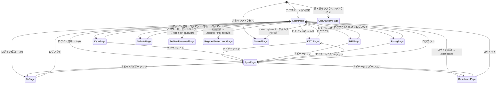
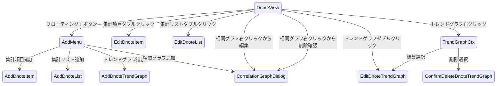
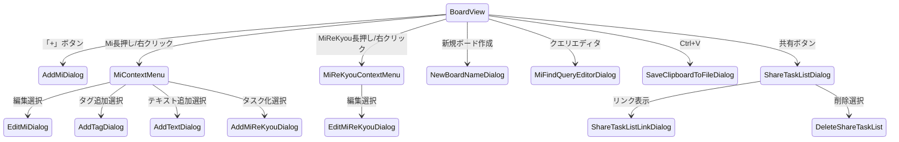
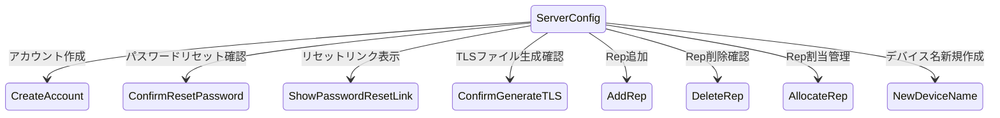
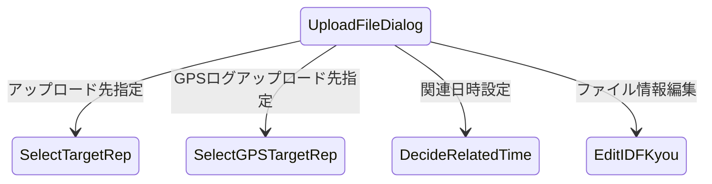

# gkill 画面遷移図（ステートマシン）

コードの `src/client/router/index.ts` と画面設計シートに基づく画面遷移。

## 1. 全体画面遷移


```mermaid
stateDiagram-v2
    [*] --> LoginPage: アプリケーション起動

    LoginPage --> KFTLPage: ログイン成功 → /kftl
    LoginPage --> RykvPage: ログイン成功 → /rykv
    LoginPage --> MiPage: ログイン成功 → /mi
    LoginPage --> KyouPage: ログイン成功 → /kyou
    LoginPage --> MkflPage: ログイン成功 → /mkfl
    LoginPage --> PlaingPage: ログイン成功 → /plaing
    LoginPage --> DashboardPage: ログイン成功 → /dashboard
    LoginPage --> SaihatePage: ログイン成功 → /saihate
    LoginPage --> SetNewPasswordPage: パスワードリセットリンク → /set_new_password
    LoginPage --> RegisterFirstAccountPage: 初回起動 → /register_first_account

    KFTLPage --> RykvPage: ナビゲーション
    RykvPage --> KFTLPage: ナビゲーション
    RykvPage --> MiPage: ナビゲーション
    MiPage --> RykvPage: ナビゲーション
    KyouPage --> RykvPage: ナビゲーション
    MkflPage --> RykvPage: ナビゲーション
    PlaingPage --> RykvPage: ナビゲーション
    DashboardPage --> RykvPage: ナビゲーション
    RykvPage --> DashboardPage: ナビゲーション

    KFTLPage --> LoginPage: ログアウト
    RykvPage --> LoginPage: ログアウト
    MiPage --> LoginPage: ログアウト
    KyouPage --> LoginPage: ログアウト
    MkflPage --> LoginPage: ログアウト
    PlaingPage --> LoginPage: ログアウト
    DashboardPage --> LoginPage: ログアウト
    SaihatePage --> LoginPage: ログアウト

    [*] --> SharedPage: 共有リンクアクセス
    [*] --> OldSharedMiPage: 旧・共有タスクリンクアクセス
    OldSharedMiPage --> SharedPage: router.replace（リダイレクトのみ）
```

**メイン画面群（認証必要）:** KFTLPage, RykvPage, MiPage, KyouPage, MkflPage, PlaingPage, DashboardPage, SaihatePage

**共有ページ（認証不要）:** SharedPage (`/shared_page`), OldSharedMiPage (`/shared_mi`)

## 2. 各画面の役割と遷移条件

### ルートページ一覧（13ルート）

| パス | ページ | 認証要否 | 役割 |
|-----|-------|---------|------|
| `/` | LoginPage | 不要 | ログイン画面 |
| `/kftl` | KFTLPage | 要 | KFTL テキストベース記録 |
| `/mi` | MiPage | 要 | タスク管理（ボード形式） |
| `/rykv` | RykvPage | 要 | ライフログ閲覧・検索・編集 |
| `/kyou` | KyouPage | 要 | 単一 Kyou の記録詳細表示 |
| `/mkfl` | MkflPage | 要 | 打刻メモ帳（KFTL入力+TimeIs表示） |
| `/plaing` | PlaingPage | 要 | 稼働中 TimeIs 一覧 |
| `/dashboard` | DashboardPage | 要 | 日次サマリー（Dnote・GPS・MI一覧） |
| `/saihate` | SaihatePage | 要 | 記録特化画面（他画面への遷移なし） |
| `/set_new_password` | SetNewPasswordPage | 不要 | 新パスワード設定 |
| `/register_first_account` | RegisterFirstAccountPage | 不要 | 初回アカウント登録（旧 `/regist_first_account` はリダイレクト） |
| `/shared_page` | SharedPage | 不要 | 共有 Kyou / タスク閲覧（`view_type` で内部振り分け） |
| `/shared_mi` | OldSharedMiPage | 不要 | 旧URL。`/shared_page?share_id=…` へリダイレクトするだけ |

### 2.2 画面グループ分類

画面は機能ごとに以下の4グループに分類される。

| グループ | 画面 | 共通目的 |
|---------|------|---------|
| **記録追加・入力系** | RykvPage（ライフログビュー）、KFTLPage、MkflPage | データの入力と追加。RykvはFABメニューから全データ型の追加が可能で最も汎用的。KFTLはテキスト構文入力、MkflはTimeIsとKFTL入力を同一画面で管理 |
| **閲覧・検索系** | RykvPage（タイムライン表示）、KyouPage、DashboardPage | 記録されたデータの時系列閲覧・検索・フィルタリング。RykvはタイムラインとDnote集計ビューを統合。Dashboardは日次サマリー（Dnote・GPS・Mi一覧） |
| **タスク管理系** | MiPage、PlaingPage | タスク（Mi）の管理。MiPageはカンバンボード形式でタスクを管理。PlaingPageは進行中のTimeIsセッションを一覧表示 |
| **特殊・補助系** | SaihatePage、LoginPage、SetNewPasswordPage、RegisterFirstAccountPage、SharedPage、OldSharedMiPage | SaihatePageはナビゲーション不要の記録追加専用画面（ホーム画面ウィジェット等からの直接記録に使用）。認証フロー（ログイン・初回登録・パスワードリセット）と共有ページがこのグループに含まれる |

### 2.3 各画面の詳細説明

#### LoginPage（ログイン画面）`/`

ユーザーIDとパスワード（SHA256ハッシュ化して送信、サーバ側はArgon2idで照合）でログインする起点画面。パスワードリセットリンク経由でSetNewPasswordPageへ、初回起動時はRegisterFirstAccountPageへ自動遷移する。ログイン成功後のリダイレクト先は最後にアクセスした画面（Vue Routerの履歴から復元）。

#### KFTLPage（KFTL入力画面）`/kftl`

KFTL構文によるテキストベースの記録入力画面。テンプレートから定型文を挿入でき、1送信で複数のデータ型（Kmemo・Mi・TimeIs等）を同時に作成できる。記録した内容の確認はRykvPageで行う。

#### MiPage（タスク画面）`/mi`

カンバンボード形式のタスク管理画面。複数のボード（`board_name`で分類）をタブ切り替えで管理する。タスクの追加・編集・完了チェック・ボード間移動・共有リンク発行が可能。フィルター（未完了/完了/全て）とソートで表示制御できる。

#### RykvPage（ライフログビュー）`/rykv`

gkillの中心的な閲覧・操作画面。左サイドバーで検索条件（日付範囲・タグ・リポジトリ・テキスト・データ型）を指定し、メインエリアにタイムライン・Dnote集計ビュー・GPS地図を切り替え表示する。FABボタンから全データ型の新規追加が可能。Kyouを長押し/右クリックするとコンテキストメニューから編集・削除・タグ追加・リポスト・履歴確認・ZIP閲覧などの操作ができる。

#### KyouPage（記録画面）`/kyou`

単一のKyouを詳細表示する画面。主にRykvPageや共有ページから特定の記録を深堀りする際に使用される。コンテキストメニューはRykvPageと共通。

#### MkflPage（打刻メモ帳）`/mkfl`

画面の上半分にKFTL入力エリア、下半分に進行中のTimeIs一覧を同時表示する複合画面。打刻の開始・終了操作とKFTLテキスト送信を行き来する場面に特化している。TimeIsの終了はKFTL構文（`/endt`等）での入力と画面上のボタン操作の両方で対応。

#### PlaingPage（実行中画面）`/plaing`

現在進行中（終了時刻未設定）のTimeIsセッションを一覧表示する画面。各セッションに終了ボタンを表示し、打刻の停止操作に特化する。TimeIsの詳細確認はRykvPageのコンテキストメニューから行う。

#### DashboardPage（ダッシュボード）`/dashboard`

選択した日付の記録を日次サマリーとして統合表示する画面。Dnote集計ビュー・GPS地図・Miタスク一覧を同一画面で確認できる。日付ナビゲーション（前日・次日ボタン）で1日単位の振り返りに使用する。

#### SaihatePage（さいはて画面）`/saihate`

他の画面へのナビゲーションバーを持たない記録追加専用画面。Android/iOSのホーム画面ウィジェットやロック画面からの直接起動を想定し、最低限のUIで素早くデータを追加するシナリオに対応する。記録後に確認する場合はRykvPageで行う。

#### SharedPage（共有ページ）`/shared_page`

ログイン不要で閲覧できる公開ページ。`/api/add_share_kyou_list_info` で発行した共有リンク経由でアクセスする。

`shared-page.vue` 自体は**ディスパッチャ**で、共有情報の `view_type` に応じて描画先を切り替える。

| `view_type` | 描画されるコンポーネント | 内容 |
|---|---|---|
| `mi` | `shared-mi-page.vue` | Miタスクリストの読み取り専用表示 |
| `rykv` | `shared-rykv-page.vue` | Kyouリストの読み取り専用表示 |

#### OldSharedMiPage（旧・共有タスクURL）`/shared_mi`

`old-shared-mi-page.vue` は**中身を描画しない**（テンプレートは空の `<div>`）。
マウント時に `reset_dialog_history()` を呼んでから `/shared_page?share_id=…` へ
`router.replace` するだけのリダイレクタ。過去に配布した共有リンクを生かすために残っている。

> サーバ側（`serve.go`）は `/shared_rykv` にも SPA を配信するが、
> `src/client/router/index.ts` に対応するルートが無いため、直接アクセスしても表示されない。

## 3. Rykv 画面のダイアログ遷移

**典型的な呼び出しシナリオ：** ユーザーがタイムライン上の記録を確認中に、内容を修正したい・タグを付けたい・削除したいと判断した場合に記録を長押し（モバイル）または右クリック（デスクトップ）してコンテキストメニューを呼び出す。また、FABボタンから新規記録を追加した後、タイムラインの最新エントリーに対してすぐに追加操作（タグ付与・テキスト注釈）を行うシナリオも典型的。

Rykv 画面は最も多くのダイアログを呼び出す中心的な画面。


```mermaid
stateDiagram-v2
    KyouListView --> KyouCtx: 長押し/右クリック
    KyouListView --> TagCtx: タグ長押し
    KyouListView --> TextCtx: テキスト長押し

    KyouCtx --> EditKmemo: 編集選択(Kmemo)
    KyouCtx --> EditKC: 編集選択(KC)
    KyouCtx --> EditURLog: 編集選択(URLog)
    KyouCtx --> EditMi: 編集選択(Mi)
    KyouCtx --> EditNlog: 編集選択(Nlog)
    KyouCtx --> EditTimeIs: 編集選択(TimeIs)
    KyouCtx --> EditLantana: 編集選択(Lantana)
    KyouCtx --> EditIDFKyou: 編集選択(IDFKyou)
    KyouCtx --> EditReKyou: 編集選択(ReKyou)
    KyouCtx --> EditMiReKyou: 編集選択(MiReKyou)
    KyouCtx --> BrowseZipContents: ZIP内容閲覧(IDFKyou, is_zip=true)
    KyouCtx --> DeleteKyou: 削除選択
    KyouCtx --> ConfirmReKyou: リポスト選択
    KyouCtx --> AddMiReKyou: タスク化選択
    KyouCtx --> KyouHistory: 履歴選択
    KyouCtx --> AddTag: タグ追加選択
    KyouCtx --> AddText: テキスト追加選択
    KyouCtx --> AddNotification: 通知追加選択
    KyouCtx --> CopyContent: 内容コピー選択
    KyouCtx --> CopyId: IDコピー選択
    KyouCtx --> OpenFolder: フォルダを開く(session_is_local)
    KyouCtx --> OpenFile: ファイルを開く(session_is_local)

    TagCtx --> EditTag: 編集選択
    TagCtx --> DeleteTag: 削除選択
    TagCtx --> TagHistory: 履歴選択

    TextCtx --> EditText: 編集選択
    TextCtx --> DeleteText: 削除選択
    TextCtx --> TextHistory: 履歴選択

    NotifCtx --> EditNotification: 編集選択
    NotifCtx --> DeleteNotification: 削除選択
    NotifCtx --> NotificationHistory: 履歴選択

    PluginCtx --> AddTag: タグ追加選択
    PluginCtx --> CopyContent: 内容コピー選択
```

**コンテキストメニュー:** KyouCtx（Kyou用）、TagCtx（タグ用）、TextCtx（テキスト用）、NotifCtx（通知用）、PluginCtx（プラグインKyou用、`plugin-html-context-menu.vue`）

**編集ダイアログ:** データ型ごとに EditKmemo, EditKC, EditURLog, EditMi, EditNlog, EditTimeIs, EditLantana, EditIDFKyou, EditReKyou, EditMiReKyou

**ZIP閲覧ダイアログ:** BrowseZipContents（IDFKyouの `is_zip=true` の場合にコンテキストメニューに表示）

**メタデータダイアログ:** AddTag, EditTag, DeleteTag, AddText, EditText, DeleteText, AddNotification, EditNotification, DeleteNotification

**履歴ダイアログ:** KyouHistory, TagHistory, TextHistory, NotificationHistory

**クリップボード操作:** CopyContent（内容コピー）, CopyId（IDコピー）はダイアログを開かず、その場でクリップボードに書き込む

**タグ履歴クイック追加:** KyouCtx は直近使用したタグをサブメニューに列挙し、ダイアログを開かずに付与できる

### Rykv のダイアログホスト

上記のダイアログは各コンポーネントが個別に配置しているのではなく、
`rykv-dialog-host.vue` / `rykv-dialog-host-item.vue` が一括でホストする。
開けるダイアログ種別は `rykv-dialog-kind.ts` の `RykvDialogKind` に**28種**が定義されている。

```
'kyou' | 'edit_kmemo' | 'edit_kc' | 'edit_mi' | 'edit_nlog' | 'edit_lantana'
| 'edit_timeis' | 'edit_urlog' | 'edit_idf_kyou' | 'edit_re_kyou'
| 'add_mi_re_kyou' | 'edit_mi_re_kyou' | 'add_tag' | 'add_text' | 'add_notification'
| 'confirm_delete_kyou' | 'confirm_re_kyou' | 'kyou_histories'
| 'edit_tag' | 'confirm_delete_tag' | 'tag_histories'
| 'edit_text' | 'confirm_delete_text' | 'text_histories'
| 'edit_notification' | 'confirm_delete_notification' | 'notification_histories'
| 'browse_zip_contents'
```

### 集計ビュー（DnoteView）のダイアログ遷移

Rykv 画面・ダッシュボード画面に埋め込まれる集計ビューのダイアログ遷移。フローティング「＋」メニューから集計項目・集計リスト・トレンドグラフ・相関グラフの4種類の集計要素を追加できる。


```mermaid
stateDiagram-v2
    DnoteView --> AddMenu: フローティング＋ボタン
    AddMenu --> AddDnoteItem: 集計項目追加
    AddMenu --> AddDnoteList: 集計リスト追加
    AddMenu --> AddDnoteTrendGraph: トレンドグラフ追加
    AddMenu --> CorrelationGraphDialog: 相関グラフ追加

    DnoteView --> EditDnoteItem: 集計項目ダブルクリック
    DnoteView --> EditDnoteList: 集計リストダブルクリック
    DnoteView --> EditDnoteTrendGraph: トレンドグラフダブルクリック
    DnoteView --> CorrelationGraphDialog: 相関グラフ右クリックから編集

    DnoteView --> TrendGraphCtx: トレンドグラフ右クリック
    TrendGraphCtx --> EditDnoteTrendGraph: 編集選択
    TrendGraphCtx --> ConfirmDeleteDnoteTrendGraph: 削除選択
    DnoteView --> CorrelationGraphDialog: 相関グラフ右クリックから削除確認
```

**追加ダイアログ:** AddDnoteItem（`add-dnote-item-dialog.vue`）, AddDnoteList（`add-dnote-list-dialog.vue`）, AddDnoteTrendGraph（`add-dnote-trend-graph-dialog.vue`）, CorrelationGraphDialog（`dnote-correlation-graph-dialog.vue`）

**編集ダイアログ:** EditDnoteItem, EditDnoteList, EditDnoteTrendGraph（`edit-dnote-trend-graph-dialog.vue`）

**削除確認ダイアログ:** ConfirmDeleteDnoteItemList, ConfirmDeleteDnoteListQuery, ConfirmDeleteDnoteTrendGraph（`confirm-delete-dnote-trend-graph-dialog.vue`）

トレンドグラフと相関グラフはドラッグ&ドロップで並べ替え可能（ダイアログ遷移なし）。相関グラフは小さなダイアログファイルを増やさないため、追加・編集・削除確認を1つのダイアログのモードで処理する。

## 4. Mi 画面のダイアログ遷移

**典型的な呼び出しシナリオ：** ユーザーがカンバンボード上のタスクを追加・編集するとき、またはタスクリストを他のユーザーやチームと共有したい場合に各ダイアログを呼び出す。新規ボードの作成は「+」ボタンから、既存タスクの操作はタスクカードの長押し/右クリックのコンテキストメニューから起動する。


```mermaid
stateDiagram-v2
    BoardView --> AddMiDialog: 「+」ボタン
    BoardView --> MiContextMenu: Mi長押し/右クリック
    BoardView --> MiReKyouContextMenu: MiReKyou長押し/右クリック
    BoardView --> NewBoardNameDialog: 新規ボード作成
    BoardView --> MiFindQueryEditorDialog: クエリエディタ
    BoardView --> SaveClipboardToFileDialog: Ctrl+V

    MiContextMenu --> EditMiDialog: 編集選択
    MiContextMenu --> AddTagDialog: タグ追加選択
    MiContextMenu --> AddTextDialog: テキスト追加選択
    MiContextMenu --> AddMiReKyouDialog: タスク化選択

    MiReKyouContextMenu --> EditMiReKyouDialog: 編集選択

    BoardView --> ShareTaskListDialog: 共有ボタン
    ShareTaskListDialog --> ShareTaskListLinkDialog: リンク表示
    ShareTaskListDialog --> DeleteShareTaskList: 削除選択
```

**Mi操作ダイアログ:** AddMiDialog, EditMiDialog, NewBoardNameDialog（`new-board-name-dialog.vue`）, MiFindQueryEditorDialog

**MiReKyou:** AddMiReKyouDialog, EditMiReKyouDialog, MiReKyouContextMenu

**共有機能:** ShareTaskListDialog → ShareTaskListLinkDialog, DeleteShareTaskList

**その他:** `mi-kyou-count-calendar.vue`（記録件数カレンダー）、
`save-clipboard-to-file-dialog.vue`（Ctrl+V でクリップボード内容をファイル保存。
rykv / mi / plaing / dashboard で有効。`classes/use-scoped-ctrl-v-for-clipboard.ts`）

## 5. 設定画面のダイアログ遷移

**典型的な呼び出しシナリオ：** AppConfigはナビゲーションバーの「設定」アイコンからアクセスする。KFTLテンプレートの追加・整理、タグの階層構造設定、リポジトリ（記録保管場所）の追加、RepType表示名のカスタマイズなど、アプリケーション初期設定や運用変更時に使用する。ServerConfigは管理者がアカウント管理・TLS設定・リポジトリ割当を行う際に使用し、ユーザーは通常アクセスしない。


```mermaid
stateDiagram-v2
    AppConfig --> AddTagStructElement: タグ構造追加
    AppConfig --> EditTagStructElement: タグ構造編集
    AppConfig --> AddRepStructElement: Rep構造追加
    AppConfig --> EditRepStructElement: Rep構造編集
    AppConfig --> AddKFTLTemplateElement: テンプレート追加
    AppConfig --> EditKFTLTemplateElement: テンプレート編集
    AppConfig --> AddDeviceElement: Device追加
    AppConfig --> EditDeviceElement: Device編集
    AppConfig --> AddRepTypeElement: RepType追加
    AppConfig --> EditRepTypeElement: RepType編集
    AppConfig --> AddNewFolder: フォルダ追加
    AppConfig --> EditFolder: フォルダ編集
    AppConfig --> EditDnote: Dnote設定編集
    AppConfig --> EditRyuu: Ryuu設定編集
    AppConfig --> EditDashboard: ダッシュボード設定編集
    AppConfig --> EditSavedFindQuery: 保存済み検索条件編集
    EditSavedFindQuery --> EditSavedFindQueryList: ライフログ/タスク別一覧管理
    AppConfig --> NewBoardName: ボード名新規作成
    AppConfig --> ServerConfig: サーバ設定へ
```

**アプリケーション設定（AppConfig）:** TagStruct, RepStruct, KFTLTemplate, DeviceStruct, RepTypeStruct の各構造を編集


```mermaid
stateDiagram-v2
    ServerConfig --> CreateAccount: アカウント作成
    ServerConfig --> ConfirmResetPassword: パスワードリセット確認
    ServerConfig --> ShowPasswordResetLink: リセットリンク表示
    ServerConfig --> ConfirmGenerateTLS: TLSファイル生成確認
    ServerConfig --> AddRep: Rep追加
    ServerConfig --> DeleteRep: Rep削除確認
    ServerConfig --> AllocateRep: Rep割当管理
    ServerConfig --> NewDeviceName: デバイス名新規作成
```

**サーバ設定（ServerConfig）:** アカウント管理、パスワードリセット、TLS生成、Rep管理、デバイス名作成（`new-device-name-dialog.vue`）

## 6. ファイルアップロードのダイアログ遷移

**典型的な呼び出しシナリオ：** RykvPageのFABボタンから「アップロード」を選択したとき、またはドラッグ&ドロップでファイルをブラウザにドロップしたときにUploadFileDialogが起動する。アップロード先リポジトリの選択（directory型リポジトリ一覧）→ 関連日時の調整 → ファイル情報の編集（タイトル等）の順で進む。GPSログ（GPXファイル）は専用のアップロード先選択（gpslog型リポジトリ）を経由する。


```mermaid
stateDiagram-v2
    UploadFileDialog --> SelectTargetRep: アップロード先指定
    UploadFileDialog --> SelectGPSTargetRep: GPSログアップロード先指定
    UploadFileDialog --> DecideRelatedTime: 関連日時設定
    UploadFileDialog --> EditIDFKyou: ファイル情報編集
```

## 7. その他の共通ダイアログ

| ダイアログ | 起動元 | 説明 |
|---|---|---|
| `help-dialog.vue` | 各ページのツールバー | ヘルプ表示 |
| `tutorial-dialog.vue` | 各ページのツールバー | チュートリアル表示 |
| `save-clipboard-to-file-dialog.vue` | Ctrl+V（rykv / mi / plaing / dashboard） | クリップボードの内容をファイルとして保存 |
| `plugin-config-dialog.vue` | `plugin-html-view.vue` | プラグイン設定。プラグイン Kyou のコンテキストメニュー「プラグイン設定」から開く |

### KFTL の未知タグ確認

KFTL 送信時とタグ追加時に、既存タグに無いタグが含まれていると確認を求める。
この確認は `Teleport` によるインライン描画で、対応する `*-dialog.vue` ファイルは存在しない
（`classes/use-kftl-view.ts`、`classes/use-add-tag-view.ts`）。

### プログラムからダイアログを閉じる

ダイアログの開閉はブラウザ履歴と連動している（[frontend-architecture.md](frontend-architecture.md) 参照）。
プログラムから閉じるときは `show.value = false` を直接書かず、
必ず `close_dialog_via_history()` を使うこと。直接書くと履歴スタックとずれる。
