# gkill シーケンス図

コードの API ハンドラ実装（`gkill_server_api.go`）から抽出した主要フローのシーケンス図。

## 1. ログイン

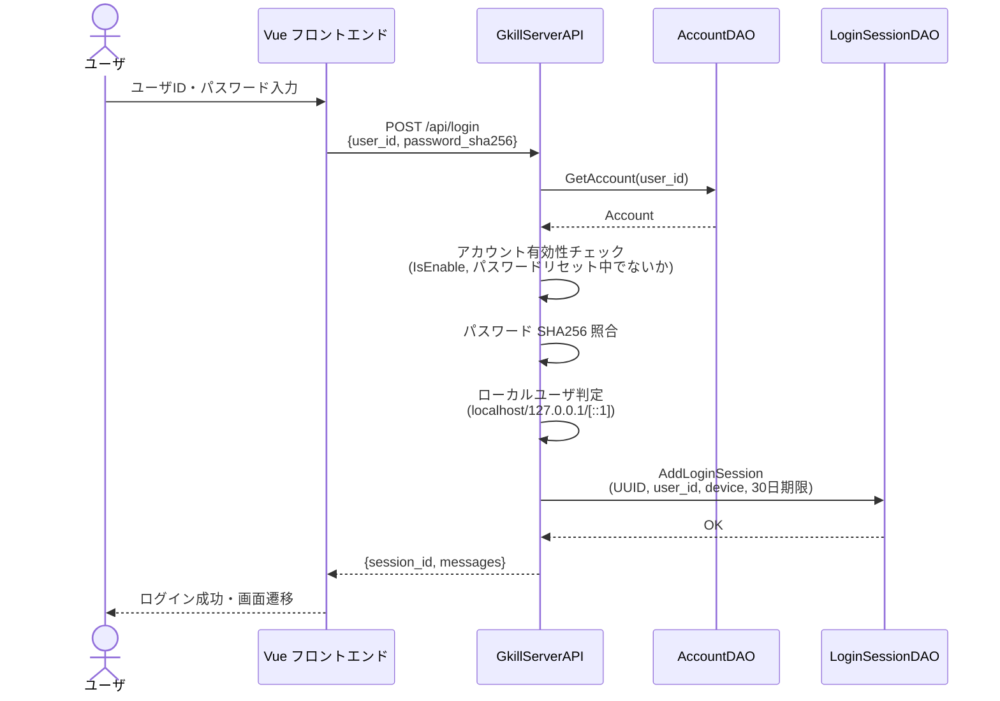
```mermaid
sequenceDiagram
    actor User as ユーザ
    participant UI as Vue フロントエンド
    participant API as GkillServerAPI
    participant AccDAO as AccountDAO
    participant SesDAO as LoginSessionDAO

    User->>UI: ユーザID・パスワード入力
    UI->>API: POST /api/login<br>{user_id, password_sha256}
    API->>AccDAO: GetAccount(user_id)
    AccDAO-->>API: Account
    API->>API: アカウント有効性チェック<br>(IsEnable, パスワードリセット中でないか)
    API->>API: パスワード SHA256 照合
    API->>API: ローカルユーザ判定<br>(localhost/127.0.0.1/[::1])
    API->>SesDAO: AddLoginSession<br>(UUID, user_id, device, 30日期限)
    SesDAO-->>API: OK
    API-->>UI: {session_id, messages}
    UI-->>User: ログイン成功・画面遷移
```

## 2. ログアウト

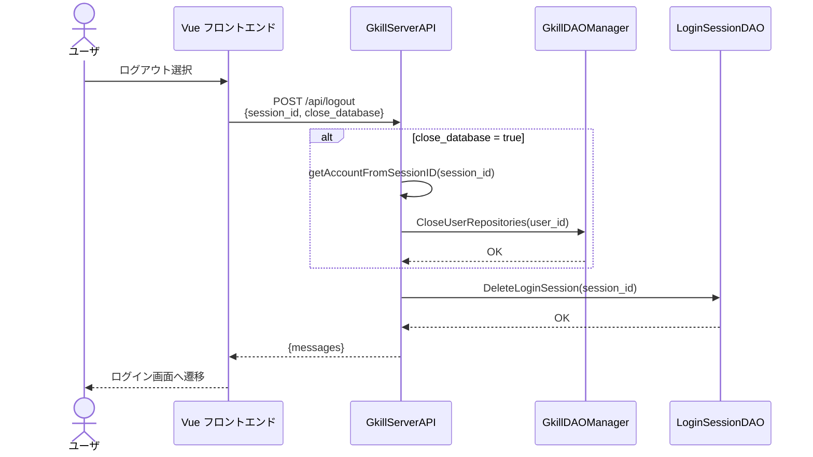
```mermaid
sequenceDiagram
    actor User as ユーザ
    participant UI as Vue フロントエンド
    participant API as GkillServerAPI
    participant DAOMgr as GkillDAOManager
    participant SesDAO as LoginSessionDAO

    User->>UI: ログアウト選択
    UI->>API: POST /api/logout<br>{session_id, close_database}
    alt close_database = true
        API->>API: getAccountFromSessionID(session_id)
        API->>DAOMgr: CloseUserRepositories(user_id)
        DAOMgr-->>API: OK
    end
    API->>SesDAO: DeleteLoginSession(session_id)
    SesDAO-->>API: OK
    API-->>UI: {messages}
    UI-->>User: ログイン画面へ遷移
```

## 3. Kyou データ追加（例: Kmemo）

全データ型（KC, Lantana, Mi, Nlog, URLog, TimeIs, ReKyou）も同様のフロー。

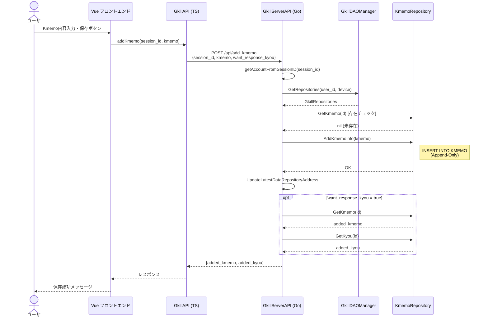
```mermaid
sequenceDiagram
    actor User as ユーザ
    participant UI as Vue フロントエンド
    participant GkillAPI as GkillAPI (TS)
    participant API as GkillServerAPI (Go)
    participant DAOMgr as GkillDAOManager
    participant KmemoRep as KmemoRepository

    User->>UI: Kmemo内容入力・保存ボタン
    UI->>GkillAPI: addKmemo(session_id, kmemo)
    GkillAPI->>API: POST /api/add_kmemo<br>{session_id, kmemo, want_response_kyou}
    API->>API: getAccountFromSessionID(session_id)
    API->>DAOMgr: GetRepositories(user_id, device)
    DAOMgr-->>API: GkillRepositories
    API->>KmemoRep: GetKmemo(id) [存在チェック]
    KmemoRep-->>API: nil (未存在)
    API->>KmemoRep: AddKmemoInfo(kmemo)
    Note right of KmemoRep: INSERT INTO KMEMO<br>(Append-Only)
    KmemoRep-->>API: OK
    API->>API: UpdateLatestDataRepositoryAddress
    opt want_response_kyou = true
        API->>KmemoRep: GetKmemo(id)
        KmemoRep-->>API: added_kmemo
        API->>KmemoRep: GetKyou(id)
        KmemoRep-->>API: added_kyou
    end
    API-->>GkillAPI: {added_kmemo, added_kyou}
    GkillAPI-->>UI: レスポンス
    UI-->>User: 保存成功メッセージ
```

## 4. Kyou データ更新（例: Kmemo）

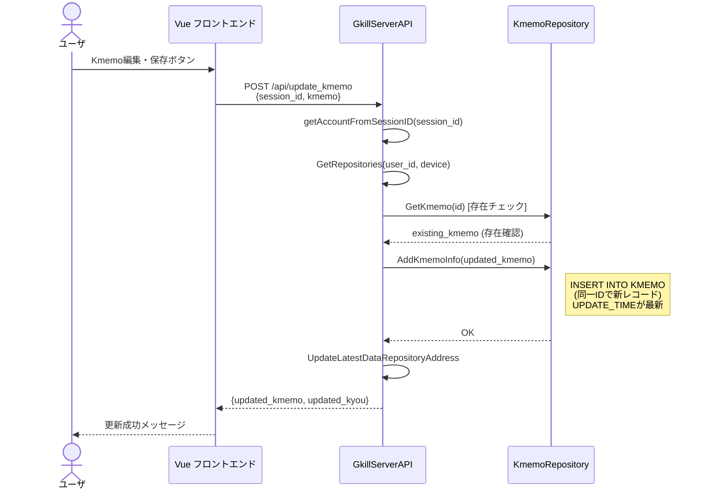
```mermaid
sequenceDiagram
    actor User as ユーザ
    participant UI as Vue フロントエンド
    participant API as GkillServerAPI
    participant KmemoRep as KmemoRepository

    User->>UI: Kmemo編集・保存ボタン
    UI->>API: POST /api/update_kmemo<br>{session_id, kmemo}
    API->>API: getAccountFromSessionID(session_id)
    API->>API: GetRepositories(user_id, device)
    API->>KmemoRep: GetKmemo(id) [存在チェック]
    KmemoRep-->>API: existing_kmemo (存在確認)
    API->>KmemoRep: AddKmemoInfo(updated_kmemo)
    Note right of KmemoRep: INSERT INTO KMEMO<br>(同一IDで新レコード)<br>UPDATE_TIMEが最新
    KmemoRep-->>API: OK
    API->>API: UpdateLatestDataRepositoryAddress
    API-->>UI: {updated_kmemo, updated_kyou}
    UI-->>User: 更新成功メッセージ
```

## 5. Kyou データ削除（論理削除）

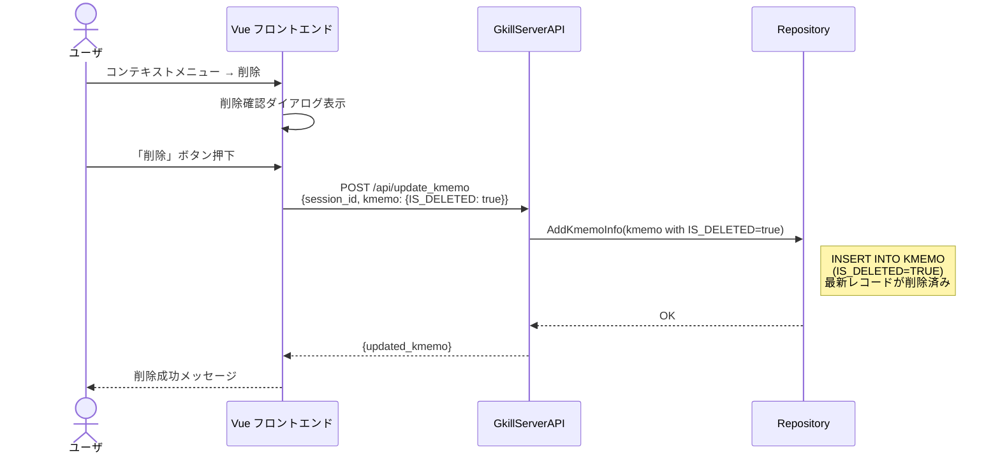
```mermaid
sequenceDiagram
    actor User as ユーザ
    participant UI as Vue フロントエンド
    participant API as GkillServerAPI
    participant Rep as Repository

    User->>UI: コンテキストメニュー → 削除
    UI->>UI: 削除確認ダイアログ表示
    User->>UI: 「削除」ボタン押下
    UI->>API: POST /api/update_kmemo<br>{session_id, kmemo: {IS_DELETED: true}}
    API->>Rep: AddKmemoInfo(kmemo with IS_DELETED=true)
    Note right of Rep: INSERT INTO KMEMO<br>(IS_DELETED=TRUE)<br>最新レコードが削除済み
    Rep-->>API: OK
    API-->>UI: {updated_kmemo}
    UI-->>User: 削除成功メッセージ
```

## 6. Kyou 検索（GetKyous）

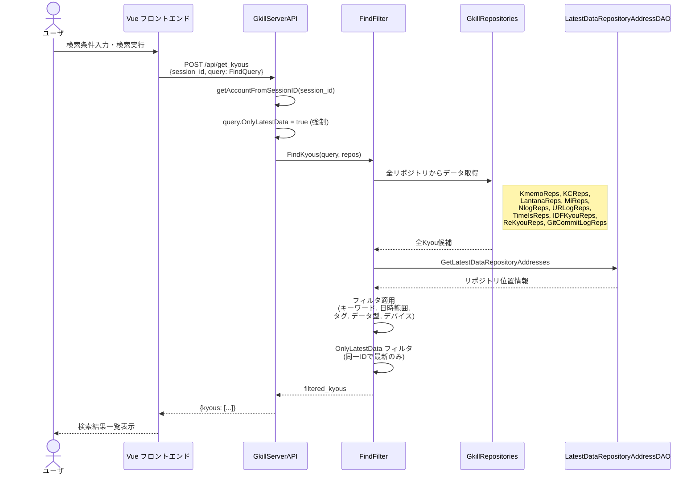
```mermaid
sequenceDiagram
    actor User as ユーザ
    participant UI as Vue フロントエンド
    participant API as GkillServerAPI
    participant Filter as FindFilter
    participant Repos as GkillRepositories
    participant Cache as LatestDataRepositoryAddressDAO

    User->>UI: 検索条件入力・検索実行
    UI->>API: POST /api/get_kyous<br>{session_id, query: FindQuery}
    API->>API: getAccountFromSessionID(session_id)
    API->>API: query.OnlyLatestData = true (強制)
    API->>Filter: FindKyous(query, repos)
    Filter->>Repos: 全リポジトリからデータ取得
    Note right of Repos: KmemoReps, KCReps,<br>LantanaReps, MiReps,<br>NlogReps, URLogReps,<br>TimeIsReps, IDFKyouReps,<br>ReKyouReps, GitCommitLogReps
    Repos-->>Filter: 全Kyou候補
    Filter->>Cache: GetLatestDataRepositoryAddresses
    Cache-->>Filter: リポジトリ位置情報
    Filter->>Filter: フィルタ適用<br>(キーワード, 日時範囲,<br>タグ, データ型, デバイス)
    Filter->>Filter: OnlyLatestData フィルタ<br>(同一IDで最新のみ)
    Filter-->>API: filtered_kyous
    API-->>UI: {kyous: [...]}
    UI-->>User: 検索結果一覧表示
```

## 7. KFTL テキスト送信・パース・保存

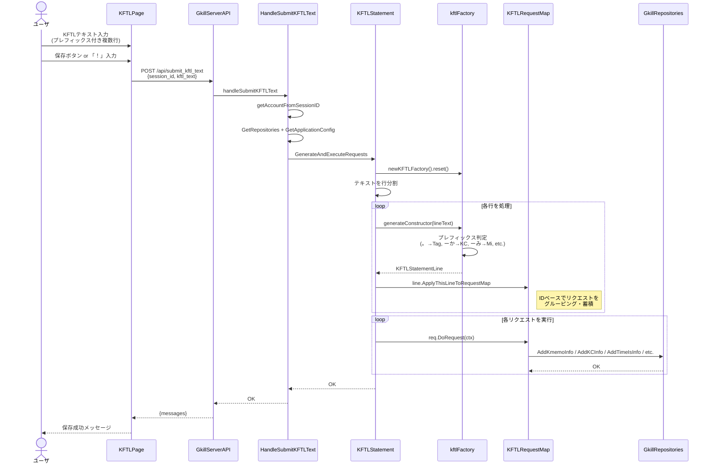
```mermaid
sequenceDiagram
    actor User as ユーザ
    participant UI as KFTLPage
    participant API as GkillServerAPI
    participant Handler as HandleSubmitKFTLText
    participant Stmt as KFTLStatement
    participant Factory as kftlFactory
    participant ReqMap as KFTLRequestMap
    participant Repos as GkillRepositories

    User->>UI: KFTLテキスト入力<br>(プレフィックス付き複数行)
    User->>UI: 保存ボタン or 「！」入力
    UI->>API: POST /api/submit_kftl_text<br>{session_id, kftl_text}
    API->>Handler: handleSubmitKFTLText
    Handler->>Handler: getAccountFromSessionID
    Handler->>Handler: GetRepositories + GetApplicationConfig
    Handler->>Stmt: GenerateAndExecuteRequests
    Stmt->>Factory: newKFTLFactory().reset()
    Stmt->>Stmt: テキストを行分割
    loop 各行を処理
        Stmt->>Factory: generateConstructor(lineText)
        Factory->>Factory: プレフィックス判定<br>(。→Tag, ーか→KC, ーみ→Mi, etc.)
        Factory-->>Stmt: KFTLStatementLine
        Stmt->>ReqMap: line.ApplyThisLineToRequestMap
        Note right of ReqMap: IDベースでリクエストを<br>グルーピング・蓄積
    end
    loop 各リクエストを実行
        Stmt->>ReqMap: req.DoRequest(ctx)
        ReqMap->>Repos: AddKmemoInfo / AddKCInfo / AddTimeIsInfo / etc.
        Repos-->>ReqMap: OK
    end
    Stmt-->>Handler: OK
    Handler-->>API: OK
    API-->>UI: {messages}
    UI-->>User: 保存成功メッセージ
```

## 8. ファイルアップロード

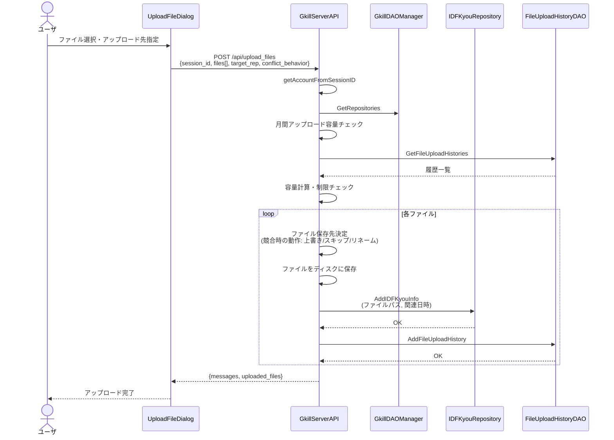
```mermaid
sequenceDiagram
    actor User as ユーザ
    participant UI as UploadFileDialog
    participant API as GkillServerAPI
    participant DAOMgr as GkillDAOManager
    participant IDFRep as IDFKyouRepository
    participant FUH as FileUploadHistoryDAO

    User->>UI: ファイル選択・アップロード先指定
    UI->>API: POST /api/upload_files<br>{session_id, files[], target_rep, conflict_behavior}
    API->>API: getAccountFromSessionID
    API->>DAOMgr: GetRepositories
    API->>API: 月間アップロード容量チェック
    API->>FUH: GetFileUploadHistories
    FUH-->>API: 履歴一覧
    API->>API: 容量計算・制限チェック
    loop 各ファイル
        API->>API: ファイル保存先決定<br>(競合時の動作: 上書き/スキップ/リネーム)
        API->>API: ファイルをディスクに保存
        API->>IDFRep: AddIDFKyouInfo<br>(ファイルパス, 関連日時)
        IDFRep-->>API: OK
        API->>FUH: AddFileUploadHistory
        FUH-->>API: OK
    end
    API-->>UI: {messages, uploaded_files}
    UI-->>User: アップロード完了
```

## 9. Tag / Text / Notification の追加

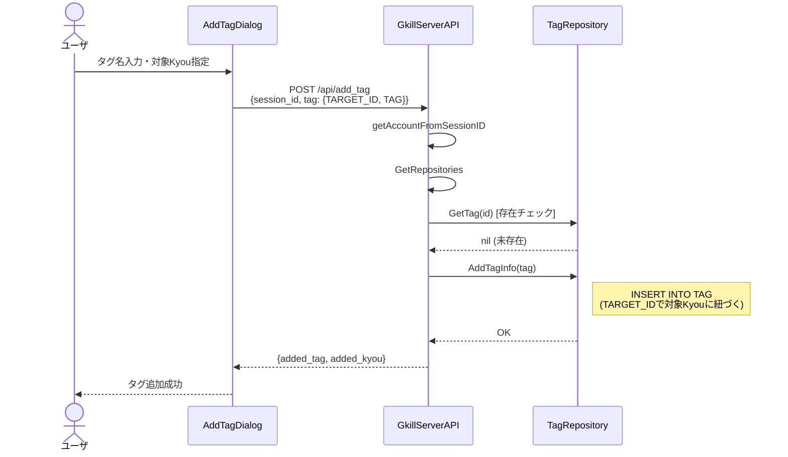
```mermaid
sequenceDiagram
    actor User as ユーザ
    participant UI as AddTagDialog
    participant API as GkillServerAPI
    participant TagRep as TagRepository

    User->>UI: タグ名入力・対象Kyou指定
    UI->>API: POST /api/add_tag<br>{session_id, tag: {TARGET_ID, TAG}}
    API->>API: getAccountFromSessionID
    API->>API: GetRepositories
    API->>TagRep: GetTag(id) [存在チェック]
    TagRep-->>API: nil (未存在)
    API->>TagRep: AddTagInfo(tag)
    Note right of TagRep: INSERT INTO TAG<br>(TARGET_IDで対象Kyouに紐づく)
    TagRep-->>API: OK
    API-->>UI: {added_tag, added_kyou}
    UI-->>User: タグ追加成功
```

## 10. TimeIs 開始・終了

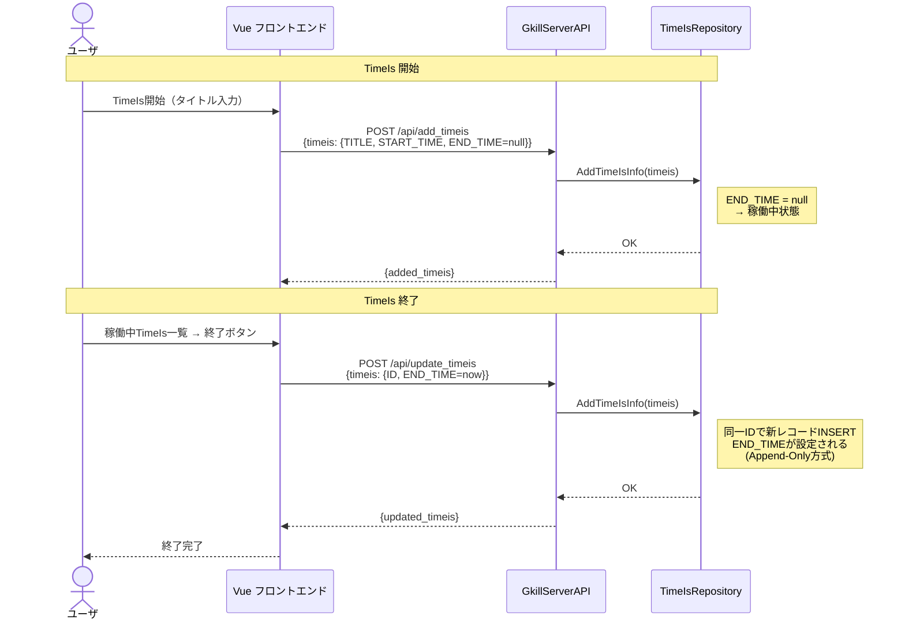
```mermaid
sequenceDiagram
    actor User as ユーザ
    participant UI as Vue フロントエンド
    participant API as GkillServerAPI
    participant TimeIsRep as TimeIsRepository

    Note over User,TimeIsRep: TimeIs 開始
    User->>UI: TimeIs開始（タイトル入力）
    UI->>API: POST /api/add_timeis<br>{timeis: {TITLE, START_TIME, END_TIME=null}}
    API->>TimeIsRep: AddTimeIsInfo(timeis)
    Note right of TimeIsRep: END_TIME = null<br>→ 稼働中状態
    TimeIsRep-->>API: OK
    API-->>UI: {added_timeis}

    Note over User,TimeIsRep: TimeIs 終了
    User->>UI: 稼働中TimeIs一覧 → 終了ボタン
    UI->>API: POST /api/update_timeis<br>{timeis: {ID, END_TIME=now}}
    API->>TimeIsRep: AddTimeIsInfo(timeis)
    Note right of TimeIsRep: 同一IDで新レコードINSERT<br>END_TIMEが設定される<br>(Append-Only方式)
    TimeIsRep-->>API: OK
    API-->>UI: {updated_timeis}
    UI-->>User: 終了完了
```

## 11. アプリケーション設定取得・更新

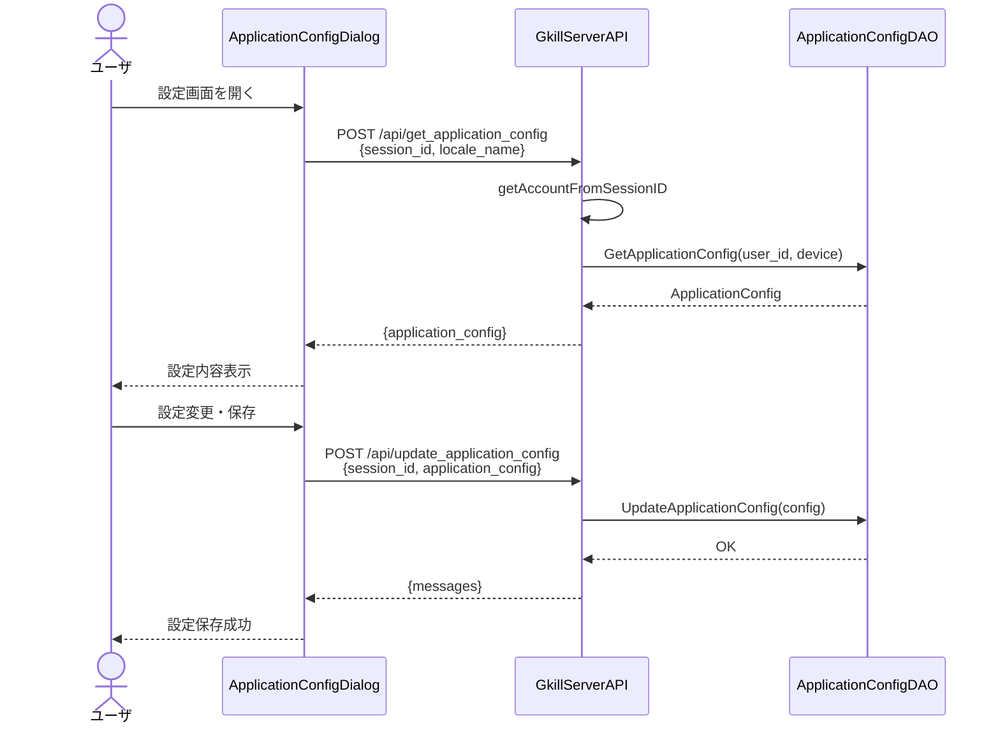
```mermaid
sequenceDiagram
    actor User as ユーザ
    participant UI as ApplicationConfigDialog
    participant API as GkillServerAPI
    participant AppConfigDAO as ApplicationConfigDAO

    User->>UI: 設定画面を開く
    UI->>API: POST /api/get_application_config<br>{session_id, locale_name}
    API->>API: getAccountFromSessionID
    API->>AppConfigDAO: GetApplicationConfig(user_id, device)
    AppConfigDAO-->>API: ApplicationConfig
    API-->>UI: {application_config}
    UI-->>User: 設定内容表示

    User->>UI: 設定変更・保存
    UI->>API: POST /api/update_application_config<br>{session_id, application_config}
    API->>AppConfigDAO: UpdateApplicationConfig(config)
    AppConfigDAO-->>API: OK
    API-->>UI: {messages}
    UI-->>User: 設定保存成功
```

## 12. 共有（ShareKyouListInfo）

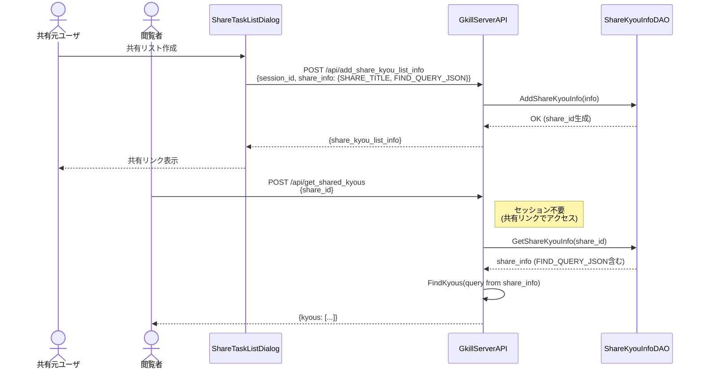
```mermaid
sequenceDiagram
    actor Owner as 共有元ユーザ
    actor Viewer as 閲覧者
    participant UI as ShareTaskListDialog
    participant API as GkillServerAPI
    participant ShareDAO as ShareKyouInfoDAO

    Owner->>UI: 共有リスト作成
    UI->>API: POST /api/add_share_kyou_list_info<br>{session_id, share_info: {SHARE_TITLE, FIND_QUERY_JSON}}
    API->>ShareDAO: AddShareKyouInfo(info)
    ShareDAO-->>API: OK (share_id生成)
    API-->>UI: {share_kyou_list_info}
    UI-->>Owner: 共有リンク表示

    Viewer->>API: POST /api/get_shared_kyous<br>{share_id}
    Note right of API: セッション不要<br>(共有リンクでアクセス)
    API->>ShareDAO: GetShareKyouInfo(share_id)
    ShareDAO-->>API: share_info (FIND_QUERY_JSON含む)
    API->>API: FindKyous(query from share_info)
    API-->>Viewer: {kyous: [...]}
```

## 13. Web Push 通知登録

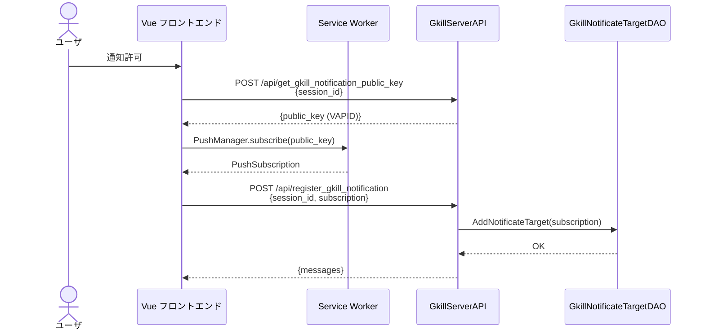
```mermaid
sequenceDiagram
    actor User as ユーザ
    participant UI as Vue フロントエンド
    participant SW as Service Worker
    participant API as GkillServerAPI
    participant NotifDAO as GkillNotificateTargetDAO

    User->>UI: 通知許可
    UI->>API: POST /api/get_gkill_notification_public_key<br>{session_id}
    API-->>UI: {public_key (VAPID)}
    UI->>SW: PushManager.subscribe(public_key)
    SW-->>UI: PushSubscription
    UI->>API: POST /api/register_gkill_notification<br>{session_id, subscription}
    API->>NotifDAO: AddNotificateTarget(subscription)
    NotifDAO-->>API: OK
    API-->>UI: {messages}
```

## 14. Wear OS テンプレート取得・KFTL 送信

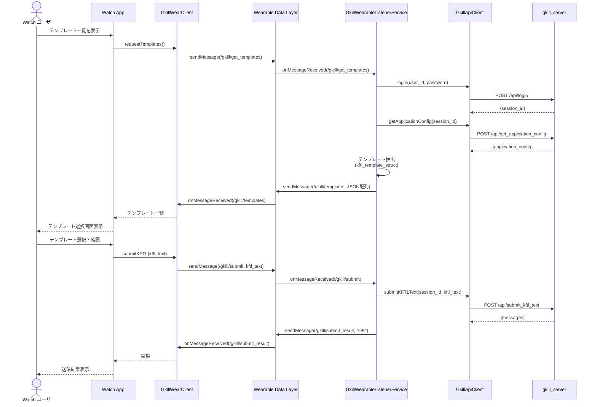
```mermaid
sequenceDiagram
    actor User as Watch ユーザ
    participant Watch as Watch App
    participant WearClient as GkillWearClient
    participant DataLayer as Wearable Data Layer
    participant Companion as GkillWearableListenerService
    participant ApiClient as GkillApiClient
    participant Server as gkill_server

    User->>Watch: テンプレート一覧を表示
    Watch->>WearClient: requestTemplates()
    WearClient->>DataLayer: sendMessage(/gkill/get_templates)
    DataLayer->>Companion: onMessageReceived(/gkill/get_templates)
    Companion->>ApiClient: login(user_id, password)
    ApiClient->>Server: POST /api/login
    Server-->>ApiClient: {session_id}
    Companion->>ApiClient: getApplicationConfig(session_id)
    ApiClient->>Server: POST /api/get_application_config
    Server-->>ApiClient: {application_config}
    Companion->>Companion: テンプレート抽出<br>(kftl_template_struct)
    Companion->>DataLayer: sendMessage(/gkill/templates, JSON配列)
    DataLayer->>WearClient: onMessageReceived(/gkill/templates)
    WearClient-->>Watch: テンプレート一覧
    Watch-->>User: テンプレート選択画面表示

    User->>Watch: テンプレート選択・確認
    Watch->>WearClient: submitKFTL(kftl_text)
    WearClient->>DataLayer: sendMessage(/gkill/submit, kftl_text)
    DataLayer->>Companion: onMessageReceived(/gkill/submit)
    Companion->>ApiClient: submitKFTLText(session_id, kftl_text)
    ApiClient->>Server: POST /api/submit_kftl_text
    Server-->>ApiClient: {messages}
    Companion->>DataLayer: sendMessage(/gkill/submit_result, "OK")
    DataLayer->>WearClient: onMessageReceived(/gkill/submit_result)
    WearClient-->>Watch: 結果
    Watch-->>User: 送信結果表示
```

## 15. MCP Kyou 取得

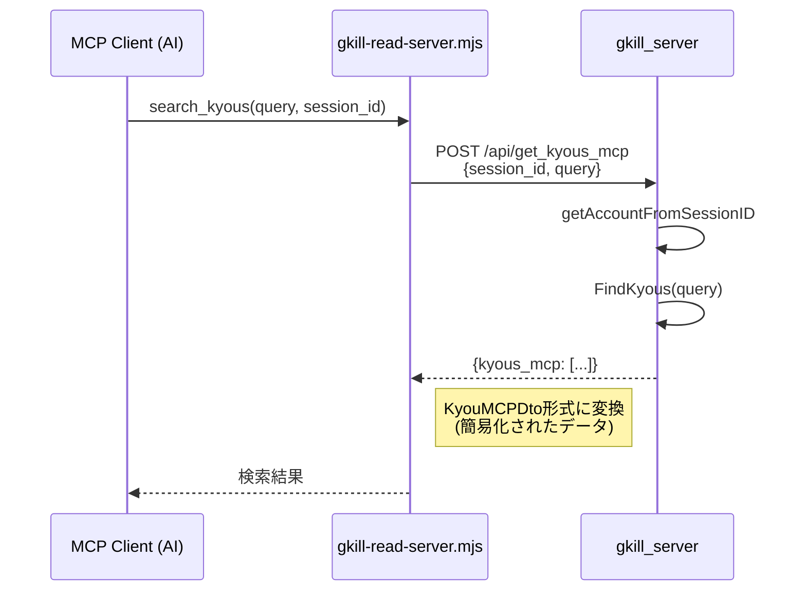
```mermaid
sequenceDiagram
    participant MCP as MCP Client (AI)
    participant MCPServer as gkill-read-server.mjs
    participant Server as gkill_server

    MCP->>MCPServer: search_kyous(query, session_id)
    MCPServer->>Server: POST /api/get_kyous_mcp<br>{session_id, query}
    Server->>Server: getAccountFromSessionID
    Server->>Server: FindKyous(query)
    Server-->>MCPServer: {kyous_mcp: [...]}
    Note right of MCPServer: KyouMCPDto形式に変換<br>(簡易化されたデータ)
    MCPServer-->>MCP: 検索結果
```

## 16. トランザクション（CommitTX / DiscardTX）

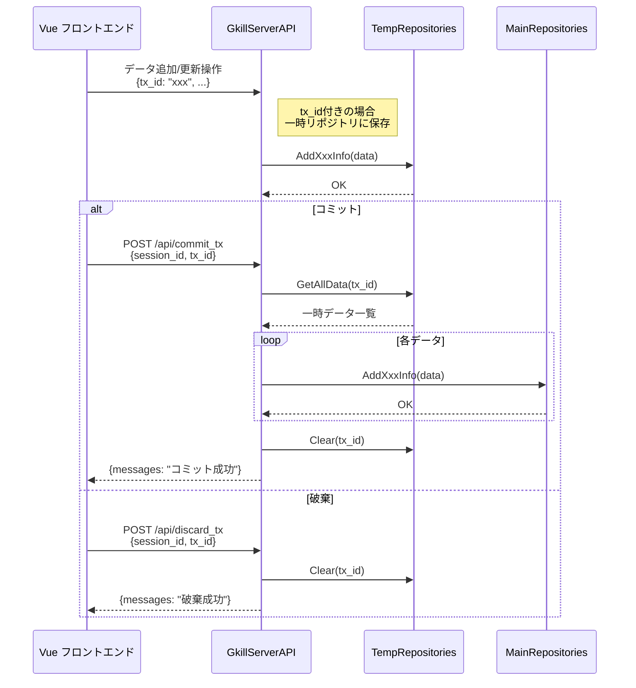
```mermaid
sequenceDiagram
    participant UI as Vue フロントエンド
    participant API as GkillServerAPI
    participant TempReps as TempRepositories
    participant MainReps as MainRepositories

    UI->>API: データ追加/更新操作<br>{tx_id: "xxx", ...}
    Note right of API: tx_id付きの場合<br>一時リポジトリに保存
    API->>TempReps: AddXxxInfo(data)
    TempReps-->>API: OK

    alt コミット
        UI->>API: POST /api/commit_tx<br>{session_id, tx_id}
        API->>TempReps: GetAllData(tx_id)
        TempReps-->>API: 一時データ一覧
        loop 各データ
            API->>MainReps: AddXxxInfo(data)
            MainReps-->>API: OK
        end
        API->>TempReps: Clear(tx_id)
        API-->>UI: {messages: "コミット成功"}
    else 破棄
        UI->>API: POST /api/discard_tx<br>{session_id, tx_id}
        API->>TempReps: Clear(tx_id)
        API-->>UI: {messages: "破棄成功"}
    end
```

---

## 異常系シーケンス

以下は正常系シーケンスに対応するエラーパターン。全エンドポイント共通のエラー処理パターンも含む。

### E1. 認証失敗（ログイン）

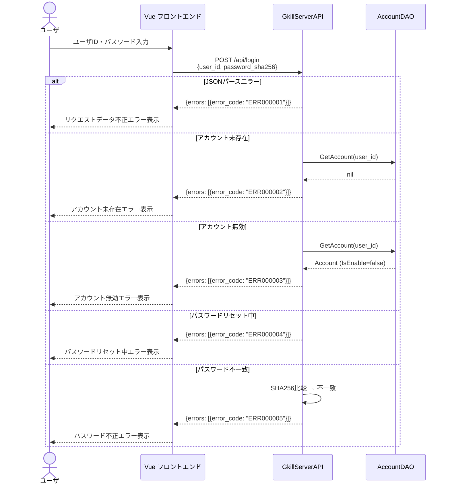
```mermaid
sequenceDiagram
    actor User as ユーザ
    participant UI as Vue フロントエンド
    participant API as GkillServerAPI
    participant AccDAO as AccountDAO

    User->>UI: ユーザID・パスワード入力
    UI->>API: POST /api/login<br>{user_id, password_sha256}

    alt JSONパースエラー
        API-->>UI: {errors: [{error_code: "ERR000001"}]}
        UI-->>User: リクエストデータ不正エラー表示
    else アカウント未存在
        API->>AccDAO: GetAccount(user_id)
        AccDAO-->>API: nil
        API-->>UI: {errors: [{error_code: "ERR000002"}]}
        UI-->>User: アカウント未存在エラー表示
    else アカウント無効
        API->>AccDAO: GetAccount(user_id)
        AccDAO-->>API: Account (IsEnable=false)
        API-->>UI: {errors: [{error_code: "ERR000003"}]}
        UI-->>User: アカウント無効エラー表示
    else パスワードリセット中
        API-->>UI: {errors: [{error_code: "ERR000004"}]}
        UI-->>User: パスワードリセット中エラー表示
    else パスワード不一致
        API->>API: SHA256比較 → 不一致
        API-->>UI: {errors: [{error_code: "ERR000005"}]}
        UI-->>User: パスワード不正エラー表示
    end
```

### E2. セッション検証失敗（全認証済みエンドポイント共通）

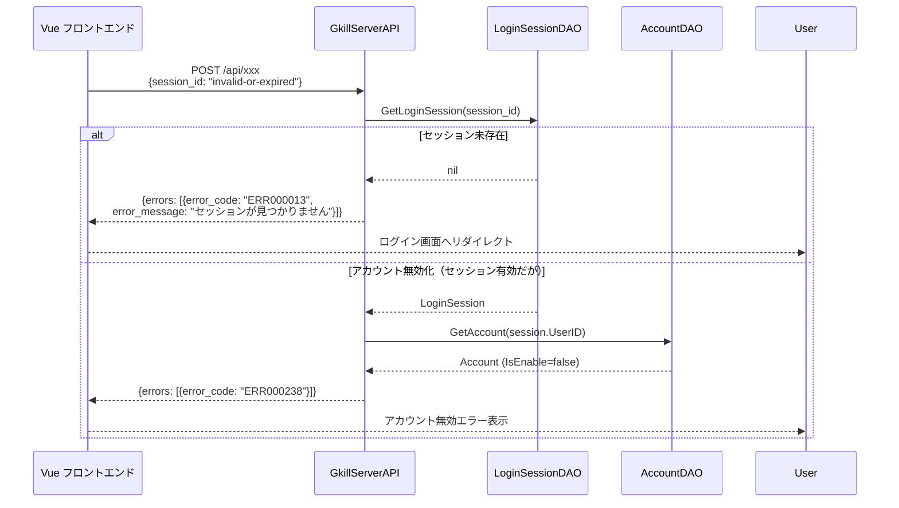
```mermaid
sequenceDiagram
    participant UI as Vue フロントエンド
    participant API as GkillServerAPI
    participant SesDAO as LoginSessionDAO
    participant AccDAO as AccountDAO

    UI->>API: POST /api/xxx<br>{session_id: "invalid-or-expired"}
    API->>SesDAO: GetLoginSession(session_id)

    alt セッション未存在
        SesDAO-->>API: nil
        API-->>UI: {errors: [{error_code: "ERR000013",<br>error_message: "セッションが見つかりません"}]}
        UI-->>User: ログイン画面へリダイレクト
    else アカウント無効化（セッション有効だが）
        SesDAO-->>API: LoginSession
        API->>AccDAO: GetAccount(session.UserID)
        AccDAO-->>API: Account (IsEnable=false)
        API-->>UI: {errors: [{error_code: "ERR000238"}]}
        UI-->>User: アカウント無効エラー表示
    end
```

### E3. データ操作時のバリデーションエラー

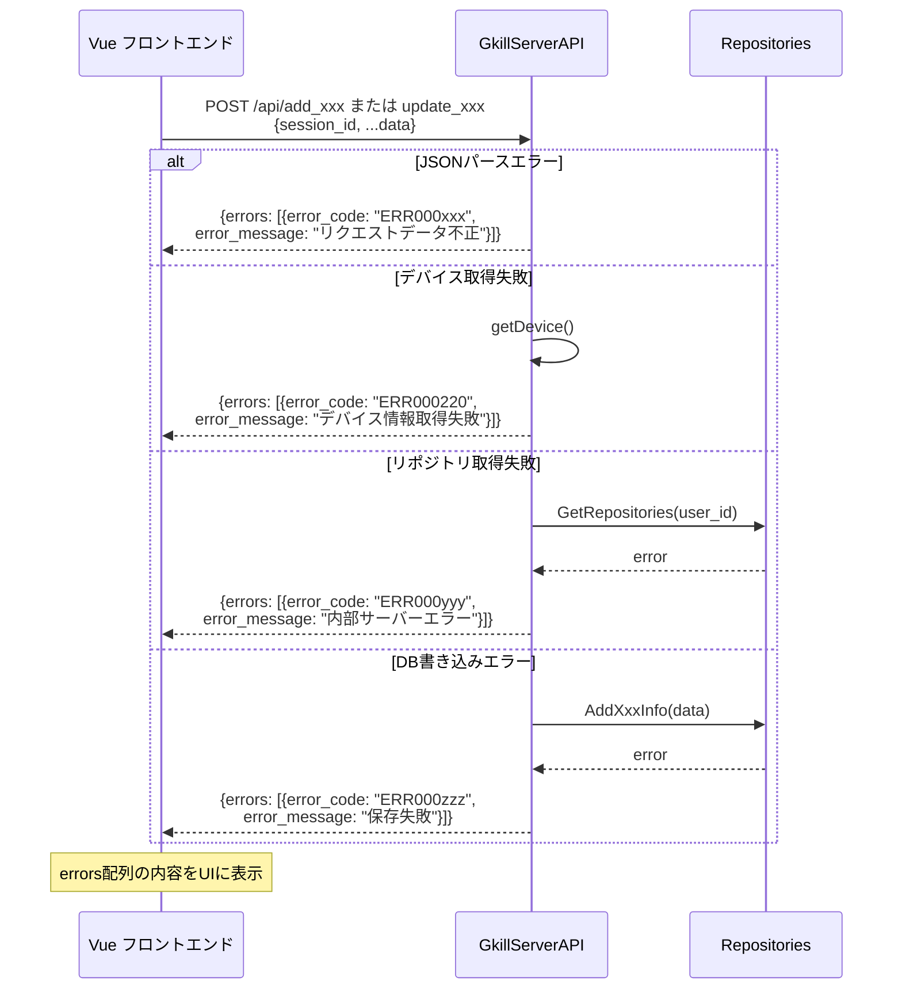
```mermaid
sequenceDiagram
    participant UI as Vue フロントエンド
    participant API as GkillServerAPI
    participant Reps as Repositories

    UI->>API: POST /api/add_xxx または update_xxx<br>{session_id, ...data}

    alt JSONパースエラー
        API-->>UI: {errors: [{error_code: "ERR000xxx",<br>error_message: "リクエストデータ不正"}]}
    else デバイス取得失敗
        API->>API: getDevice()
        API-->>UI: {errors: [{error_code: "ERR000220",<br>error_message: "デバイス情報取得失敗"}]}
    else リポジトリ取得失敗
        API->>Reps: GetRepositories(user_id)
        Reps-->>API: error
        API-->>UI: {errors: [{error_code: "ERR000yyy",<br>error_message: "内部サーバーエラー"}]}
    else DB書き込みエラー
        API->>Reps: AddXxxInfo(data)
        Reps-->>API: error
        API-->>UI: {errors: [{error_code: "ERR000zzz",<br>error_message: "保存失敗"}]}
    end

    Note over UI: errors配列の内容をUIに表示
```

### E4. ローカルアクセス制限

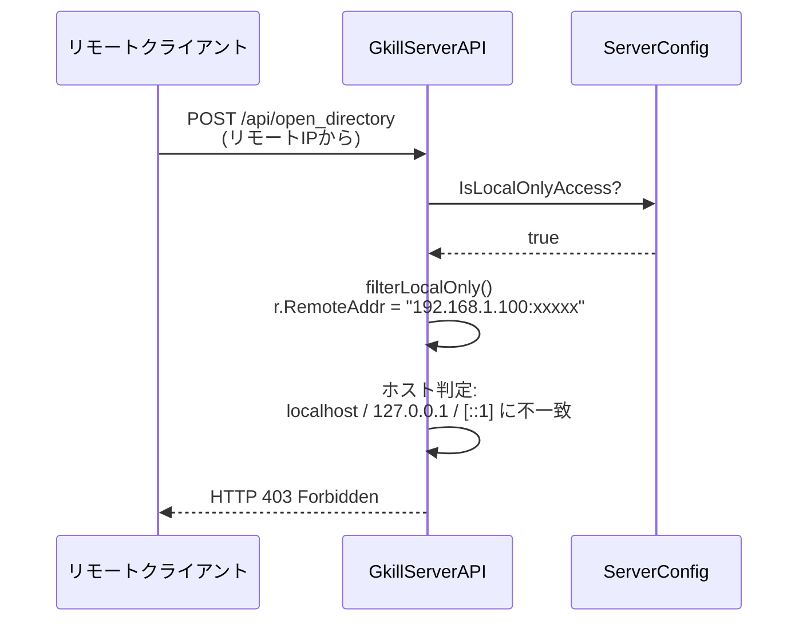
```mermaid
sequenceDiagram
    participant Client as リモートクライアント
    participant API as GkillServerAPI
    participant Config as ServerConfig

    Client->>API: POST /api/open_directory<br>(リモートIPから)
    API->>Config: IsLocalOnlyAccess?
    Config-->>API: true

    API->>API: filterLocalOnly()<br>r.RemoteAddr = "192.168.1.100:xxxxx"
    API->>API: ホスト判定:<br>localhost / 127.0.0.1 / [::1] に不一致

    API-->>Client: HTTP 403 Forbidden
```

### E5. KFTL テキスト送信エラー

```mermaid
sequenceDiagram
    participant UI as Vue フロントエンド
    participant API as GkillServerAPI
    participant KFTL as KFTLParser

    UI->>API: POST /api/submit_kftl_text<br>{session_id, kftl_text}

    alt JSONパースエラー
        API-->>UI: {errors: [{error_code: "ERR000350"}]}
    else セッション検証失敗
        API-->>UI: {errors: [{error_code: "ERR000013"}]}
    else デバイス取得失敗
        API-->>UI: {errors: [{error_code: "ERR000220"}]}
    else パース/保存エラー
        API->>KFTL: GenerateAndExecuteRequests(kftl_text)
        KFTL-->>API: error
        API-->>UI: {errors: [{error_code: "ERR000351",<br>error_message: "KFTLテキスト処理エラー"}]}
    end
```
