# gkill シーケンス図

コードの API ハンドラ実装（`gkill/api/gkill_server_api/` パッケージ、`handle_*.go`）およびMCPサーバ実装（`gkill-read-server.mjs`）から抽出した主要フローのシーケンス図。

## 1. ログイン

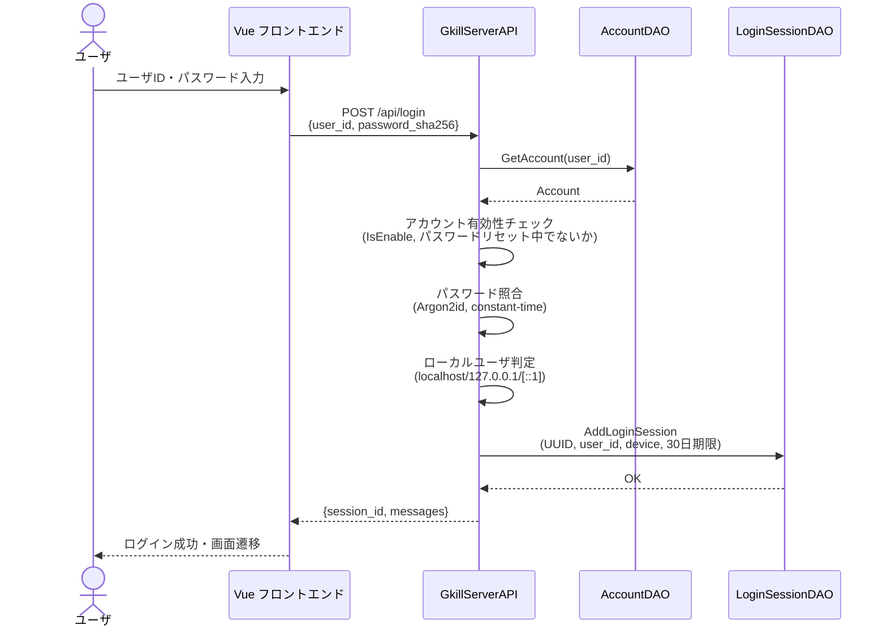
```mermaid
sequenceDiagram
    actor User as ユーザ
    participant UI as Vue フロントエンド
    participant API as GkillServerAPI
    participant AccDAO as AccountDAO
    participant SesDAO as LoginSessionDAO

    User->>UI: ユーザID・パスワード入力
    UI->>API: POST /api/login<br>{user_id, password_sha256}
    API->>AccDAO: GetAccount(user_id)
    AccDAO-->>API: Account
    API->>API: アカウント有効性チェック<br>(IsEnable, パスワードリセット中でないか)
    API->>API: パスワード照合<br>(Argon2id, constant-time)
    API->>API: ローカルユーザ判定<br>(localhost/127.0.0.1/[::1])
    API->>SesDAO: AddLoginSession<br>(UUID, user_id, device, 30日期限)
    SesDAO-->>API: OK
    API-->>UI: {session_id, messages}
    UI-->>User: ログイン成功・画面遷移
```

## 2. ログアウト

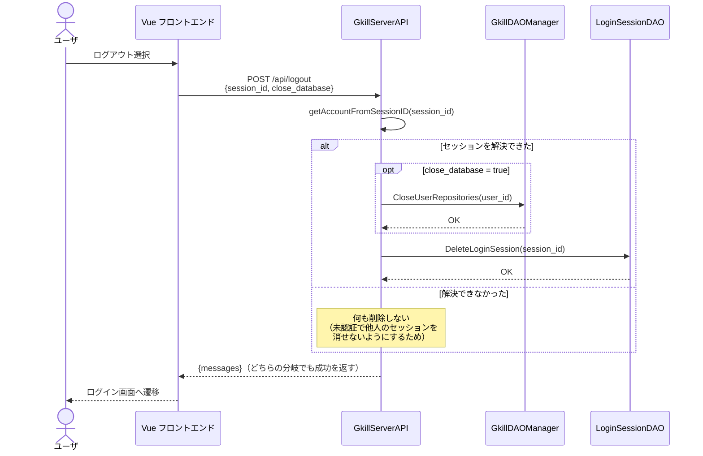
```mermaid
sequenceDiagram
    actor User as ユーザ
    participant UI as Vue フロントエンド
    participant API as GkillServerAPI
    participant DAOMgr as GkillDAOManager
    participant SesDAO as LoginSessionDAO

    User->>UI: ログアウト選択
    UI->>API: POST /api/logout<br>{session_id, close_database}
    API->>API: getAccountFromSessionID(session_id)
    alt セッションを解決できた
        opt close_database = true
            API->>DAOMgr: CloseUserRepositories(user_id)
            DAOMgr-->>API: OK
        end
        API->>SesDAO: DeleteLoginSession(session_id)
        SesDAO-->>API: OK
    else 解決できなかった
        Note over API: 何も削除しない<br>（未認証で他人のセッションを<br>消せないようにするため）
    end
    API-->>UI: {messages}（どちらの分岐でも成功を返す）
    UI-->>User: ログイン画面へ遷移
```

> **応答をどちらも成功にしている理由**: ログアウトはべき等であってほしいこと、
> 与えた `session_id` が有効だったかどうかを応答から読み取れるようにしたくないこと、
> 期限切れのセッションでログアウトを押した利用者がエラーで手詰まりにならないこと。
> `/api/logout` は `wrapNoAuth` なので誰でも叩ける。`session_id` は122ビットの UUIDv4 で
> 当てられるものではないが、未認証で届く書き込み操作をなくしておく。

## 3. パスワード設定（リセットトークン使用）

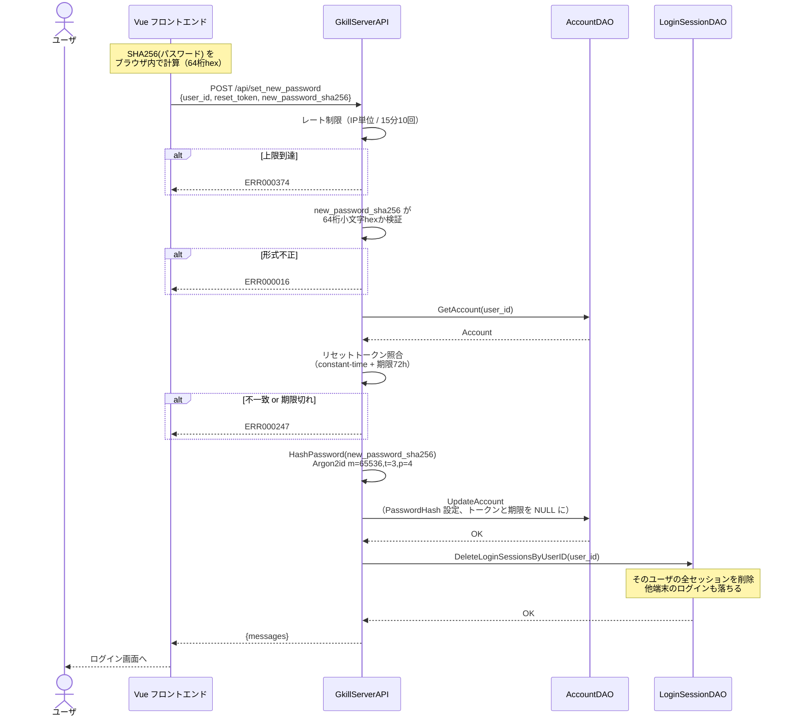
```mermaid
sequenceDiagram
    actor User as ユーザ
    participant UI as Vue フロントエンド
    participant API as GkillServerAPI
    participant AccDAO as AccountDAO
    participant SesDAO as LoginSessionDAO

    Note over UI: SHA256(パスワード) を<br>ブラウザ内で計算（64桁hex）
    UI->>API: POST /api/set_new_password<br>{user_id, reset_token, new_password_sha256}

    API->>API: レート制限（IP単位 / 15分10回）
    alt 上限到達
        API-->>UI: ERR000374
    end

    API->>API: new_password_sha256 が<br>64桁小文字hexか検証
    alt 形式不正
        API-->>UI: ERR000016
    end

    API->>AccDAO: GetAccount(user_id)
    AccDAO-->>API: Account

    API->>API: リセットトークン照合<br>（constant-time + 期限72h）
    alt 不一致 or 期限切れ
        API-->>UI: ERR000247
    end

    API->>API: HashPassword(new_password_sha256)<br>Argon2id m=65536,t=3,p=4
    API->>AccDAO: UpdateAccount<br>（PasswordHash 設定、トークンと期限を NULL に）
    AccDAO-->>API: OK

    API->>SesDAO: DeleteLoginSessionsByUserID(user_id)
    Note over SesDAO: そのユーザの全セッションを削除<br>他端末のログインも落ちる
    SesDAO-->>API: OK

    API-->>UI: {messages}
    UI-->>User: ログイン画面へ
```

**ポイント:**

- **クライアントは平文パスワードを送らない**。送るのは SHA256 の64桁hex で、サーバはそれを資格情報として Argon2id にかける。ワイヤ形式は旧方式から変えていないので、MCP・Wear OS・gkill_autolog が保存している値はそのまま使える
- **トークンは単回使用**。設定に成功すると `PASSWORD_RESET_TOKEN` と `PASSWORD_RESET_TOKEN_EXPIRATION` を NULL にする
- **全セッションを失効させる**ので、パスワードを変えていなくても設定しなおした時点で全端末がログアウトされる。セッションだけを保存していて再ログインの材料を持たないもの（HTTP/OAuth モードの MCP サーバ）は再認可が必要になる
- このエンドポイントは `wrapNoAuth`。認可はリセットトークンだけが担うので、レート制限と constant-time 照合が効いている

## 4. Kyou データ追加（例: Kmemo）

全データ型（KC, Lantana, Mi, Nlog, URLog, TimeIs, ReKyou, MiReKyou）も同様のフロー。
MiReKyou は `/api/add_mirekyou` / `/api/update_mirekyou` / `/api/get_mirekyou` を使い、
タイトルを持たず `target_id` で元の Kyou を指す点だけが異なる。

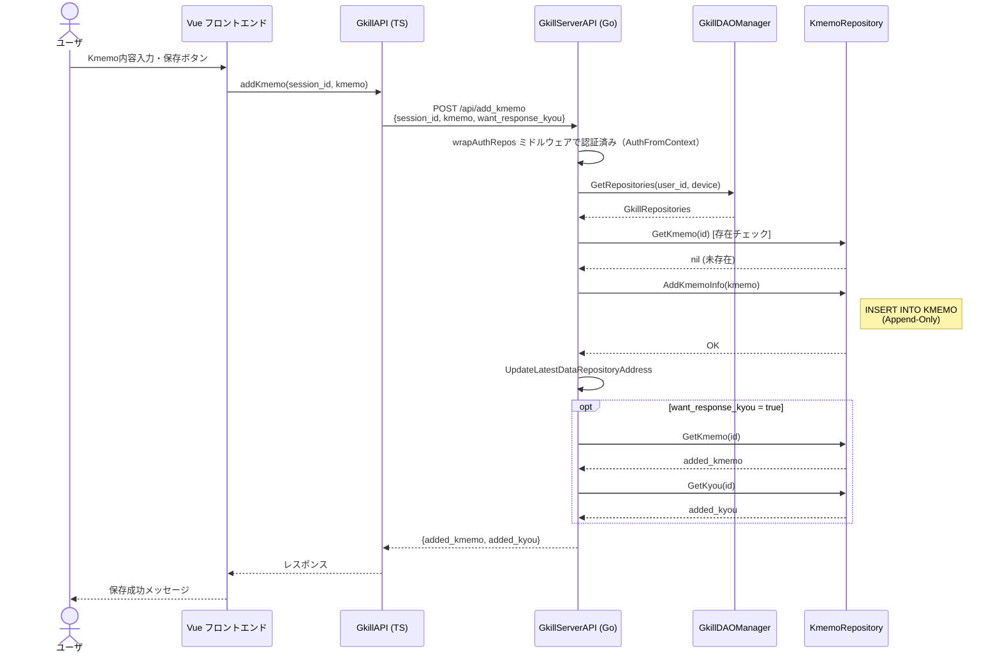
```mermaid
sequenceDiagram
    actor User as ユーザ
    participant UI as Vue フロントエンド
    participant GkillAPI as GkillAPI (TS)
    participant API as GkillServerAPI (Go)
    participant DAOMgr as GkillDAOManager
    participant KmemoRep as KmemoRepository

    User->>UI: Kmemo内容入力・保存ボタン
    UI->>GkillAPI: addKmemo(session_id, kmemo)
    GkillAPI->>API: POST /api/add_kmemo<br>{session_id, kmemo, want_response_kyou}
    API->>API: wrapAuthRepos ミドルウェアで認証済み（AuthFromContext）
    API->>DAOMgr: GetRepositories(user_id, device)
    DAOMgr-->>API: GkillRepositories
    API->>KmemoRep: GetKmemo(id) [存在チェック]
    KmemoRep-->>API: nil (未存在)
    API->>KmemoRep: AddKmemoInfo(kmemo)
    Note right of KmemoRep: INSERT INTO KMEMO<br>(Append-Only)
    KmemoRep-->>API: OK
    API->>API: UpdateLatestDataRepositoryAddress
    opt want_response_kyou = true
        API->>KmemoRep: GetKmemo(id)
        KmemoRep-->>API: added_kmemo
        API->>KmemoRep: GetKyou(id)
        KmemoRep-->>API: added_kyou
    end
    API-->>GkillAPI: {added_kmemo, added_kyou}
    GkillAPI-->>UI: レスポンス
    UI-->>User: 保存成功メッセージ
```

## 5. Kyou データ更新（例: Kmemo）

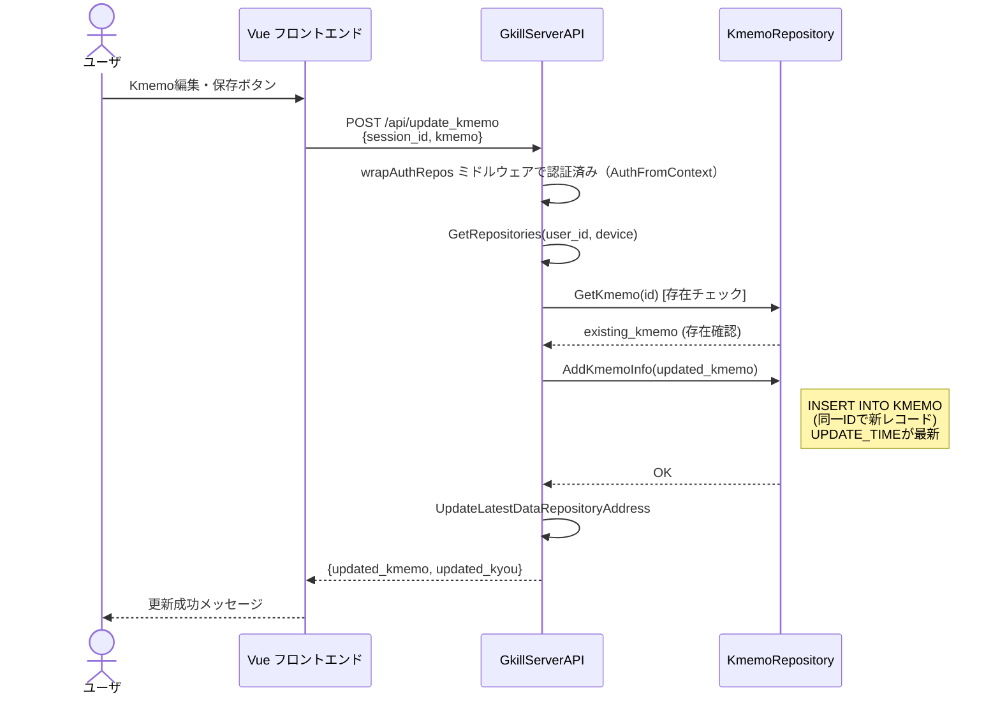
```mermaid
sequenceDiagram
    actor User as ユーザ
    participant UI as Vue フロントエンド
    participant API as GkillServerAPI
    participant KmemoRep as KmemoRepository

    User->>UI: Kmemo編集・保存ボタン
    UI->>API: POST /api/update_kmemo<br>{session_id, kmemo}
    API->>API: wrapAuthRepos ミドルウェアで認証済み（AuthFromContext）
    API->>API: GetRepositories(user_id, device)
    API->>KmemoRep: GetKmemo(id) [存在チェック]
    KmemoRep-->>API: existing_kmemo (存在確認)
    API->>KmemoRep: AddKmemoInfo(updated_kmemo)
    Note right of KmemoRep: INSERT INTO KMEMO<br>(同一IDで新レコード)<br>UPDATE_TIMEが最新
    KmemoRep-->>API: OK
    API->>API: UpdateLatestDataRepositoryAddress
    API-->>UI: {updated_kmemo, updated_kyou}
    UI-->>User: 更新成功メッセージ
```

## 6. Kyou データ削除（論理削除）

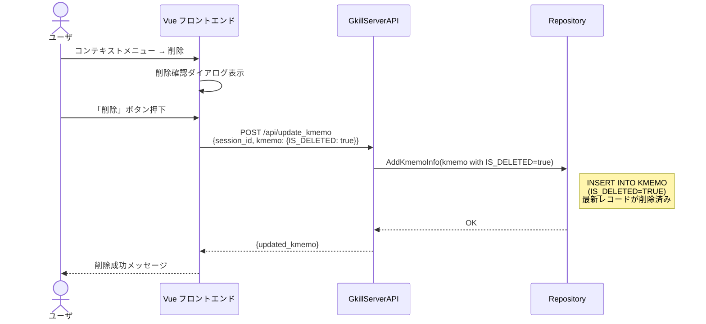
```mermaid
sequenceDiagram
    actor User as ユーザ
    participant UI as Vue フロントエンド
    participant API as GkillServerAPI
    participant Rep as Repository

    User->>UI: コンテキストメニュー → 削除
    UI->>UI: 削除確認ダイアログ表示
    User->>UI: 「削除」ボタン押下
    UI->>API: POST /api/update_kmemo<br>{session_id, kmemo: {IS_DELETED: true}}
    API->>Rep: AddKmemoInfo(kmemo with IS_DELETED=true)
    Note right of Rep: INSERT INTO KMEMO<br>(IS_DELETED=TRUE)<br>最新レコードが削除済み
    Rep-->>API: OK
    API-->>UI: {updated_kmemo}
    UI-->>User: 削除成功メッセージ
```

## 7. Kyou 検索（GetKyous）

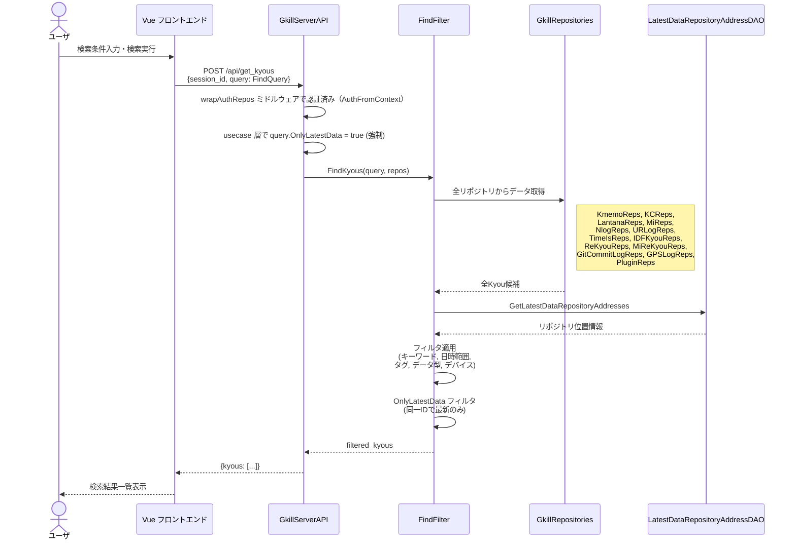
```mermaid
sequenceDiagram
    actor User as ユーザ
    participant UI as Vue フロントエンド
    participant API as GkillServerAPI
    participant Filter as FindFilter
    participant Repos as GkillRepositories
    participant Cache as LatestDataRepositoryAddressDAO

    User->>UI: 検索条件入力・検索実行
    UI->>API: POST /api/get_kyous<br>{session_id, query: FindQuery}
    API->>API: wrapAuthRepos ミドルウェアで認証済み（AuthFromContext）
    API->>API: usecase 層で query.OnlyLatestData = true (強制)
    API->>Filter: FindKyous(query, repos)
    Filter->>Repos: 全リポジトリからデータ取得
    Note right of Repos: KmemoReps, KCReps,<br>LantanaReps, MiReps,<br>NlogReps, URLogReps,<br>TimeIsReps, IDFKyouReps,<br>ReKyouReps, MiReKyouReps,<br>GitCommitLogReps, GPSLogReps,<br>PluginReps
    Repos-->>Filter: 全Kyou候補
    Filter->>Cache: GetLatestDataRepositoryAddresses
    Cache-->>Filter: リポジトリ位置情報
    Filter->>Filter: フィルタ適用<br>(キーワード, 日時範囲,<br>タグ, データ型, デバイス)
    Filter->>Filter: OnlyLatestData フィルタ<br>(同一IDで最新のみ)
    Filter-->>API: filtered_kyous
    API-->>UI: {kyous: [...]}
    UI-->>User: 検索結果一覧表示
```

## 8. KFTL テキスト送信・パース・保存

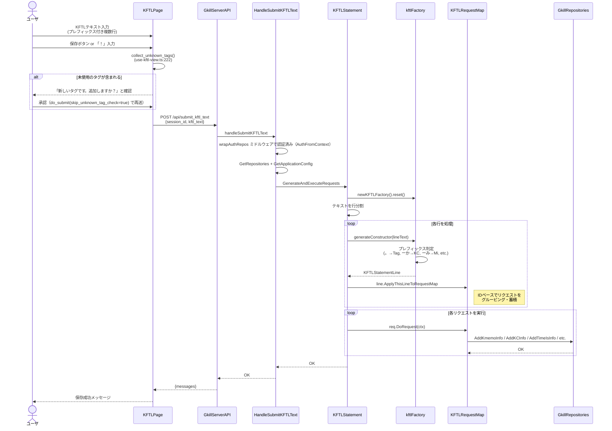
```mermaid
sequenceDiagram
    actor User as ユーザ
    participant UI as KFTLPage
    participant API as GkillServerAPI
    participant Handler as HandleSubmitKFTLText
    participant Stmt as KFTLStatement
    participant Factory as kftlFactory
    participant ReqMap as KFTLRequestMap
    participant Repos as GkillRepositories

    User->>UI: KFTLテキスト入力<br>(プレフィックス付き複数行)
    User->>UI: 保存ボタン or 「！」入力
    UI->>UI: collect_unknown_tags()<br>(use-kftl-view.ts:222)
    alt 未使用のタグが含まれる
        UI-->>User: 「新しいタグです。追加しますか？」と確認
        User->>UI: 承認（do_submit(skip_unknown_tag_check=true) で再送）
    end
    UI->>API: POST /api/submit_kftl_text<br>{session_id, kftl_text}
    API->>Handler: handleSubmitKFTLText
    Handler->>Handler: wrapAuthRepos ミドルウェアで認証済み（AuthFromContext）
    Handler->>Handler: GetRepositories + GetApplicationConfig
    Handler->>Stmt: GenerateAndExecuteRequests
    Stmt->>Factory: newKFTLFactory().reset()
    Stmt->>Stmt: テキストを行分割
    loop 各行を処理
        Stmt->>Factory: generateConstructor(lineText)
        Factory->>Factory: プレフィックス判定<br>(。→Tag, ーか→KC, ーみ→Mi, etc.)
        Factory-->>Stmt: KFTLStatementLine
        Stmt->>ReqMap: line.ApplyThisLineToRequestMap
        Note right of ReqMap: IDベースでリクエストを<br>グルーピング・蓄積
    end
    loop 各リクエストを実行
        Stmt->>ReqMap: req.DoRequest(ctx)
        ReqMap->>Repos: AddKmemoInfo / AddKCInfo / AddTimeIsInfo / etc.
        Repos-->>ReqMap: OK
    end
    Stmt-->>Handler: OK
    Handler-->>API: OK
    API-->>UI: {messages}
    UI-->>User: 保存成功メッセージ
```

> **新規タグの確認ゲート**は完全にクライアント側の処理。`do_submit(skip_unknown_tag_check)`
> （`use-kftl-view.ts:258,272`）が未確認のときだけ `collect_unknown_tags()` を呼び、
> 打ち間違いで似たタグが増えるのを防ぐ。サーバ側は確認の有無を関知しない。

## 9. ファイルアップロード

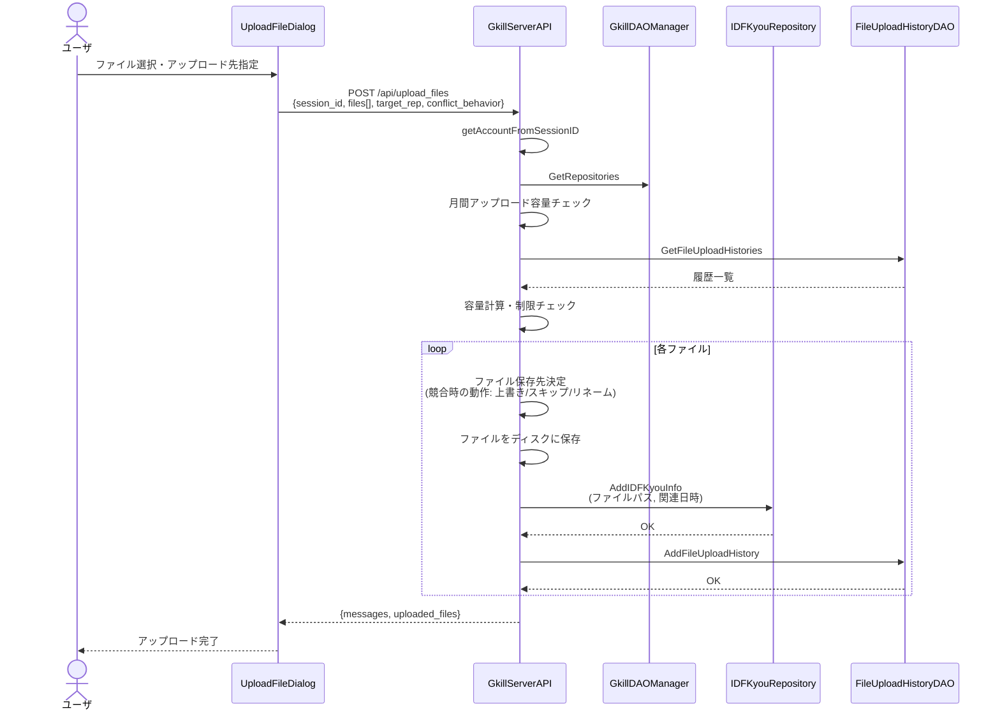
```mermaid
sequenceDiagram
    actor User as ユーザ
    participant UI as UploadFileDialog
    participant API as GkillServerAPI
    participant DAOMgr as GkillDAOManager
    participant IDFRep as IDFKyouRepository
    participant FUH as FileUploadHistoryDAO

    User->>UI: ファイル選択・アップロード先指定
    UI->>API: POST /api/upload_files<br>{session_id, files[], target_rep, conflict_behavior}
    API->>API: getAccountFromSessionID
    API->>DAOMgr: GetRepositories
    API->>API: 月間アップロード容量チェック
    API->>FUH: GetFileUploadHistories
    FUH-->>API: 履歴一覧
    API->>API: 容量計算・制限チェック
    loop 各ファイル
        API->>API: ファイル保存先決定<br>(競合時の動作: 上書き/スキップ/リネーム)
        API->>API: ファイルをディスクに保存
        API->>IDFRep: AddIDFKyouInfo<br>(ファイルパス, 関連日時)
        IDFRep-->>API: OK
        API->>FUH: AddFileUploadHistory
        FUH-->>API: OK
    end
    API-->>UI: {messages, uploaded_files}
    UI-->>User: アップロード完了
```

## 10. Tag / Text / Notification の追加

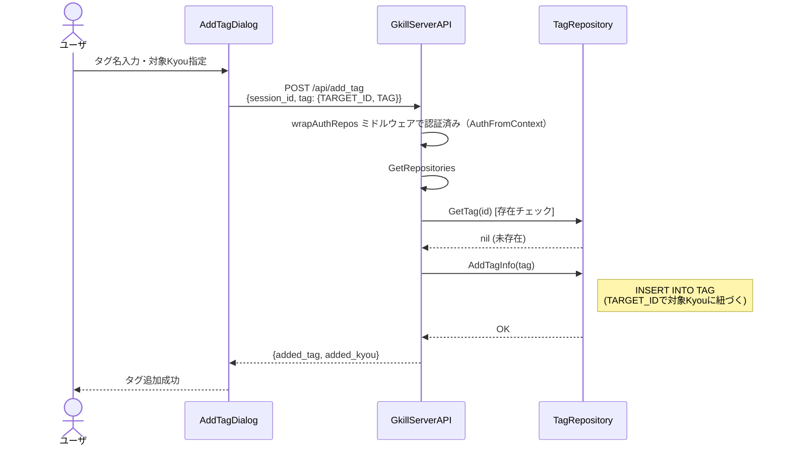
```mermaid
sequenceDiagram
    actor User as ユーザ
    participant UI as AddTagDialog
    participant API as GkillServerAPI
    participant TagRep as TagRepository

    User->>UI: タグ名入力・対象Kyou指定
    UI->>API: POST /api/add_tag<br>{session_id, tag: {TARGET_ID, TAG}}
    API->>API: wrapAuthRepos ミドルウェアで認証済み（AuthFromContext）
    API->>API: GetRepositories
    API->>TagRep: GetTag(id) [存在チェック]
    TagRep-->>API: nil (未存在)
    API->>TagRep: AddTagInfo(tag)
    Note right of TagRep: INSERT INTO TAG<br>(TARGET_IDで対象Kyouに紐づく)
    TagRep-->>API: OK
    API-->>UI: {added_tag, added_kyou}
    UI-->>User: タグ追加成功
```

## 11. TimeIs 開始・終了

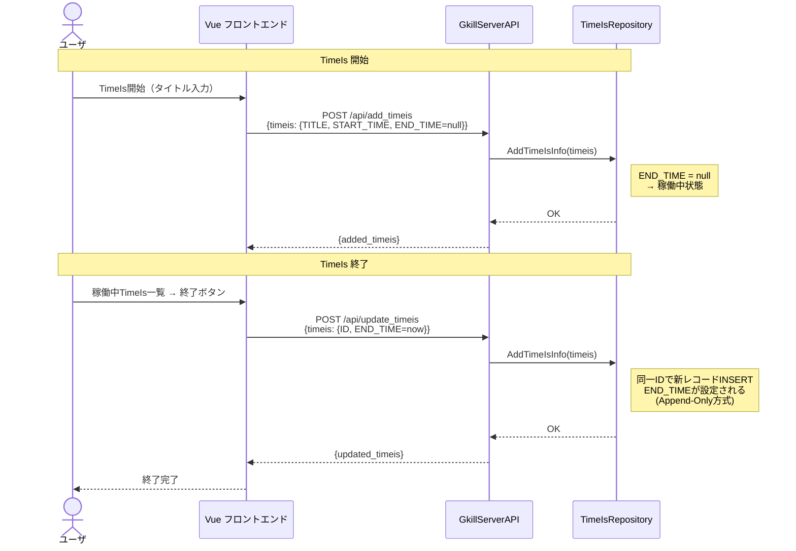
```mermaid
sequenceDiagram
    actor User as ユーザ
    participant UI as Vue フロントエンド
    participant API as GkillServerAPI
    participant TimeIsRep as TimeIsRepository

    Note over User,TimeIsRep: TimeIs 開始
    User->>UI: TimeIs開始（タイトル入力）
    UI->>API: POST /api/add_timeis<br>{timeis: {TITLE, START_TIME, END_TIME=null}}
    API->>TimeIsRep: AddTimeIsInfo(timeis)
    Note right of TimeIsRep: END_TIME = null<br>→ 稼働中状態
    TimeIsRep-->>API: OK
    API-->>UI: {added_timeis}

    Note over User,TimeIsRep: TimeIs 終了
    User->>UI: 稼働中TimeIs一覧 → 終了ボタン
    UI->>API: POST /api/update_timeis<br>{timeis: {ID, END_TIME=now}}
    API->>TimeIsRep: AddTimeIsInfo(timeis)
    Note right of TimeIsRep: 同一IDで新レコードINSERT<br>END_TIMEが設定される<br>(Append-Only方式)
    TimeIsRep-->>API: OK
    API-->>UI: {updated_timeis}
    UI-->>User: 終了完了
```

## 12. アプリケーション設定取得・更新

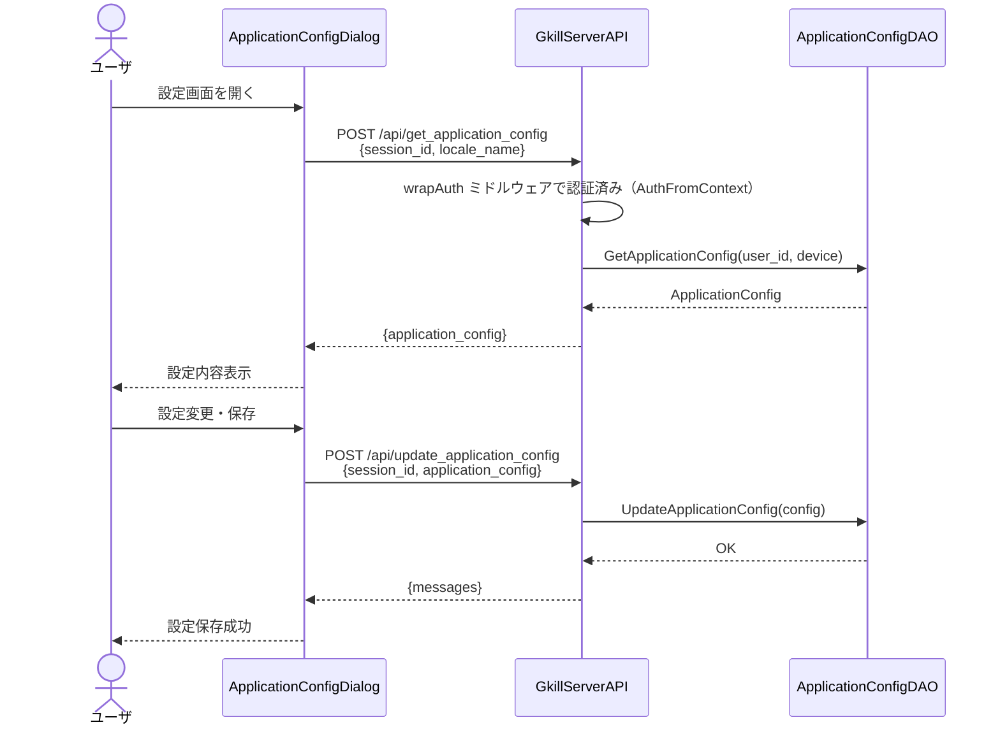
```mermaid
sequenceDiagram
    actor User as ユーザ
    participant UI as ApplicationConfigDialog
    participant API as GkillServerAPI
    participant AppConfigDAO as ApplicationConfigDAO

    User->>UI: 設定画面を開く
    UI->>API: POST /api/get_application_config<br>{session_id, locale_name}
    API->>API: wrapAuth ミドルウェアで認証済み（AuthFromContext）
    API->>AppConfigDAO: GetApplicationConfig(user_id, device)
    AppConfigDAO-->>API: ApplicationConfig
    API-->>UI: {application_config}
    UI-->>User: 設定内容表示

    User->>UI: 設定変更・保存
    UI->>API: POST /api/update_application_config<br>{session_id, application_config}
    API->>AppConfigDAO: UpdateApplicationConfig(config)
    AppConfigDAO-->>API: OK
    API-->>UI: {messages}
    UI-->>User: 設定保存成功
```

## 13. 共有（ShareKyouListInfo）

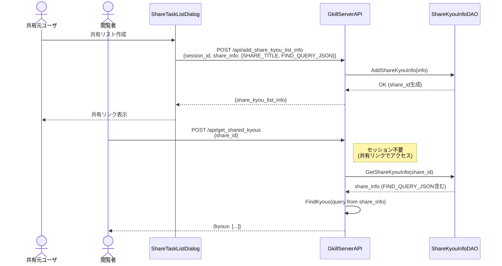
```mermaid
sequenceDiagram
    actor Owner as 共有元ユーザ
    actor Viewer as 閲覧者
    participant UI as ShareTaskListDialog
    participant API as GkillServerAPI
    participant ShareDAO as ShareKyouInfoDAO

    Owner->>UI: 共有リスト作成
    UI->>API: POST /api/add_share_kyou_list_info<br>{session_id, share_info: {SHARE_TITLE, FIND_QUERY_JSON}}
    API->>ShareDAO: AddShareKyouInfo(info)
    ShareDAO-->>API: OK (share_id生成)
    API-->>UI: {share_kyou_list_info}
    UI-->>Owner: 共有リンク表示

    Viewer->>API: POST /api/get_shared_kyous<br>{share_id}
    Note right of API: セッション不要<br>(共有リンクでアクセス)
    API->>ShareDAO: GetShareKyouInfo(share_id)
    ShareDAO-->>API: share_info (FIND_QUERY_JSON含む)
    API->>API: FindKyous(query from share_info)
    API-->>Viewer: {kyous: [...]}
```

## 14. Web Push 通知登録

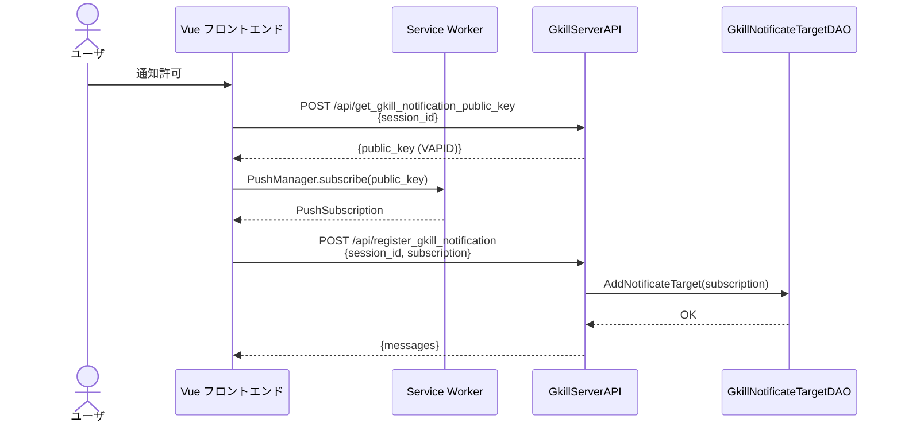
```mermaid
sequenceDiagram
    actor User as ユーザ
    participant UI as Vue フロントエンド
    participant SW as Service Worker
    participant API as GkillServerAPI
    participant NotifDAO as GkillNotificateTargetDAO

    User->>UI: 通知許可
    UI->>API: POST /api/get_gkill_notification_public_key<br>{session_id}
    API-->>UI: {public_key (VAPID)}
    UI->>SW: PushManager.subscribe(public_key)
    SW-->>UI: PushSubscription
    UI->>API: POST /api/register_gkill_notification<br>{session_id, subscription}
    API->>NotifDAO: AddNotificateTarget(subscription)
    NotifDAO-->>API: OK
    API-->>UI: {messages}
```

## 15. Wear OS テンプレート取得・KFTL 送信

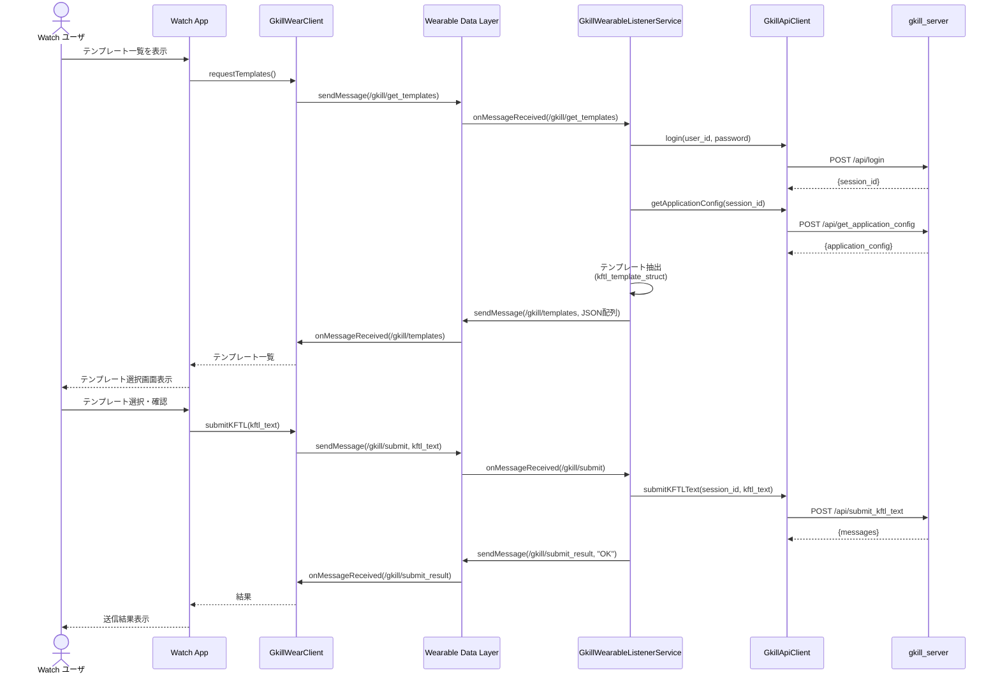
```mermaid
sequenceDiagram
    actor User as Watch ユーザ
    participant Watch as Watch App
    participant WearClient as GkillWearClient
    participant DataLayer as Wearable Data Layer
    participant Companion as GkillWearableListenerService
    participant ApiClient as GkillApiClient
    participant Server as gkill_server

    User->>Watch: テンプレート一覧を表示
    Watch->>WearClient: requestTemplates()
    WearClient->>DataLayer: sendMessage(/gkill/get_templates)
    DataLayer->>Companion: onMessageReceived(/gkill/get_templates)
    Companion->>ApiClient: login(user_id, password)
    ApiClient->>Server: POST /api/login
    Server-->>ApiClient: {session_id}
    Companion->>ApiClient: getApplicationConfig(session_id)
    ApiClient->>Server: POST /api/get_application_config
    Server-->>ApiClient: {application_config}
    Companion->>Companion: テンプレート抽出<br>(kftl_template_struct)
    Companion->>DataLayer: sendMessage(/gkill/templates, JSON配列)
    DataLayer->>WearClient: onMessageReceived(/gkill/templates)
    WearClient-->>Watch: テンプレート一覧
    Watch-->>User: テンプレート選択画面表示

    User->>Watch: テンプレート選択・確認
    Watch->>WearClient: submitKFTL(kftl_text)
    WearClient->>DataLayer: sendMessage(/gkill/submit, kftl_text)
    DataLayer->>Companion: onMessageReceived(/gkill/submit)
    Companion->>ApiClient: submitKFTLText(session_id, kftl_text)
    ApiClient->>Server: POST /api/submit_kftl_text
    Server-->>ApiClient: {messages}
    Companion->>DataLayer: sendMessage(/gkill/submit_result, "OK")
    DataLayer->>WearClient: onMessageReceived(/gkill/submit_result)
    WearClient-->>Watch: 結果
    Watch-->>User: 送信結果表示
```

## 16. MCP Kyou 取得

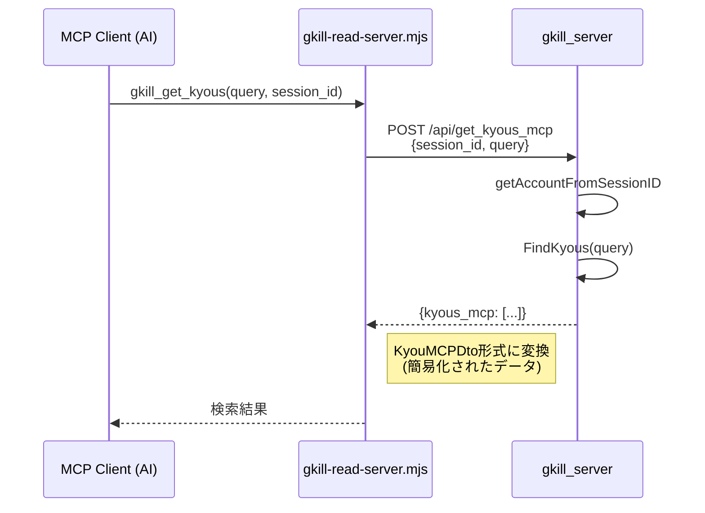
```mermaid
sequenceDiagram
    participant MCP as MCP Client (AI)
    participant MCPServer as gkill-read-server.mjs
    participant Server as gkill_server

    MCP->>MCPServer: gkill_get_kyous(query, session_id)
    MCPServer->>Server: POST /api/get_kyous_mcp<br>{session_id, query}
    Server->>Server: getAccountFromSessionID
    Server->>Server: FindKyous(query)
    Server-->>MCPServer: {kyous_mcp: [...]}
    Note right of MCPServer: KyouMCPDto形式に変換<br>(簡易化されたデータ)
    MCPServer-->>MCP: 検索結果
```

## 17. MCP OAuth 2.1 認可フロー（HTTP モード）

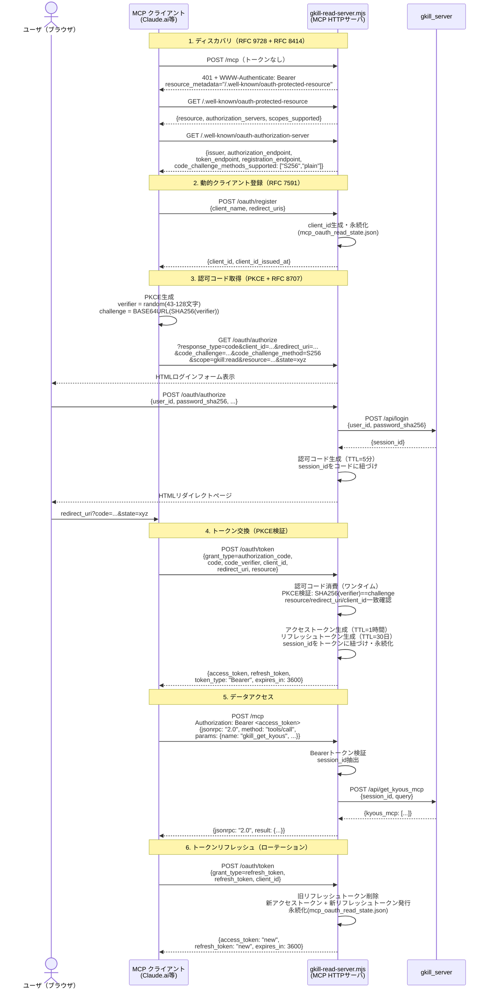
```mermaid
sequenceDiagram
    actor User as ユーザ（ブラウザ）
    participant Client as MCP クライアント<br>(Claude.ai等)
    participant MCP as gkill-read-server.mjs<br>(MCP HTTPサーバ)
    participant Server as gkill_server

    Note over Client,MCP: 1. ディスカバリ（RFC 9728 + RFC 8414）

    Client->>MCP: POST /mcp（トークンなし）
    MCP-->>Client: 401 + WWW-Authenticate: Bearer<br>resource_metadata="/.well-known/oauth-protected-resource"
    Client->>MCP: GET /.well-known/oauth-protected-resource
    MCP-->>Client: {resource, authorization_servers, scopes_supported}
    Client->>MCP: GET /.well-known/oauth-authorization-server
    MCP-->>Client: {issuer, authorization_endpoint,<br>token_endpoint, registration_endpoint,<br>code_challenge_methods_supported: ["S256","plain"]}

    Note over Client,MCP: 2. 動的クライアント登録（RFC 7591）

    Client->>MCP: POST /oauth/register<br>{client_name, redirect_uris}
    MCP->>MCP: client_id生成・永続化<br>(mcp_oauth_read_state.json)
    MCP-->>Client: {client_id, client_id_issued_at}

    Note over Client,MCP: 3. 認可コード取得（PKCE + RFC 8707）

    Client->>Client: PKCE生成<br>verifier = random(43-128文字)<br>challenge = BASE64URL(SHA256(verifier))
    Client->>MCP: GET /oauth/authorize<br>?response_type=code&client_id=...&redirect_uri=...<br>&code_challenge=...&code_challenge_method=S256<br>&scope=gkill:read&resource=...&state=xyz
    MCP-->>User: HTMLログインフォーム表示
    User->>MCP: POST /oauth/authorize<br>{user_id, password_sha256, ...}
    MCP->>Server: POST /api/login<br>{user_id, password_sha256}
    Server-->>MCP: {session_id}
    MCP->>MCP: 認可コード生成（TTL=5分）<br>session_idをコードに紐づけ
    MCP-->>User: HTMLリダイレクトページ
    User->>Client: redirect_uri?code=...&state=xyz

    Note over Client,MCP: 4. トークン交換（PKCE検証）

    Client->>MCP: POST /oauth/token<br>{grant_type=authorization_code,<br>code, code_verifier, client_id,<br>redirect_uri, resource}
    MCP->>MCP: 認可コード消費（ワンタイム）<br>PKCE検証: SHA256(verifier)==challenge<br>resource/redirect_uri/client_id一致確認
    MCP->>MCP: アクセストークン生成（TTL=1時間）<br>リフレッシュトークン生成（TTL=30日）<br>session_idをトークンに紐づけ・永続化
    MCP-->>Client: {access_token, refresh_token,<br>token_type: "Bearer", expires_in: 3600}

    Note over Client,MCP: 5. データアクセス

    Client->>MCP: POST /mcp<br>Authorization: Bearer <access_token><br>{jsonrpc: "2.0", method: "tools/call",<br>params: {name: "gkill_get_kyous", ...}}
    MCP->>MCP: Bearerトークン検証<br>session_id抽出
    MCP->>Server: POST /api/get_kyous_mcp<br>{session_id, query}
    Server-->>MCP: {kyous_mcp: [...]}
    MCP-->>Client: {jsonrpc: "2.0", result: {...}}

    Note over Client,MCP: 6. トークンリフレッシュ（ローテーション）

    Client->>MCP: POST /oauth/token<br>{grant_type=refresh_token,<br>refresh_token, client_id}
    MCP->>MCP: 旧リフレッシュトークン削除<br>新アクセストークン + 新リフレッシュトークン発行<br>永続化(mcp_oauth_read_state.json)
    MCP-->>Client: {access_token: "new",<br>refresh_token: "new", expires_in: 3600}
```

### 補足

- **トークン永続化:** リフレッシュトークンとDCRクライアント登録は `$GKILL_HOME/configs/` 配下に保存（Read: `mcp_oauth_read_state.json`、Write: `mcp_oauth_write_state.json`、ReadWrite: `mcp_oauth_readwrite_state.json`）。サーバ再起動後も再認証不要
- **アクセストークン:** インメモリのみ（サーバ再起動で失効、リフレッシュトークンで再発行可能）
- **PKCE:** S256（SHA-256）と plain の両方をサポート。S256 推奨
- **RFC 8707（Resource Indicators）:** 認可〜トークン交換で `resource` パラメータを引き回し、一致を検証
- **既知の制限:** ChatGPT はOAuth認証・初回データ取得は成功するが、cursorベースのページング継続時にプラットフォーム側で問題が発生する（2026-03時点）

## 18. ZIPファイル内容閲覧

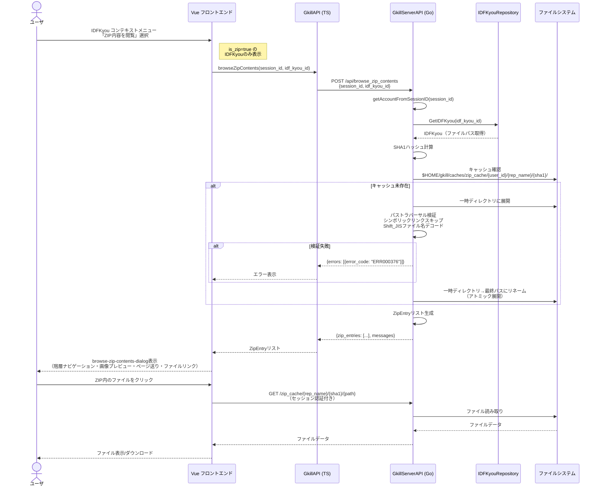
```mermaid
sequenceDiagram
    actor User as ユーザ
    participant UI as Vue フロントエンド
    participant GkillAPI as GkillAPI (TS)
    participant API as GkillServerAPI (Go)
    participant IDFRep as IDFKyouRepository
    participant FS as ファイルシステム

    User->>UI: IDFKyou コンテキストメニュー<br>「ZIP内容を閲覧」選択
    Note right of UI: is_zip=true の<br>IDFKyouのみ表示
    UI->>GkillAPI: browseZipContents(session_id, idf_kyou_id)
    GkillAPI->>API: POST /api/browse_zip_contents<br>{session_id, idf_kyou_id}
    API->>API: getAccountFromSessionID(session_id)
    API->>IDFRep: GetIDFKyou(idf_kyou_id)
    IDFRep-->>API: IDFKyou（ファイルパス取得）
    API->>API: SHA1ハッシュ計算
    API->>FS: キャッシュ確認<br>$HOME/gkill/caches/zip_cache/{user_id}/{rep_name}/{sha1}/

    alt キャッシュ未存在
        API->>FS: 一時ディレクトリに展開
        API->>API: パストラバーサル検証<br>シンボリックリンクスキップ<br>Shift_JISファイル名デコード
        alt 検証失敗
            API-->>GkillAPI: {errors: [{error_code: "ERR000376"}]}
            GkillAPI-->>UI: エラー表示
        end
        API->>FS: 一時ディレクトリ→最終パスにリネーム<br>（アトミック展開）
    end

    API->>API: ZipEntryリスト生成
    API-->>GkillAPI: {zip_entries: [...], messages}
    GkillAPI-->>UI: ZipEntryリスト
    UI-->>User: browse-zip-contents-dialog表示<br>（階層ナビゲーション・画像プレビュー・ページ送り・ファイルリンク）

    User->>UI: ZIP内のファイルをクリック
    UI->>API: GET /zip_cache/{rep_name}/{sha1}/{path}<br>（セッション認証付き）
    API->>FS: ファイル読み取り
    FS-->>API: ファイルデータ
    API-->>UI: ファイルデータ
    UI-->>User: ファイル表示/ダウンロード
```

### 補足

- **MSG000080**: ZIP内容の閲覧成功時に返されるメッセージコード
- **キャッシュ**: 展開済みZIPは利用者ID・リポジトリ名・ZIPの絶対パスのSHA1をキーに `$HOME/gkill/caches/zip_cache/{user_id}/{rep_name}/{sha1}/` へ永続化される。同一ZIPファイルの再アクセス時は展開をスキップしてキャッシュから直接返却する
- **利用者の分離**: `/zip_cache/` の配信はセッションから引いた利用者のディレクトリを起点に固定される。URLには利用者IDが現れないため、他人のキャッシュを指名できない
- **Service Worker**: `/zip_cache/.*` は Service Worker の denylist に追加されており、キャッシュされない

## 19. トランザクション（CommitTX / DiscardTX）

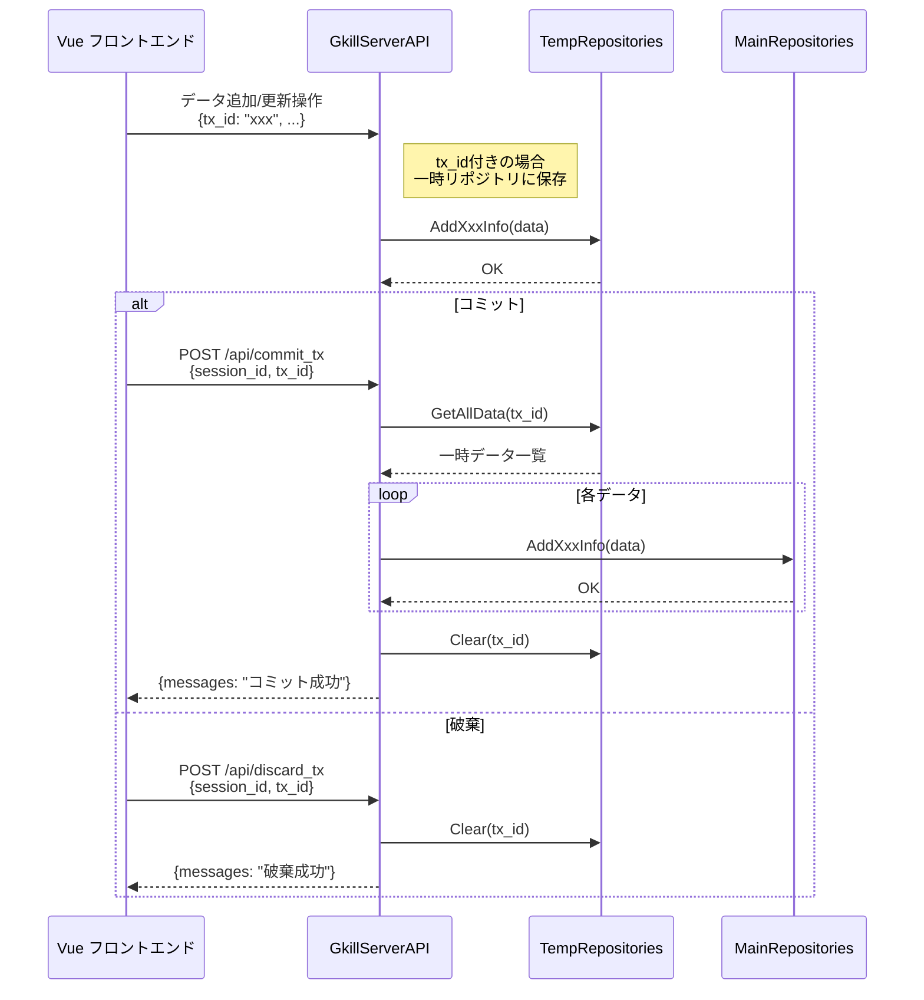
```mermaid
sequenceDiagram
    participant UI as Vue フロントエンド
    participant API as GkillServerAPI
    participant TempReps as TempRepositories
    participant MainReps as MainRepositories

    UI->>API: データ追加/更新操作<br>{tx_id: "xxx", ...}
    Note right of API: tx_id付きの場合<br>一時リポジトリに保存
    API->>TempReps: AddXxxInfo(data)
    TempReps-->>API: OK

    alt コミット
        UI->>API: POST /api/commit_tx<br>{session_id, tx_id}
        API->>TempReps: GetAllData(tx_id)
        TempReps-->>API: 一時データ一覧
        loop 各データ
            API->>MainReps: AddXxxInfo(data)
            MainReps-->>API: OK
        end
        API->>TempReps: Clear(tx_id)
        API-->>UI: {messages: "コミット成功"}
    else 破棄
        UI->>API: POST /api/discard_tx<br>{session_id, tx_id}
        API->>TempReps: Clear(tx_id)
        API-->>UI: {messages: "破棄成功"}
    end
```

---

## 20. プラグイン一覧取得（get_plugin_list）

> **呼び出し元は MCP のみ。** gkill のフロントエンドにこのエンドポイントを叩く導線は無い
> （`gkill-api.ts` に `get_plugin_list()` の定義はあるが呼び出し元が存在しない）。
> 設定ダイアログは `rep_name` をコンテキストメニューから直接受け取るため、一覧を引く必要がない。

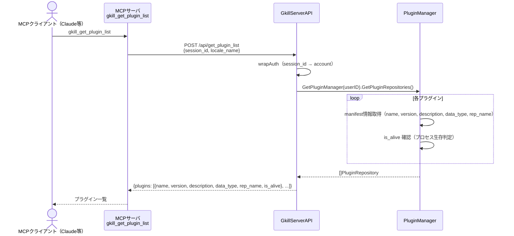
```mermaid
sequenceDiagram
    actor Client as MCPクライアント（Claude等）
    participant MCP as MCPサーバ<br>gkill_get_plugin_list
    participant API as GkillServerAPI
    participant PluginMgr as PluginManager

    Client->>MCP: gkill_get_plugin_list
    MCP->>API: POST /api/get_plugin_list<br>{session_id, locale_name}
    API->>API: wrapAuth（session_id → account）
    API->>PluginMgr: GetPluginManager(userID).GetPluginRepositories()
    loop 各プラグイン
        PluginMgr->>PluginMgr: manifest情報取得（name, version, description, data_type, rep_name）
        PluginMgr->>PluginMgr: is_alive 確認（プロセス生存判定）
    end
    PluginMgr-->>API: []PluginRepository
    API-->>MCP: {plugins: [{name, version, description, data_type, rep_name, is_alive}, ...]}
    MCP-->>Client: プラグイン一覧
```

---

## 21. プラグイン設定 HTML 取得（get_plugin_config_html）

> プラグイン Kyou を右クリック →「プラグイン設定」で `plugin-config-dialog.vue` が開き、
> このエンドポイントを呼ぶ。保存後にも呼び直して表示を更新する。

```mermaid
sequenceDiagram
    actor User as ユーザ
    participant UI as plugin-config-dialog.vue
    participant API as GkillServerAPI
    participant PluginRepo as pluginRepositoryImpl
    participant Plugin as プラグインバイナリ

    User->>UI: プラグイン設定ボタンを押す
    UI->>API: POST /api/get_plugin_config_html<br>{session_id, rep_name}
    API->>API: wrapAuth（session_id → account）
    API->>PluginRepo: rep_name でプラグインを検索
    PluginRepo->>PluginRepo: ensureStarted() — プロセス未起動なら起動
    PluginRepo->>PluginRepo: callCommand() — mu.Lock()
    PluginRepo->>Plugin: {"command":"get_config_html"} (stdin)
    Plugin->>Plugin: GetConfigHTML ハンドラ呼び出し<br>（設定フォームHTML生成）
    Plugin-->>PluginRepo: {"html":"<form>...</form>"} (stdout)
    PluginRepo->>PluginRepo: mu.Unlock()
    PluginRepo-->>API: html string
    API-->>UI: {html, messages, errors}
    UI->>UI: iframe srcdoc = html（設定フォーム表示）
    UI-->>User: 設定フォームを表示
```

---

## 22. プラグイン設定保存（post_plugin_config）

> iframe には `allow-same-origin` を与えていないので、設定フォームは自力で API を叩けない。
> iframe が `postMessage({ gkill_plugin_config: {...} })` で親に依頼し、親（ダイアログ）が
> このエンドポイントを呼ぶ。結果は `{ gkill_plugin_config_result: { ok, error } }` で iframe へ返す。
> MCP は `post_plugin_config` を公開していない（プラグインツールは読み取り専用）。

```mermaid
sequenceDiagram
    actor User as ユーザ
    participant UI as plugin-config-dialog.vue
    participant API as GkillServerAPI
    participant PluginRepo as pluginRepositoryImpl
    participant Plugin as プラグインバイナリ

    User->>UI: 設定フォーム送信
    Note right of UI: iframe内フォームの送信データを<br>form_data: Record<string,string> として収集
    UI->>API: POST /api/post_plugin_config<br>{session_id, rep_name, form_data}
    API->>API: wrapAuth（session_id → account）
    API->>PluginRepo: rep_name でプラグインを検索
    PluginRepo->>PluginRepo: callCommand() — mu.Lock()
    PluginRepo->>Plugin: {"command":"post_config","form_data":{...}} (stdin)
    Plugin->>Plugin: PostConfig ハンドラ呼び出し<br>SaveConfig() が config.json (0600) に書き込む
    Plugin-->>PluginRepo: {"id":"uuid"} (stdout)
    PluginRepo->>PluginRepo: mu.Unlock()
    PluginRepo-->>API: OK
    API-->>UI: {messages, errors}
    UI-->>User: 設定保存完了
```

`SaveConfig`（`plugin/sdk/config.go:57-70`）の書き込み先は
`manifest.json` と同じフォルダの `config.json`。cache.db ではない。
レスポンスは `pluginResponse{ID: req.ID}` で、`Pong` は `omitempty` のため出力されない。

---

## 23. プラグインコンテンツ HTML 取得

```mermaid
sequenceDiagram
    actor User as ユーザ
    participant UI as plugin-html-view.vue
    participant SW as Service Worker
    participant API as GkillServerAPI
    participant PluginRepo as pluginRepositoryImpl
    participant Plugin as プラグインバイナリ<br>(例: gkill_plugin_claudeai)

    User->>UI: KyouDetailView で PluginKyou 表示
    UI->>SW: POST /api/get_plugin_content_html<br>{session_id, rep_name, kyou_id}
    alt キャッシュヒット (/cache/api/plugin_content_html/{kyou_id})
        SW-->>UI: キャッシュ済み HTML
    else キャッシュミス
        SW->>API: POST /api/get_plugin_content_html
        API->>PluginRepo: GetContentHTML(ctx, kyouID)
        PluginRepo->>PluginRepo: callCommand() — mu.Lock()
        PluginRepo->>Plugin: {"command":"get_content_html","kyou_id":"..."} (stdin)
        Plugin->>Plugin: globalCache.GetMsgByID(pluginDir, src, kyouID)<br>（Claude Code は GetMessage(pluginDir, src, messageID)）
        Plugin-->>PluginRepo: {"html":"<!DOCTYPE html>..."} (stdout)
        PluginRepo->>PluginRepo: mu.Unlock()
        PluginRepo-->>API: html string
        API-->>SW: {html, messages, errors}
        SW->>SW: gkill-post-kyou-cache に保存
        SW-->>UI: {html}
    end
    UI->>UI: iframe srcdoc = html (レンダリング)
    UI->>UI: on_iframe_load() → postMessage({gkill_theme: 'dark'|'light'})
    Note right of UI: iframe が theme を受信し<br>data-theme 属性を更新 → CSS 変数切り替え
    UI-->>UI: iframe → postMessage({gkill_iframe_size:{width, height}})
    UI->>UI: iframe_content_height 更新 → iframe 高さ自動調整
```

### 23. MCP からのプラグイン本文取得（include_plugin_content）

プラグインKyouの本文は gkill 本体に保存されていない。`get_kyous` が返すのはメタデータと
`payload.kind="plugin"`（`rep_name` / `kyou_id`）だけなので、AI に本文を届けるには画面と同じく
`get_plugin_content_html` を経由する。かつては1件ずつ取る専用ツールがあったが、N件読むのに
ツール呼び出しが N+1 回必要で LLM のターンを浪費していたため、いまは `gkill_get_kyous` の
`include_plugin_content` で同じレスポンスへ埋め込む。表示用の CSS/JS がバイト数の大半を占めるため、
MCP 側は既定で HTML をプレーンテキストへ変換する。

同一プラグインへは必ず1件ずつ直列に投げる。gkill 側の `callCommand` は30秒のデッドラインを
`p.mu.Lock()` の前に張るので、同時発行するとロック待ちで期限を食い潰し、
期限切れ時の `Process.Kill()` でプラグインプロセスが落ちるためである。

```mermaid
sequenceDiagram
    actor Client as MCPクライアント（Claude等）
    participant MCP as MCPサーバ<br>gkill_get_kyous
    participant IN as inlinePluginContents
    participant HT as lib/html-text.mjs
    participant API as GkillServerAPI
    participant PluginRepo as pluginRepositoryImpl

    Client->>MCP: gkill_get_kyous<br>{query, include_plugin_content:true, plugin_content_format?}
    MCP->>API: POST /api/get_kyous_mcp
    API-->>MCP: {kyous[], total_count, ...}
    MCP->>IN: inlinePluginContents(call, kyous)
    IN->>IN: kind="plugin" のペイロードを集め<br>rep_name でグループ化（rep内は直列 / rep間は並列4）
    loop 同一repのKyouを1件ずつ（最大20件・全体30秒）
        IN->>API: POST /api/get_plugin_content_html<br>{rep_name, kyou_id}
        API->>PluginRepo: GetContentHTML(ctx, kyouID)
        PluginRepo-->>API: html string
        API-->>IN: {html, messages, errors}
        alt 成功
            IN->>HT: htmlToText(html)
            HT-->>IN: text（既定 4000 文字で打ち切り）
            IN->>IN: payload.content_text / content_status="ok"|"truncated"
        else 失敗
            IN->>IN: payload.content_status="error"<br>そのrepの残りは投げず "rep_error" で skip
        end
    end
    IN-->>MCP: {requested, inlined, truncated, skipped, errors}
    MCP-->>Client: kyous[]（本文入り） + plugin_content 集計
```

---

## 異常系シーケンス

以下は正常系シーケンスに対応するエラーパターン。全エンドポイント共通のエラー処理パターンも含む。

### E1. 認証失敗（ログイン）

```mermaid
sequenceDiagram
    actor User as ユーザ
    participant UI as Vue フロントエンド
    participant API as GkillServerAPI
    participant AccDAO as AccountDAO

    User->>UI: ユーザID・パスワード入力
    UI->>API: POST /api/login<br>{user_id, password_sha256}

    alt JSONパースエラー
        API-->>UI: {errors: [{error_code: "ERR000001"}]}
        UI-->>User: リクエストデータ不正エラー表示
    else アカウント未存在
        API->>AccDAO: GetAccount(user_id)
        AccDAO-->>API: nil
        API-->>UI: {errors: [{error_code: "ERR000002"}]}
        UI-->>User: アカウント未存在エラー表示
    else アカウント無効
        API->>AccDAO: GetAccount(user_id)
        AccDAO-->>API: Account (IsEnable=false)
        API-->>UI: {errors: [{error_code: "ERR000003"}]}
        UI-->>User: アカウント無効エラー表示
    else パスワードリセット中
        API-->>UI: {errors: [{error_code: "ERR000004"}]}
        UI-->>User: パスワードリセット中エラー表示
    else パスワード不一致
        API->>API: Argon2id照合 → 不一致
        API-->>UI: {errors: [{error_code: "ERR000005"}]}
        UI-->>User: パスワード不正エラー表示
    end
```

### E2. セッション検証失敗（全認証済みエンドポイント共通）

```mermaid
sequenceDiagram
    participant UI as Vue フロントエンド
    participant API as GkillServerAPI
    participant SesDAO as LoginSessionDAO
    participant AccDAO as AccountDAO

    UI->>API: POST /api/xxx<br>{session_id: "invalid-or-expired"}
    API->>SesDAO: GetLoginSession(session_id)

    alt セッション未存在
        SesDAO-->>API: nil
        API-->>UI: {errors: [{error_code: "ERR000013",<br>error_message: "セッションが見つかりません"}]}
        UI-->>User: ログイン画面へリダイレクト
    else セッション有効期限切れ
        SesDAO-->>API: LoginSession
        API->>API: ExpirationTime < 現在時刻
        API-->>UI: {errors: [{error_code: "ERR000373",<br>error_message: "セッションの有効期限が切れています"}]}
        UI-->>User: ログイン画面へリダイレクト
    else アカウント無効化（セッション有効だが）
        SesDAO-->>API: LoginSession
        API->>AccDAO: GetAccount(session.UserID)
        AccDAO-->>API: Account (IsEnable=false)
        API-->>UI: {errors: [{error_code: "ERR000238"}]}
        UI-->>User: アカウント無効エラー表示
    end
```

### E3. データ操作時のバリデーションエラー

```mermaid
sequenceDiagram
    participant UI as Vue フロントエンド
    participant API as GkillServerAPI
    participant Reps as Repositories

    UI->>API: POST /api/add_xxx または update_xxx<br>{session_id, ...data}

    alt JSONパースエラー
        API-->>UI: {errors: [{error_code: "ERR000097等",<br>error_message: "リクエストデータ不正"}]}
        Note right of API: データ型ごとに固有コード<br>例: Kmemo=ERR000097<br>TimeIs=ERR000039<br>Mi=ERR000085
    else デバイス取得失敗
        API->>API: getDevice()
        API-->>UI: {errors: [{error_code: "ERR000220",<br>error_message: "デバイス情報取得失敗"}]}
    else リポジトリ取得失敗
        API->>Reps: GetRepositories(user_id)
        Reps-->>API: error
        API-->>UI: {errors: [{error_code: "ERR000018",<br>error_message: "リポジトリ取得失敗"}]}
    else DB書き込みエラー
        API->>Reps: AddXxxInfo(data)
        Reps-->>API: error
        API-->>UI: {errors: [{error_code: "ERR000023等",<br>error_message: "保存失敗"}]}
        Note right of API: データ型ごとに固有コード<br>例: Kmemo=ERR000023<br>TimeIs=ERR000037<br>Mi=ERR000083
    end

    Note over UI: errors配列の内容をUIに表示
```

### E4. ローカルアクセス制限

```mermaid
sequenceDiagram
    participant Client as リモートクライアント
    participant API as GkillServerAPI
    participant Config as ServerConfig

    Client->>API: POST /api/open_directory<br>(リモートIPから)
    API->>Config: IsLocalOnlyAccess?
    Config-->>API: true

    API->>API: filterLocalOnly()<br>r.RemoteAddr = "192.168.1.100:xxxxx"
    API->>API: ホスト判定:<br>localhost / 127.0.0.1 / [::1] に不一致

    API-->>Client: HTTP 403 Forbidden
```

### E5. KFTL テキスト送信エラー

```mermaid
sequenceDiagram
    participant UI as Vue フロントエンド
    participant API as GkillServerAPI
    participant KFTL as KFTLParser

    UI->>API: POST /api/submit_kftl_text<br>{session_id, kftl_text}

    alt JSONパースエラー
        API-->>UI: {errors: [{error_code: "ERR000350"}]}
    else セッション検証失敗
        API-->>UI: {errors: [{error_code: "ERR000013"}]}
    else デバイス取得失敗
        API-->>UI: {errors: [{error_code: "ERR000220"}]}
    else パース/保存エラー
        API->>KFTL: GenerateAndExecuteRequests(kftl_text)
        KFTL-->>API: error
        API-->>UI: {errors: [{error_code: "ERR000351",<br>error_message: "KFTLテキスト処理エラー"}]}
    end
```
