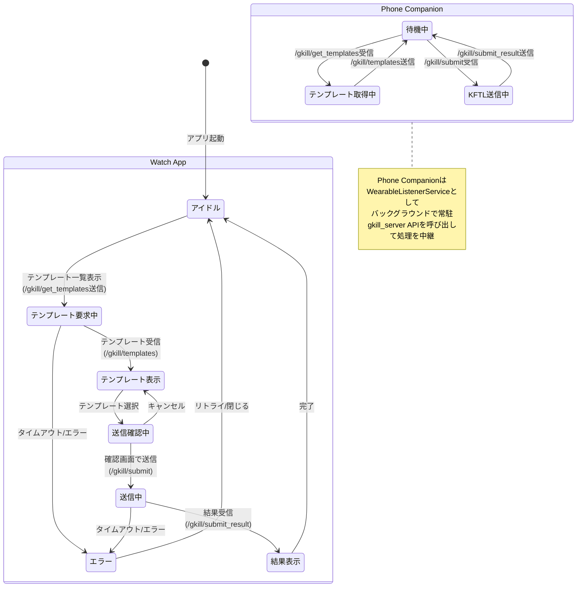
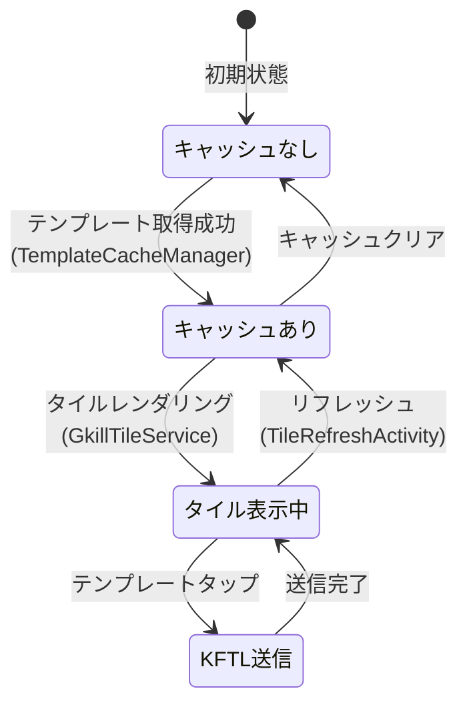

# gkill ステートマシン図

コードの実装から抽出した主要エンティティ・プロセスの状態遷移。

## 1. TimeIs の状態遷移

TimeIs はタイムスタンプ（打刻）データ型。`START_TIME` と `END_TIME` の値で状態が決まる。

```mermaid
stateDiagram-v2
    [*] --> 未記録: 初期状態

    未記録 --> 実行中: AddTimeis<br>(START_TIME設定, END_TIME=null)

    実行中 --> 終了済み: UpdateTimeis<br>(END_TIME設定)

    実行中 --> 論理削除: UpdateTimeis<br>(IS_DELETED=true)

    終了済み --> 終了済み: UpdateTimeis<br>(タイトル等の編集)<br>Append-Onlyで新レコードINSERT

    終了済み --> 論理削除: UpdateTimeis<br>(IS_DELETED=true)

    state 実行中 {
        note right of 実行中
            END_TIME = null
            /plaing ページに表示される
            終了操作が可能
        end note
    }

    state 終了済み {
        note right of 終了済み
            END_TIME != null
            rykv/dnote で閲覧可能
            経過時間 = END_TIME - START_TIME
        end note
    }

    state 論理削除 {
        note right of 論理削除
            IS_DELETED = true
            検索結果から除外
            履歴からは参照可能
        end note
    }
```

### KFTL での TimeIs 状態遷移

KFTL テキスト経由では以下のプレフィックスで状態遷移:

| プレフィックス | 操作 | 遷移 |
|-------------|------|------|
| `ーた` | TimeIs Start | 未記録 → 実行中（START_TIMEのみ） |
| `ーえ` | TimeIs End | 実行中 → 終了済み（タイトル指定） |
| `ーいえ` | TimeIs End If Exist | 実行中 → 終了済み（存在する場合のみ） |
| `ーたえ` | TimeIs End By Tag | 実行中 → 終了済み（タグ名指定） |
| `ーいたえ` | TimeIs End By Tag If Exist | 実行中 → 終了済み（タグ名指定、存在する場合のみ） |
| `ーち` | TimeIs | 未記録 → 終了済み（START+END 同時設定） |

## 2. Mi（タスク）の状態遷移

Mi はタスク管理データ型。`IS_CHECKED` フラグで完了状態が決まる。

```mermaid
stateDiagram-v2
    [*] --> 未完了: AddMi<br>(IS_CHECKED=false)

    未完了 --> 完了: UpdateMi<br>(IS_CHECKED=true)
    完了 --> 未完了: UpdateMi<br>(IS_CHECKED=false)

    未完了 --> 未完了: UpdateMi<br>(タイトル/期限等の編集)
    完了 --> 完了: UpdateMi<br>(タイトル/期限等の編集)

    未完了 --> 論理削除: UpdateMi<br>(IS_DELETED=true)
    完了 --> 論理削除: UpdateMi<br>(IS_DELETED=true)

    state 未完了 {
        note right of 未完了
            IS_CHECKED = false
            Mi画面のボードに表示
            チェック操作が可能
        end note
    }

    state 完了 {
        note right of 完了
            IS_CHECKED = true
            CHECK_TIME が記録される
            フィルタで表示/非表示切替可能
        end note
    }
```

### Mi の表示フィルタ（MiCheckState）

Mi 画面では `MiCheckState` で表示対象を絞り込み:

| フィルタ | 表示対象 |
|---------|---------|
| 全て | 完了 + 未完了 |
| 未完了のみ | IS_CHECKED = false |
| 完了のみ | IS_CHECKED = true |

### Mi のソート（MiSortType）

| ソート | 基準 |
|-------|------|
| 期限順 | LIMIT_TIME |
| 作成日時順 | CREATE_TIME |
| 更新日時順 | UPDATE_TIME |

## 3. セッションの状態遷移

```mermaid
stateDiagram-v2
    [*] --> 未認証: アプリケーション起動

    未認証 --> 認証済み: Login成功<br>(session_id発行)

    認証済み --> 未認証: Logout<br>(session削除)

    認証済み --> 期限切れ: 30日経過<br>(EXPIRATION_TIME超過)

    期限切れ --> 未認証: 再ログイン必要

    認証済み --> 認証済み: API呼び出し<br>(session_id検証OK)

    state 未認証 {
        note right of 未認証
            ログイン画面を表示
            /shared_page, /shared_mi は
            認証なしでアクセス可能
        end note
    }

    state 認証済み {
        note right of 認証済み
            session_id をCookieに保持
            全API呼び出しにsession_idを付与
            IS_LOCAL_APP_USERフラグで
            ローカルアクセスかを区別
        end note
    }

    state 期限切れ {
        note right of 期限切れ
            EXPIRATION_TIME < 現在時刻
            API呼び出しが認証エラーになる
        end note
    }
```

### セッション特殊ケース

- **URLog ブックマークレット用セッション**: ログイン時に自動作成。ブックマークレットからの URLog 追加に使用
- **ローカルアプリユーザ**: `IS_LOCAL_APP_USER=true`。localhost/127.0.0.1/[::1] からのアクセス

## 4. KFTL パース時の行状態遷移

kftlFactory の `prevLineIsMetaInfo` フラグに基づく行解釈の状態遷移。

```mermaid
stateDiagram-v2
    [*] --> メタ情報行: factory初期化<br>(prevLineIsMetaInfo=true)

    メタ情報行 --> メタ情報行: タグ行「。」<br>テキスト行「ーー」<br>関連時刻行「？」
    メタ情報行 --> データ行: データ型プレフィックス<br>(ーか, ーみ, ーら, etc.)
    メタ情報行 --> データ行: Kmemo行<br>(プレフィックスなし)

    データ行 --> メタ情報行: 区切り行「、」<br>(新ステートメント開始)
    データ行 --> データ行: データ型固有の後続行<br>(タイトル, 数値, URL等)

    state メタ情報行 {
        note right of メタ情報行
            prevLineIsMetaInfo = true
            次の行がメタ情報かデータかを
            プレフィックスで判定
        end note
    }

    state データ行 {
        note right of データ行
            prevLineIsMetaInfo = false
            現在のデータ型に応じた
            後続行を処理
            (KC:タイトル→数値, Mi:タイトル→期限, etc.)
        end note
    }
```

### データ型別の行シーケンス

各データ型のKFTL入力は複数行で構成される:

| データ型 | 行シーケンス |
|---------|------------|
| Kmemo | (テキスト内容) |
| KC | `ーか` → タイトル → 数値 |
| Lantana | `ーら` → 気分値(0-10) |
| Mi | `ーみ` → タイトル → [ボード名] → [期限] → [開始予定] → [終了予定] |
| Nlog | `ーん` → タイトル → 店名 → 金額 |
| URLog | `ーう` → タイトル → URL |
| TimeIs | `ーち` → タイトル → [開始時刻] → [終了時刻] |
| TimeIs Start | `ーた` → タイトル |
| TimeIs End | `ーえ` → タイトル |
| Tag | `。タグ名` |
| Text | `ーー` → テキスト内容 → `ーー`(終了) |
| Related Time | `？時刻` |
| Split | `、` |

## 5. Wear OS 通信の状態遷移



### Wear OS タイルの状態



## 6. 全 Kyou データの共通ライフサイクル

```mermaid
stateDiagram-v2
    [*] --> 存在: AddXxxInfo<br>(新規レコードINSERT)

    存在 --> 存在: UpdateXxxInfo<br>(同一IDで新レコードINSERT)<br>Append-Only

    存在 --> 論理削除: UpdateXxxInfo<br>(IS_DELETED=true)

    論理削除 --> 存在: UpdateXxxInfo<br>(IS_DELETED=false)<br>※復元操作

    state 存在 {
        v1: バージョン1<br>(CREATE_TIME)
        v2: バージョン2<br>(UPDATE_TIME > v1)
        v3: バージョン3<br>(UPDATE_TIME > v2)
        v1 --> v2: 更新
        v2 --> v3: 更新
        note right of v3
            最新のUPDATE_TIMEを持つ
            レコードが有効データ
            過去バージョンは履歴として保持
        end note
    }

    state 論理削除 {
        note right of 論理削除
            IS_DELETED = true の
            レコードがINSERTされる
            検索結果から除外される
            履歴ダイアログからは参照可能
        end note
    }
```
