# gkill ステートマシン図

コードの実装から抽出した主要エンティティ・プロセスの状態遷移。

## 1. TimeIs の状態遷移

TimeIs はタイムスタンプ（打刻）データ型。`START_TIME` と `END_TIME` の値で状態が決まる。

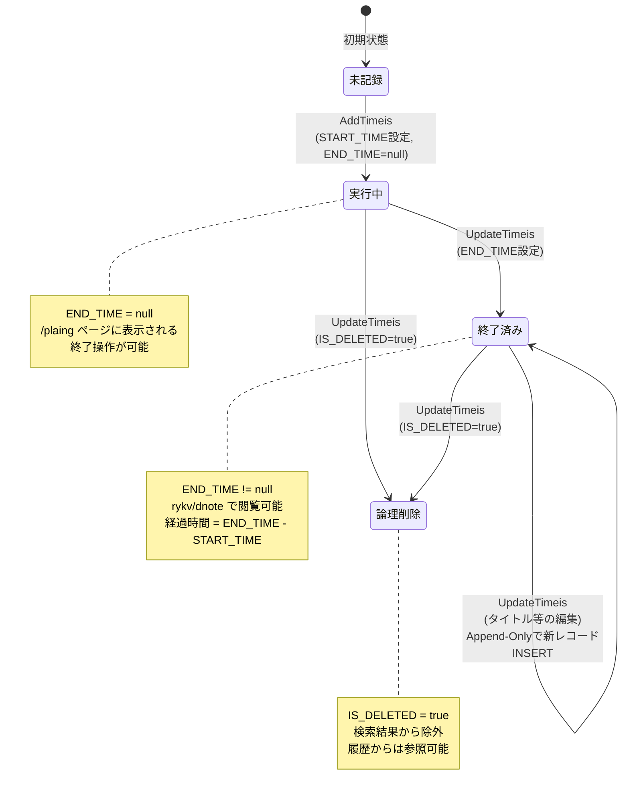
```mermaid
stateDiagram-v2
    [*] --> 未記録: 初期状態

    未記録 --> 実行中: AddTimeis<br>(START_TIME設定, END_TIME=null)

    実行中 --> 終了済み: UpdateTimeis<br>(END_TIME設定)

    実行中 --> 論理削除: UpdateTimeis<br>(IS_DELETED=true)

    終了済み --> 終了済み: UpdateTimeis<br>(タイトル等の編集)<br>Append-Onlyで新レコードINSERT

    終了済み --> 論理削除: UpdateTimeis<br>(IS_DELETED=true)

    note right of 実行中
        END_TIME = null
        /plaing ページに表示される
        終了操作が可能
    end note

    note right of 終了済み
        END_TIME != null
        rykv/dnote で閲覧可能
        経過時間 = END_TIME - START_TIME
    end note

    note right of 論理削除
        IS_DELETED = true
        検索結果から除外
        履歴からは参照可能
    end note
```

### KFTL での TimeIs 状態遷移

KFTL テキスト経由では以下のプレフィックスで状態遷移:

| 日本語 | ASCII | 操作 | 遷移 |
|---|---|------|------|
| `ーた` | `/start` | TimeIs Start | 未記録 → 実行中（START_TIMEのみ） |
| `ーえ` | `/end` | TimeIs End | 実行中 → 終了済み（タイトル指定） |
| `ーいえ` | `/end?` | TimeIs End If Exist | 実行中 → 終了済み（存在する場合のみ） |
| `ーたえ` | `/endt` | TimeIs End By Tag | 実行中 → 終了済み（タグ名指定） |
| `ーいたえ` | `/endt?` | TimeIs End By Tag If Exist | 実行中 → 終了済み（タグ名指定、存在する場合のみ） |
| `ーち` | `/timeis` | TimeIs | 未記録 → 終了済み（START+END 同時設定） |

## 2. Mi（タスク）の状態遷移

Mi はタスク管理データ型。`IS_CHECKED` フラグで完了状態が決まる。

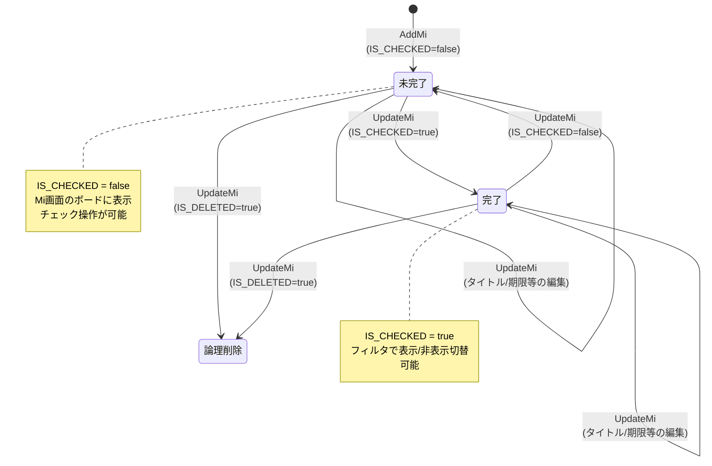
```mermaid
stateDiagram-v2
    [*] --> 未完了: AddMi<br>(IS_CHECKED=false)

    未完了 --> 完了: UpdateMi<br>(IS_CHECKED=true)
    完了 --> 未完了: UpdateMi<br>(IS_CHECKED=false)

    未完了 --> 未完了: UpdateMi<br>(タイトル/期限等の編集)
    完了 --> 完了: UpdateMi<br>(タイトル/期限等の編集)

    未完了 --> 論理削除: UpdateMi<br>(IS_DELETED=true)
    完了 --> 論理削除: UpdateMi<br>(IS_DELETED=true)

    note right of 未完了
        IS_CHECKED = false
        Mi画面のボードに表示
        チェック操作が可能
    end note

    note right of 完了
        IS_CHECKED = true
        フィルタで表示/非表示切替可能
    end note
```

### Mi の表示フィルタ（MiCheckState）

Mi 画面では `MiCheckState` で表示対象を絞り込み:

| フィルタ | 表示対象 |
|---------|---------|
| 全て | 完了 + 未完了 |
| 未完了のみ | IS_CHECKED = false |
| 完了のみ | IS_CHECKED = true |

### Mi のソート（MiSortType）

`src/client/classes/api/find_query/mi-sort-type.ts` の enum に定義されている4種。

| ソート | 値 |
|-------|------|
| 作成日時順 | `create_time` |
| 見積開始時刻順 | `estimate_start_time` |
| 見積終了時刻順 | `estimate_end_time` |
| 期限順 | `limit_time` |

`update_time` によるソートは存在しない。

### ボードのチェックボックス状態（CheckState）

表示フィルタの `MiCheckState`（`{ all, checked, uncheck }`）とは別に、
ボード上のチェックボックス UI 用の三状態がある（`src/client/pages/views/check-state.ts`）。

| 状態 | 意味 |
|---|---|
| `checked` | 配下が全て完了 |
| `unchecked` | 配下が全て未完了 |
| `indeterminate` | 完了と未完了が混在 |

## 3. セッションの状態遷移

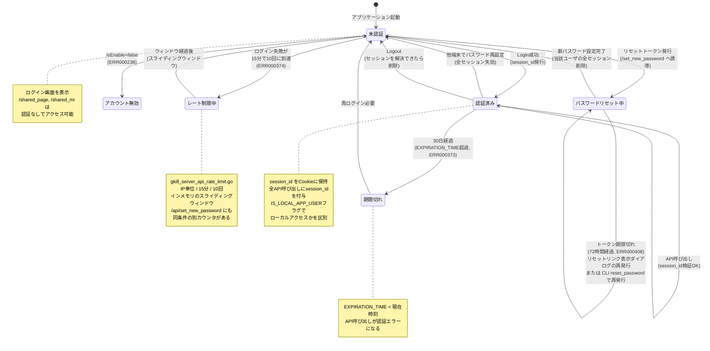
```mermaid
stateDiagram-v2
    [*] --> 未認証: アプリケーション起動

    未認証 --> 認証済み: Login成功<br>(session_id発行)
    未認証 --> レート制限中: ログイン失敗が<br>15分で10回に到達<br>(ERR000374)
    レート制限中 --> 未認証: ウィンドウ経過後<br>(スライディングウィンドウ)

    未認証 --> アカウント無効: IsEnable=false<br>(ERR000238)
    未認証 --> パスワードリセット中: リセットトークン発行<br>(/set_new_password へ誘導)
    パスワードリセット中 --> 未認証: 新パスワード設定完了<br>(当該ユーザの全セッション削除)
    パスワードリセット中 --> パスワードリセット中: トークン期限切れ<br>(72時間経過, ERR000408)<br>リセットリンク表示ダイアログの再発行<br>または CLI reset_password で再発行

    認証済み --> 未認証: 他端末でパスワード再設定<br>(全セッション失効)

    認証済み --> 未認証: Logout<br>(セッションを解決できたら削除)

    認証済み --> 期限切れ: 30日経過<br>(EXPIRATION_TIME超過, ERR000373)

    期限切れ --> 未認証: 再ログイン必要

    認証済み --> 認証済み: API呼び出し<br>(session_id検証OK)

    note right of レート制限中
        gkill_server_api_rate_limit.go
        IP単位 / 15分 / 10回
        インメモリのスライディングウィンドウ
        /api/set_new_password にも
        同条件の別カウンタがある
    end note

    note right of 未認証
        ログイン画面を表示
        /shared_page, /shared_mi は
        認証なしでアクセス可能
    end note

    note right of 認証済み
        session_id をCookieに保持
        全API呼び出しにsession_idを付与
        IS_LOCAL_APP_USERフラグで
        ローカルアクセスかを区別
    end note

    note right of 期限切れ
        EXPIRATION_TIME < 現在時刻
        API呼び出しが認証エラーになる
    end note
```

### セッション特殊ケース

- **URLog ブックマークレット用セッション**: ログイン時に自動作成。ブックマークレットからの URLog 追加に使用
- **ローカルアプリユーザ**: `IS_LOCAL_APP_USER=true`。localhost/127.0.0.1/[::1] からのアクセス

## 4. KFTL パース時の行状態遷移

kftlFactory の `prev_line_is_meta_info` フラグに基づく行解釈の状態遷移。

> **初期値に注意:** コンストラクタは `prev_line_is_meta_info = false` で初期化する。
> `true` にするのは `reset()` のみ（`kftl-statement-line-constructor-factory.ts`）。

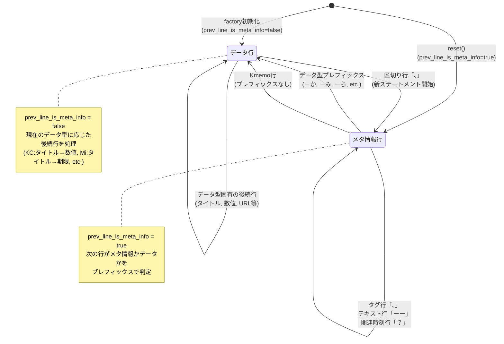
```mermaid
stateDiagram-v2
    [*] --> データ行: factory初期化<br>(prev_line_is_meta_info=false)
    [*] --> メタ情報行: reset()<br>(prev_line_is_meta_info=true)

    メタ情報行 --> メタ情報行: タグ行「。」<br>テキスト行「ーー」<br>関連時刻行「？」
    メタ情報行 --> データ行: データ型プレフィックス<br>(ーか, ーみ, ーら, etc.)
    メタ情報行 --> データ行: Kmemo行<br>(プレフィックスなし)

    データ行 --> メタ情報行: 区切り行「、」<br>(新ステートメント開始)
    データ行 --> データ行: データ型固有の後続行<br>(タイトル, 数値, URL等)

    note right of メタ情報行
        prev_line_is_meta_info = true
        次の行がメタ情報かデータかを
        プレフィックスで判定
    end note

    note right of データ行
        prev_line_is_meta_info = false
        現在のデータ型に応じた
        後続行を処理
        (KC:タイトル→数値, Mi:タイトル→期限, etc.)
    end note
```

### データ型別の行シーケンス

各データ型のKFTL入力は複数行で構成される:

| データ型 | 行シーケンス（日本語 / ASCII） |
|---------|------------|
| Kmemo | (テキスト内容。プレフィックスなし) |
| KC | `ーか` / `/num` → タイトル → 数値 |
| Lantana | `ーら` / `/mood` → 気分値(0-10) |
| Mi | `ーみ` / `/mi` → タイトル → [ボード名] → [期限] → [開始予定] → [終了予定] |
| Nlog | `ーん` / `/expense` → 店名 → タイトル → 金額 |
| URLog | `ーう` / `/url` → タイトル → URL |
| TimeIs | `ーち` / `/timeis` → タイトル → [開始時刻] → [終了時刻] |
| TimeIs Start | `ーた` / `/start` → タイトル |
| TimeIs End | `ーえ` / `/end` → タイトル |
| TimeIs End If Exist | `ーいえ` / `/end?` → タイトル |
| TimeIs End By Tag | `ーたえ` / `/endt` → タグ名 |
| TimeIs End By Tag If Exist | `ーいたえ` / `/endt?` → タグ名 |
| Tag | `。タグ名` / `#タグ名` |
| Text | `ーー` / `--` → テキスト内容 → `ーー` / `--`(終了) |
| Related Time | `？時刻` / `?時刻` |
| Split | `、` / `,` |
| Split (+1秒) | `、、` / `,,` |
| Save | `！` / `!` |

## 5. Wear OS 通信の状態遷移

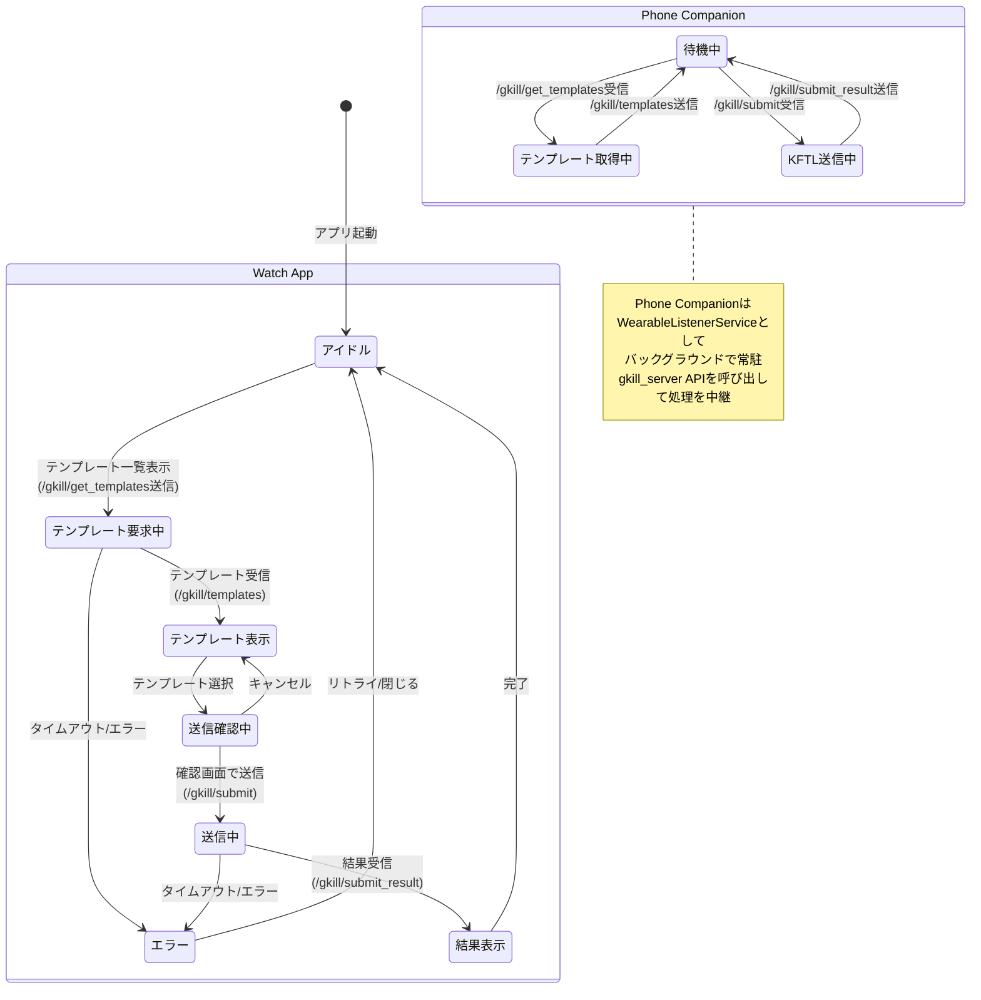
```mermaid
stateDiagram-v2
    [*] --> アイドル: アプリ起動

    state "Watch App" as watch {
        アイドル --> テンプレート要求中: テンプレート一覧表示<br>(/gkill/get_templates送信)
        テンプレート要求中 --> テンプレート表示: テンプレート受信<br>(/gkill/templates)
        テンプレート要求中 --> エラー: タイムアウト/エラー

        テンプレート表示 --> 送信確認中: テンプレート選択
        送信確認中 --> 送信中: 確認画面で送信<br>(/gkill/submit)
        送信確認中 --> テンプレート表示: キャンセル

        送信中 --> 結果表示: 結果受信<br>(/gkill/submit_result)
        送信中 --> エラー: タイムアウト/エラー

        結果表示 --> アイドル: 完了
        エラー --> アイドル: リトライ/閉じる
    }

    state "Phone Companion" as phone {
        待機中 --> テンプレート取得中: /gkill/get_templates受信
        テンプレート取得中 --> 待機中: /gkill/templates送信

        待機中 --> KFTL送信中: /gkill/submit受信
        KFTL送信中 --> 待機中: /gkill/submit_result送信
    }

    note right of phone
        Phone CompanionはWearableListenerServiceとして
        バックグラウンドで常駐
        gkill_server APIを呼び出して処理を中継
    end note
```

### Wear OS テンプレートキャッシュの状態

タイル（`GkillTileService`）は「記録する」「実行中」への導線を出すだけで、テンプレートは並べない。
キャッシュを持ち、読み書きするのはウォッチアプリの `MainActivity`。

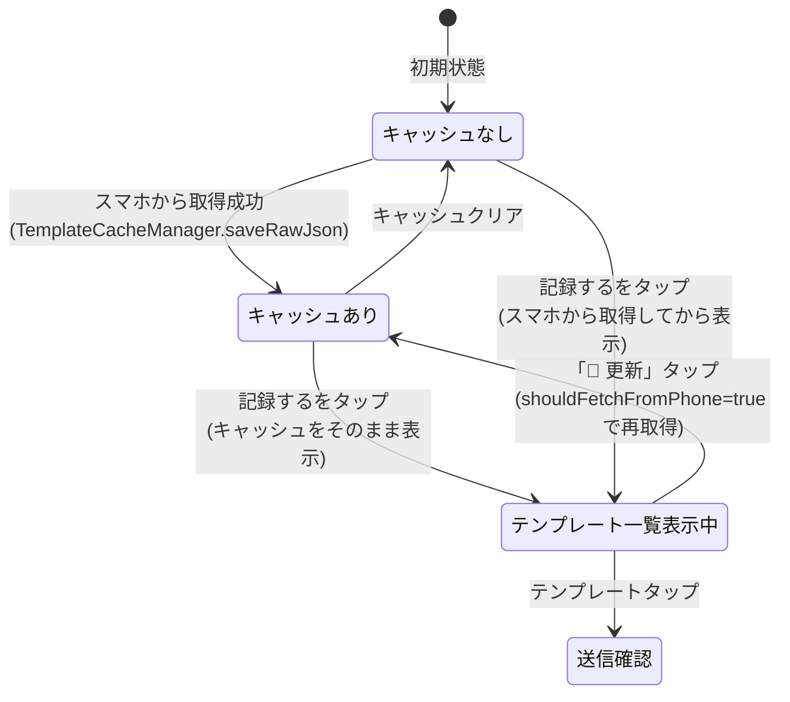
```mermaid
stateDiagram-v2
    [*] --> キャッシュなし: 初期状態

    キャッシュなし --> キャッシュあり: スマホから取得成功<br>(TemplateCacheManager.saveRawJson)

    キャッシュあり --> テンプレート一覧表示中: 記録するをタップ<br>(キャッシュをそのまま表示)
    キャッシュなし --> テンプレート一覧表示中: 記録するをタップ<br>(スマホから取得してから表示)

    テンプレート一覧表示中 --> 送信確認: テンプレートタップ

    テンプレート一覧表示中 --> キャッシュあり: 「🔄 更新」タップ<br>(shouldFetchFromPhone=true で再取得)

    キャッシュあり --> キャッシュなし: キャッシュクリア
```

## 6. 全 Kyou データの共通ライフサイクル

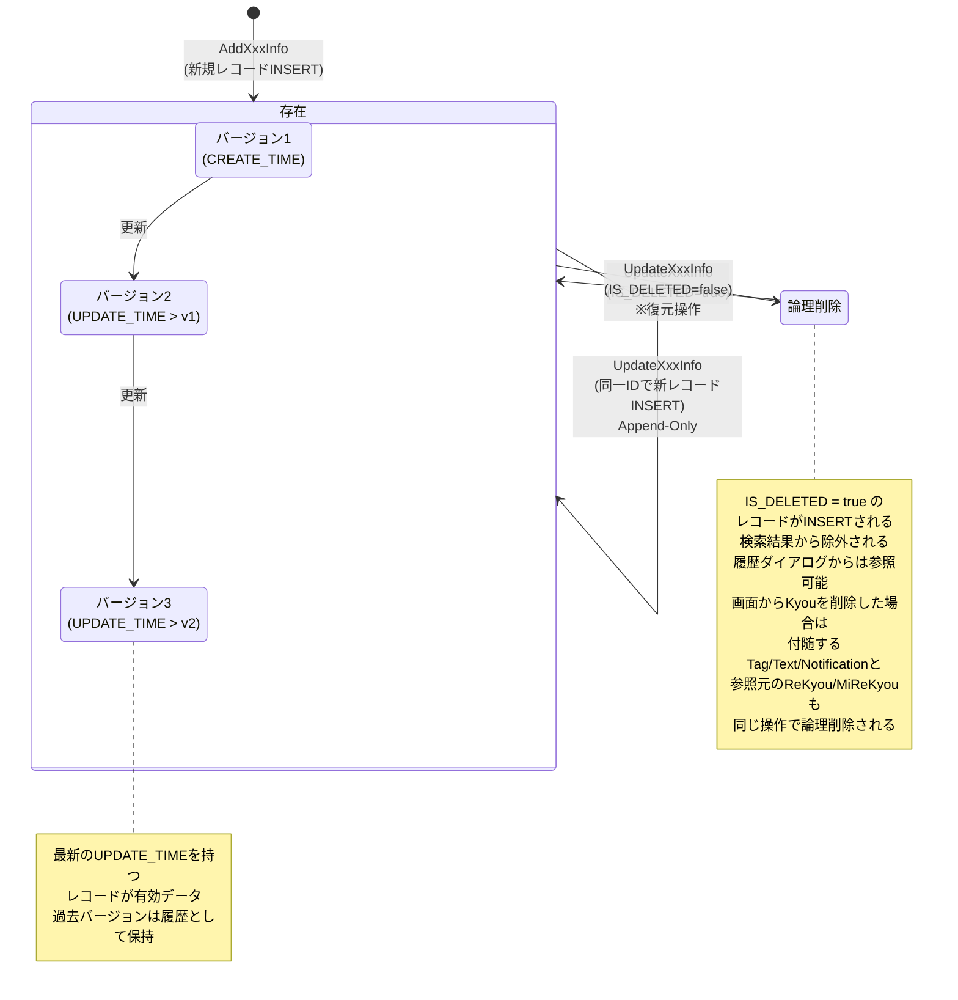
```mermaid
stateDiagram-v2
    [*] --> 存在: AddXxxInfo<br>(新規レコードINSERT)

    存在 --> 存在: UpdateXxxInfo<br>(同一IDで新レコードINSERT)<br>Append-Only

    存在 --> 論理削除: UpdateXxxInfo<br>(IS_DELETED=true)

    論理削除 --> 存在: UpdateXxxInfo<br>(IS_DELETED=false)<br>※復元操作

    state 存在 {
        v1: バージョン1<br>(CREATE_TIME)
        v2: バージョン2<br>(UPDATE_TIME > v1)
        v3: バージョン3<br>(UPDATE_TIME > v2)
        v1 --> v2: 更新
        v2 --> v3: 更新
        note right of v3
            最新のUPDATE_TIMEを持つ
            レコードが有効データ
            過去バージョンは履歴として保持
        end note
    }

    note right of 論理削除
        IS_DELETED = true の
        レコードがINSERTされる
        検索結果から除外される
        履歴ダイアログからは参照可能
        画面からKyouを削除した場合は
        付随するTag/Text/Notificationと
        参照元のReKyou/MiReKyouも
        同じ操作で論理削除される
    end note
```

## 7. MiReKyou（既存記録のタスク化）の状態遷移

MiReKyou は Mi と同じ完了/期限のライフサイクルを持つが、`target_id` で別の Kyou を指すため
**対象 Kyou が失われた状態**という Mi には無い状態を持つ。タイトルを持たず、
表示は対象 Kyou を描画することで成立する。

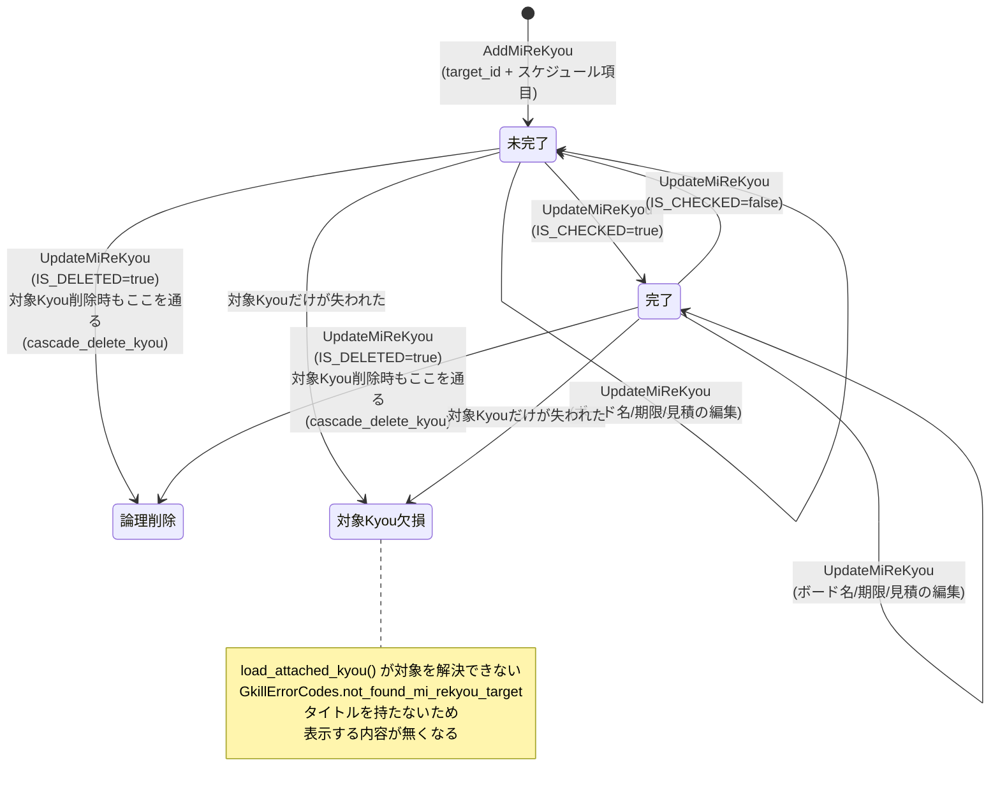
```mermaid
stateDiagram-v2
    [*] --> 未完了: AddMiReKyou<br>(target_id + スケジュール項目)

    未完了 --> 完了: UpdateMiReKyou<br>(IS_CHECKED=true)
    完了 --> 未完了: UpdateMiReKyou<br>(IS_CHECKED=false)

    未完了 --> 未完了: UpdateMiReKyou<br>(ボード名/期限/見積の編集)
    完了 --> 完了: UpdateMiReKyou<br>(ボード名/期限/見積の編集)

    未完了 --> 論理削除: UpdateMiReKyou<br>(IS_DELETED=true)<br>対象Kyou削除時もここを通る<br>(cascade_delete_kyou)
    完了 --> 論理削除: UpdateMiReKyou<br>(IS_DELETED=true)<br>対象Kyou削除時もここを通る<br>(cascade_delete_kyou)

    未完了 --> 対象Kyou欠損: 対象Kyouだけが失われた
    完了 --> 対象Kyou欠損: 対象Kyouだけが失われた

    note right of 対象Kyou欠損
        load_attached_kyou() が対象を解決できない
        GkillErrorCodes.not_found_mi_rekyou_target
        タイトルを持たないため
        表示する内容が無くなる
    end note
```

**画面から対象 Kyou を削除したときは「対象Kyou欠損」にはならない。** その MiReKyou も連鎖して
論理削除される（MiReKyou を先に、対象 Kyou 自身を最後に消す）。「対象Kyou欠損」に落ちるのは、
連鎖削除が途中で失敗して部分確定した場合や、MCP・他クライアントから対象 Kyou だけを消した場合。

### DATA_TYPE の射影

MiReKyou は Mi と同様、1レコードから複数の時刻観点で射影される。
`DATA_TYPE` はその観点を表す。

| DATA_TYPE | RELATED_TIME の導出元 |
|---|---|
| `mirekyou_create` | `CREATE_TIME` |
| `mirekyou_check` | `UPDATE_TIME` |
| `mirekyou_limit` | `LIMIT_TIME` |
| `mirekyou_start` | `ESTIMATE_START_TIME` |
| `mirekyou_end` | `ESTIMATE_END_TIME` |

> いずれも `mi` で始まるため、`DATA_TYPE` を前方一致で判定する箇所では
> **`mirekyou` を `mi` より先に**評価しないと Mi として誤判定される。

## 8. プラグインプロセスのライフサイクル

`pluginRepositoryImpl`（`src/server/gkill/dao/reps/plugin_repository_impl.go`）が管理する
サブプロセスの状態遷移。

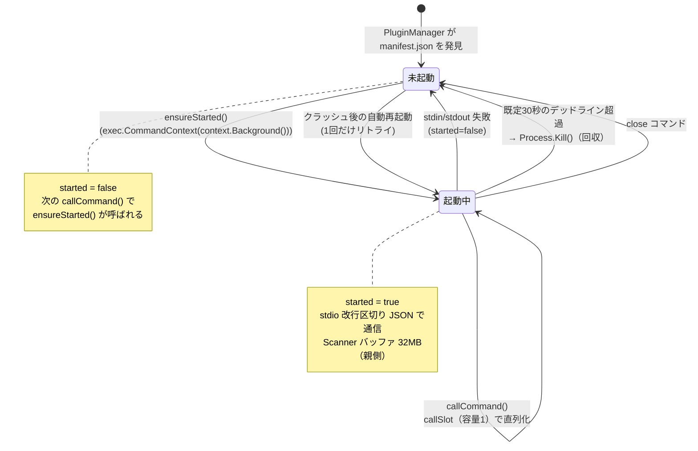
```mermaid
stateDiagram-v2
    [*] --> 未起動: PluginManager が manifest.json を発見

    未起動 --> 起動中: ensureStarted()<br>(exec.CommandContext(context.Background()))

    起動中 --> 起動中: callCommand()<br>callSlot（容量1）で直列化

    起動中 --> 未起動: stdin/stdout 失敗<br>(started=false)
    起動中 --> 未起動: 既定30秒のデッドライン超過<br>→ Process.Kill()（回収）
    起動中 --> 未起動: close コマンド

    未起動 --> 起動中: クラッシュ後の自動再起動<br>(1回だけリトライ)

    note right of 起動中
        started = true
        stdio 改行区切り JSON で通信
        Scanner バッファ 32MB（親側）
    end note

    note right of 未起動
        started = false
        次の callCommand() で
        ensureStarted() が呼ばれる
    end note
```

**リトライの例外:** クラッシュ時の自動再起動は1回だけ行われるが、
打ち切り（デッドライン超過・呼び出し元のキャンセル）が原因の失敗ではリトライしない。
再試行しても待ち時間が倍増するだけのため。

**呼び出し元のキャンセルでは状態が遷移しない:** HTTPクライアントの切断でリクエストを
打ち切っても、プロセスは「起動中」のまま維持される。回収するのは gkill 自身が定めた
デッドライン（既定30秒 / `IsAlive` の5秒）を超えたときだけ。
フロントは全リクエストに `AbortController` を張っているので、ここを混同すると
画面を操作するだけでプラグインが落ちる。

**順番待ちの打ち切りでも状態が遷移しない:** 実行スロットが空くのを待ちきれなかった
（既定10秒 `maxPluginQueueWait`）呼び出しは `ErrPluginBusy` を返すだけで、
プロセスは「起動中」のまま。混んでいることとプラグインが壊れていることは別である。
期限をスロット取得より前に張ると両者を区別できなくなり、
一覧の行数ぶんの本文取得が同時に来ただけで回収と再起動が繰り返される
（2026-08-06以前はこうなっていた）。

## 9. ダイアログ履歴スタック

`src/client/classes/use-dialog-history-stack.ts` が管理する、ダイアログ開閉とブラウザ履歴の同期。

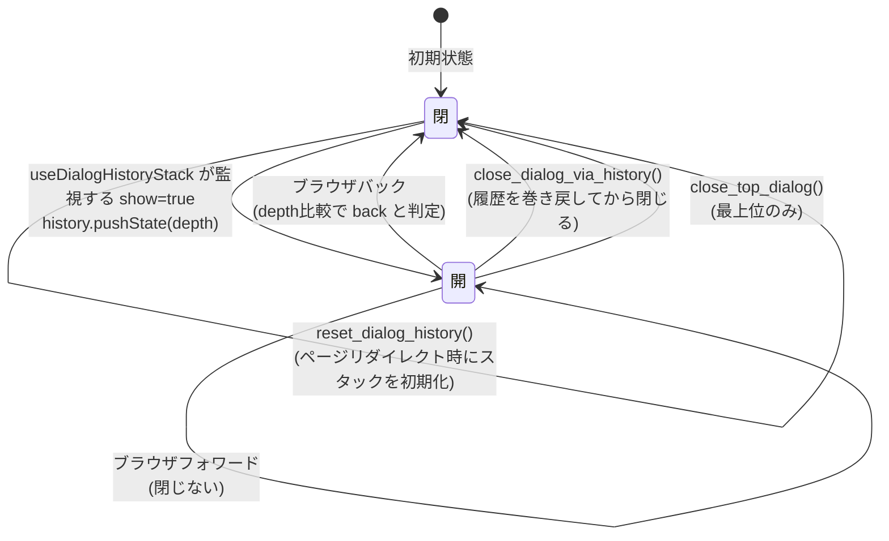
```mermaid
stateDiagram-v2
    [*] --> 閉: 初期状態

    閉 --> 開: useDialogHistoryStack が監視する show=true<br>history.pushState(depth)

    開 --> 開: 子ダイアログを開く<br>depth+1 で push

    開 --> 閉: ブラウザバック<br>(depth比較で back と判定)
    開 --> 閉: close_dialog_via_history()<br>(履歴を巻き戻してから閉じる)
    開 --> 閉: close_top_dialog()<br>(最上位のみ)

    開 --> 開: ブラウザフォワード<br>(閉じない)

    閉 --> 閉: reset_dialog_history()<br>(ページリダイレクト時にスタックを初期化)
```

**重要:** プログラムから閉じるときに `show.value = false` を直接書くと履歴とずれる。
必ず `close_dialog_via_history()` を使うこと。約44のコンポーザブルがこの規約に従っている。

## 10. フォーム送信の状態遷移（二重送信ガード）

追加・編集・削除・コンテキストメニューからのタグ付与など、サーバ更新につながる操作は
`is_requested_submit` ref で再入を弾く。`src/client/classes/` 配下の45ファイルがこのフラグを持つ。

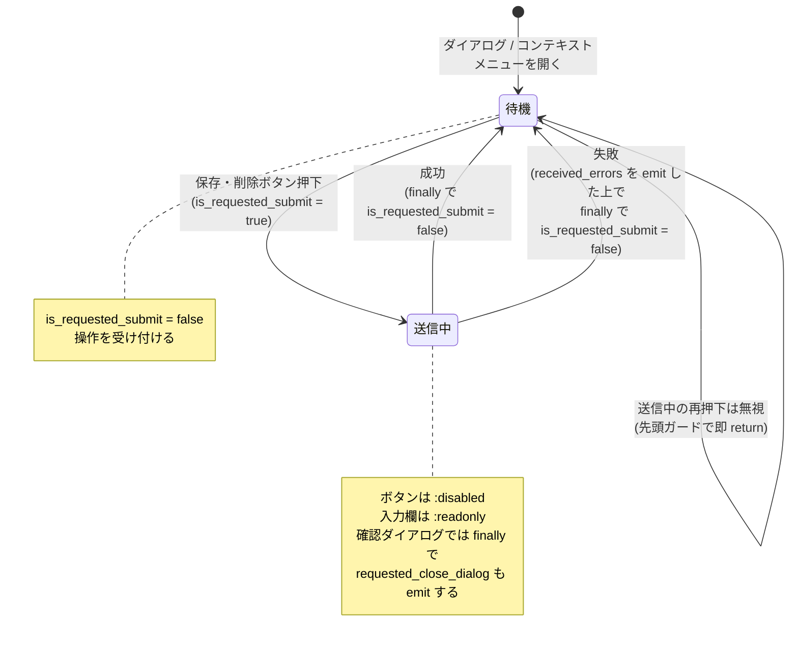
```mermaid
stateDiagram-v2
    [*] --> 待機: ダイアログ / コンテキストメニューを開く

    待機 --> 送信中: 保存・削除ボタン押下<br>(is_requested_submit = true)
    待機 --> 待機: 送信中の再押下は無視<br>(先頭ガードで即 return)

    送信中 --> 待機: 成功<br>(finally で is_requested_submit = false)
    送信中 --> 待機: 失敗<br>(received_errors を emit した上で<br>finally で is_requested_submit = false)

    note right of 送信中
        ボタンは :disabled
        入力欄は :readonly
        確認ダイアログでは finally で
        requested_close_dialog も emit する
    end note

    note right of 待機
        is_requested_submit = false
        操作を受け付ける
    end note
```

**クローズを `finally` に置く理由:** 削除・保存リクエストはサーバに届いているのに、後続処理の例外で
クローズまで到達せず「消えているのに閉じない」状態になるのを防ぐため。これに伴い、
**従来はエラー時に early return して開いたままだった確認ダイアログ（`use-confirm-delete-tag-view.ts` など）も、
いまはエラー時・例外時を問わず必ず閉じる**（`use-confirm-delete-kyou-view.ts` は元からエラー時も閉じていた）。

**KFTL の事情:** KFTL は複数リクエストを1つの TXID で束ねて送るため、二重送信すると Kyou が丸ごと
重複登録される。以前は保存マーカー（「！」）検出経路でしかフラグを立てておらず、保存ボタン経由では
実質ノーガードだった（`use-kftl-view.ts` の `do_submit`）。なお KFTL だけは初期値が `true` で、
`application_config` の読み込みが終わるまで送信できない。

タブのロックは `is_requested_submit` **ではなく** `is_submitting || show_confirm_unknown_tag_dialog`
で判定する。`is_requested_submit` は設定の読み込みが終わるまで `true` なので、これを鍵にすると
起動直後にタブを追加できない。板名確認（`unknown_mi_boards`）はブラウザバックで閉じても空に
ならないため、ロック条件に入れると永久ロックになる。送信対象タブは `do_submit()` の引数で渡し、
確認からの続行だけが `submit_target_tab_id` を読む。
