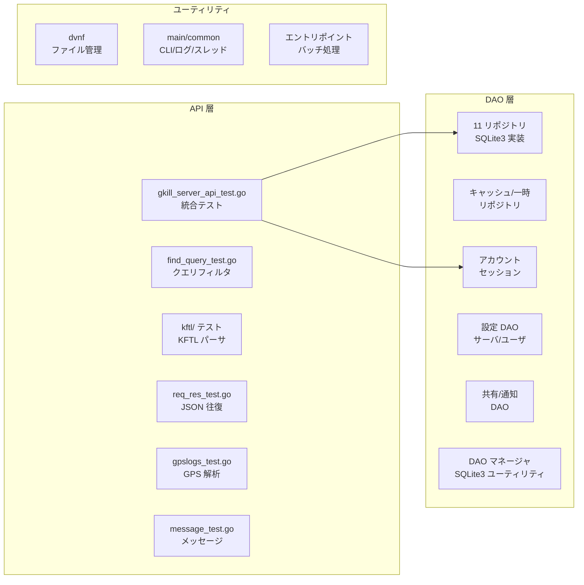
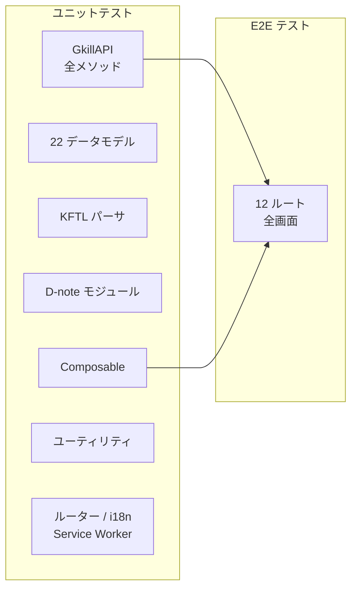

# テストガイド

## 1. 概要

gkill プロジェクトでは約1,904件の自動テストを整備しています。Go バックエンド、Vue 3 フロントエンド、MCP サーバ、Android、Wear OS の各コンポーネントにテストが存在し、データアクセス層から API 統合、UI の E2E テストまで幅広くカバーしています。

### テスト統計

| コンポーネント | テスト数 | テストファイル数 | フレームワーク |
|--------------|---------|----------------|---------------|
| Go バックエンド | ~534 | 47 | Go `testing` |
| フロントエンド ユニット | ~676 | 49 | Vitest |
| フロントエンド E2E | 187 | 29 | Playwright |
| MCP サーバ | ~381 | 10 | Vitest |
| Android | 12 | 2 | JUnit 4 |
| Wear OS | 114 | 9 | JUnit 4 + MockK |
| **合計** | **~1,904** | **~146** | |

### テスト仕様書

各 `src/` サブディレクトリには `ABOUT_TEST.md` が配置されており、そのフォルダ内のテスト概要を日本語で記載しています。索引は [`src/ABOUT_TEST.md`](../../src/ABOUT_TEST.md) です。

## 2. テスト実行コマンド

### 全テスト一括実行

```bash
npm test
```

このコマンドは以下の全テストを順次実行します：server → client → MCP → Android → Wear OS

### コンポーネント別実行

| コマンド | 対象 | 所要時間目安 |
|---------|------|------------|
| `npm run test_server` | Go バックエンド全体 | 数十秒 |
| `npm run test_client` | フロントエンド（ユニット + E2E） | 1〜2分 |
| `npm run test_client_unit` | フロントエンド ユニットのみ | 数十秒 |
| `npm run test_client_e2e` | フロントエンド E2E のみ（gkill_server 自動起動・停止） | 20分前後 |
| `npm run test_e2e_server` | E2E 用 gkill_server 単体起動 (`$HOME/gkill_test`) | — |
| `npm run test_mcp` | MCP サーバ | 数秒 |
| `npm run test_android` | Android | Gradle 依存 |
| `npm run test_wear_os` | Wear OS | Gradle 依存 |

### Go パッケージ単位での実行

```bash
# 特定パッケージのテスト
cd src/server && go test ./gkill/api/...
cd src/server && go test ./gkill/dao/reps/...
cd src/server && go test ./gkill/api/kftl/...

# 全パッケージ（npm run test_server と等価）
cd src/server && go test ./...

# 詳細出力
cd src/server && go test -v ./gkill/dao/reps/...
```

### Vitest の個別実行

```bash
# 特定テストファイルの実行
npx vitest run src/client/__tests__/unit/api/gkill-api.test.ts

# パターンマッチで実行
npx vitest run --reporter=verbose datas

# ウォッチモードで開発中に常時実行
npx vitest watch
```

### Playwright E2E テスト

```bash
# E2E テスト実行（gkill_server + Vite を自動起動・停止）
npm run test_client_e2e

# 特定ファイル（事前に gkill_server と Vite dev server を手動起動する必要あり）
npx playwright test src/client/__tests__/e2e/login.spec.ts

# ヘッドフルモード（ブラウザ表示）
npx playwright test --headed

# デバッグモード
npx playwright test --debug
```

**E2E テスト環境の仕組み:**

`npm run test_client_e2e` は `src/client/__tests__/e2e/run-e2e.mjs` を実行し、以下を自動で行います：

1. `$HOME/gkill_test` ディレクトリを削除・再作成（クリーン状態）
2. `gkill_server --gkill_home_dir "$HOME/gkill_test" --disable_tls --log none` を起動
3. gkill_server がポート 9999 で応答するまで待機（最大 30 秒）
4. `npx playwright test` を実行（Playwright が Vite dev server を自動起動）
5. テスト完了後に gkill_server を停止

これにより毎回クリーンな状態（admin アカウント/パスワードなし）でテストが実行されます。初回テスト実行時、`helpers.ts` の `loginAsAdmin()` がサーバから reset_token を取得し、`/regist_first_account` ページで自動的にアカウント登録とパスワード設定を行います。

> **Note:** `npx playwright test` を直接実行する場合は、事前に gkill_server（テスト用 home）と Vite dev server を手動で起動する必要があります：
> ```bash
> # ターミナル 1: テスト用サーバ起動
> rm -rf ~/gkill_test && mkdir -p ~/gkill_test
> npm run test_e2e_server
>
> # ターミナル 2: Vite dev server 起動
> npm run dev
>
> # ターミナル 3: テスト実行
> npx playwright test
> ```

## 3. テストアーキテクチャ

### 3.1 Go バックエンド（`src/server/`）

```
src/server/gkill/
├── api/
│   ├── gkill_server_api_test.go      ← 統合テスト（全エンドポイント）
│   ├── find_filter_test.go            ← 検索フィルタ
│   ├── find/find_query_test.go        ← クエリビルダー
│   ├── gpslogs/gpslogs_test.go        ← GPS ログ解析
│   ├── message/message_test.go        ← メッセージフォーマット
│   ├── kftl/                          ← KFTL パーサ（3ファイル）
│   └── req_res/req_res_test.go        ← JSON 往復テスト
├── dao/
│   ├── gkill_dao_manager_test.go      ← DAO マネージャ
│   ├── account/                       ← アカウント CRUD
│   ├── account_state/                 ← セッション・アップロード履歴
│   ├── server_config/                 ← サーバ設定
│   ├── user_config/                   ← ユーザ設定・リポジトリ定義
│   ├── share_kyou_info/               ← 共有設定
│   ├── gkill_notification/            ← 通知ターゲット
│   ├── hide_files/                    ← ファイル非表示
│   ├── sqlite3impl/                   ← SQLite3 ユーティリティ
│   └── reps/                          ← リポジトリ実装（16ファイル）
│       ├── *_repository_sqlite3_impl_test.go  ← 11データ型
│       ├── cached_and_temp_test.go    ← キャッシュ層・一時層
│       └── cache/                     ← キャッシュ更新
├── dvnf/                              ← DVNF ファイル管理（2ファイル）
└── main/                              ← CLI・エントリポイント（8ファイル）
```

**テスト戦略:**

- **インメモリ SQLite3**: 全 DAO テストはインメモリデータベースを使用し、テスト間の隔離を保証
- **4層リポジトリパターン**: interface → SQLite3 実装 → キャッシュ実装 → 一時実装の各層をそれぞれテスト
- **統合テスト**: `gkill_server_api_test.go` が全11データ型の CRUD を HTTP ハンドラレベルで検証
- **テストヘルパー**: `reps/testhelper_test.go` が共通のテストデータ生成・DB セットアップを提供

### 3.2 フロントエンド ユニット（`src/client/__tests__/unit/`）

```
src/client/__tests__/
├── unit/
│   ├── api/gkill-api.test.ts         ← GkillAPI シングルトン（全メソッド）
│   ├── classes/                       ← ユーティリティ（6ファイル）
│   │   ├── deep-equals.test.ts
│   │   ├── format-date-time.test.ts
│   │   ├── looks-like-url.test.ts
│   │   ├── long-press.test.ts
│   │   ├── save-as.test.ts
│   │   └── delete-gkill-cache.test.ts
│   ├── datas/                         ← データモデル（22ファイル）
│   ├── dnote/                         ← D-note モジュール（5ファイル）
│   ├── kftl/                          ← KFTL パーサ（5ファイル）
│   ├── composables/                   ← Vue Composable（6ファイル）
│   ├── router.test.ts                 ← ルーター（12ルート）
│   ├── i18n-completeness.test.ts      ← i18n 完全性（7ロケール）
│   └── service-worker.test.ts         ← Service Worker
├── e2e/                               ← E2E テスト（後述）
└── helpers/                           ← テストヘルパー
    ├── factory.ts                     ← テストデータファクトリ
    ├── mock-api.ts                    ← API モック
    └── setup-i18n.ts                  ← i18n セットアップ
```

**テスト戦略:**

- **jsdom 環境**: Vitest の jsdom 環境でブラウザ API をシミュレート
- **API モック**: `mock-api.ts` で `GkillAPI` のメソッドをモックし、HTTP 通信なしでテスト
- **ファクトリパターン**: `factory.ts` の `makeKmemo()`, `makeMi()`, `makeTag()` 等でテストデータを生成
- **Vue 3 対応**: `@vue/test-utils` と Vitest の組み合わせで Composable と Vue コンポーネントをテスト

### 3.3 フロントエンド E2E（`src/client/__tests__/e2e/`）

全12ルートを Playwright で検証し、CRUD 操作フローもカバー（29ファイル、187テスト）。各テストでは以下を共通チェック：

- **JS エラー検出**: ページ遷移時にコンソールエラーがないことを検証
- **インタラクティブ操作**: ボタンクリック、フォーム入力、ダイアログ開閉
- **CRUD フロー**: KFTL 記録 → 画面追加 → 編集 → 削除 → 閲覧の一連操作
- **レスポンシブ対応**: 一部テスト（rykv.spec.ts, mi-board.spec.ts）でモバイルビューポートの表示確認

#### ページ表示・ナビゲーション系（12 spec files）

| テストファイル | 対象ルート | 主なテスト内容 |
|-------------|-----------|--------------|
| `login.spec.ts` | `/` | セッション永続化、認証リダイレクト、パスワードマスキング |
| `kftl-dialog.spec.ts` | `/kftl` | KFTL テキスト入力、マルチライン、テンプレート |
| `mi-board.spec.ts` | `/mi` | タスクボード表示、FAB 検出、レスポンシブ |
| `rykv.spec.ts` | `/rykv` | モバイルビューポート、URL 永続化 |
| `mkfl.spec.ts` | `/mkfl` | ファイル管理 |
| `plaing.spec.ts` | `/plaing` | 計画ビュー |
| `settings.spec.ts` | `/saihate` | 設定コンテンツ、インタラクティブ操作 |
| `kyou-list.spec.ts` | `/kyou` | レコード一覧 |
| `share-page.spec.ts` | `/shared_page` | 共有ページ |
| `shared-mi.spec.ts` | `/shared_mi` | 共有タスク |
| `regist-first-account.spec.ts` | `/regist_first_account` | 初回アカウント登録 |
| `set-new-password.spec.ts` | `/set_new_password` | パスワード再設定 |

#### CRUD 操作フロー系（7 spec files）

| テストファイル | テスト内容 |
|-------------|-----------|
| `kftl-crud.spec.ts` | KFTL テキスト経由で各データ型（Kmemo/Lantana/Mi/TimeIs/Nlog/URLog）を記録 → 画面表示確認 |
| `add-dialog-crud.spec.ts` | FAB(+)→追加ダイアログ→フォーム入力→保存 (Mi/Lantana/Nlog/TimeIs/URLog/KC/Tag/Text) + Mi最小入力、TimeIs/URLog全項目入力 |
| `edit-dialog-crud.spec.ts` | 右クリック→編集→変更→保存 (Kmemo/Mi/Lantana/Nlog/URLog/TimeIs/Tag + 空内容バリデーション) + 実行中TimeIs終了ボタン、ReKyou編集、Text編集 |
| `delete-crud.spec.ts` | 右クリック→削除→確認→表示消失確認 (Kmemo/Mi/Lantana/Nlog/URLog/TimeIs/Tag/Text/ReKyou) |
| `view-browse.spec.ts` | 履歴ダイアログ表示、混合データ型表示、Mi ボード/Plaing ページの表示確認 |
| `notification-crud.spec.ts` | Notification の追加/編集/削除/閲覧/履歴ダイアログ |
| `search-and-summary.spec.ts` | RYKV キーワード検索、Mi キーワード検索、D-note サマリパネルトグル |

#### KFTL TimeIs終了系（1 spec file）

| テストファイル | テスト内容 |
|-------------|-----------|
| `kftl-timeis-end.spec.ts` | TimeIs終了の全4バリエーション: タイトル指定(ーえ)、タイトル存在すれば(ーいえ)、タグ指定(ーたえ)、タグ存在すれば(ーいたえ) |

#### 閲覧・履歴系（1 spec file）

| テストファイル | テスト内容 |
|-------------|-----------|
| `view-history.spec.ts` | Lantana/Mi/Nlog/URLog/ReKyou/Tag/Text の閲覧+履歴ダイアログ+リポスト+NoImage確認 |

#### 認証フロー系（1 spec file）

| テストファイル | テスト内容 |
|-------------|-----------|
| `auth-flow.spec.ts` | ログアウト→ログイン画面遷移、パスワード未設定ログイン不可、ログイン後Rep全チェック確認 |

#### Mi（タスク）操作系（1 spec file）

| テストファイル | テスト内容 |
|-------------|-----------|
| `mi-operations.spec.ts` | タスク板間移動、完了状態トグル、共有状況閲覧+スクロール確認、共有停止 |

#### 設定機能テスト系（3 spec files）

| テストファイル | テスト内容 |
|-------------|-----------|
| `settings-crud.spec.ts` | サーバ設定/ユーザ設定/タグ構造/Rep 構造/Device 構造/KFTL テンプレート構造の表示確認 |
| `server-config-crud.spec.ts` | プロファイル追加・変更、TLS有効化・無効化・生成、アドレス変更、アカウント管理(追加/有効化/無効化/パスワードリセット)、Rep管理(追加/設定変更/有効化/無効化/削除/書き込み制御/ID自動割当/デバイス割当/RepType編集) |
| `user-config-crud.spec.ts` | GoogleMapAPIキー、画像ビューア列数、miデフォルト板名、ホットリロード、タグ/Rep/Device/RepType/KFTLテンプレート構造(フォルダ追加/並替/適用) |

#### 回帰テスト・その他（3 spec files）

| テストファイル | テスト内容 |
|-------------|-----------|
| `regression-fixes.spec.ts` | 修正済みバグの回帰テスト: Kmemo必須チェック、ローカルアクセス設定、タグ/Device/RepType構造追加、ApplicationConfig適用、ファイルアップロード |
| `misc-features.spec.ts` | Notification/Text 見た目区別、TimeIs 履歴終了ボタン非表示、コンテキストメニュー重複チェック |
| `misc-operations.spec.ts` | ブックマークレット確認、GPSログアップロード、無効共有リンクエラー表示、サーバコンフィグ適用で再起動 |

#### ヘルパーファイル

| ファイル | 用途 |
|---------|------|
| `run-e2e.mjs` | E2E テストランナー（gkill_server 自動起動・停止、`$HOME/gkill_test` クリーン） |
| `helpers.ts` | `loginAsAdmin()` — 初回起動時の自動登録（reset_token取得→regist_first_account）+ テストユーザでのログイン |
| `check-server.ts` | `checkGkillServer()`, `checkGkillApiViaVite()` — サーバヘルスチェック |
| `crud-helpers.ts` | KFTL 送信（`#kftl_text_area` + 保存ボタン有効化待機）、ページナビゲーション（フローティングダイアログ自動閉じ）、コンテキストメニュー操作（`force: true`）、FAB クリック（`.position-fixed button`） |
| `global-setup.ts` | Playwright グローバルセットアップ（no-op — サーバ管理は `run-e2e.mjs` が担当） |
| `global-teardown.ts` | Playwright グローバルティアダウン（no-op — Playwright が自動停止） |

### 3.4 MCP サーバ（`src/mcp/__tests__/`）

MCP テストは全てモック/スタブベースで動作し、実行中の gkill_server は不要です。OAuth テスト（`oauth-server.test.mjs`, `oauth-store.test.mjs`）もインメモリストアを使用するため、外部環境変数（`GKILL_BASE_URL` 等）の設定は不要です。

| テストファイル | テスト内容 |
|-------------|-----------|
| `validation.test.mjs` | 7ツールの入力パラメータ検証（必須/型/範囲） |
| `normalization.test.mjs` | 日付・文字列・デフォルト値の正規化 |
| `constants.test.mjs` | ツール名、エラーコード、デフォルト設定値 |
| `tool-handlers.test.mjs` | 各ツールのハンドラ実行ロジック |
| `client.test.mjs` | GkillReadClient（fetch モック、認証、レスポンスパース） |
| `server.test.mjs` | McpServer ライフサイクル、トランスポート管理、gkill_get_idf_file ツール（ディスパッチ/画像image block/非画像/ネストパス/セッションフォールバック） |
| `pkce.test.mjs` | PKCE検証（S256/plain） |
| `oauth-store.test.mjs` | OAuth ストア（トークン/コード/クライアント CRUD、TTL 有効期限、JSON ファイル永続化） |
| `oauth-server.test.mjs` | OAuth サーバ（メタデータ、認可、トークン交換、PKCE、リフレッシュトークンローテーション、DCR、RFC 8707 resource パラメータ、redirect_uri 検証、E2E フロー） |
| `access-log.test.mjs` | McpAccessLog（レベルフィルタリング、JSON形式検証、lazy open、close/reopen、noneレベルno-op、コンテキストフィールド） |

### 3.5 Android / Wear OS

**Android** (`src/android/`): JUnit 4 + Kotlin
- ユニットテスト（JVM）: 定数検証（サーバURL、ポート、バイナリ名）
- インストルメンテーションテスト: Android フレームワーク統合

**Wear OS** (`src/wear_os/`): JUnit 4 + MockK
- phone_companion（4テスト）: 認証ストア、Activity、API クライアント（MockWebServer）、メッセージハンドリング
- watch_app（5テスト）: Activity、テンプレートキャッシュ、Wear クライアント、データモデル

## 4. テスト設定ファイル

| ファイル | 用途 |
|---------|------|
| `vitest.config.ts` | フロントエンドユニットテスト設定（jsdom, Vue 3, パスエイリアス） |
| `vitest.config.mcp.ts` | MCP サーバテスト設定（Node.js 環境, shebang 除去） |
| `playwright.config.ts` | E2E テスト設定（baseURL, タイムアウト, Vite webServer, globalSetup/Teardown） |
| `src/client/__tests__/e2e/run-e2e.mjs` | E2E テストランナー（gkill_server 自動起動・停止、`$HOME/gkill_test` クリーン） |
| `src/server/go.mod` | Go テストの依存管理 |
| `src/android/app/build.gradle.kts` | Android テスト設定 |
| `src/wear_os/phone_companion/build.gradle.kts` | Wear OS phone_companion テスト設定 |
| `src/wear_os/watch_app/build.gradle.kts` | Wear OS watch_app テスト設定 |

## 5. テストカバレッジの範囲

### Go バックエンド（29パッケージ全てにテスト有）



### フロントエンド



## 6. テストデータの管理

### Go テスト

Go テストではインメモリ SQLite3 データベースを使用します。各テスト関数が独立した DB インスタンスを持ち、テスト間の干渉を防止します。

```go
// テストヘルパーの使用例（概念）
func TestKmemoRepository(t *testing.T) {
    db := setupInMemoryDB(t)  // インメモリ DB を作成
    repo := NewKmemoRepositorySQLite3Impl(db)
    // テスト実行...
    // t.Cleanup() で自動クリーンアップ
}
```

### フロントエンド テスト

テストデータファクトリ (`src/client/__tests__/helpers/factory.ts`) が各データ型のモックオブジェクトを生成します。

```typescript
// ファクトリの使用例（概念）
import { makeKmemo, makeMi, makeTag } from '../helpers/factory'

const kmemo = makeKmemo({ content: 'テストメモ' })
const mi = makeMi({ title: 'テストタスク', is_checked: false })
const tag = makeTag({ tag: 'テストタグ', target_id: kmemo.id })
```

API モック (`src/client/__tests__/helpers/mock-api.ts`) は `GkillAPI` シングルトンのメソッドをスタブに置き換え、ネットワーク通信なしでテストを実行します。

## 7. テスト実行の前提条件

### 全テスト共通

```bash
# Node.js 依存パッケージのインストール（初回 or package.json 変更時）
npm install
```

### Go テスト

- Go 1.26.0 以上
- 追加のセットアップ不要（インメモリ DB 使用のため）

### フロントエンド ユニットテスト

- Node.js 20.15.1 以上
- 追加のセットアップ不要

### フロントエンド E2E テスト

```bash
# Playwright ブラウザのインストール（初回のみ）
npx playwright install

# gkill_server のビルド（初回 or サーバコード変更時）
cd src/server/gkill/main/gkill_server && go install

# 自動実行（推奨）— サーバ起動・クリーン・停止を自動で行う
npm run test_client_e2e

# 手動実行 — 事前に gkill_server と Vite dev server を起動してから実行
npm run test_e2e_server  # ターミナル 1
npm run dev              # ターミナル 2
npx playwright test      # ターミナル 3
```

E2E テストは `$HOME/gkill_test` をテスト専用のホームディレクトリとして使用します。毎回クリーンな状態（admin アカウント/パスワードなし）で実行されます。

### Android テスト

```bash
# Android SDK と Java JDK が必要
cd src/android && ./gradlew test
```

### Wear OS テスト

```bash
# gradlew を android/ からコピー（初回のみ）
cp src/android/gradlew src/wear_os/
cp src/android/gradlew.bat src/wear_os/
cp -r src/android/gradle src/wear_os/

cd src/wear_os && ./gradlew test
```

## 8. テスト追加のガイドライン

### Go テスト

- テストファイルはソースファイルと同じディレクトリに `*_test.go` として配置（Go の標準慣習）
- `testing.T` を使用し、サブテスト（`t.Run`）でテストケースをグループ化
- DAO テストはインメモリ SQLite3 を使用し、外部依存を排除

### フロントエンド ユニットテスト

- テストファイルは `src/client/__tests__/unit/` 配下に、ソースのディレクトリ構成を反映して配置
- ファイル名は `{module-name}.test.ts` 形式
- `factory.ts` でテストデータを生成、`mock-api.ts` で API をモック

### フロントエンド E2E テスト

- テストファイルは `src/client/__tests__/e2e/` 配下に `{feature-name}.spec.ts` 形式で配置
- `helpers.ts` の `loginAsAdmin()` でログイン、`crud-helpers.ts` の CRUD ヘルパーを利用
- `check-server.ts` でサーバ疎通確認し、未起動時は `test.skip()` でスキップ
- CRUD テストでは `makeUniqueLabel()` で一意なテストデータを生成（並列実行対応）
- 各テストで JS コンソールエラーの検出を組み込む
- `test.setTimeout(120000)` で API 通信を伴うテストのタイムアウトを延長
- テスト環境: `$HOME/gkill_test` を使用し、本番データに影響しない

### MCP サーバ テスト

- テストファイルは `src/mcp/__tests__/` 配下に `{module}.test.mjs` 形式で配置
- `vitest.config.mcp.ts` で Node.js 環境を指定

### 新しいデータ型を追加した場合のテスト

新しいデータ型（例：新しい Kyou 派生型）を追加した場合、以下のテストが必要です：

1. **Go DAO テスト**: `dao/reps/{type}_repository_sqlite3_impl_test.go` — CRUD テスト
2. **Go API 統合テスト**: `gkill_server_api_test.go` にテストケース追加
3. **フロントエンド データモデルテスト**: `__tests__/unit/datas/{type}.test.ts`
4. **フロントエンド API テスト**: `__tests__/unit/api/gkill-api.test.ts` にテストケース追加
5. **KFTL テスト**（対応する場合）: Go 側 `kftl/*_test.go`、TS 側 `__tests__/unit/kftl/*.test.ts`

## 9. トラブルシューティング

### Go テストが失敗する

```bash
# モジュールキャッシュのクリア
cd src/server && go clean -testcache

# 詳細ログ付きで再実行
cd src/server && go test -v -count=1 ./gkill/dao/reps/...
```

### Vitest が失敗する

```bash
# node_modules を再インストール
rm -rf node_modules && npm install

# キャッシュクリア
npx vitest run --reporter=verbose --no-cache
```

### Playwright E2E が失敗する

```bash
# ブラウザの再インストール
npx playwright install --force

# gkill_server が起動しているか確認
curl http://localhost:9999

# Vite dev server が起動しているか確認
curl http://localhost:5173

# API プロキシが機能しているか確認
curl -X POST -H "Content-Type: application/json" -d '{}' http://localhost:5173/api/login

# テスト用ホームディレクトリを手動クリーン
rm -rf ~/gkill_test && mkdir -p ~/gkill_test

# スクリーンショット付きデバッグ
npx playwright test --debug --trace on
```

> **Note:** E2E テストの大部分は gkill_server への API 通信を必要とします。`npm run test_client_e2e` で自動起動するか、手動で `npm run test_e2e_server` を実行してください。サーバ未起動時はテストがスキップされます。

### Android / Wear OS テストが失敗する

```bash
# Gradle キャッシュのクリア
cd src/android && ./gradlew clean
cd src/wear_os && ./gradlew clean

# gradlew が存在しない場合（Wear OS）
# src/android/ から gradlew, gradlew.bat, gradle/ をコピー
```

## 10. 関連資料

| 資料 | 説明 |
|------|------|
| [`src/ABOUT_TEST.md`](../../src/ABOUT_TEST.md) | テスト仕様書索引（全サブディレクトリへのリンク） |
| [`dev-setup.md`](dev-setup.md) | 開発環境構築手順 |
| [`operations-guide.md`](operations-guide.md) | 運用・デプロイガイド |
| [`api-endpoints.md`](api-endpoints.md) | API エンドポイント一覧（テスト対象の参照） |
| [`program-spec.md`](program-spec.md) | プログラム仕様（テスト対象の内部構造） |
