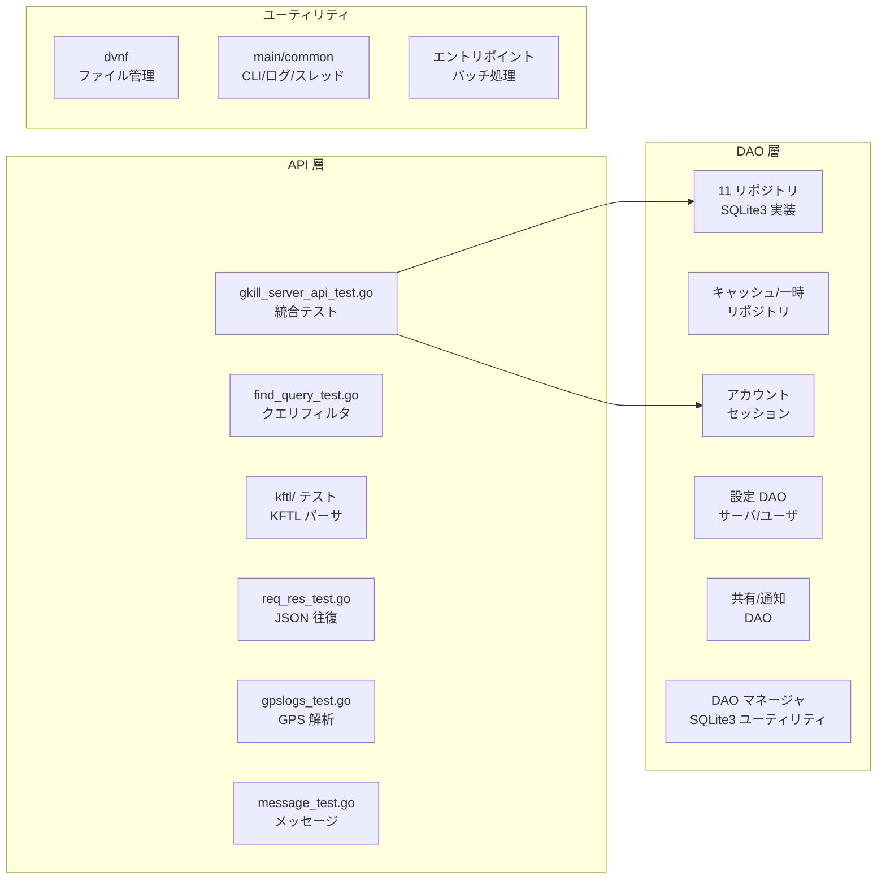
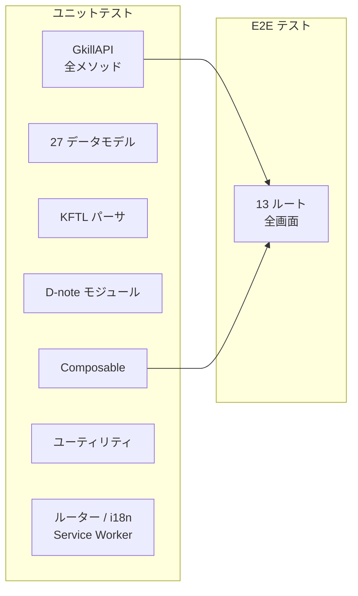

# テストガイド

## 1. 概要

gkill プロジェクトには Go バックエンド、Vue 3 フロントエンド、MCP サーバ、Android、Wear OS の各コンポーネントにテストが存在し、データアクセス層から API 統合、UI の E2E テストまで幅広くカバーしています。

### テスト統計

> **これは静的計数**（ソースに書かれたテスト宣言の数）であり、実行時にレポートされる件数とは一致しません。
> `it.each` / `test.each` の展開、`skip`、Playwright のプロジェクト数によって実行件数は増減します。
> 下表の数値は `npm run verify_docs -- --list` が算出するメトリクスと同じ定義です。

| コンポーネント | テスト宣言数 | テストファイル数 | フレームワーク |
|--------------|---------|----------------|---------------|
| Go バックエンド | 634 | 67 | Go `testing` |
| フロントエンド ユニット | 808 | 64 | Vitest |
| フロントエンド E2E | 195 | 34（+auth.setup.ts） | Playwright |
| MCP サーバ | 668 | 20 | Vitest |
| Android | 12 | 2 | JUnit 4 |
| Wear OS | 118 | 9 | JUnit 4 + MockK |
| **合計** | **2,386** | **186** | |

数え直すコマンド:

```bash
grep -rhE '^func Test' src/server --include=*.go | wc -l          # Go テスト数
find src/server -name '*_test.go' | wc -l                          # Go テストファイル数
grep -rhE "^\s*(it|test)\(" src/client/__tests__/unit | wc -l      # クライアント ユニット
grep -rhE "^\s*test\(" src/client/__tests__/e2e --include=*.spec.ts | wc -l  # E2E
```

> `src/plugins/*` の Go テスト（`cache_path_test.go`、`loader_test.go` 等）は
> 各プラグインが**独立した Go モジュール**のため、上記の集計（`src/server` 基準）には含まれない
> （`test_server` は `cd src/server && go test ./...`）。実行は `npm run test_plugins`
> （`src/tools/test_plugins.mjs` が go.mod を持つディレクトリを探して1つずつ回す）が担当し、
> `npm test` からも呼ばれる。詳細は `src/plugins/ABOUT_TEST.md` を参照。

### テスト仕様書

各 `src/` サブディレクトリには `ABOUT_TEST.md` が配置されており、そのフォルダ内のテスト概要を日本語で記載しています。索引は [`src/ABOUT_TEST.md`](../../src/ABOUT_TEST.md) です。

## 2. テスト実行コマンド

### 全テスト一括実行

```bash
npm test
```

このコマンドは以下を順次実行します：
`install_server`（ビルド） → **`verify_docs`（docs CI）** → server → client → MCP → plugins → Android → Wear OS

`verify_docs` を重いテスト群より前に置いているのは、実行が速く失敗が早いため。
また `install_server` の後に置くのは、`checkManuals()` の生成鮮度チェックを
マニュアル再生成後の状態で走らせるため。

### コンポーネント別実行

| コマンド | 対象 | 所要時間目安 |
|---------|------|------------|
| `npm run verify_docs` | ドキュメントの件数・リンク・参照パス・Mermaid・マニュアル | 数秒 |
| `npm run test_server` | Go バックエンド全体 | 数十秒 |
| `npm run test_client` | フロントエンド（ユニット + E2E） | 20分前後（E2Eを含むため） |
| `npm run test_client_unit` | フロントエンド ユニットのみ | 数十秒 |
| `npm run test_client_e2e` | フロントエンド E2E のみ（gkill_server 自動起動・停止） | 20分前後 |
| `npm run test_e2e_server` | E2E 用 gkill_server 単体起動 (`$HOME/gkill_test`) | — |
| `npm run test_mcp` | MCP サーバ | 数秒 |
| `npm run test_plugins` | 同梱プラグイン（独立 Go モジュール4つ） | 数秒 |
| `npm run test_android` | Android | Gradle 依存 |
| `npm run test_wear_os` | Wear OS | Gradle 依存 |

### Go パッケージ単位での実行

```bash
# 特定パッケージのテスト
cd src/server && go test ./gkill/api/...
cd src/server && go test ./gkill/dao/reps/...
cd src/server && go test ./gkill/api/kftl/...

# 全パッケージ（npm run test_server と等価）
cd src/server && go test ./...

# 詳細出力
cd src/server && go test -v ./gkill/dao/reps/...
```

### Vitest の個別実行

```bash
# 特定テストファイルの実行
npx vitest run src/client/__tests__/unit/api/gkill-api.test.ts

# パターンマッチで実行
npx vitest run --reporter=verbose datas

# ウォッチモードで開発中に常時実行
npx vitest watch
```

### Playwright E2E テスト

```bash
# 事前に必須: 最新フロントエンドを埋め込んだ gkill_server をインストール
npm run install_server

# E2E テスト実行（gkill_server を自動起動・停止）
npm run test_client_e2e

# 特定ファイル（事前に gkill_server を手動起動する必要あり）
npx playwright test src/client/__tests__/e2e/login.spec.ts

# ヘッドフルモード（ブラウザ表示）
npx playwright test --headed

# デバッグモード
npx playwright test --debug
```

**E2E テスト環境の仕組み:**

`npm run test_client_e2e` は `src/client/__tests__/e2e/run-e2e.mjs` を実行し、以下を自動で行います：

1. 残存 `gkill_server` プロセスのうち **コマンドラインに `gkill_test` を含むものだけ**を停止し、`$HOME/gkill_test` ディレクトリを削除・再作成（クリーン状態）
2. **空きポートを 2 つ採番**（gkill_server 用 / Vite 用、`free-port.mjs`）
3. **インストール済みの `gkill_server` バイナリ**を `--gkill_home_dir "$HOME/gkill_test" --address 127.0.0.1:<空きポート> --disable_tls --log none` で起動し、応答するまで待機（最大 30 秒、500ms間隔）
4. **Vite dev server** を空きポートで起動（`GKILL_API_PROXY_TARGET` でテスト用 gkill_server に `/api` をproxy）
5. `GKILL_E2E_BASE_URL` / `GKILL_E2E_VITE_URL` を渡して `npx playwright test` を実行
6. テスト完了後に Vite と gkill_server を停止

これにより毎回クリーンな状態でテストが実行されます。初回テスト実行時、`helpers.ts` の `loginAsAdmin()` がサーバから reset_token を取得し、`/regist_first_account` ページで自動的にアカウント登録とパスワード設定を行います（初期 admin は `PasswordResetToken` が設定されているため、この登録なしにはログインできません）。

> **ポートは固定ではありません。** 開発機で本番 `gkill_server` が :9999 を占有していても衝突しないよう、E2E が使うポートは毎回 OS から空きポートを採番します。プロセス停止も `gkill_test` を含むものに限定しているため、常駐している本番サーバを巻き込みません。

> **Vite の役割。** テスト対象（`baseURL`）は **`go install` 済み `gkill_server` バイナリに埋め込まれたフロントエンド**です。Vite dev server は `check-server.ts` の `checkGkillApiViaVite()` ゲート用に起動され、これが無いと CRUD 系 22 spec が skip されます。Vite の `/api` proxy 先は `GKILL_API_PROXY_TARGET` でテスト用サーバに固定されるため、本番の :9999 に書き込む事故は起きません。
>
> - `npm run test_client_e2e` を単独実行する前に **`npm run install_server` が必要**です。これを省くと、以前ビルドした古いフロントエンドを試験してしまいます。
> - `npm test` は先に `install_server` を実行するため、常に最新ビルドを試験します。

> **Note:** `npx playwright test` を直接実行する場合は、事前にテスト用 gkill_server を手動で起動し、接続先を環境変数で渡す必要があります：
> ```bash
> # ターミナル 1: テスト用サーバ起動（:19999 で起動する）
> rm -rf ~/gkill_test && mkdir -p ~/gkill_test
> npm run test_e2e_server
>
> # ターミナル 2: テスト実行
> GKILL_E2E_BASE_URL=http://localhost:19999 npx playwright test
> ```
> `playwright.config.ts` の `baseURL` は `process.env.GKILL_E2E_BASE_URL ?? 'http://localhost:9999'`、
> Vite ゲートの接続先は `process.env.GKILL_E2E_VITE_URL ?? 'http://localhost:5173'` です。

## CI

`.github/workflows/` には2つのワークフローがある。

| ワークフロー | 内容 |
|---|---|
| `ci.yml` | ビルドとテスト。`go`（build / vet / test / dao配下の `-race`）、`frontend`（type-check / eslint / Vitest / MCP）、`docs`（`build_manuals` → `verify_docs`）、`plugins`（各プラグインモジュールの `go test`）の4ジョブを並列に回す |
| `codeql.yml` | CodeQL 解析（go / java-kotlin / javascript-typescript） |

`ci.yml` は E2E・Android・Wear OS を含まない。ローカルの `npm test` は
`install_server` から始まって30分近くかかるため、push ごとに回す層は
速いものだけに絞っている。E2E は手元で `npm run test_client_e2e` を使う。

**Go ジョブが `npm ci` と `copy_i18n_to_app_embed` を先に実行する理由**:
`gkill/api` パッケージの `init()` は `embed/i18n/locales` を読み、
見つからなければ panic する。locales のコピーは Vite のビルドを伴わないので、
フロントエンド一式をビルドしなくてもここだけ用意すれば Go のテストが回る。

**`docs` ジョブが `build_manuals` を先に実行する理由**:
`resources/manual/` は生成物で追跡していない。`verify_docs` はマニュアルの
生成鮮度と言語間のページ集合一致を見るため、先に `manual_src` から生成する必要がある。

なお `src/server/gkill/api/embed/PLACEHOLDER.md` は、embed 配下が空だと
`//go:embed` がコンパイルエラーになるために置いている追跡ファイル。
これが無いとクリーンな clone で `go build ./...` すら通らない。

### ドキュメント検証（docs CI）

自動テストとは別に、ドキュメントの整合性を検証する軽量ツール（Node 標準のみ）がある。`ci.yml` の `docs` ジョブで PR / push 時に実行される。

```bash
npm run verify_docs                    # 件数・リンク・パス・Mermaid・マニュアルa11y/生成鮮度を検証
node src/tools/verify_docs.mjs --parity # 構造パリティ・レポート（日本語=正本との各言語ズレ）
```

主な検査項目:
- **件数ドリフト**: docs 記載の件数（handler / req_res / view / dialog / endpoint / i18nキー 等）をコードから再計算して突合。実測値は `node src/tools/verify_docs.mjs --list` で確認できる。`npm test` にも組み込まれているため、コードを変えて件数が動いたらテストが落ちる。
- **相互リンク・参照パス・Mermaid**: reverse資料内の `.md` リンク・`src/...` パス・Mermaid ブロックを検査。
- **マニュアル**: `resources/manual_src` からの生成鮮度、アクセシビリティ不変条件（`<main>`／全表 `<caption>`／全 `th` に `scope`）、7言語のページ構成一致、内部リンク。

詳細なワークフローは [dev-setup.md](dev-setup.md)（ドキュメント・マニュアルのツール）を参照。

## 3. テストアーキテクチャ

### 3.1 Go バックエンド（`src/server/`）

```
src/server/gkill/
├── api/
│   ├── find_filter_test.go            ← 検索フィルタ
│   ├── find/find_query_test.go        ← クエリビルダー
│   ├── gpslogs/gpslogs_test.go        ← GPS ログ解析
│   ├── message/message_test.go        ← メッセージフォーマット
│   ├── kftl/                          ← KFTL パーサ（3ファイル）
│   ├── req_res/req_res_test.go        ← JSON 往復テスト
│   └── gkill_server_api/              ← ハンドラ層（7ファイル）
│       ├── gkill_server_api_test.go              ← 統合テスト（全エンドポイント）
│       ├── gkill_server_api_rate_limit_test.go   ← ログインレート制限
│       ├── handle_get_idf_file_path_test.go      ← IDFファイル絶対パス取得
│       ├── handle_get_idf_kyou_by_relative_path_test.go ← 相対パス解決
│       ├── handle_get_shared_kyous_test.go       ← 共有Kyou取得
│       ├── handle_zip_cache_file_serve_test.go   ← ZIPキャッシュの利用者分離
│       └── utils_ssrf_test.go                    ← SSRF対策
├── plugin/
│   └── sdk/                           ← プラグインSDK（sdk_test.go, config_test.go）
├── dao/
│   ├── gkill_dao_manager_test.go      ← DAO マネージャ
│   ├── account/                       ← アカウント CRUD、Argon2id、スキーマ移行（3ファイル）
│   ├── account_state/                 ← セッション・アップロード履歴
│   ├── server_config/                 ← サーバ設定
│   ├── user_config/                   ← ユーザ設定・リポジトリ定義
│   ├── share_kyou_info/               ← 共有設定
│   ├── gkill_notification/            ← 通知ターゲット
│   ├── hide_files/                    ← ファイル非表示
│   ├── sqlite3impl/                   ← SQLite3 ユーティリティ
│   └── reps/                          ← リポジトリ実装（17ファイル。plugin_repository_impl_test.go, mi_re_kyou_repository_sqlite3_impl_test.go, re_kyou_granular_cache_test.go 等）
│       ├── *_repository_sqlite3_impl_test.go  ← 11データ型
│       ├── cached_and_temp_test.go    ← キャッシュ層・一時層
│       └── cache/                     ← キャッシュ更新
├── dvnf/                              ← DVNF ファイル管理（2ファイル）
└── main/                              ← CLI・エントリポイント（8ファイル）
```

**テスト戦略:**

- **インメモリ SQLite3**: 全 DAO テストはインメモリデータベースを使用し、テスト間の隔離を保証
- **4層リポジトリパターン**: interface → SQLite3 実装 → キャッシュ実装 → 一時実装の各層をそれぞれテスト
- **統合テスト**: `gkill_server_api/gkill_server_api_test.go` が全11データ型の CRUD を HTTP ハンドラレベルで検証（ZIP内容閲覧含む）
- **`usecase/` にテストは無い**: 意図的にテストを置いていない。理由は [`src/server/gkill/usecase/ABOUT_TEST.md`](../../src/server/gkill/usecase/ABOUT_TEST.md) を参照
- **テストヘルパー**: `reps/testhelper_test.go` が共通のテストデータ生成・DB セットアップを提供

### 3.2 フロントエンド ユニット（`src/client/__tests__/unit/`）

```
src/client/__tests__/
├── unit/
│   ├── api/                           ← API クライアント（2ファイル）
│   │   ├── gkill-api.test.ts         ← GkillAPI シングルトン（全メソッド）
│   │   └── find-kyou-query.test.ts   ← 検索クエリビルダー
│   ├── classes/                       ← ユーティリティ（11ファイル）
│   │   ├── deep-equals.test.ts
│   │   ├── format-date-time.test.ts
│   │   ├── looks-like-url.test.ts
│   │   ├── long-press.test.ts
│   │   ├── save-as.test.ts
│   │   ├── delete-gkill-cache.test.ts
│   │   ├── markdown-to-html.test.ts
│   │   ├── mermaid-render.test.ts
│   │   ├── foldable-struct-move.test.ts
│   │   ├── kyou-content-text.test.ts  ← 内容コピー / IDコピー
│   │   └── use-dialog-history-stack.test.ts
│   ├── datas/                         ← データモデル（27ファイル）
│   ├── dnote/                         ← D-note モジュール（6ファイル、trend-aggregator.test.ts 含む）
│   ├── kftl/                          ← KFTL パーサ（5ファイル）
│   ├── composables/                   ← Vue Composable（10ファイル。add-views / edit-views /
│   │                                     confirm-delete / context-menus / page-composables /
│   │                                     query-composables / idf-kyou-view / re-kyou-view /
│   │                                     mi-re-kyou-view / save-clipboard-to-file-dialog）
│   ├── router.test.ts                 ← ルーター（13ルート）
│   ├── i18n-completeness.test.ts      ← i18n 完全性（7ロケール）
│   └── service-worker.test.ts         ← Service Worker
├── e2e/                               ← E2E テスト（後述）
└── helpers/                           ← テストヘルパー
    ├── factory.ts                     ← テストデータファクトリ
    ├── mock-api.ts                    ← API モック
    └── setup-i18n.ts                  ← i18n セットアップ
```

**テスト戦略:**

- **jsdom 環境**: Vitest の jsdom 環境でブラウザ API をシミュレート
- **API モック**: `mock-api.ts` で `GkillAPI` のメソッドをモックし、HTTP 通信なしでテスト
- **ファクトリパターン**: `factory.ts` の `makeKmemo()`, `makeMi()`, `makeTag()` 等でテストデータを生成
- **Vue 3 対応**: `@vue/test-utils` と Vitest の組み合わせで Composable と Vue コンポーネントをテスト

### 3.3 フロントエンド E2E（`src/client/__tests__/e2e/`）

全13ルートを Playwright で検証し、CRUD 操作フローもカバー（34 specファイル + auth.setup.ts、195テスト宣言）。各テストでは以下を共通チェック：

- **JS エラー検出**: ページ遷移時にコンソールエラーがないことを検証
- **インタラクティブ操作**: ボタンクリック、フォーム入力、ダイアログ開閉
- **CRUD フロー**: KFTL 記録 → 画面追加 → 編集 → 削除 → 閲覧の一連操作
- **レスポンシブ対応**: 一部テスト（rykv.spec.ts, mi-board.spec.ts）でモバイルビューポートの表示確認

#### ページ表示・ナビゲーション系（13 spec files）

| テストファイル | 対象ルート | 主なテスト内容 |
|-------------|-----------|--------------|
| `login.spec.ts` | `/` | セッション永続化、認証リダイレクト、パスワードマスキング |
| `kftl-dialog.spec.ts` | `/kftl` | KFTL テキスト入力、マルチライン、テンプレート |
| `mi-board.spec.ts` | `/mi` | タスクボード表示、FAB 検出、レスポンシブ |
| `rykv.spec.ts` | `/rykv` | モバイルビューポート、URL 永続化 |
| `mkfl.spec.ts` | `/mkfl` | ファイル管理 |
| `plaing.spec.ts` | `/plaing` | 計画ビュー |
| `settings.spec.ts` | `/saihate` | 設定コンテンツ、インタラクティブ操作 |
| `kyou-list.spec.ts` | `/kyou` | レコード一覧 |
| `dashboard.spec.ts` | `/dashboard` | ダッシュボード表示（ナビゲーション、描画、JSエラーなし確認） |
| `share-page.spec.ts` | `/shared_page` | 共有ページ |
| `shared-mi.spec.ts` | `/shared_mi` | 共有タスク |
| `regist-first-account.spec.ts` | `/regist_first_account` | 初回アカウント登録 |
| `set-new-password.spec.ts` | `/set_new_password` | パスワード再設定 |

#### CRUD 操作フロー系（8 spec files）

| テストファイル | テスト内容 |
|-------------|-----------|
| `kftl-crud.spec.ts` | KFTL テキスト経由で各データ型（Kmemo/Lantana/Mi/TimeIs/Nlog/URLog）を記録 → 画面表示確認 |
| `add-dialog-crud.spec.ts` | FAB(+)→追加ダイアログ→フォーム入力→保存 (Mi/Lantana/Nlog/TimeIs/URLog/KC/Tag/Text) + Mi最小入力、TimeIs/URLog全項目入力 |
| `edit-dialog-crud.spec.ts` | 右クリック→編集→変更→保存 (Kmemo/Mi/Lantana/Nlog/URLog/TimeIs/Tag + 空内容バリデーション) + 実行中TimeIs終了ボタン、ReKyou編集、Text編集 |
| `delete-crud.spec.ts` | 右クリック→削除→確認→表示消失確認 (Kmemo/Mi/Lantana/Nlog/URLog/TimeIs/Tag/Text/ReKyou) |
| `view-browse.spec.ts` | 履歴ダイアログ表示、混合データ型表示、Mi ボード/Plaing ページの表示確認 |
| `notification-crud.spec.ts` | Notification の追加/編集/削除/閲覧/履歴ダイアログ |
| `search-and-summary.spec.ts` | RYKV キーワード検索、Mi キーワード検索、D-note サマリパネルトグル |
| `clipboard-save.spec.ts` | RYKV ページでの Ctrl+V によるクリップボード保存ダイアログの表示・閉じる操作 |

#### KFTL TimeIs終了系（1 spec file）

| テストファイル | テスト内容 |
|-------------|-----------|
| `kftl-timeis-end.spec.ts` | TimeIs終了の全4バリエーション: タイトル指定(ーえ)、タイトル存在すれば(ーいえ)、タグ指定(ーたえ)、タグ存在すれば(ーいたえ) |

#### 閲覧・履歴系（3 spec files）

| テストファイル | テスト内容 |
|-------------|-----------|
| `view-history.spec.ts` | Lantana/Mi/Nlog/URLog/ReKyou/Tag/Text の閲覧+履歴ダイアログ+リポスト+NoImage確認 |
| `dialog-history.spec.ts` | ダイアログ履歴不変条件: ×/Escape/ブラウザバックのどれで閉じてもバックスタックに使用済みエントリが残らないこと（閉じた後、戻る1回でページを離れる）、複数ダイアログを開いたまま APP_BAR プルダウンで画面遷移できること |
| `edit-readonly-loading.spec.ts` | Edit系ダイアログ: 保存中は入力フォームが readonly になること（`/api/update_kmemo` の遅延注入で検証）。readonly は `is_busy = is_loading \|\| is_requested_submit` にバインドされているが、リストから開いた Kyou は `clone()` が `is_typed_data_loaded` を引き継ぐため `load_typed_datas()` が早期 return し load 側は観測可能なウィンドウにならない。そのため確実に到達する保存中（`is_requested_submit`）側を検証する |

#### 認証フロー系（1 spec file）

| テストファイル | テスト内容 |
|-------------|-----------|
| `auth-flow.spec.ts` | ログアウト→ログイン画面遷移、パスワード未設定ログイン不可、ログイン後Rep全チェック確認 |

#### Mi（タスク）操作系（1 spec file）

| テストファイル | テスト内容 |
|-------------|-----------|
| `mi-operations.spec.ts` | タスク板間移動、完了状態トグル、共有状況閲覧+スクロール確認、共有停止 |

#### 設定機能テスト系（3 spec files）

| テストファイル | テスト内容 |
|-------------|-----------|
| `settings-crud.spec.ts` | サーバ設定/ユーザ設定/タグ構造/Rep 構造/Device 構造/KFTL テンプレート構造の表示確認 |
| `server-config-crud.spec.ts` | プロファイル追加・変更、TLS有効化・無効化・生成、アドレス変更、アカウント管理(追加/有効化/無効化/パスワードリセット)、Rep管理(追加/設定変更/有効化/無効化/削除/書き込み制御/ID自動割当/デバイス割当/RepType編集) |
| `user-config-crud.spec.ts` | GoogleMapAPIキー、画像ビューア列数、miデフォルト板名、ホットリロード、タグ/Rep/Device/RepType/KFTLテンプレート構造(フォルダ追加/並替/適用) |

#### 回帰テスト・その他（3 spec files）

| テストファイル | テスト内容 |
|-------------|-----------|
| `regression-fixes.spec.ts` | 修正済みバグの回帰テスト: Kmemo必須チェック、ローカルアクセス設定、タグ/Device/RepType構造追加、ApplicationConfig適用、ファイルアップロード |
| `misc-operations.spec.ts` | ブックマークレット確認、GPSログアップロード、無効共有リンクエラー表示、サーバコンフィグ適用で再起動 |
| `mi-re-kyou.spec.ts` | MiReKyou（既存記録のタスク化）の追加・編集・表示 |
| `re-kyou.spec.ts` | リポストの行を右クリックしたとき、元の記録ではなくリポスト自身のコンテキストメニューが出ること |

#### ヘルパーファイル

| ファイル | 用途 |
|---------|------|
| `run-e2e.mjs` | E2E テストランナー（gkill_server 自動起動・停止、`$HOME/gkill_test` クリーン） |
| `free-port.mjs` | `getFreePort()` / `getFreePorts()` — OS から空きポートを採番する。ポートを固定しないための要 |
| `auth.setup.ts` | Playwright の `setup` プロジェクト。ログイン済み `storageState` を作って以降のテストで再利用する |
| `helpers.ts` | `loginAsAdmin()` — 初回起動時の自動登録（reset_token取得→regist_first_account）+ テストユーザでのログイン |
| `check-server.ts` | `checkGkillServer()`, `checkGkillApiViaVite()` — サーバヘルスチェック |
| `crud-helpers.ts` | KFTL 送信（`#kftl_text_area` + 保存ボタン有効化待機）、ページナビゲーション（フローティングダイアログ自動閉じ）、コンテキストメニュー操作（`force: true`）、FAB クリック（`.position-fixed button`） |
| `global-setup.ts` | Playwright グローバルセットアップ（no-op — サーバ管理は `run-e2e.mjs` が担当） |
| `global-teardown.ts` | Playwright グローバルティアダウン（no-op — Playwright が自動停止） |

### 3.4 MCP サーバ（`src/mcp/__tests__/`）

MCP テストは全てモック/スタブベースで動作し、実行中の gkill_server は不要です。OAuth テスト（`oauth-server.test.mjs`, `oauth-store.test.mjs`）もインメモリストアを使用するため、外部環境変数（`GKILL_BASE_URL` 等）の設定は不要です。3種のMCPサーバ（Read/Write/ReadWrite）のテストを含みます。

**共通・Read専用サーバ:**

| テストファイル | テスト内容 |
|-------------|-----------|
| `validation.test.mjs` | Read入力パラメータ検証（必須/型/範囲） |
| `normalization.test.mjs` | 日付・文字列・デフォルト値の正規化 |
| `constants.test.mjs` | ツール名、エラーコード、デフォルト設定値 |
| `tool-handlers.test.mjs` | Read 8ツール + プラグイン2ツールのハンドラ実行ロジック |
| `file-link.test.mjs` | FileLinkStore（HTTPモード用の期限付きファイルリンクトークンの発行・解決・失効、`GET /files/{token}` 配信） |
| `client.test.mjs` | GkillReadClient（fetch モック、認証、レスポンスパース） |
| `server.test.mjs` | McpServer ライフサイクル、トランスポート管理、gkill_get_idf_file ツール |
| `access-log.test.mjs` | McpAccessLog（レベルフィルタリング、JSON形式、sourceパラメータ） |
| `pkce.test.mjs` | PKCE検証（S256/plain） |
| `oauth-store.test.mjs` | OAuth ストア（トークン/コード/クライアント CRUD、TTL 有効期限、JSON ファイル永続化） |
| `oauth-server.test.mjs` | OAuth サーバ（メタデータ、認可、トークン交換、PKCE、DCR、RFC 8707、E2E フロー） |

**プラグインツール（3サーバ共通）:**

| テストファイル | テスト内容 |
|-------------|-----------|
| `plugin-tools.test.mjs` | `gkill_get_plugin_list` / `gkill_get_plugin_content` の定義、引数正規化、エンドポイント振り分け、format別レスポンス、summarize |
| `html-text.test.mjs` | プラグインコンテンツHTMLのプレーンテキスト変換、HTMLエンティティのデコード |

**Write専用サーバ:**

| テストファイル | テスト内容 |
|-------------|-----------|
| `write-normalization.test.mjs` | Write入力の正規化（11 normalizer関数、mood範囲、data_type列挙値） |
| `write-client.test.mjs` | GkillWriteClient（環境変数、login、callWrite、認証リトライ） |
| `write-server.test.mjs` | McpWriteServer（25ツールディスパッチ、プラグインツール振り分け、エンティティデフォルト値、レスポンス構造） |
| `write-tool-handlers.test.mjs` | Write 固有23ツール定義（update系9ツール含む。プラグイン2ツールを足して公開は25）・summarize関数 |

**Read/Write統合サーバ:**

| テストファイル | テスト内容 |
|-------------|-----------|
| `readwrite-client.test.mjs` | GkillClient（callApi統合メソッド、fetchFile、認証リトライ） |
| `readwrite-server.test.mjs` | McpServer統合（全30ツールディスパッチ、プラグインツール振り分け、IDF画像ブロック） |
| `readwrite-tool-handlers.test.mjs` | 統合の固有28ツール定義（プラグイン2ツールを足して公開は30）・summarize関数 |

### 3.5 Android / Wear OS

**Android** (`src/android/`): JUnit 4 + Kotlin
- ユニットテスト（JVM）: 定数検証（サーバURL、ポート、バイナリ名）
- インストルメンテーションテスト: Android フレームワーク統合

**Wear OS** (`src/wear_os/`): JUnit 4 + MockK
- phone_companion（4ファイル / 60テスト）: 認証ストア（暗号化含む）、Activity、API クライアント（MockWebServer）、メッセージハンドリング
- watch_app（5ファイル / 58テスト）: Activity、テンプレートキャッシュ、Wear クライアント、データモデル

## 4. テスト設定ファイル

| ファイル | 用途 |
|---------|------|
| `vitest.config.ts` | フロントエンドユニットテスト設定（jsdom, Vue 3, パスエイリアス） |
| `vitest.config.mcp.ts` | MCP サーバテスト設定（Node.js 環境, shebang 除去） |
| `playwright.config.ts` | E2E テスト設定（`baseURL`、`timeout: 60000`、`retries: CI?2:1`、`workers: CI?1:4`、`projects: setup/default` + `storageState`、`globalSetup`/`globalTeardown`）。**`webServer` は使っていない** — gkill_server と Vite の起動は `run-e2e.mjs` が行う |
| `src/client/__tests__/e2e/run-e2e.mjs` | E2E テストランナー（gkill_server 自動起動・停止、`$HOME/gkill_test` クリーン） |
| `src/server/go.mod` | Go テストの依存管理 |
| `src/android/app/build.gradle.kts` | Android テスト設定 |
| `src/wear_os/phone_companion/build.gradle.kts` | Wear OS phone_companion テスト設定 |
| `src/wear_os/watch_app/build.gradle.kts` | Wear OS watch_app テスト設定 |

## 5. テストカバレッジの範囲

### Go バックエンド（31ディレクトリにテスト有）


```mermaid
graph LR
    subgraph "API 層"
        A1[gkill_server_api_test.go<br/>統合テスト]
        A2[find_query_test.go<br/>クエリフィルタ]
        A3[kftl/ テスト<br/>KFTL パーサ]
        A4[req_res_test.go<br/>JSON 往復]
        A5[gpslogs_test.go<br/>GPS 解析]
        A6[message_test.go<br/>メッセージ]
    end

    subgraph "DAO 層"
        D1[11 リポジトリ<br/>SQLite3 実装]
        D2[キャッシュ/一時<br/>リポジトリ]
        D3[アカウント<br/>セッション]
        D4[設定 DAO<br/>サーバ/ユーザ]
        D5[共有/通知<br/>DAO]
        D6[DAO マネージャ<br/>SQLite3 ユーティリティ]
    end

    subgraph "ユーティリティ"
        U1[dvnf<br/>ファイル管理]
        U2[main/common<br/>CLI/ログ/スレッド]
        U3[エントリポイント<br/>バッチ処理]
    end

    A1 --> D1
    A1 --> D3
```

### フロントエンド


```mermaid
graph LR
    subgraph "ユニットテスト"
        F1[GkillAPI<br/>全メソッド]
        F2[27 データモデル]
        F3[KFTL パーサ]
        F4[D-note モジュール]
        F5[Composable]
        F6[ユーティリティ]
        F7[ルーター / i18n<br/>Service Worker]
    end

    subgraph "E2E テスト"
        E1[13 ルート<br/>全画面]
    end

    F1 --> E1
    F5 --> E1
```

## 6. テストデータの管理

### Go テスト

Go テストではインメモリ SQLite3 データベースを使用します。各テスト関数が独立した DB インスタンスを持ち、テスト間の干渉を防止します。

```go
// テストヘルパーの使用例（概念）
func TestKmemoRepository(t *testing.T) {
    db := setupInMemoryDB(t)  // インメモリ DB を作成
    repo := NewKmemoRepositorySQLite3Impl(db)
    // テスト実行...
    // t.Cleanup() で自動クリーンアップ
}
```

### フロントエンド テスト

テストデータファクトリ (`src/client/__tests__/helpers/factory.ts`) が各データ型のモックオブジェクトを生成します。

```typescript
// ファクトリの使用例（概念）
import { makeKmemo, makeMi, makeTag } from '../helpers/factory'

const kmemo = makeKmemo({ content: 'テストメモ' })
const mi = makeMi({ title: 'テストタスク', is_checked: false })
const tag = makeTag({ tag: 'テストタグ', target_id: kmemo.id })
```

API モック (`src/client/__tests__/helpers/mock-api.ts`) は `GkillAPI` シングルトンのメソッドをスタブに置き換え、ネットワーク通信なしでテストを実行します。

## 7. テスト実行の前提条件

### 全テスト共通

```bash
# Node.js 依存パッケージのインストール（初回 or package.json 変更時）
npm install
```

### Go テスト

- Go 1.26.4 以上（`src/server/go.mod` の `go` ディレクティブ）
- 追加のセットアップ不要（インメモリ DB 使用のため）

### フロントエンド ユニットテスト

- Node.js 20.19 以上（24.x推奨）。`package.json` に `engines` フィールドは無いため、この要件はドキュメント上の約束
- 追加のセットアップ不要

### フロントエンド E2E テスト

```bash
# Playwright ブラウザのインストール（初回のみ）
npx playwright install

# gkill_server のビルド（初回 or サーバコード変更時）
cd src/server/gkill/main/gkill_server && go install

# 自動実行（推奨）— サーバ起動・クリーン・停止を自動で行う
npm run test_client_e2e

# 手動実行 — 事前に gkill_server と Vite dev server を起動してから実行
npm run test_e2e_server  # ターミナル 1
npm run dev              # ターミナル 2
npx playwright test      # ターミナル 3
```

E2E テストは `$HOME/gkill_test` をテスト専用のホームディレクトリとして使用します。毎回クリーンな状態（admin アカウント/パスワードなし）で実行されます。

### Android テスト

```bash
# Android SDK と Java JDK が必要
cd src/android && ./gradlew test
```

### Wear OS テスト

```bash
# gradlew はコミット済みなのでコピー不要
cd src/wear_os && ./gradlew test
```

## 8. テスト追加のガイドライン

### Go テスト

- テストファイルはソースファイルと同じディレクトリに `*_test.go` として配置（Go の標準慣習）
- `testing.T` を使用し、サブテスト（`t.Run`）でテストケースをグループ化
- DAO テストはインメモリ SQLite3 を使用し、外部依存を排除

### フロントエンド ユニットテスト

- テストファイルは `src/client/__tests__/unit/` 配下に、ソースのディレクトリ構成を反映して配置
- ファイル名は `{module-name}.test.ts` 形式
- `factory.ts` でテストデータを生成、`mock-api.ts` で API をモック

### フロントエンド E2E テスト

- テストファイルは `src/client/__tests__/e2e/` 配下に `{feature-name}.spec.ts` 形式で配置
- `helpers.ts` の `loginAsAdmin()` でログイン、`crud-helpers.ts` の CRUD ヘルパーを利用
- `check-server.ts` でサーバ疎通確認し、未起動時は `test.skip()` でスキップ
- CRUD テストでは `makeUniqueLabel()` で一意なテストデータを生成（並列実行対応）
- 各テストで JS コンソールエラーの検出を組み込む
- `test.setTimeout(120000)` で API 通信を伴うテストのタイムアウトを延長
- テスト環境: `$HOME/gkill_test` を使用し、本番データに影響しない

### MCP サーバ テスト

- テストファイルは `src/mcp/__tests__/` 配下に `{module}.test.mjs` 形式で配置
- `vitest.config.mcp.ts` で Node.js 環境を指定

### 新しいデータ型を追加した場合のテスト

新しいデータ型（例：新しい Kyou 派生型）を追加した場合、以下のテストが必要です：

1. **Go DAO テスト**: `dao/reps/{type}_repository_sqlite3_impl_test.go` — CRUD テスト
2. **Go API 統合テスト**: `gkill_server_api_test.go` にテストケース追加
3. **フロントエンド データモデルテスト**: `__tests__/unit/datas/{type}.test.ts`
4. **フロントエンド API テスト**: `__tests__/unit/api/gkill-api.test.ts` にテストケース追加
5. **KFTL テスト**（対応する場合）: Go 側 `kftl/*_test.go`、TS 側 `__tests__/unit/kftl/*.test.ts`

## 9. トラブルシューティング

### Go テストが失敗する

```bash
# モジュールキャッシュのクリア
cd src/server && go clean -testcache

# 詳細ログ付きで再実行
cd src/server && go test -v -count=1 ./gkill/dao/reps/...
```

### Vitest が失敗する

```bash
# node_modules を再インストール
rm -rf node_modules && npm install

# キャッシュクリア
npx vitest run --reporter=verbose --no-cache
```

### Playwright E2E が失敗する

```bash
# ブラウザの再インストール
npx playwright install --force

# gkill_server が起動しているか確認
curl http://localhost:9999

# Vite dev server が起動しているか確認
curl http://localhost:5173

# API プロキシが機能しているか確認
curl -X POST -H "Content-Type: application/json" -d '{}' http://localhost:5173/api/login

# テスト用ホームディレクトリを手動クリーン
rm -rf ~/gkill_test && mkdir -p ~/gkill_test

# スクリーンショット付きデバッグ
npx playwright test --debug --trace on
```

> **Note:** E2E テストの大部分は gkill_server への API 通信を必要とします。`npm run test_client_e2e` で自動起動するか、手動で `npm run test_e2e_server` を実行してください。サーバ未起動時はテストがスキップされます。

### Android / Wear OS テストが失敗する

```bash
# Gradle キャッシュのクリア
cd src/android && ./gradlew clean
cd src/wear_os && ./gradlew clean

# gradlew が存在しない場合（Wear OS）
# src/android/ から gradlew, gradlew.bat, gradle/ をコピー
```

## 10. 関連資料

| 資料 | 説明 |
|------|------|
| [`src/ABOUT_TEST.md`](../../src/ABOUT_TEST.md) | テスト仕様書索引（全サブディレクトリへのリンク） |
| [`dev-setup.md`](dev-setup.md) | 開発環境構築手順 |
| [`operations-guide.md`](operations-guide.md) | 運用・デプロイガイド |
| [`api-endpoints.md`](api-endpoints.md) | API エンドポイント一覧（テスト対象の参照） |
| [`program-spec.md`](program-spec.md) | プログラム仕様（テスト対象の内部構造） |
