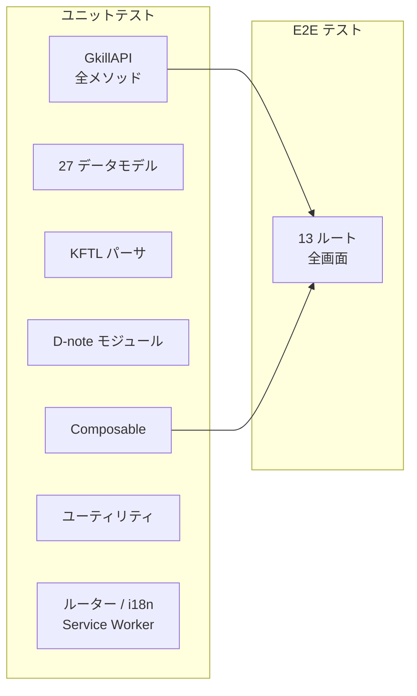

# テストガイド

## 1. 概要

gkill プロジェクトには Go バックエンド、Vue 3 フロントエンド、MCP サーバ、Android、Wear OS の各コンポーネントにテストが存在し、データアクセス層から API 統合、UI の E2E テストまで幅広くカバーしています。

### テスト統計

> **これは静的計数**（ソースに書かれたテスト宣言の数）であり、実行時にレポートされる件数とは一致しません。
> `it.each` / `test.each` の展開、`skip`、Playwright のプロジェクト数によって実行件数は増減します。
> 下表の数値は `npm run verify_docs -- --list` が算出するメトリクスと同じ定義です。

| コンポーネント | テスト宣言数 | テストファイル数 | フレームワーク |
|--------------|---------|----------------|---------------|
| Go バックエンド | 1361 | 204 | Go `testing` |
| フロントエンド ユニット | 2025 | 179 | Vitest |
| フロントエンド E2E | 253 | 46（+auth.setup.ts） | Playwright |
| MCP サーバ | 1127 | 36 | Go `testing` |
| ツール | 55 | 2 | Vitest |
| Android | 15 | 2 | JUnit 4 |
| Wear OS | 228 | 18 | JUnit 4 + MockK |
| **合計** | **5,064** | **487** | |

数え直すコマンド:

```bash
grep -rhE '^func Test' src/server --include=*.go | wc -l          # Go テスト数
find src/server -name '*_test.go' | wc -l                          # Go テストファイル数
grep -rhE "^\s*(it|test)\(" src/client/__tests__/unit | wc -l      # クライアント ユニット
grep -rhE "^\s*test\(" src/client/__tests__/e2e --include=*.spec.ts | wc -l  # E2E
```

> `src/plugins/*` の Go テスト（`loader_test.go`、`reader_test.go` 等）は
> 各プラグインが**独立した Go モジュール**のため、上記の集計（`src/server` 基準）には含まれない
> （`test_server` は `src/tools/run_test_suite.mjs` 経由で `src/server` にて `go test ./...`）。実行は `npm run test_plugins`
> （`src/tools/test_plugins.mjs` が go.mod を持つディレクトリを探して1つずつ回す）が担当し、
> `npm test` からも呼ばれる。詳細は `src/plugins/ABOUT_TEST.md` を参照。

### テスト仕様書

各 `src/` サブディレクトリには `ABOUT_TEST.md` が配置されており、そのフォルダ内のテスト概要を日本語で記載しています。索引は [`src/ABOUT_TEST.md`](../../src/ABOUT_TEST.md) です。

## 2. テスト実行コマンド

### 全テスト一括実行

```bash
npm test
```

このコマンドは以下を順次実行します：
`install_server`（ビルド） → **`verify_docs`（docs CI）** → server → client → MCP → tools → plugins → Android → Wear OS

`verify_docs` を重いテスト群より前に置いているのは、実行が速く失敗が早いため。
また `install_server` の後に置くのは、`checkManuals()` の生成鮮度チェックを
マニュアル再生成後の状態で走らせるため。

### コンポーネント別実行

| コマンド | 対象 | 所要時間目安 |
|---------|------|------------|
| `npm run verify_docs` | ドキュメントの件数・リンク・参照パス・Mermaid・マニュアル | 数秒 |
| `npm run test_server` | Go バックエンド全体 | 数十秒 |
| `npm run test_client` | フロントエンド（ユニット + E2E） | 20分前後（E2Eを含むため） |
| `npm run test_client_unit` | フロントエンド ユニットのみ | 数十秒 |
| `npm run test_client_e2e` | フロントエンド E2E のみ（gkill_server 自動起動・停止） | 20分前後 |
| `npm run test_e2e_server` | E2E 用 gkill_server 単体起動 (`$HOME/gkill_test`) | — |
| `npm run test_mcp` | MCP サーバ（`src/server` で `go test ./gkill/mcp/...`） | 数秒 |
| `npm run test_tools` | `src/tools/` のリリースゲート・attestation ランナーとリリース工程の書く側（記録条件・`version.json`・成果物検証。`vitest.config.tools.ts`。使い捨て git リポジトリを作るので git が要る） | 30秒前後 |
| `npm run test_plugins` | 同梱プラグイン（独立 Go モジュール7つ） | 数秒 |
| `npm run vet_plugins` | 同梱プラグインへ `go vet`（CI の `plugins` ジョブが `test_plugins` の前に回す。`npm test` には入っていない） | 数秒 |
| `npm run test_android` | Android | Gradle 依存 |
| `npm run test_wear_os` | Wear OS | Gradle 依存 |

`verify_docs` と `test_*` はすべて `src/tools/run_test_suite.mjs` を経由する。スイートが exit 0 で終わると、
作業ツリーの tree hash を `test_attestation.local.json`（gitignore 済み）に記録し、`npm run release` の
リリースゲートがそれを検査する（詳細は `operations-guide.md` 3.3、規約は `.claude/skills/gkill-build-test/SKILL.md`）。
`npm run test_client_e2e -- --workers=2` のような余剰引数はそのままスイートへ渡る。並列度・レポータ系は
記録されるが、`-run` / `--grep` / ファイル名のような絞り込みは「全件通った」と言えないので記録されない。
`verify_docs -- --list` のように引数が検査内容を置き換えるスイートは、引数が 1 つでもあれば記録されない。

### Go パッケージ単位での実行

```bash
# 特定パッケージのテスト
cd src/server && go test ./gkill/api/...
cd src/server && go test ./gkill/dao/reps/...
cd src/server && go test ./gkill/api/kftl/...

# 全パッケージ（npm run test_server と等価）
cd src/server && go test ./...

# 詳細出力
cd src/server && go test -v ./gkill/dao/reps/...
```

### Vitest の個別実行

```bash
# 特定テストファイルの実行
npx vitest run src/client/__tests__/unit/api/gkill-api.test.ts

# パターンマッチで実行
npx vitest run --reporter=verbose datas

# ウォッチモードで開発中に常時実行
npx vitest watch
```

### Playwright E2E テスト

```bash
# 事前に必須: 最新フロントエンドを埋め込んだ gkill_server をインストール
npm run install_server

# E2E テスト実行（gkill_server を自動起動・停止）
npm run test_client_e2e

# 特定ファイル（事前に gkill_server を手動起動する必要あり）
npx playwright test src/client/__tests__/e2e/login.spec.ts

# ヘッドフルモード（ブラウザ表示）
npx playwright test --headed

# デバッグモード
npx playwright test --debug
```

**E2E テスト環境の仕組み:**

`npm run test_client_e2e` は `src/client/__tests__/e2e/run-e2e.mjs` を実行し、以下を自動で行います：

1. 残存 `gkill_server` プロセスのうち **コマンドラインに `gkill_test` を含むものだけ**を停止し、`$HOME/gkill_test` ディレクトリを削除・再作成（クリーン状態）
2. **空きポートを 2 つ採番**（gkill_server 用 / Vite 用、`free-port.mjs`）
3. **インストール済みの `gkill_server` バイナリ**を `--gkill_home_dir "$HOME/gkill_test" --address 127.0.0.1:<空きポート> --disable_tls --log none` で起動し、応答するまで待機（最大 30 秒、500ms間隔）
4. **Vite dev server** を空きポートで起動（`GKILL_API_PROXY_TARGET` でテスト用 gkill_server に `/api` をproxy）
5. `GKILL_E2E_BASE_URL` / `GKILL_E2E_VITE_URL` を渡して `npx playwright test` を実行
6. テスト完了後に Vite と gkill_server を停止

これにより毎回クリーンな状態でテストが実行されます。初回テスト実行時、`helpers.ts` の `loginAsAdmin()` がサーバから reset_token を取得し、`/register_first_account` ページで自動的にアカウント登録とパスワード設定を行います（初期 admin は `PasswordResetToken` が設定されているため、この登録なしにはログインできません）。

> **ポートは固定ではありません。** 開発機で本番 `gkill_server` が :9999 を占有していても衝突しないよう、E2E が使うポートは毎回 OS から空きポートを採番します。プロセス停止も `gkill_test` を含むものに限定しているため、常駐している本番サーバを巻き込みません。

> **Vite の役割。** テスト対象（`baseURL`）は **`go install` 済み `gkill_server` バイナリに埋め込まれたフロントエンド**です。Vite dev server は `check-server.ts` の `checkGkillApiViaVite()` ゲート用に起動され、これが無いと CRUD 系 22 spec が skip されます。Vite の `/api` proxy 先は `GKILL_API_PROXY_TARGET` でテスト用サーバに固定されるため、本番の :9999 に書き込む事故は起きません。
>
> - `npm run test_client_e2e` を単独実行する前に **`npm run install_server` が必要**です。これを省くと、以前ビルドした古いフロントエンドを試験してしまいます。
> - `npm test` は先に `install_server` を実行するため、常に最新ビルドを試験します。

> **Note:** `npx playwright test` を直接実行する場合は、事前にテスト用 gkill_server を手動で起動し、接続先を環境変数で渡す必要があります：
> ```bash
> # ターミナル 1: テスト用サーバ起動（:19999 で起動する）
> rm -rf ~/gkill_test && mkdir -p ~/gkill_test
> npm run test_e2e_server
>
> # ターミナル 2: テスト実行
> GKILL_E2E_BASE_URL=http://localhost:19999 npx playwright test
> ```
> `playwright.config.ts` の `baseURL` は `process.env.GKILL_E2E_BASE_URL ?? 'http://localhost:9999'`、
> Vite ゲートの接続先は `process.env.GKILL_E2E_VITE_URL ?? 'http://localhost:5173'` です。

## CI

`.github/workflows/` には2つのワークフローがある。

| ワークフロー | 内容 |
|---|---|
| `ci.yml` | ビルドとテスト。次の4ジョブを並列に回す。<br>・`go` … build / vet / **gofmt**（`test -z "$(gofmt -l .)"`。無かったころ60ファイル分の崩れが溜まっていた）/ test / dao配下の `-race`<br>・`frontend` … type-check / **`npx eslint --max-warnings 0`**（`npm run lint` は `--fix` なのでCIでは使わない。固定sleepや条件分岐の警告を溜めないための歯止め）/ Vitest / MCP / tools（`test_tools`）<br>・`docs` … `build_manuals` → `verify_docs`<br>・`plugins` … 各プラグインモジュールの **`go vet`** → `go test` |
| `codeql.yml` | CodeQL 解析（go / java-kotlin / javascript-typescript） |

`ci.yml` は E2E・Android・Wear OS を含まない。ローカルの `npm test` は
`install_server` から始まって30分近くかかるため、push ごとに回す層は
速いものだけに絞っている。E2E は手元で `npm run test_client_e2e` を使う。

**Go ジョブが `npm ci` と `copy_i18n_to_app_embed` を先に実行する理由**:
`gkill/api` パッケージの `init()` は `embed/i18n/locales` を読み、
見つからなければ panic する。locales のコピーは Vite のビルドを伴わないので、
フロントエンド一式をビルドしなくてもここだけ用意すれば Go のテストが回る。

**`docs` ジョブが `build_manuals` を先に実行する理由**:
`resources/manual/` は生成物で追跡していない。`verify_docs` はマニュアルの
生成鮮度と言語間のページ集合一致を見るため、先に `manual_src` から生成する必要がある。

なお `src/server/gkill/api/embed/PLACEHOLDER.md` は、embed 配下が空だと
`//go:embed` がコンパイルエラーになるために置いている追跡ファイル。
これが無いとクリーンな clone で `go build ./...` すら通らない。

### ドキュメント検証（docs CI）

自動テストとは別に、ドキュメントの整合性を検証する軽量ツール（Node 標準のみ）がある。`ci.yml` の `docs` ジョブで PR / push 時に実行される。

```bash
npm run verify_docs                    # 件数・リンク・パス・Mermaid・マニュアルa11y/生成鮮度を検証
node src/tools/verify_docs.mjs --parity # 構造パリティ・レポート（日本語=正本との各言語ズレ）
```

主な検査項目:
- **件数ドリフト**: docs 記載の件数（handler / req_res / view / dialog / endpoint / i18nキー 等）をコードから再計算して突合。実測値は `node src/tools/verify_docs.mjs --list` で確認できる。`npm test` にも組み込まれているため、コードを変えて件数が動いたらテストが落ちる。
- **相互リンク・参照パス・Mermaid**: reverse資料内の `.md` リンク・`src/...` パス・Mermaid ブロックを検査。
- **マニュアル**: `resources/manual_src` からの生成鮮度、アクセシビリティ不変条件（`<main>`／全表 `<caption>`／全 `th` に `scope`）、7言語のページ構成一致、内部リンク。

詳細なワークフローは [dev-setup.md](dev-setup.md)（ドキュメント・マニュアルのツール）を参照。

## 3. テストアーキテクチャ

### 3.1 Go バックエンド（`src/server/`）

```
src/server/gkill/
├── api/
│   ├── find_filter_test.go            ← 検索フィルタ
│   ├── find/find_query_test.go        ← クエリビルダー
│   ├── gpslogs/gpslogs_test.go        ← GPS ログ解析
│   ├── message/                       ← メッセージフォーマット + エラーコード→HTTPステータス表
│   │   ├── message_test.go
│   │   ├── gkill_error_test.go
│   │   └── http_status_test.go        ← ステータス表の網羅・分布・名指し固定（下記）
│   ├── kftl/                          ← KFTL パーサ（6ファイル）
│   ├── req_res/                       ← ワイヤ契約（JSONタグ名 / omitempty）と応答型の Errors / Messages の型（ソース走査）
│   ├── find_kyou_rep_name_filter_test.go ← rep名での結果側の絞り込み
│   ├── select_match_reps_cache_test.go   ← 検索対象repの選定（キャッシュを剥がさないこと）
│   └── gkill_server_api/              ← ハンドラ層（45ファイル）
│       ├── gkill_server_api_test.go              ← 統合テスト（全エンドポイント）
│       ├── gkill_server_api_rate_limit_test.go   ← ログインレート制限
│       ├── response_status_guard_test.go         ← 全ハンドラが writeErrorStatus を呼ぶこと（ソース走査）
│       ├── response_status_test.go               ← エラー時のHTTPステータス実挙動（下記）
│       ├── auth_middleware_capped_test.go        ← 無認証経路のボディ上限・読み取り期限・応答ラッパの Unwrap
│       ├── handle_add_urlog_skip_wiring_test.go  ← URLog 取得抑止フラグの引数順（ソース走査）
│       ├── filter_local_only_test.go             ← localhost 判定 (isLocalRequest)
│       ├── handle_get_idf_kyou_by_relative_path_test.go ← 相対パス解決
│       ├── handle_get_shared_kyous_test.go       ← 共有Kyou取得
│       ├── handle_zip_cache_file_serve_test.go   ← ZIPキャッシュの利用者分離
│       ├── utils_ssrf_test.go                    ← SSRF対策
│       ├── get_device_cache_test.go              ← デバイス一覧キャッシュ
│       ├── handle_reset_password_test.go         ← パスワードリセット
│       ├── plugin_content_html_cache_test.go     ← プラグイン本文HTMLのキャッシュ
│       ├── get_kyous_rep_filter_test.go          ← rep名絞り込み（キャッシュON/OFF × UpdateCache前後）
│       ├── get_kyous_tx_rep_filter_test.go       ← tx確定した記録がrep絞り込みを通ること
│       ├── gkill_error_cause_scan_test.go        ← if err != nil 内の GkillError に Cause があること（複合条件も。ソース走査）
│       ├── handle_commit_tx_error_code_test.go   ← commit_tx の失敗コード写し（13種別・Cause）
│       ├── handle_discard_tx_test.go             ← discard_tx の失敗コード写し
│       ├── handle_add_without_write_rep_test.go  ← 書き込み先 rep 無しは panic ではなく config エラー
│       └── security_headers_middleware_test.go   ← セキュリティヘッダ3つと経路側の Set が勝つこと
├── plugin/
│   └── sdk/                           ← プラグインSDK（4ファイル: sdk / config / source / cache_path）
├── dao/
│   ├── gkill_dao_manager_test.go      ← DAO マネージャ
│   ├── account/                       ← アカウント CRUD、Argon2id、スキーマ移行（3ファイル）
│   ├── account_state/                 ← セッション・アップロード履歴
│   ├── server_config/                 ← サーバ設定
│   ├── user_config/                   ← ユーザ設定・リポジトリ定義
│   ├── share_kyou_info/               ← 共有設定
│   ├── gkill_notification/            ← 通知ターゲット
│   ├── hide_files/                    ← ファイル非表示
│   ├── sqlite3impl/                   ← SQLite3 ユーティリティ
│   └── reps/                          ← リポジトリ実装（63ファイル。repositories_get_kyou_histories_cache_test.go, git_commit_log_cached_miss_test.go, plugin_repository_impl_test.go, plugin_git_commit_log_adapter_test.go, git_commit_log_cached_unique_test.go, ur_log_fill_skip_test.go 等）
│       ├── *_repository_sqlite3_impl_test.go  ← 11データ型
│       ├── cached_and_temp_test.go    ← キャッシュ層・一時層
│       └── cache/                     ← キャッシュ更新
├── usecase/                           ← 規約のソース走査 + キャッシュ反映（3ファイル）
│   ├── write_through_cache_test.go    ← 書き込み後のキャッシュ反映
│   ├── cached_rep_insert_alignment_test.go ← INSERT の列並びと引数の並びの一致
│   └── source_conventions_scan_test.go ← 規約9件のソース走査（下記）
├── dvnf/                              ← DVNF ファイル管理（3ファイル。copyFile の実ファイル操作を含む）
└── main/                              ← CLI・エントリポイント（15ファイル）
```

**テスト戦略:**

- **インメモリ SQLite3**: 全 DAO テストはインメモリデータベースを使用し、テスト間の隔離を保証
- **4層リポジトリパターン**: interface → SQLite3 実装 → キャッシュ実装 → 一時実装の各層をそれぞれテスト
- **統合テスト**: `gkill_server_api/gkill_server_api_test.go` が全11データ型の CRUD を HTTP ハンドラレベルで検証（ZIP内容閲覧含む）
- **`usecase/` には関数ごとの専用テストを置かない**: ビジネスロジックはハンドラ統合テストが
  HTTPレイヤ込みで通す。このパッケージに置いてあるのは、そのやり方では捕まえられない3本だけ。
  理由は [`src/server/gkill/usecase/ABOUT_TEST.md`](../../src/server/gkill/usecase/ABOUT_TEST.md) を参照
- **規約のソース走査**: 13型・457メソッドのようにコピペで増える形は、**1つだけ抜けても他が緑のまま通る**。
  `usecase/source_conventions_scan_test.go` が製品コードを実行せずソースの書き方だけを見張る（8件）。
  どれも「`go build` も `go vet` も通り、実行時にエラーも出ずに静かに間違った結果を返す」種類のズレ
- **HTTPステータス化のガード3本**: エラーコード→ステータスの表（`api/message/http_status.go`）は
  「コードを足したのに分類し忘れる」「ハンドラのコピペで `writeErrorStatus` の1行が抜ける」で静かに壊れる
  （どちらもエラーにならず、そのエンドポイントだけ異常時も200へ戻る）。役割分担で3本が見張る
  - `message/http_status_test.go` — 表の**網羅**（`error_codes.go` の全定数が表に載る・表に余剰が無い）、
    ステータス別**分布**の固定（「とりあえず500」で全部通るのを防ぐ）、実害の出る割り当ての**名指し固定**
  - `gkill_server_api/response_status_guard_test.go` — **ソース走査**。全 `handle_*.go` のエンコード行の
    直前に `writeErrorStatus` があること、認証ミドルウェアとローカル限定フィルタが
    `writeGkillErrorResponse` を通すこと（素の `json.NewEncoder(w).Encode(` に加え
    **素の `w.WriteHeader(` の直書きも禁止** — 本文なしでステータスだけが返り、
    クライアントの `res.json()` が例外になる）
  - `gkill_server_api/response_status_test.go` — **実挙動**。表が正しくてもハンドラが呼んでいなければ
    意味がないので、実際にHTTPを叩いて 401/400/403/409/413 と「成功は今も200」を確認する
- **テストヘルパー**: `reps/testhelper_test.go` が共通のテストデータ生成・DB セットアップを提供

### 3.2 フロントエンド ユニット（`src/client/__tests__/unit/`）

```
src/client/__tests__/
├── unit/
│   ├── api/                           ← API クライアント（8ファイル）
│   │   ├── gkill-api.test.ts         ← GkillAPI シングルトン（全メソッド）
│   │   ├── find-kyou-query.test.ts   ← 検索クエリビルダー
│   │   └── hydrate.test.ts           ← hydrate() / hydrate_all()（JSON→クラス詰め替え）
│   ├── classes/                       ← ユーティリティ（53ファイル）
│   │   ├── deep-equals.test.ts
│   │   ├── format-date-time.test.ts
│   │   ├── looks-like-url.test.ts
│   │   ├── long-press.test.ts
│   │   ├── save-as.test.ts
│   │   ├── delete-gkill-cache.test.ts
│   │   ├── markdown-to-html.test.ts
│   │   ├── mermaid-render.test.ts
│   │   ├── foldable-struct-move.test.ts
│   │   ├── kyou-content-text.test.ts  ← 内容コピー / IDコピー
│   │   ├── use-dialog-history-stack.test.ts
│   │   ├── delayed-loading.test.ts
│   │   ├── cascade-delete-kyou.test.ts    ← Kyou削除の連鎖削除（探索・削除順・循環参照・深さ上限）
│   │   ├── use-confirm-delete-kyou-view.test.ts ← 削除確認ビュー（二重送信ガード・finallyでのクローズ）
│   │   ├── kyou-view-relay.test.ts        ← 中継束の網羅性（ビュー18件 / ダイアログ20件、overrides の差し替え）
│   │   ├── confirm-dialog-close.test.ts   ← 確認ダイアログが例外時も finally で閉じること
│   │   ├── edit-view-no-update-check.test.ts ← 「更新がありません」判定に related_time を含めること
│   │   ├── convention-source-scan.test.ts ← 棚卸し全体の安全網（規約9件のソース走査）
│   │   ├── check-auth-login-page.test.ts  ← ログイン画面ではセッション無効の飛ばしを止めること
│   │   ├── abort-error.test.ts            ← 中断判定（20箇所の手書きを集約した先）
│   │   ├── web-push-key.test.ts           ← VAPID公開鍵のバイト列化（6ページ分を集約した先）
│   │   ├── use-gkill-message-feed.test.ts ← 右上のエラー / メッセージのフィード（view 版は表示ロジック）
│   │   ├── global-exception-feed.test.ts  ← main.ts の例外配線（中断と ResizeObserver の通知は出さない）
│   │   └── tx-bundle-source-scan.test.ts  ← 複数書き込みの保存経路が run_in_tx / tx_id を通ること（ソース走査）
│   ├── datas/                         ← データモデル（35ファイル）
│   ├── dnote/                         ← D-note モジュール（9ファイル、trend-aggregator / correlation-graph-editor-view 含む）
│   ├── kftl/                          ← KFTL 行分類器（8ファイル。kftl-line-labels 含む）
│   ├── composables/                   ← Vue Composable（62ファイル。add-views / edit-views /
│   │                                     tx-bundle-views / shared-mi-view-dialog / context-menus / page-composables /
│   │                                     query-composables / idf-kyou-view / re-kyou-view /
│   │                                     mi-re-kyou-view / kyou-view / kyou-count-calendar /
│   │                                     gps-log-map / overlay-and-ur-log-view /
│   │                                     save-clipboard-to-file-dialog /
│   │                                     rykv-view-search-routing / mi-view-search-routing /
│   │                                     rykv-sidebar-saved-query-apply / mi-sidebar-saved-query-apply /
│   │                                     mi-board-query / kyou-list-view-loading /
│   │                                     sidebar-child-query-sync-emission / kyou-list-view-scroll-to /
│   │                                     rep-query-summary-detail / find-query-editor-dialog-default-signal /
│   │                                     registered-tag-column-filter / new-tag-column-search /
│   │                                     browse-zip-contents-dialog / plugin-config-dialog）
│   ├── router.test.ts                 ← ルーター（コンポーネント13 + リダイレクト専用2）
│   ├── i18n-completeness.test.ts      ← i18n 完全性（7ロケール）
│   └── service-worker.test.ts         ← Service Worker
├── e2e/                               ← E2E テスト（後述）
└── helpers/                           ← テストヘルパー
    ├── factory.ts                     ← テストデータファクトリ
    ├── mock-api.ts                    ← API モック
    └── setup-i18n.ts                  ← i18n セットアップ
```

**テスト戦略:**

- **jsdom 環境**: Vitest の jsdom 環境でブラウザ API をシミュレート
- **API モック**: `mock-api.ts` で `GkillAPI` のメソッドをモックし、HTTP 通信なしでテスト
- **ファクトリパターン**: `factory.ts` の `makeKmemo()`, `makeMi()`, `makeTag()` 等でテストデータを生成
- **Vue 3 対応**: `@vue/test-utils` と Vitest の組み合わせで Composable と Vue コンポーネントをテスト

### 3.3 フロントエンド E2E（`src/client/__tests__/e2e/`）

コンポーネントを持つ13ルートすべてを Playwright で検証し、CRUD 操作フローもカバーします
（46 specファイル + auth.setup.ts、253テスト宣言）。各テストでは以下を共通チェックします：

- **JS エラー検出**: ページ遷移時にコンソールエラーがないことを検証
- **インタラクティブ操作**: ボタンクリック、フォーム入力、ダイアログ開閉
- **CRUD フロー**: メモ帳構文で記録 → 画面追加 → 編集 → 削除 → 閲覧の一連操作
- **レスポンシブ対応**: 一部テスト（`rykv.spec.ts` / `mi-board.spec.ts`）でモバイルビューポートの表示確認

> **spec ファイルごとの内容は [`src/client/pages/ABOUT_TEST.md`](../../src/client/pages/ABOUT_TEST.md) が持ちます。**
> 以前はここにも同じ一覧を置いていましたが、spec が増えるたびに二重管理になり、
> 実際に「40ファイル/215宣言」で取り残されていました。件数（44 / 250）は `verify_docs` が
> 実測と突き合わせますが、ファイル名の一覧までは検査できないため、置き場所を1つに寄せています。
>
> 同じ資料には **E2E の書き方の規約**（条件で本体を包まない / 固定 sleep を使わない）と、
> 硬いアサーションへ移行したときに引っかかった落とし穴の一覧もあります。

#### ヘルパーファイル

| ファイル | 用途 |
|---------|------|
| `run-e2e.mjs` | E2E テストランナー（gkill_server 自動起動・停止、`$HOME/gkill_test` クリーン） |
| `free-port.mjs` | `getFreePort()` / `getFreePorts()` — OS から空きポートを採番する。ポートを固定しないための要 |
| `auth.setup.ts` | Playwright の `setup` プロジェクト。ログイン済み `storageState` を作って以降のテストで再利用する |
| `helpers.ts` | `loginAsAdmin()` — 初回起動時の自動登録（reset_token取得→register_first_account）+ テストユーザでのログイン |
| `check-server.ts` | `checkGkillServer()`, `checkGkillApiViaVite()` — サーバヘルスチェック |
| `crud-helpers.ts` | メモ帳の送信（`.kftl_text_area` + 保存ボタン有効化待機。**id はメモ帳を複数枚開けるよう `useId()` で採番されるのでクラスで掴む**）、ページナビゲーション（フローティングダイアログ自動閉じ）、列ビューの準備完了待ち（`data-gkill-view-ready`）、コンテキストメニュー操作、FAB クリック |
| `e2e-credentials.ts` | テストユーザのIDとパスワードハッシュ。各 spec へ手書きで散らさないための1箇所 |
| `global-setup.ts` | Playwright グローバルセットアップ（no-op — サーバ管理は `run-e2e.mjs` が担当） |
| `global-teardown.ts` | Playwright グローバルティアダウン（no-op — Playwright が自動停止） |

### 3.4 MCP サーバ（`src/server/gkill/mcp/*_test.go`）

MCP テストは全てモック/スタブベース（`mock_client_test.go` と偽 gkill `internal/fakegkill`）で動作し、実行中の gkill_server は不要です。OAuth テスト（`oauth_server_test.go`, `oauth_store_test.go`）もインメモリストアを使用するため、外部環境変数（`GKILL_BASE_URL` 等）の設定は不要です。3種のMCPサーバ（Read/Write/ReadWrite）のテストを含みます。2026-09-20 に Node.js 実装から Go へ移し、旧 vitest の `describe` / `test` を `TestXxx` / `t.Run` に 1:1 で対応させてあります（件数は `t.Run` を数える）。

**共通・Read専用サーバ:**

| テストファイル | テスト内容 |
|-------------|-----------|
| `validation_test.go` | Read入力パラメータ検証（必須/型/範囲） |
| `normalization_test.go` | 日付・文字列・デフォルト値の正規化 |
| `constants_test.go` | ツール名、エラーコード、デフォルト設定値 |
| `tool_handlers_test.go` | Read 11ツール分のハンドラ実行ロジック（`read_tools.go` を実物 import したツール名一覧・エンドポイント対応表・summarize） |
| `file_link_test.go` | FileLinkStore（HTTPモード用の期限付きファイルリンクトークンの発行・解決・失効、`GET /files/{token}` 配信） |
| `client_test.go` | GkillReadClient（fetch モック、認証、レスポンスパース） |
| `server_test.go` | McpServer ライフサイクル、トランスポート管理、gkill_get_idf_file ツール |
| `access_log_test.go` | McpAccessLog（レベルフィルタリング、JSON形式、sourceパラメータ） |
| `pkce_test.go` | PKCE検証（S256/plain） |
| `oauth_store_test.go` | OAuth ストア（トークン/コード/クライアント CRUD、TTL 有効期限、JSON ファイル永続化） |
| `oauth_server_test.go` | OAuth サーバ（メタデータ、認可、トークン交換、PKCE、DCR、RFC 8707、E2E フロー） |
| `status_tool_test.go` | ツール一覧の世代 `schema_revision` の計算と `gkill_status` への焼き込み（決定性・自己参照除外・冪等・3サーバで別値） |
| `help_topics_test.go` | `gkill_get_mcp_help` の topic 本文（全 topic に本文・index の列挙・説明文から移した知識の実在・名指しするツール名の実在・3サーバ搭載・gkill へ往復しない） |
| `schema_contract_test.go` | tools/list どおりに呼べる契約（スキーマのキー集合 = 受理集合 − 廃止済み、全プロパティ指定スモーク、3サーバの同名ツール同一、世代の一致） |
| `tool_schema_budget_test.go` | tools/list のバイト量が予算ファイル `src/server/gkill/mcp/tool_schema_budget.json` 内であること（超過・過小の両方で失敗）。説明文を意図して変えたときは `gkill_server mcp schema-budget --update` で予算を書き直す |
| `golden_test.go` | 旧 Node 実装から採ったゴールデン（`testdata/golden/`。要求コーパス 328 件）との**バイト一致**（tools/list・`schema_revision`・tools/call の応答（stdio / http × 3サーバ）・gkill へ送った要求） |
| `config_test.go` | 設定ファイル `gkill_mcp.json` の生成と、フラグ > 環境変数 > ファイル > 既定値の優先順位 |
| `import_graph_test.go` | package `mcp` が本体の `api` / `dao` / `usecase` を import しないこと |
| `stdio_e2e_test.go` | テストバイナリを子プロセスにした stdio の端から端まで（NDJSON / Content-Length、stdout に JSON-RPC 以外が出ない） |

**プラグインツール（3サーバ共通）:**

| テストファイル | テスト内容 |
|-------------|-----------|
| `plugin_tools_test.go` | `gkill_get_plugin_list` の定義とエンドポイント振り分け、`inlinePluginContents`（rep内直列・rep間並列、format別レスポンス、truncated、重複取得の集約、rep単位の失敗打ち切り、max_kyous/budget/deadline のskip、統計の整合）、summarize |
| `html_text_test.go` | プラグインコンテンツHTMLのプレーンテキスト変換、HTMLエンティティのデコード |

**Write専用サーバ:**

| テストファイル | テスト内容 |
|-------------|-----------|
| `write_normalization_test.go` | Write入力の正規化（11 normalizer関数、mood範囲、data_type列挙値） |
| `write_client_test.go` | GkillWriteClient（環境変数、login、callWrite、認証リトライ） |
| `write_server_test.go` | McpWriteServer（29ツールディスパッチ、プラグインツール振り分け、エンティティデフォルト値、レスポンス構造） |
| `write_tool_handlers_test.go` | Write 21ツール定義（実物 import）・削除の語彙が3箇所で一致すること・summarizeWriteToolPayload |
| `write_handlers_test.go` | 書き込みディスパッチ（add/update/delete のエンドポイント、patch セマンティクス、create_app のサーバ種別） |

**Read/Write統合サーバ:**

| テストファイル | テスト内容 |
|-------------|-----------|
| `readwrite_client_test.go` | GkillClient（callApi統合メソッド、fetchFile、認証リトライ） |
| `readwrite_server_test.go` | McpServer統合（全33ツールディスパッチ、プラグインツール振り分け、IDF画像ブロック） |

### 3.5 Android / Wear OS

**Android** (`src/android/`): JUnit 4 + Kotlin
- ユニットテスト（JVM）: 定数検証（サーバURL、ポート、バイナリ名）
- インストルメンテーションテスト: Android フレームワーク統合

**Wear OS** (`src/wear_os/`): JUnit 4 + MockK
- phone_companion（10ファイル / 140テスト）: 認証ストア（暗号化含む）、Activity、API クライアント（MockWebServer、playing検索クエリの形状検証・全 API への `locale_name` 送信含む）、メッセージハンドリング、サーバ証明書の信頼（フィンガープリント計算とピン照合）、二重送信防止台帳、エラーコード→文言の照合（`GkillErrorText`）、`strings.xml` の7言語セットの整合
- watch_app（7ファイル / 86テスト）: Activity、テンプレートキャッシュ、Wear クライアント、データモデル、気分記録の KFTL 組み立て、`strings.xml` の7言語セットの整合

## 4. テスト設定ファイル

| ファイル | 用途 |
|---------|------|
| `vitest.config.ts` | フロントエンドユニットテスト設定（jsdom, Vue 3, パスエイリアス） |
| `playwright.config.ts` | E2E テスト設定（`baseURL`、`timeout: 60000`、`retries: CI?2:1`、`workers: CI?1:4`、`projects: setup/default` + `storageState`、`globalSetup`/`globalTeardown`）。**`webServer` は使っていない** — gkill_server と Vite の起動は `run-e2e.mjs` が行う |
| `src/client/__tests__/e2e/run-e2e.mjs` | E2E テストランナー（gkill_server 自動起動・停止、`$HOME/gkill_test` クリーン） |
| `src/server/go.mod` | Go テストの依存管理 |
| `src/android/app/build.gradle.kts` | Android テスト設定 |
| `src/wear_os/phone_companion/build.gradle.kts` | Wear OS phone_companion テスト設定 |
| `src/wear_os/watch_app/build.gradle.kts` | Wear OS watch_app テスト設定 |

## 5. テストカバレッジの範囲

### Go バックエンド（30ディレクトリにテスト有）


```mermaid
graph LR
    subgraph "API 層"
        A1[gkill_server_api_test.go<br/>統合テスト]
        A2[find_query_test.go<br/>クエリフィルタ]
        A3[kftl/ テスト<br/>KFTL パーサ]
        A4[req_res_test.go<br/>ワイヤ契約]
        A5[gpslogs_test.go<br/>GPS 解析]
        A6[message_test.go<br/>メッセージ]
    end

    subgraph "DAO 層"
        D1[11 リポジトリ<br/>SQLite3 実装]
        D2[キャッシュ/一時<br/>リポジトリ]
        D3[アカウント<br/>セッション]
        D4[設定 DAO<br/>サーバ/ユーザ]
        D5[共有/通知<br/>DAO]
        D6[DAO マネージャ<br/>SQLite3 ユーティリティ]
    end

    subgraph "ユーティリティ"
        U1[dvnf<br/>ファイル管理]
        U2[main/common<br/>CLI/ログ/スレッド]
        U3[エントリポイント<br/>バッチ処理]
    end

    A1 --> D1
    A1 --> D3
```

### フロントエンド


```mermaid
graph LR
    subgraph "ユニットテスト"
        F1[GkillAPI<br/>全メソッド]
        F2[27 データモデル]
        F3[KFTL パーサ]
        F4[D-note モジュール]
        F5[Composable]
        F6[ユーティリティ]
        F7[ルーター / i18n<br/>Service Worker]
    end

    subgraph "E2E テスト"
        E1[13 ルート<br/>全画面]
    end

    F1 --> E1
    F5 --> E1
```

## 6. テストデータの管理

### Go テスト

Go テストではインメモリ SQLite3 データベースを使用します。各テスト関数が独立した DB インスタンスを持ち、テスト間の干渉を防止します。

```go
// テストヘルパーの使用例（概念）
func TestKmemoRepository(t *testing.T) {
    db := setupInMemoryDB(t)  // インメモリ DB を作成
    repo := NewKmemoRepositorySQLite3Impl(db)
    // テスト実行...
    // t.Cleanup() で自動クリーンアップ
}
```

### フロントエンド テスト

テストデータファクトリ (`src/client/__tests__/helpers/factory.ts`) が各データ型のモックオブジェクトを生成します。

```typescript
// ファクトリの使用例（概念）
import { makeKmemo, makeMi, makeTag } from '../helpers/factory'

const kmemo = makeKmemo({ content: 'テストメモ' })
const mi = makeMi({ title: 'テストタスク', is_checked: false })
const tag = makeTag({ tag: 'テストタグ', target_id: kmemo.id })
```

API モック (`src/client/__tests__/helpers/mock-api.ts`) は `GkillAPI` シングルトンのメソッドをスタブに置き換え、ネットワーク通信なしでテストを実行します。

## 7. テスト実行の前提条件

### 全テスト共通

```bash
# Node.js 依存パッケージのインストール（初回 or package.json 変更時）
npm install
```

### Go テスト

- Go 1.26.6 以上（`src/server/go.mod` の `go` ディレクティブ）
- 追加のセットアップ不要（インメモリ DB 使用のため）

### フロントエンド ユニットテスト

- Node.js 20.19 以上（24.x推奨）。`package.json` に `engines` フィールドは無いため、この要件はドキュメント上の約束
- 追加のセットアップ不要

### フロントエンド E2E テスト

```bash
# Playwright ブラウザのインストール（初回のみ）
npx playwright install

# gkill_server のビルド（初回 or サーバコード変更時）
cd src/server/gkill/main/gkill_server && go install

# 自動実行（推奨）— サーバ起動・クリーン・停止を自動で行う
npm run test_client_e2e

# 手動実行 — 事前に gkill_server と Vite dev server を起動してから実行
npm run test_e2e_server  # ターミナル 1
npm run dev              # ターミナル 2
npx playwright test      # ターミナル 3
```

E2E テストは `$HOME/gkill_test` をテスト専用のホームディレクトリとして使用します。毎回クリーンな状態（admin アカウント/パスワードなし）で実行されます。

### Android テスト

```bash
# Android SDK と Java JDK が必要
cd src/android && ./gradlew test   # Windows は gradlew.bat（npm run test_android が自動で振り分ける）
```

### Wear OS テスト

```bash
# gradlew はコミット済みなのでコピー不要
cd src/wear_os && ./gradlew test
```

## 8. テスト追加のガイドライン

### Go テスト

- テストファイルはソースファイルと同じディレクトリに `*_test.go` として配置（Go の標準慣習）
- `testing.T` を使用し、サブテスト（`t.Run`）でテストケースをグループ化
- DAO テストはインメモリ SQLite3 を使用し、外部依存を排除

### フロントエンド ユニットテスト

- テストファイルは `src/client/__tests__/unit/` 配下に、ソースのディレクトリ構成を反映して配置
- ファイル名は `{module-name}.test.ts` 形式
- `factory.ts` でテストデータを生成、`mock-api.ts` で API をモック

### フロントエンド E2E テスト

- テストファイルは `src/client/__tests__/e2e/` 配下に `{feature-name}.spec.ts` 形式で配置
- `helpers.ts` の `loginAsAdmin()` でログイン、`crud-helpers.ts` の CRUD ヘルパーを利用
- `check-server.ts` でサーバ疎通確認し、未起動時は `test.skip()` でスキップ
- CRUD テストでは `makeUniqueLabel()` で一意なテストデータを生成（並列実行対応）
- 各テストで JS コンソールエラーの検出を組み込む
- `test.setTimeout(120000)` で API 通信を伴うテストのタイムアウトを延長
- テスト環境: `$HOME/gkill_test` を使用し、本番データに影響しない

### MCP サーバ テスト

- テストファイルは `src/server/gkill/mcp/` 配下に `{module}_test.go` 形式で配置（旧 vitest の `describe` → `TestXxx`、`test` → `t.Run`）
- gkill への往復は `mockClient`（`mock_client_test.go`）か偽 gkill（`internal/fakegkill`）で代替する。応答の形を変えたら `golden_test.go` が落ちるので、意図した変更なら `testdata/golden/` の当該行を更新して理由をコミットメッセージに書く

### 新しいデータ型を追加した場合のテスト

新しいデータ型（例：新しい Kyou 派生型）を追加した場合、以下のテストが必要です：

1. **Go DAO テスト**: `dao/reps/{type}_repository_sqlite3_impl_test.go` — CRUD テスト
2. **Go API 統合テスト**: `gkill_server_api_test.go` にテストケース追加
3. **フロントエンド データモデルテスト**: `__tests__/unit/datas/{type}.test.ts`
4. **フロントエンド API テスト**: `__tests__/unit/api/gkill-api.test.ts` にテストケース追加
5. **KFTL テスト**（対応する場合）: Go 側 `kftl/*_test.go`、TS 側 `__tests__/unit/kftl/*.test.ts`

## 9. トラブルシューティング

### Go テストが失敗する

```bash
# モジュールキャッシュのクリア
cd src/server && go clean -testcache

# 詳細ログ付きで再実行
cd src/server && go test -v -count=1 ./gkill/dao/reps/...
```

### Vitest が失敗する

```bash
# node_modules を再インストール
rm -rf node_modules && npm install

# キャッシュクリア
npx vitest run --reporter=verbose --no-cache
```

### Playwright E2E が失敗する

```bash
# ブラウザの再インストール
npx playwright install --force

# gkill_server が起動しているか確認
curl http://localhost:9999

# Vite dev server が起動しているか確認
curl http://localhost:5173

# API プロキシが機能しているか確認
curl -X POST -H "Content-Type: application/json" -d '{}' http://localhost:5173/api/login

# テスト用ホームディレクトリを手動クリーン
rm -rf ~/gkill_test && mkdir -p ~/gkill_test

# スクリーンショット付きデバッグ
npx playwright test --debug --trace on
```

> **Note:** E2E テストの大部分は gkill_server への API 通信を必要とします。`npm run test_client_e2e` で自動起動するか、手動で `npm run test_e2e_server` を実行してください。サーバ未起動時はテストがスキップされます。

### Android / Wear OS テストが失敗する

```bash
# Gradle キャッシュのクリア
cd src/android && ./gradlew clean
cd src/wear_os && ./gradlew clean

# Gradle ラッパーは src/wear_os/ にコミット済みなのでコピーは不要。
# 壊れたときだけ src/android/ から入れ直す:
#   npm run setup_wear_os_gradle
```

## 10. 関連資料

| 資料 | 説明 |
|------|------|
| [`src/ABOUT_TEST.md`](../../src/ABOUT_TEST.md) | テスト仕様書索引（全サブディレクトリへのリンク） |
| [`dev-setup.md`](dev-setup.md) | 開発環境構築手順 |
| [`operations-guide.md`](operations-guide.md) | 運用・デプロイガイド |
| [`api-endpoints.md`](api-endpoints.md) | API エンドポイント一覧（テスト対象の参照） |
| [`program-spec.md`](program-spec.md) | プログラム仕様（テスト対象の内部構造） |
