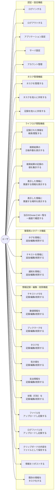

# gkill ユースケース

astah モデル（`gkill_model.asta`）のユースケース記述 + コードの API エンドポイントから整理。

## 0. アクター定義

| アクター | 説明 |
|---------|------|
| **ユーザ** | gkill にログインしてライフログの記録・閲覧・管理を行う利用者。全認証済みユースケースの主アクター |
| **管理者 (admin)** | アカウント作成・サーバー設定変更の権限を持つユーザ。初回起動時に自動作成される `admin` アカウント |
| **共有閲覧者** | 認証不要で共有リンク経由でKyouやタスクを閲覧する外部利用者 |
| **MCP クライアント** | MCP サーバー経由で gkill のデータを読み書きするAIアシスタント等の外部システム。Read サーバー（9ツール）は読み取りのみ、Write（24ツール）/ ReadWrite（29ツール）は追加・更新・削除も行える |
| **Wear OS ウォッチ** | Wearable Data Layer 経由でテンプレート取得・KFTL テキスト送信を行うウォッチアプリ |
| **ブックマークレット** | ブラウザ上で動作し、URLog（ブックマーク）を直接追加するJavaScript |

### スコープ

**スコープ内:**
- ライフログデータ（Kyou）の CRUD 操作
- テキストベース一括入力（KFTL）
- 検索・集計・関連情報表示
- タスク管理（Mi）
- 共有機能
- 認証・アカウント管理
- サーバー設定・リポジトリ管理
- Web Push 通知
- MCP 連携（読み取り / 書き込みの両方）
- プラグイン連携（外部プラグインの一覧取得・コンテンツ表示・設定）
- Wear OS 連携

**スコープ外:**
- ユーザ間のリアルタイムコラボレーション
- 外部サービスとの双方向同期
- 複数サーバー間のデータ同期
- ロールベースのアクセス制御（管理者/一般ユーザの2段階のみ）

## 1. ユースケース概要図


```mermaid
graph LR
    User((ユーザ))

    subgraph "情報記録・編集・削除機能"
        UC_KMEMO[テキストメモを<br>記録/編集/削除する]
        UC_KC[数値情報を<br>記録/編集/削除する]
        UC_URLOG[ブックマークを<br>記録/編集/削除する]
        UC_MI[タスクを<br>記録/編集/削除する]
        UC_LANTANA[気分値を<br>記録/編集/削除する]
        UC_NLOG[支出情報を<br>記録/編集/削除する]
        UC_TIMEIS[状態（打刻）を<br>記録/編集/削除する]
        UC_FILE[ファイルを<br>アップロードし記録する]
        UC_GPSLOG[ログファイルを<br>アップロードし記録する]
        UC_CLIPBOARD[クリップボードの内容を<br>ファイルとして保存する]
        UC_REKYOU[情報をリポストする]
        UC_MIREKYOU[既存の情報を<br>タスク化する]
    end

    subgraph "整理用メタデータ機能"
        UC_TAG[タグを情報に<br>追加/編集/削除する]
        UC_TEXT[テキストを情報に<br>追加/編集/削除する]
        UC_NOTIF[通知を情報に<br>追加/編集/削除する]
    end

    subgraph "ライフログ閲覧機能"
        UC_SEARCH[記録された情報を<br>検索/閲覧する]
        UC_CALENDAR[検索結果の<br>日毎件数を表示する]
        UC_AGGREGATE[検索結果の記録の<br>値を集計する]
        UC_RELATED[表示した情報に<br>関連する情報を表示する]
        UC_MAP[表示した情報に<br>関連する場所を表示する]
        UC_DASHBOARD[当日のDnoteとMI一覧を<br>一画面で確認する]
    end

    subgraph "タスク管理機能"
        UC_MI_MANAGE[タスクを管理する]
        UC_MI_SHARE[タスクを他人に共有する]
        UC_KYOU_SHARE[記録を他人に共有する]
    end

    subgraph "認証・設定機能"
        UC_LOGIN[ログインする]
        UC_LOGOUT[ログアウトする]
        UC_APP_CONFIG[アプリケーション設定]
        UC_SERVER_CONFIG[サーバ設定]
        UC_ACCOUNT[アカウント管理]
    end

    User --> UC_KMEMO
    User --> UC_KC
    User --> UC_URLOG
    User --> UC_MI
    User --> UC_LANTANA
    User --> UC_NLOG
    User --> UC_TIMEIS
    User --> UC_FILE
    User --> UC_GPSLOG
    User --> UC_CLIPBOARD
    User --> UC_REKYOU
    User --> UC_MIREKYOU
    User --> UC_TAG
    User --> UC_TEXT
    User --> UC_NOTIF
    User --> UC_SEARCH
    User --> UC_CALENDAR
    User --> UC_AGGREGATE
    User --> UC_RELATED
    User --> UC_MAP
    User --> UC_DASHBOARD
    User --> UC_MI_MANAGE
    User --> UC_MI_SHARE
    User --> UC_KYOU_SHARE
    User --> UC_LOGIN
    User --> UC_LOGOUT
    User --> UC_APP_CONFIG
    User --> UC_SERVER_CONFIG
    User --> UC_ACCOUNT
```

## 2. 機能カテゴリ別ユースケース一覧

> **件数について:** ユースケースは **84件（ユニークな UC-ID 数）**。以下のカテゴリ別表の行数は 89 行で、一部のユースケースは複数カテゴリに再掲されているため行数のほうが多くなる。件数を引用する際はユニーク ID 数（84）を使うこと。
>
> 数え直すときは **4桁に限定**すること。`UC-[0-9]+` だと本文中の「UC-04xx」「UC-05xx」という
> 記述（後述の欠番の説明）まで拾ってしまい、2件多く数えられる。
>
> ```bash
> grep -oE 'UC-[0-9]{4}' documents/reverse/usecase.md | sort -u | wc -l   # 84
> grep -cE '^\|\s*UC-[0-9]{4}' documents/reverse/usecase.md               # 89
> ```

### 2.1 認証

| UC-ID | ユースケース名 | API エンドポイント |
|-------|---------------|------------------|
| UC-0101 | ログインする | `Login` |
| UC-0102 | ログアウトする | `Logout` |
| UC-0103 | パスワードリセットする | `ResetPassword` |
| UC-0104 | 新パスワード設定する | `SetNewPassword` |
| UC-0105 | アカウント作成する | `AddAccount` |

### 2.2 情報記録（KFTL 経由）

| UC-ID | ユースケース名 | API エンドポイント |
|-------|---------------|------------------|
| UC-0201 | KFTL でデータを記録する | `SubmitKFTLText` |
| UC-0202 | KFTL 送信前に未知のタグを確認する | なし（クライアント完結。`collect_unknown_tags()` が既存タグに無いタグを検出し、確認ダイアログで承認されるまで送信しない） |

KFTL 経由で以下の全データ型を記録可能:
Kmemo, KC, Lantana, Mi, Nlog, TimeIs, URLog + Tag, Text

### 2.3 情報記録（画面操作）

| UC-ID | ユースケース名 | API エンドポイント |
|-------|---------------|------------------|
| UC-0301 | テキストメモを追加する | `AddKmemo` |
| UC-0302 | 数値情報を追加する | `AddKC` |
| UC-0303 | ブックマークを追加する | `AddURLog` |
| UC-0304 | タスクを追加する | `AddMi` |
| UC-0305 | 気分値を追加する | `AddLantana` |
| UC-0306 | 支出情報を追加する | `AddNlog` |
| UC-0307 | タイムスタンプを追加する | `AddTimeis` |
| UC-0308 | リポストする | `AddRekyou` |
| UC-0309 | 既存の情報をタスク化する | `AddMiReKyou` |

### 2.4 情報編集

| UC-ID | ユースケース名 | API エンドポイント |
|-------|---------------|------------------|
| UC-0401 | テキストメモを編集する | `UpdateKmemo` |
| UC-0402 | 数値情報を編集する | `UpdateKC` |
| UC-0403 | ブックマークを編集する | `UpdateURLog` |
| UC-0404 | タスクを編集する | `UpdateMi` |
| UC-0405 | 気分値を編集する | `UpdateLantana` |
| UC-0406 | 支出情報を編集する | `UpdateNlog` |
| UC-0407 | タイムスタンプを編集する | `UpdateTimeis` |
| UC-0408 | ファイル情報を編集する | `UpdateIDFKyou` |
| UC-0409 | リポストを編集する | `UpdateRekyou` |
| UC-0410 | リポストタスクを編集する | `UpdateMiReKyou` |

### 2.5 情報削除（論理削除）

削除は編集エンドポイントで `IS_DELETED=true` を設定することで実現。
専用の Delete エンドポイントは存在しない（Append-Only 方式）。

> **注:** UC-05xx は欠番です。削除操作は専用エンドポイントを持たず、UC-04xx（編集）の `IS_DELETED=true` 設定として実現されるため、独立したユースケースIDを付与していません。

### 2.6 メタデータ操作

| UC-ID | ユースケース名 | API エンドポイント |
|-------|---------------|------------------|
| UC-0601 | タグを追加する | `AddTag` |
| UC-0602 | タグを編集する | `UpdateTag` |
| UC-0603 | テキストを追加する | `AddText` |
| UC-0604 | テキストを編集する | `UpdateText` |
| UC-0605 | 通知を追加する | `AddNotification` |
| UC-0606 | 通知を編集する | `UpdateNotification` |

### 2.7 情報閲覧・検索

| UC-ID | ユースケース名 | API エンドポイント |
|-------|---------------|------------------|
| UC-0701 | Kyou を検索・一覧表示する | `GetKyous` |
| UC-0702 | 個別 Kyou を取得する | `GetKyou` |
| UC-0703 | 各データ型を個別取得する | `GetKmemo`, `GetKC`, `GetURLog`, `GetNlog`, `GetTimeis`, `GetMi`, `GetLantana`, `GetRekyou`, `GetMiReKyou`, `GetGitCommitLog`, `GetIDFKyou` |
| UC-0704 | タグ履歴を取得する | `GetTagsByTargetID`, `GetTagHistoriesByTagID` |
| UC-0705 | テキスト履歴を取得する | `GetTextsByTargetID`, `GetTextHistoriesByTextID` |
| UC-0706 | 通知履歴を取得する | `GetNotificationsByTargetID`, `GetNotificationHistoriesByNotificationID` |
| UC-0707 | Mi ボード一覧を取得する | `GetMiBoardList` |
| UC-0708 | 全タグ名を取得する | `GetAllTagNames` |
| UC-0709 | GPS ログを取得する | `GetGPSLog` |
| UC-0710 | 更新データを時刻指定取得する | `GetUpdatedDatasByTime` |
| UC-0711 | 集計ビューで記録を集計・分析する（集計項目・集計リスト） | `GetKyous`（集計はクライアント側）+ `UpdateApplicationConfig`（定義を `dnote_json_data` に保存） |
| UC-0712 | 集計ビューにトレンドグラフを追加・編集・削除する | `GetKyous`（時系列集計は `DnoteTrendAggregator` によるクライアント側処理）+ `UpdateApplicationConfig`（定義保存） |
| UC-0713 | Markdown ファイル内の相対リンクから対象記録を開く | `GetIDFKyouByRelativePath` |
| UC-0714 | ZIP ファイルの内容を閲覧する | `BrowseZipContents` |
| UC-0715 | 全リポジトリ名を取得する | `GetAllRepNames` |

### 2.8 ファイルアップロード

| UC-ID | ユースケース名 | API エンドポイント |
|-------|---------------|------------------|
| UC-0801 | ファイルをアップロードする | `UploadFiles` |
| UC-0802 | GPS ログファイルをアップロードする | `UploadGPSLogFiles` |
| UC-0803 | クリップボードの内容をファイルとして保存する | `UploadFiles`（クライアントサイドで Clipboard API → base64 変換後送信） |

### 2.9 ダッシュボード

| UC-ID | ユースケース名 | API エンドポイント |
|-------|---------------|------------------|
| UC-0901d | 当日のDnoteとMI一覧を一画面で確認する | `GetKyous`（DnoteView・KyouListView） |
| UC-0902d | ダッシュボードの日付を切り替えて過去日のデータを確認する | `GetKyous`（日付パラメータ変更） |
| UC-0903d | ダッシュボードのMI検索条件を設定する | `UpdateApplicationConfig`（DashboardConfig.dashboard_mi_find_kyou_query） |
| UC-0904d | ダッシュボードのDnote検索条件を設定する | `UpdateApplicationConfig`（DashboardConfig.dashboard_dnote_find_kyou_query） |
| UC-0905d | ダッシュボードからライフログを記録する | `SubmitKFTLText`, `AddMi`, `AddTimeis` 等（FABメニュー経由） |

### 2.10 設定管理

| UC-ID | ユースケース名 | API エンドポイント |
|-------|---------------|------------------|
| UC-0901 | アプリケーション設定を取得する | `GetApplicationConfig` |
| UC-0902 | アプリケーション設定を更新する | `UpdateApplicationConfig` |
| UC-0903 | サーバ設定を取得する | `GetServerConfigs` |
| UC-0904 | サーバ設定を更新する | `UpdateServerConfigs` |
| UC-0905 | ユーザリポジトリを更新する | `UpdateUserReps` |
| UC-0906 | リポジトリ一覧を取得する | `GetRepositories` |
| UC-0907 | リポジトリを再読み込みする | `ReloadRepositories` |
| UC-0908 | アカウントステータスを更新する | `UpdateAccountStatus` |

### 2.11 共有

| UC-ID | ユースケース名 | API エンドポイント |
|-------|---------------|------------------|
| UC-1001 | 共有リスト情報を追加する | `AddShareKyouListInfo` |
| UC-1002 | 共有リスト情報を更新する | `UpdateShareKyouListInfo` |
| UC-1003 | 共有リスト情報を削除する | `DeleteShareKyouListInfos` |
| UC-1004 | 共有リスト情報を取得する | `GetShareKyouListInfos` |
| UC-1005 | 共有 Kyou を取得する | `GetSharedKyous` |

### 2.12 その他

| UC-ID | ユースケース名 | API エンドポイント |
|-------|---------------|------------------|
| UC-1101 | TLS ファイルを生成する | `GenerateTLSFile` |
| UC-1102 | Web Push 通知公開鍵を取得する | `GetGkillNotificationPublicKey` |
| UC-1103 | Web Push 通知を登録する | `RegisterGkillNotification` |
| UC-1104 | URLog ブックマークレットアドレスを取得する | `URLogBookmarklet` |
| UC-1105 | キャッシュを更新する | `UpdateCache` |
| UC-1106 | MCP 経由で Kyou を取得する | `GetKyousMCP` |
| UC-1107 | トランザクションをコミットする | `CommitTX` |
| UC-1108 | トランザクションを破棄する | `DiscardTX` |
| UC-1109 | ディレクトリを開く | `OpenDirectory` |
| UC-1110 | ファイルを開く | `OpenFile` |
| UC-1111 | MCP 経由で IDF ファイルの実データを取得する | `GetIDFFile` |
| UC-1112 | MCP 経由で IDF ファイルの絶対パスを取得する | `GetIDFFilePath`（localhost からのリクエストのみ応答） |
| UC-1113 | プラグイン一覧を取得する | `GetPluginList`（呼び出し元は MCP の `gkill_get_plugin_list` のみ） |
| UC-1114 | プラグイン Kyou のコンテンツ HTML を取得する（画面表示と、MCP の `include_plugin_content` によるインライン埋め込みの両方から使う） | `GetPluginContentHTML` |
| UC-1115 | プラグイン設定画面の HTML を取得する | `GetPluginConfigHTML`（プラグイン Kyou のコンテキストメニュー「プラグイン設定」から開く） |
| UC-1116 | プラグイン設定を保存する | `PostPluginConfig`（設定ダイアログの iframe から postMessage で親に依頼して保存。`config.json` を直接編集する経路も残っている） |
| UC-1117 | Kyou の内容 / ID をクリップボードにコピーする | なし（クライアント完結。`classes/kyou-content-text.ts`） |
| UC-1118 | ディスク上の派生キャッシュを削除する | なし（CLI `clear_cache <thumb\|video\|zip\|plugin\|all> <all\|user_id...>`） |
| UC-1119 | 起動時に指定ユーザのリポジトリを先読みする | なし（CLI フラグ `--pre_load_users`） |
| UC-1120 | 待ち受けアドレスを起動時だけ上書きする | なし（CLI フラグ `--address`。設定DBの `ADDRESS` は書き換えないため、設定画面の表示と実際の待ち受け先がずれる） |
| UC-1121 | サーバ機上でパスワードを無効化してリセットURLを再発行する | なし（CLI `reset_password <user_id...>`。`account.db` を直接開く。パスワードは Argon2id で保存され復元できないため、管理者がパスワードを忘れたときやリセットトークンが期限切れになったときの唯一の復帰経路） |

## 3. ユースケース記述（astah モデルから抽出）

### UC-0102: ログアウトする

**事前条件:** アクターがアプリケーションにログインしている

**事後条件:** ログアウトされている

**基本フロー:**
1. アクターはアプリケーションタイトルプルダウンからログアウトを選択する
2. アプリケーションはログアウト処理を行う 【例外B】
3. アプリケーションはログイン画面を表示する

**例外フロー:**
- B【サーバ内エラー】: アプリケーションはエラーメッセージを表示する

---

### UC-0401: テキストメモを編集する

**事前条件:**
- アクターがアプリケーションにログインしている
- アクターが Kmemo 編集ダイアログを開いている

**事後条件:** 編集されたテキストメモが保存されている

**基本フロー:**
1. アクターはメモ内容を編集する 【代替B】
2. アクターは「保存」ボタンを押下する
3. アプリケーションは更新されたテキストメモを保存する
4. アプリケーションは保存成功メッセージを表示する 【例外A】
5. アプリケーションはテキストメモ入力欄をクリアする
6. アプリケーションは Kmemo 編集ダイアログを閉じる

**代替フロー:**
- B【ユーザによるキャンセル】:
  1. アクターは「×」ボタンを押下する
  2. アプリケーションは Kmemo 編集ダイアログを閉じる

---

### テキストメモを削除する

**事前条件:**
- アクターがアプリケーションにログインしている
- アクターが rykv 画面からコンテキストメニューを開いている

**事後条件:** 削除されたテキストメモが論理削除されている

**基本フロー:**
1. アクターはコンテキストメニューから「削除」を選択する
2. アプリケーションは削除確認ダイアログを表示する
3. ユーザは「削除」ボタンを押下する 【代替B】
4. アプリケーションはデータを論理削除する 【例外A】
5. アプリケーションは削除成功メッセージを表示する
6. アプリケーションは削除ダイアログを閉じる

**代替フロー:**
- B【ユーザによるキャンセル】:
  1. アクターは「×」ボタンを押下する
  2. アプリケーションは削除確認ダイアログを閉じる

---

### UC-0303: ブックマークを記録する（KFTL 経由）

**事前条件:**
- アクターがアプリケーションにログインしている
- アクターが KFTL ダイアログを開いている

**事後条件:** ブックマークが保存されている

**基本フロー:**
1. アクターはブックマーク内容を入力する 【代替B】【備考A】
2. アクターは「保存」ボタンを押下する 【代替A】
3. アプリケーションはブックマークを保存する
4. アプリケーションは保存成功メッセージを表示する 【例外A】
5. アプリケーションはテキスト入力欄をクリアする

**代替フロー:**
- A【「！」による保存】:
  1. アクターはブックマーク情報の末尾行に「！」を入力し、改行する
  2. 基本フロー 3 に戻る
- B【ユーザによるキャンセル】:
  1. アクターは「×」ボタンを押下する
  2. アプリケーションは KFTL ダイアログを閉じる

**備考:**
- A【ブックマーク情報】: URL、ページタイトル

---

### サーバ設定の項目

astah モデルから抽出されたサーバ設定項目:
- ローカルアクセスのみ許可するかどうか
- TLS の有効/無効
- 使用するポート番号
- TLS の CERT ファイルパス
- TLS の KEY ファイルパス
- ディレクトリを開くコマンド（管理者、所有者用）
- ファイルを開くコマンド（管理者、所有者用）
- URLog のタイムアウト時間
- URLog の UserAgent
- 月間ファイルアップロード容量上限
- ユーザデータを入れるディレクトリ

## 4. 画面別 CRUD マトリックス（改修後・コード実装ベース）

Excel の「現状・改修案」シートの改修後 CRUD + コードの実装を照合:

| 画面 | Tag | Text | Kmemo | URLog | Mi | Lantana | Nlog | TimeIs |
|------|-----|------|-------|-------|-----|---------|------|--------|
| **KFTL** | C | C | C | C | C | C | C | C(開始/終了) |
| **Rykv** | CRUD | CRUD | RUD | RUD | RUD | RUD | RUD | RUD |
| **Dnote** | CRUD | CRUD | RUD | RUD | RUD | RUD | RUD | RUD |
| **Mi** | CRUD | CRUD | - | - | CRUD | - | - | - |
| **Plaing TimeIs** | - | - | - | - | - | - | - | R(終了操作) |
| **URLog サーバ** | - | - | - | C(ブックマークレット) | - | - | - | - |
| **Lantana ダイアログ** | - | C | C | - | - | C | - | - |

C=Create, R=Read, U=Update, D=Delete（論理削除）
