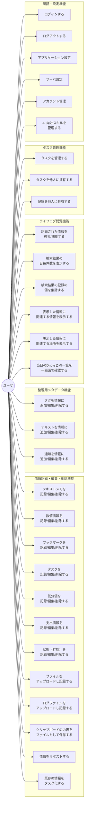

# gkill ユースケース

astah モデル（`gkill_model.asta`）のユースケース記述 + コードの API エンドポイントから整理。

## 0. アクター定義

| アクター | 説明 |
|---------|------|
| **ユーザ** | gkill にログインしてライフログの記録・閲覧・管理を行う利用者。全認証済みユースケースの主アクター |
| **管理者 (admin)** | アカウント作成・サーバー設定変更の権限を持つユーザ。初回起動時に自動作成される `admin` アカウント |
| **共有閲覧者** | 認証不要で共有リンク経由でKyouやタスクを閲覧する外部利用者 |
| **MCP クライアント** | MCP サーバー経由で gkill のデータを読み書きするAIアシスタント等の外部システム。Read サーバー（14ツール）は読み取りのみ、Write（33ツール）/ ReadWrite（37ツール）は追加・更新・削除も行える |
| **Wear OS ウォッチ** | Wearable Data Layer 経由でテンプレート取得・KFTL テキスト送信を行うウォッチアプリ |
| **ブックマークレット** | ブラウザ上で動作し、URLog（ブックマーク）を直接追加するJavaScript |

### スコープ

**スコープ内:**
- ライフログデータ（Kyou）の CRUD 操作
- テキストベース一括入力（KFTL）
- 検索・集計・関連情報表示
- タスク管理（Mi）
- 共有機能
- 認証・アカウント管理
- サーバー設定・リポジトリ管理
- Web Push 通知
- MCP 連携（読み取り / 書き込みの両方）
- AI 向けスキル（`SKILL.md` と付属ファイル）の管理（設定画面）と MCP からの読み書き
- プラグイン連携（外部プラグインの一覧取得・コンテンツ表示・設定）
- Wear OS 連携

**スコープ外:**
- ユーザ間のリアルタイムコラボレーション
- 外部サービスとの双方向同期
- 複数サーバー間のデータ同期
- ロールベースのアクセス制御（管理者/一般ユーザの2段階のみ）

## 1. ユースケース概要図


```mermaid
graph LR
    User((ユーザ))

    subgraph "情報記録・編集・削除機能"
        UC_KMEMO[テキストメモを<br>記録/編集/削除する]
        UC_KC[数値情報を<br>記録/編集/削除する]
        UC_URLOG[ブックマークを<br>記録/編集/削除する]
        UC_MI[タスクを<br>記録/編集/削除する]
        UC_LANTANA[気分値を<br>記録/編集/削除する]
        UC_NLOG[支出情報を<br>記録/編集/削除する]
        UC_TIMEIS[状態（打刻）を<br>記録/編集/削除する]
        UC_FILE[ファイルを<br>アップロードし記録する]
        UC_GPSLOG[ログファイルを<br>アップロードし記録する]
        UC_CLIPBOARD[クリップボードの内容を<br>ファイルとして保存する]
        UC_REKYOU[情報をリポストする]
        UC_MIREKYOU[既存の情報を<br>タスク化する]
    end

    subgraph "整理用メタデータ機能"
        UC_TAG[タグを情報に<br>追加/編集/削除する]
        UC_TEXT[テキストを情報に<br>追加/編集/削除する]
        UC_NOTIF[通知を情報に<br>追加/編集/削除する]
    end

    subgraph "ライフログ閲覧機能"
        UC_SEARCH[記録された情報を<br>検索/閲覧する]
        UC_CALENDAR[検索結果の<br>日毎件数を表示する]
        UC_AGGREGATE[検索結果の記録の<br>値を集計する]
        UC_RELATED[表示した情報に<br>関連する情報を表示する]
        UC_MAP[表示した情報に<br>関連する場所を表示する]
        UC_DASHBOARD[当日のDnoteとMI一覧を<br>一画面で確認する]
    end

    subgraph "タスク管理機能"
        UC_MI_MANAGE[タスクを管理する]
        UC_MI_SHARE[タスクを他人に共有する]
        UC_KYOU_SHARE[記録を他人に共有する]
    end

    subgraph "認証・設定機能"
        UC_LOGIN[ログインする]
        UC_LOGOUT[ログアウトする]
        UC_APP_CONFIG[アプリケーション設定]
        UC_SERVER_CONFIG[サーバ設定]
        UC_ACCOUNT[アカウント管理]
        UC_SKILL[AI 向けスキルを<br>管理する]
    end

    User --> UC_KMEMO
    User --> UC_KC
    User --> UC_URLOG
    User --> UC_MI
    User --> UC_LANTANA
    User --> UC_NLOG
    User --> UC_TIMEIS
    User --> UC_FILE
    User --> UC_GPSLOG
    User --> UC_CLIPBOARD
    User --> UC_REKYOU
    User --> UC_MIREKYOU
    User --> UC_TAG
    User --> UC_TEXT
    User --> UC_NOTIF
    User --> UC_SEARCH
    User --> UC_CALENDAR
    User --> UC_AGGREGATE
    User --> UC_RELATED
    User --> UC_MAP
    User --> UC_DASHBOARD
    User --> UC_MI_MANAGE
    User --> UC_MI_SHARE
    User --> UC_KYOU_SHARE
    User --> UC_LOGIN
    User --> UC_LOGOUT
    User --> UC_APP_CONFIG
    User --> UC_SERVER_CONFIG
    User --> UC_ACCOUNT
    User --> UC_SKILL
```

## 2. 機能カテゴリ別ユースケース一覧

> **件数について:** ユースケースは **94件（ユニークな UC-ID 数）**。以下のカテゴリ別表の行数は 99 行で、ダッシュボードの UC-09xxd 系がユニーク数では設定管理の UC-09xx と同一視されるため行数のほうが多くなる。件数を引用する際はユニーク ID 数（94）を使うこと。
>
> 数え直すときは **4桁に限定**すること。`UC-[0-9]+` だと本文中の「UC-04xx」「UC-05xx」という
> 記述（後述の欠番の説明）まで拾ってしまい、2件多く数えられる。
>
> ```bash
> grep -oE 'UC-[0-9]{4}' documents/reverse/usecase.md | sort -u | wc -l   # 94
> grep -cE '^\|\s*UC-[0-9]{4}' documents/reverse/usecase.md               # 99
> ```

### 2.1 認証

| UC-ID | ユースケース名 | API エンドポイント |
|-------|---------------|------------------|
| UC-0101 | ログインする | `Login` |
| UC-0102 | ログアウトする | `Logout` |
| UC-0103 | パスワードリセットする | `ResetPassword` |
| UC-0104 | 新パスワード設定する | `SetNewPassword` |
| UC-0105 | アカウント作成する | `AddAccount` |

### 2.2 情報記録（KFTL 経由）

| UC-ID | ユースケース名 | API エンドポイント |
|-------|---------------|------------------|
| UC-0201 | KFTL でデータを記録する | `SubmitKFTLText` |
| UC-0202 | KFTL 送信前に未知のタグを確認する | なし（クライアント完結。`collect_unknown_tags()` が既存タグに無いタグを検出し、確認ダイアログで承認されるまで送信しない） |

KFTL 経由で以下の全データ型を記録可能:
Kmemo, KC, Lantana, Mi, Nlog, TimeIs, URLog + Tag, Text

### 2.3 情報記録（画面操作）

| UC-ID | ユースケース名 | API エンドポイント |
|-------|---------------|------------------|
| UC-0301 | テキストメモを追加する | `AddKmemo` |
| UC-0302 | 数値情報を追加する | `AddKC` |
| UC-0303 | ブックマークを追加する | `AddURLog` |
| UC-0304 | タスクを追加する | `AddMi` |
| UC-0305 | 気分値を追加する | `AddLantana` |
| UC-0306 | 支出情報を追加する | `AddNlog` |
| UC-0307 | タイムスタンプを追加する | `AddTimeis` |
| UC-0308 | リポストする | `AddRekyou` |
| UC-0309 | 既存の情報をタスク化する | `AddMiReKyou` |

### 2.4 情報編集

| UC-ID | ユースケース名 | API エンドポイント |
|-------|---------------|------------------|
| UC-0401 | テキストメモを編集する | `UpdateKmemo` |
| UC-0402 | 数値情報を編集する | `UpdateKC` |
| UC-0403 | ブックマークを編集する | `UpdateURLog` |
| UC-0404 | タスクを編集する | `UpdateMi` |
| UC-0405 | 気分値を編集する | `UpdateLantana` |
| UC-0406 | 支出情報を編集する | `UpdateNlog` |
| UC-0407 | タイムスタンプを編集する | `UpdateTimeis` |
| UC-0408 | ファイル情報を編集する | `UpdateIDFKyou` |
| UC-0409 | リポストを編集する | `UpdateRekyou` |
| UC-0410 | リポストタスクを編集する | `UpdateMiReKyou` |

### 2.5 情報削除（論理削除）

削除は編集エンドポイントで `IS_DELETED=true` を設定することで実現。
専用の Delete エンドポイントは存在しない（Append-Only 方式）。

ただし Kyou の削除は**単独の update 1本では終わらない**。画面から Kyou を削除すると、付随する Tag / Text / Notification と、その Kyou を参照している ReKyou / MiReKyou も同じ操作で連鎖して論理削除される（`classes/cascade-delete-kyou.ts`）。消す順序は「付随データ → 参照元（深い方から）→ Kyou 自身」で、**Kyou 自身が最後**。サーバの `FindKyous` は参照先が削除済みの ReKyou を検索結果から外すため、先に Kyou を消すと参照元を辿れなくなるためである。全件を1つの tx_id で積み commit_tx で確定する（1つの SQLite トランザクション。[ADR-0219](../adr/0219-commit-tx-is-one-sqlite-transaction.md) / [ADR-0410](../adr/0410-bundle-multi-write-operations-in-tx.md)）ので、全部消えるか何も消えないかのどちらか。関連エラーコードは `ERR900093 cascade_delete_depth_exceeded`（参照の連鎖が32段を超えた）と `ERR900094 cascade_delete_failed`。

詳細は [sequence-diagrams.md](sequence-diagrams.md) の「Kyou データ削除（論理削除・連鎖削除）」と [activity-diagrams.md](activity-diagrams.md) の「Kyou 連鎖削除フロー」を参照。

> **注:** UC-05xx は欠番です。削除操作は専用エンドポイントを持たず、UC-04xx（編集）の `IS_DELETED=true` 設定として実現されるため、独立したユースケースIDを付与していません。

### 2.6 メタデータ操作

| UC-ID | ユースケース名 | API エンドポイント |
|-------|---------------|------------------|
| UC-0601 | タグを追加する | `AddTag` |
| UC-0602 | タグを編集する | `UpdateTag` |
| UC-0603 | テキストを追加する | `AddText` |
| UC-0604 | テキストを編集する | `UpdateText` |
| UC-0605 | 通知を追加する | `AddNotification` |
| UC-0606 | 通知を編集する | `UpdateNotification` |

### 2.7 情報閲覧・検索

| UC-ID | ユースケース名 | API エンドポイント |
|-------|---------------|------------------|
| UC-0701 | Kyou を検索・一覧表示する | `GetKyous` |
| UC-0702 | 個別 Kyou を取得する | `GetKyou` |
| UC-0703 | 各データ型を個別取得する | `GetKmemo`, `GetKC`, `GetURLog`, `GetNlog`, `GetTimeis`, `GetMi`, `GetLantana`, `GetRekyou`, `GetMiReKyou`, `GetGitCommitLog`, `GetIDFKyou` |
| UC-0704 | タグ履歴を取得する | `GetTagsByTargetID`, `GetTagHistoriesByTagID` |
| UC-0705 | テキスト履歴を取得する | `GetTextsByTargetID`, `GetTextHistoriesByTextID` |
| UC-0706 | 通知履歴を取得する | `GetNotificationsByTargetID`, `GetNotificationHistoriesByNotificationID` |
| UC-0707 | Mi ボード一覧を取得する | `GetMiBoardList` |
| UC-0708 | 全タグ名を取得する | `GetAllTagNames`（対象の記録が削除済みのタグは語彙に出ない） |
| UC-0709 | GPS ログを取得する | `GetGPSLog` |
| UC-0710 | 更新データを時刻指定取得する | `GetUpdatedDatasByTime` |
| UC-0711 | 集計ビューで記録を集計・分析する（集計項目・集計リスト） | `GetKyous`（集計はクライアント側）+ `UpdateApplicationConfig`（定義を `dnote_json_data` に保存） |
| UC-0712 | 集計ビューにトレンドグラフを追加・編集・削除する | `GetKyous`（時系列集計は `DnoteTrendAggregator` によるクライアント側処理）+ `UpdateApplicationConfig`（定義保存） |
| UC-0713 | Markdown ファイル内の相対リンクから対象記録を開く | `GetIDFKyouByRelativePath` |
| UC-0714 | ZIP ファイルの内容を閲覧する | `BrowseZipContents` |
| UC-0715 | 全リポジトリ名を取得する | `GetAllRepNames` |
| UC-0716 | 保存済み検索条件を呼び出して検索する | `GetKyous`（rykv/mi サイドバーの呼び出しFABから選択し、QueryEditorSidebar へ適用。ホットリロードONなら自動検索） |
| UC-0717 | 集計ビューに相関グラフを追加・編集・削除する | `GetKyous`（既存トレンド集計と `DnoteCorrelationAggregator` によるクライアント側処理）+ `UpdateApplicationConfig`（定義保存） |

### 2.8 ファイルアップロード

| UC-ID | ユースケース名 | API エンドポイント |
|-------|---------------|------------------|
| UC-0801 | ファイルをアップロードする | `UploadFiles` |
| UC-0802 | GPS ログファイルをアップロードする | `UploadGPSLogFiles` |
| UC-0803 | クリップボードの内容をファイルとして保存する | `UploadFiles`（クライアントサイドで Clipboard API → base64 変換後送信） |

### 2.9 ダッシュボード

| UC-ID | ユースケース名 | API エンドポイント |
|-------|---------------|------------------|
| UC-0901d | 当日のDnoteとMI一覧を一画面で確認する | `GetKyous`（DnoteView・KyouListView） |
| UC-0902d | ダッシュボードの日付を切り替えて過去日のデータを確認する | `GetKyous`（日付パラメータ変更） |
| UC-0903d | ダッシュボードのMI検索条件を設定する | `UpdateApplicationConfig`（DashboardConfig.dashboard_mi_find_kyou_query） |
| UC-0904d | ダッシュボードのDnote検索条件を設定する | `UpdateApplicationConfig`（DashboardConfig.dashboard_dnote_find_kyou_query） |
| UC-0905d | ダッシュボードからライフログを記録する | `SubmitKFTLText`, `AddMi`, `AddTimeis` 等（FABメニュー経由） |

### 2.10 設定管理

| UC-ID | ユースケース名 | API エンドポイント |
|-------|---------------|------------------|
| UC-0901 | アプリケーション設定を取得する | `GetApplicationConfig` |
| UC-0902 | アプリケーション設定を更新する | `UpdateApplicationConfig` |
| UC-0903 | サーバ設定を取得する | `GetServerConfigs` |
| UC-0904 | サーバ設定を更新する | `UpdateServerConfigs` |
| UC-0905 | ユーザリポジトリを更新する | `UpdateUserReps` |
| UC-0906 | リポジトリ一覧を取得する | `GetRepositories` |
| UC-0907 | リポジトリを再読み込みする | `ReloadRepositories` |
| UC-0908 | アカウントステータスを更新する | `UpdateAccountStatus` |
| UC-0909 | 保存済み検索条件を登録・更新・削除する | `UpdateApplicationConfig`（SavedFindQueryConfig を `saved_find_query_json_data` に保存） |

### 2.11 共有

| UC-ID | ユースケース名 | API エンドポイント |
|-------|---------------|------------------|
| UC-1001 | 共有リスト情報を追加する | `AddShareKyouListInfo` |
| UC-1002 | 共有リスト情報を更新する | `UpdateShareKyouListInfo` |
| UC-1003 | 共有リスト情報を削除する | `DeleteShareKyouListInfos` |
| UC-1004 | 共有リスト情報を取得する | `GetShareKyouListInfos` |
| UC-1005 | 共有 Kyou を取得する | `GetSharedKyous` |

### 2.12 その他

| UC-ID | ユースケース名 | API エンドポイント |
|-------|---------------|------------------|
| UC-1101 | TLS ファイルを生成する | `GenerateTLSFile` |
| UC-1102 | Web Push 通知公開鍵を取得する | `GetGkillNotificationPublicKey` |
| UC-1103 | Web Push 通知を登録する | `RegisterGkillNotification` |
| UC-1104 | URLog ブックマークレットアドレスを取得する | `URLogBookmarklet` |
| UC-1105 | キャッシュを更新する | `UpdateCache` |
| UC-1106 | MCP 経由で Kyou を取得する | `GetKyousMCP` |
| UC-1107 | トランザクションをコミットする | `CommitTX` |
| UC-1108 | トランザクションを破棄する | `DiscardTX` |
| UC-1109 | ディレクトリを開く | `OpenDirectory` |
| UC-1110 | ファイルを開く | `OpenFile` |
| UC-1111 | MCP 経由で IDF ファイルの実データを取得する | `GetIDFFile` |
| UC-1113 | プラグイン一覧を取得する | `GetPluginList`（呼び出し元は MCP の `gkill_get_plugin_list` のみ） |
| UC-1114 | プラグイン Kyou のコンテンツ HTML を取得する（画面表示と、MCP の `include_plugin_content` によるインライン埋め込みの両方から使う） | `GetPluginContentHTML` |
| UC-1115 | プラグイン設定画面の HTML を取得する | `GetPluginConfigHTML`（プラグイン Kyou のコンテキストメニュー「プラグイン設定」から開く） |
| UC-1116 | プラグイン設定を保存する | `PostPluginConfig`（設定ダイアログの iframe から postMessage で親に依頼して保存。`config.json` を直接編集する経路も残っている） |
| UC-1117 | Kyou の内容 / ID をクリップボードにコピーする | なし（クライアント完結。`classes/kyou-content-text.ts`） |
| UC-1118 | ディスク上の派生キャッシュを削除する | なし（CLI `clear_cache <thumb\|video\|zip\|plugin\|all> <all\|user_id...>`） |
| UC-1119 | 起動時に指定ユーザのリポジトリを先読みする | なし（CLI フラグ `--pre_load_users`） |
| UC-1120 | 待ち受けアドレスを起動時だけ上書きする | なし（CLI フラグ `--address`。設定DBの `ADDRESS` は書き換えないため、設定画面の表示と実際の待ち受け先がずれる） |
| UC-1121 | サーバ機上でパスワードを無効化してリセットURLを再発行する | なし（CLI `reset_password <user_id...>`。`account.db` を直接開く。パスワードは Argon2id で保存され復元できないため、管理者がパスワードを忘れたときやリセットトークンが期限切れになったときの唯一の復帰経路） |

### 2.13 スキル（AI 向け手順書）

利用者が AI アシスタント向けに書く手順書（`$GKILL_HOME/skills/<user_id>/<name>/` の `SKILL.md` と付属ファイル。[ADR-0634](../adr/0634-per-user-skills-for-mcp.md)）。
ファイルを読み書きするのは gkill_server だけで、設定画面と MCP は同じ API を使う。履歴は持たず、変更は即時に反映される。
UC-1201〜UC-1205 の主アクターは**ユーザ**（設定画面の「スキル」ボタンから開く `manage-skill-list-dialog.vue`）、UC-1206〜UC-1208 は **MCP クライアント**。

| UC-ID | ユースケース名 | API エンドポイント |
|-------|---------------|------------------|
| UC-1201 | スキルの一覧を見る | `GetSkillList`（名前・説明・更新日時・ファイル数。`SKILL.md` が無い・frontmatter が壊れているスキルも `invalid_reason` つきで並ぶ） |
| UC-1202 | スキルの中身を閲覧する | `GetSkill`（`path` 省略で `SKILL.md` の全文とファイル一覧、指定でそのファイル。素のテキストとして表示し、Markdown / HTML としては描かない） |
| UC-1203 | スキルを zip でダウンロードする | `DownloadSkill`（スキル名のフォルダ1段で包んだ zip。そのまま UC-1204 で上げ直せる） |
| UC-1204 | zip をアップロードしてスキルを丸ごと置き換える（新規作成を含む） | `UploadSkill`（`dry_run:true` で計画を見せる → 確認 → 同じ zip を `dry_run:false` で送る。2段階） |
| UC-1205 | スキルを丸ごと削除する | `DeleteSkill`（`path` 空。ファイル単位の削除は API にはあるが画面は使わない） |
| UC-1206 | MCP 経由でスキルを読む | `GetSkillList`, `GetSkill`（MCP の `gkill_get_skill_list` / `gkill_get_skill`。read / write / readwrite の3サーバ。`gkill_status` にも名前と説明が載る） |
| UC-1207 | MCP 経由でスキルを作る | `WriteSkillFile`（MCP の `gkill_add_skill`。`revision` を付けずに `SKILL.md` を書く＝新規作成だけ。write / readwrite） |
| UC-1208 | MCP 経由でスキルのファイルを書き換える | `WriteSkillFile`（MCP の `gkill_update_skill`。既存ファイルの上書きは `revision` 必須。write / readwrite） |

MCP にスキルを削除するツールは公開していない（`gkill_delete_skill` は実装だけで、ツール一覧と振り分けをコメントアウトしてある。`src/server/gkill/mcp/skill_delete_tool.go`）。
削除とバイナリファイルの追加は画面（UC-1204 / UC-1205）だけの操作。画面仕様は [screen-specs.md](screen-specs.md) の「スキル管理」、API の詳細は [api-endpoints.md](api-endpoints.md) の「スキル（6件）」を参照。

## 3. ユースケース記述（astah モデルから抽出）

### UC-0102: ログアウトする

**事前条件:** アクターがアプリケーションにログインしている

**事後条件:** ログアウトされている

**基本フロー:**
1. アクターはアプリケーションタイトルプルダウンからログアウトを選択する
2. アプリケーションはログアウト処理を行う 【例外B】
3. アプリケーションはログイン画面を表示する

**例外フロー:**
- B【サーバ内エラー】: アプリケーションはエラーメッセージを表示する

---

### UC-0401: テキストメモを編集する

**事前条件:**
- アクターがアプリケーションにログインしている
- アクターが Kmemo 編集ダイアログを開いている

**事後条件:** 編集されたテキストメモが保存されている

**基本フロー:**
1. アクターはメモ内容を編集する 【代替B】
2. アクターは「保存」ボタンを押下する
3. アプリケーションは更新されたテキストメモを保存する
4. アプリケーションは保存成功メッセージを表示する 【例外A】
5. アプリケーションはテキストメモ入力欄をクリアする
6. アプリケーションは Kmemo 編集ダイアログを閉じる

**代替フロー:**
- B【ユーザによるキャンセル】:
  1. アクターは「×」ボタンを押下する
  2. アプリケーションは Kmemo 編集ダイアログを閉じる

---

### テキストメモを削除する

**事前条件:**
- アクターがアプリケーションにログインしている
- アクターが rykv 画面からコンテキストメニューを開いている

**事後条件:** 削除されたテキストメモが論理削除されている

**基本フロー:**
1. アクターはコンテキストメニューから「削除」を選択する
2. アプリケーションは削除確認ダイアログを表示する
3. ユーザは「削除」ボタンを押下する 【代替B】
   - 処理中の再押下は `is_requested_submit` で弾かれ、ボタンは `:disabled` になる
4. アプリケーションは削除対象を探索する（付随する Tag / Text / Notification と、対象を参照している ReKyou / MiReKyou を幅優先で収集する）
5. アプリケーションは収集したものを論理削除し、**テキストメモ自身は最後に**論理削除する 【例外A】
6. アプリケーションは削除された全 ID を画面から取り除く
7. アプリケーションは削除ダイアログを閉じる

**代替フロー:**
- B【ユーザによるキャンセル】:
  1. アクターは「×」ボタンを押下する
  2. アプリケーションは削除確認ダイアログを閉じる

**例外フロー:**
- A【削除失敗】: アプリケーションはエラーメッセージを表示する（`ERR900094 cascade_delete_failed` / 深さ超過は `ERR900093`）。**エラーの有無にかかわらずダイアログは閉じる**（クローズ処理は `finally` にあり、「サーバには届いているのに閉じない」状態を作らないため）

**備考:** 削除成功時に成功メッセージは表示しない（画面からその行が消えることが結果の提示になる）。

---

### UC-0303: ブックマークを記録する（KFTL 経由）

**事前条件:**
- アクターがアプリケーションにログインしている
- アクターが KFTL ダイアログを開いている

**事後条件:** ブックマークが保存されている

**基本フロー:**
1. アクターはブックマーク内容を入力する 【代替B】【備考A】
2. アクターは「保存」ボタンを押下する 【代替A】
3. アプリケーションはブックマークを保存する
4. アプリケーションは保存成功メッセージを表示する 【例外A】
5. アプリケーションはテキスト入力欄をクリアする

**代替フロー:**
- A【「！」による保存】:
  1. アクターはブックマーク情報の末尾行に「！」を入力し、改行する
  2. 基本フロー 3 に戻る
- B【ユーザによるキャンセル】:
  1. アクターは「×」ボタンを押下する
  2. アプリケーションは KFTL ダイアログを閉じる

**備考:**
- A【ブックマーク情報】: URL、ページタイトル

---

### サーバ設定の項目

astah モデルから抽出されたサーバ設定項目:
- ローカルアクセスのみ許可するかどうか
- TLS の有効/無効
- 使用するポート番号
- TLS の CERT ファイルパス
- TLS の KEY ファイルパス
- ディレクトリを開くコマンド（管理者、所有者用）
- ファイルを開くコマンド（管理者、所有者用）
- URLog のタイムアウト時間
- URLog の UserAgent
- 月間ファイルアップロード容量上限
- ユーザデータを入れるディレクトリ

### スキル（UC-1201〜UC-1208。astah モデルには無く、コードから起こした）

出典は `src/client/classes/use-manage-skill-list-dialog.ts` / `use-browse-skill-files-dialog.ts`（画面）、`src/server/gkill/mcp/skill_handlers.go`（MCP）、`src/server/gkill/dao/skills/`（保存層）と、E2E `src/client/__tests__/e2e/skills.spec.ts` の一巡。

---

### UC-1201: スキルの一覧を見る

**アクター:** ユーザ

**事前条件:** アクターがアプリケーションにログインし、設定画面（ApplicationConfig）を開いている

**事後条件:** 自分のスキルの一覧が表示されている

**基本フロー:**
1. アクターは設定画面の設定ボタン2段目の末尾「スキル」を押下する
2. アプリケーションはスキル管理ダイアログを開き、スキル一覧を取得する（`GetSkillList`）【例外A】
3. アプリケーションは名前・説明・更新日時・ファイル数を行として表示する 【代替B】

**代替フロー:**
- B【壊れたスキルがある】: `SKILL.md` が無い、または frontmatter が壊れているスキルは `invalid_reason` が非空で返る。アプリケーションはその行の説明欄に理由を出す（一覧から隠さない。削除（UC-1205）や上げ直し（UC-1204）で直せるようにするため）

**例外フロー:**
- A【取得失敗】: アプリケーションはエラーメッセージを表示する（一覧は空のまま）

**備考:**
- 対象は常にログイン中の利用者自身の `$GKILL_HOME/skills/<user_id>/` 配下。リクエストで他の利用者を指名する項目は無い
- ドットで始まる項目（`.git` 等）は一覧に出ない

**関連画面 / API:** `manage-skill-list-dialog.vue`（[screen-specs.md](screen-specs.md)「スキル管理」）/ `/api/get_skill_list`

---

### UC-1202: スキルの中身を閲覧する

**アクター:** ユーザ

**事前条件:** アクターがスキル管理ダイアログ（UC-1201）を開いている

**事後条件:** 選んだファイルの中身が素のテキストとして表示されている（編集はできない）

**基本フロー:**
1. アクターは一覧の行の「表示」を押下する
2. アプリケーションは `path` を省いて `GetSkill` を呼び、`SKILL.md` の全文とファイル一覧（`path` / `size` / `is_text` / `revision`）を受け取る 【例外A】
3. アプリケーションは閲覧ダイアログを開き、左にファイル一覧、右に `SKILL.md` の本文を `<pre>` に出す
4. アクターは左の一覧から別のファイルを押下する 【代替B】【代替C】
5. アプリケーションは `path` を付けて `GetSkill` を呼び、テキスト（`content`）を右に出す 【例外A】

**代替フロー:**
- B【バイナリファイルを選んだ】: `is_text` が偽のファイルは中身を取りに行かず、バイナリである旨だけを表示する
- C【`SKILL.md` を選び直した】: 手順2の応答に入っている本文をそのまま出す（再取得しない）

**例外フロー:**
- A【スキルまたはファイルが無い】: アプリケーションはエラーメッセージを表示する（`ERR000430` スキルが無い / `ERR000431` ファイルが無い。404）

**備考:**
- Markdown / HTML としては描画しない。AI が書いた HTML の中のスクリプトがログイン中のセッションで gkill のオリジンで動く（保存型 XSS）ため
- ファイルを続けて押したときは、先に投げた要求の応答が後から来ても表示を上書きしないよう連番（`load_seq`）で捨てる
- 直したければ zip をダウンロード（UC-1203）して手元で編集し、上げ直す（UC-1204）。画面にファイル単位の編集は無い

**関連画面 / API:** `browse-skill-files-dialog.vue` / `/api/get_skill`

---

### UC-1203: スキルを zip でダウンロードする

**アクター:** ユーザ

**事前条件:** アクターがスキル管理ダイアログ（UC-1201）を開いている

**事後条件:** `<スキル名>.zip` がブラウザのダウンロードとして保存されている

**基本フロー:**
1. アクターは一覧の行の「ダウンロード」を押下する
2. アプリケーションは `DownloadSkill` を呼び、`file_name` と `zip_base64` を受け取る 【例外A】
3. アプリケーションは base64 を Blob に戻し、`file_name`（無ければ `<スキル名>.zip`）で保存する

**例外フロー:**
- A【取得失敗】: アプリケーションはエラーメッセージを表示する（スキルが無い `ERR000430` など）

**備考:**
- zip はスキル名のフォルダ1段で包んであり、そのまま UC-1204 で上げ直せる（手元のエディタで直す往復の経路）
- 保存量に上限を設けていないので、付属ファイル次第で zip は大きくなりうる（応答は JSON の `zip_base64` 1本で、分割はしない）

**関連画面 / API:** `manage-skill-list-dialog.vue` / `/api/download_skill`

---

### UC-1204: zip をアップロードしてスキルを丸ごと置き換える

**アクター:** ユーザ

**事前条件:**
- アクターがスキル管理ダイアログ（UC-1201）を開いている
- 上げる zip の中に `SKILL.md`（frontmatter の `name` がスキル名、`description` が非空）がある

**事後条件:** zip の中身でスキルのフォルダが丸ごと置き換わっている（無かったスキルなら新しく作られている）

**基本フロー:**
1. アクターは「zipをアップロード」を押下し、zip ファイルを選ぶ
2. アプリケーションは zip を data URL として読み、`dry_run:true` で `UploadSkill` に送る 【例外A】
3. サーバは zip を検証し、スキル名（zip 内 `SKILL.md` の `name`）と、追加・変更・削除・無視されるファイルの計画（`plan`）を返す。**この時点では何も書かない**
4. アプリケーションは確認ダイアログを開く。新規なら「新しいスキルを作ります。」、既存なら「既存のスキルを丸ごと置き換えます。」に続けて、追加・変更・削除・無視の4区分でファイルを列挙する
5. アクターは「適用」を押下する 【代替B】
6. アプリケーションは**確認を通したのと同じ zip** を `dry_run:false` で `UploadSkill` に送る 【例外C】
7. サーバは一時ディレクトリへ展開してから既存のフォルダと入れ替える（DELETE_WRITE）
8. アプリケーションは一覧を再取得し、新しい説明が行に出る

**代替フロー:**
- B【ユーザによるキャンセル】:
  1. アクターは「キャンセル」（または「×」）を押下する
  2. アプリケーションは確認ダイアログを閉じる。何も書かれない（確認に使った zip は、スキル管理ダイアログを閉じるか次の zip の確認が通るまで `pending_zip_base64` に残る。「適用」は確認ダイアログにしか無いので、残っていても送られない）

**例外フロー:**
- A【zip が不正】: アプリケーションはエラーメッセージを表示し、確認ダイアログは開かない（`ERR000435` zip として読めない・ファイルが1つも無い・絶対パス・`..`・シンボリックリンクを含む・ファイル名が規則に合わない・大文字小文字だけ違う重複・同名のファイルとフォルダの衝突・最上位に `SKILL.md` が無い / `ERR000434` `SKILL.md` の frontmatter が不正（`name` が規則に合わない・`description` が空を含む） / `ERR000432` 既存のスキルや利用者のフォルダと大文字小文字だけ違う / `ERR000427` base64 が復号できない。いずれも 400。zip 内のパスの規則違反は `ERR000433` ではなく `ERR000435` にまとまる）
- C【置き換え失敗】: アプリケーションはエラーメッセージを表示する（`ERR000442`。500）。**既存のスキルは元のまま残る**（入れ替え前に一時ディレクトリで組み立てるため。Windows で誰かがファイルを開いていると rename が失敗する）

**備考:**
- 確認の1段目と2段目は同じ zip を送る（`pending_zip_base64`）。ファイルを選び直しても `change` が起きるよう、選択のたびに `input[type=file]` の値を空に戻す。処理中の再押下は `is_uploading` で弾く
- 無視されるのは OS の管理ファイル、`__MACOSX`、ドットで始まる項目。zip の中身がフォルダ1段で包まれていれば剥がす
- 置き換えはフォルダ丸ごとなので、利用者がスキルのフォルダに置いたドットファイル（`.git` 等）も消える。git で管理するなら `skills/<user_id>/` の単位で置く
- **衝突は検出しない**: ダウンロード（UC-1203）後に MCP（UC-1208）が書き換えた分は、上げ直しで黙って上書きされる（利用者単位で管理しているため。利用者が増えたら見直す）
- `upload_skill` だけ `wrapNoAuth` + アップロード用の本文上限（1GB。`upload_files` と同じ枠）で、ハンドラ内でセッションを検証する。保存量の上限は設けていない

**関連画面 / API:** `manage-skill-list-dialog.vue` → `confirm-upload-skill-dialog.vue` / `/api/upload_skill`

---

### UC-1205: スキルを丸ごと削除する

**アクター:** ユーザ

**事前条件:** アクターがスキル管理ダイアログ（UC-1201）を開いている

**事後条件:** スキルのフォルダが付属ファイルごと消えている（履歴が無いので戻せない）

**基本フロー:**
1. アクターは一覧の行の「削除」を押下する
2. アプリケーションは削除確認ダイアログ「スキルのフォルダを丸ごと消します。元には戻せません。」を表示する
3. アクターは「削除」を押下する 【代替B】
4. アプリケーションは `path` を空にして `DeleteSkill` を呼ぶ 【例外A】
5. サーバはスキルのフォルダを丸ごと消す
6. アプリケーションは一覧を再取得し、その行が消える

**代替フロー:**
- B【ユーザによるキャンセル】:
  1. アクターは「×」を押下する（確認ダイアログのボタンは「削除」だけ）
  2. アプリケーションは確認ダイアログを閉じる

**例外フロー:**
- A【削除失敗】: アプリケーションはエラーメッセージを表示する（`ERR000430` スキルが無い。404 / `ERR000444` ディスクの失敗。500）

**備考:**
- ファイル単位の削除（`path` 指定。`SKILL.md` 単独は `ERR000438` で不可）は API にはあるが、画面は使わない
- MCP には削除ツールを公開していない。AI の誤操作や、読み込んだ記録・Web ページに紛れ込んだ指示に従った削除を、利用者が後から戻す手段が無いため（[ADR-0634](../adr/0634-per-user-skills-for-mcp.md)）

**関連画面 / API:** `manage-skill-list-dialog.vue` → `confirm-delete-skill-dialog.vue` / `/api/delete_skill`

---

### UC-1206: MCP 経由でスキルを読む

**アクター:** MCP クライアント（read / write / readwrite の3サーバ）

**事前条件:** MCP クライアントが gkill_server に接続している

**事後条件:** MCP クライアントが課題に合うスキルの本文と、本文が指す付属ファイルを読んでいる

**基本フロー:**
1. MCP クライアントは `gkill_status` または `gkill_get_skill_list` でスキルの名前と説明を得る（`GetSkillList`）【代替A】【代替B】
2. MCP クライアントは説明が課題に合うスキルを `gkill_get_skill`（`path` 省略）で読む（`GetSkill`）。`SKILL.md` の本文と、`revision` つきのファイル一覧が返る 【例外A】
3. MCP クライアントは本文が指す付属ファイルを `path` 付きの `gkill_get_skill` で読む。テキストは `content`、画像は image ブロック（`structuredContent` には base64 を載せず `image_content_attached:true` の印だけ）、それ以外のバイナリ（PDF 等）は `structuredContent` の `file_content_base64` で届く【代替C】

**代替フロー:**
- A【一覧が取れない】: `gkill_status` は成功のまま `skills[]` の代わりに `skills_error` を載せる。MCP クライアントは「スキルが無い」と結論せず、`gkill_get_skill_list` で理由を見る
- B【壊れたスキルがある】: `invalid_reason` が非空。MCP クライアントは推測で補わず、利用者に伝える
- C【大きなファイル】: `max_file_bytes`（IDF と同じ設定。既定 8MiB）を超えるファイルは一覧には載るが中身は返らない（`content_omitted:true` と warning）。利用者に設定画面から zip で取る（UC-1203）よう案内する

**例外フロー:**
- A【スキルまたはファイルが無い】: 404（`ERR000430` / `ERR000431`）がエラーメッセージとして返る

**備考:**
- 手順1〜3は `gkill_get_mcp_help topic:skills` が案内する順序（説明が合うスキルは**行動の前に**読んで従う）
- スキルの中のスクリプトを gkill は実行しない。動かすのはクライアント側のサンドボックスで、サンドボックスからは gkill に届かないので、データは MCP ツールで取って渡す

**関連画面 / API:** なし（画面を持たない）/ `/api/get_skill_list`, `/api/get_skill`（`src/server/gkill/mcp/skill_handlers.go`）

---

### UC-1207: MCP 経由でスキルを作る

**アクター:** MCP クライアント（write / readwrite）

**事前条件:**
- MCP クライアントが write または readwrite サーバに接続している
- 利用者と、作るスキルの内容について合意している（履歴が無く、即時に反映されるため）

**事後条件:** `$GKILL_HOME/skills/<user_id>/<name>/SKILL.md` が新しく作られ、その `revision` を MCP クライアントが持っている

**基本フロー:**
1. MCP クライアントは `gkill_add_skill` に `name` / `description` / `body` を渡す
2. MCP は frontmatter（`name` と `description`）と `body` から `SKILL.md` の全文を組み立て、**`revision` を付けずに** `WriteSkillFile`（`path` は `SKILL.md`）を呼ぶ 【例外C】
3. サーバは名前の規則と frontmatter を検証し、まだ無ければ書いて `revision`（中身の SHA-256 の先頭16桁）を返す 【例外A】【例外B】
4. MCP クライアントは `name` / `path` / `revision` を受け取る（以後の書き換えは UC-1208）

**例外フロー:**
- A【同名のスキルが既にある】: 409 `ERR000436`（`revision` を省いた新規作成だが既にある）。MCP クライアントは `gkill_get_skill` で読んで `revision` を得てから `gkill_update_skill`（UC-1208）に切り替える
- B【名前が不正】: 400 `ERR000432`（名前が規則（英小文字・数字・ハイフンで1〜64文字、先頭と末尾は英数字）に合わない、または既存のスキルのフォルダと大文字小文字だけ違う）。MCP は frontmatter の値を JSON 文字列で書くので、`ERR000434`（frontmatter の検証に通らない）は通常は起きない
- C【`description` が空】: MCP がサーバへ送る前に引数検証で拒否する

**備考:**
- `body` の先頭の空白も中身として扱い、trim しない
- 付属ファイルを足すのは UC-1208（`revision` を省いて新しい `path` に書く）

**関連画面 / API:** なし / `/api/write_skill_file`

---

### UC-1208: MCP 経由でスキルのファイルを書き換える

**アクター:** MCP クライアント（write / readwrite）

**事前条件:**
- MCP クライアントが write または readwrite サーバに接続している
- 利用者と変更内容について合意している
- 上書きする場合は、対象ファイルの `revision` を `gkill_get_skill`（UC-1206）で読んでいる

**事後条件:** 対象ファイルが新しい中身に置き換わり、新しい `revision` を MCP クライアントが持っている

**基本フロー:**
1. MCP クライアントは `gkill_get_skill` で対象ファイルを読み、`revision` を控える
2. MCP クライアントは `gkill_update_skill` に `name` / `path` / `content`（ファイルの全文）/ `revision` を渡す 【代替A】【代替B】
3. MCP は `WriteSkillFile` を呼ぶ
4. サーバは `revision` が今の中身と一致するときだけ上書きし、新しい `revision` を返す 【例外A】【例外B】【例外C】

**代替フロー:**
- A【`path` を省略】: `SKILL.md` が対象。frontmatter を含む全文を `content` に渡す（`name` は変えられない。変えると `ERR000434`）
- B【新しいファイルを足す】: `revision` を省いて、まだ無い `path` に書く。既にあるファイルに `revision` 無しで書くと 409 `ERR000436`

**例外フロー:**
- A【`revision` が食い違う】: 409 `ERR000437`。文言に今の `revision` が添えられる。利用者や別のアシスタントが読んだ後に変えているので、読み直して差分を取り込み、やり直す
- B【スキルまたはファイルが無い】: 404（`SKILL.md` 以外を書く・`revision` を渡した先のスキルが無い `ERR000430` / `revision` を渡した `path` が無い `ERR000431`）
- C【名前・パス・frontmatter が不正】: 400（`ERR000432` 名前が規則に合わない・既存のスキルのフォルダと大文字小文字だけ違う / `ERR000433` パスの規則違反・既存ファイルと大文字小文字だけ違う・ファイルとフォルダの衝突 / `ERR000434` frontmatter）

**備考:**
- **既存ファイルの上書きに `revision` は必須**。省いた書き込みは「新規作成だけ」の意味になり、既にあれば断られる。これが、ダウンロード（UC-1203）と AI の書き換えが同じファイルへ向かうときの唯一の楽観ロック（画面側の上げ直しは検出しない）
- 削除とバイナリファイルの追加は画面（UC-1204 / UC-1205）に委ねる。ツールは無い。書き込みの API は本文を JSON 文字列（`content`）で受けるので任意のバイト列は送れないが、サーバは中身がテキストかどうかを検査しない（テキスト判定の `is_text` は読み取り側だけが使う）

**関連画面 / API:** なし / `/api/write_skill_file`

## 4. 画面別 CRUD マトリックス（改修後・コード実装ベース）

Excel の「現状・改修案」シートの改修後 CRUD + コードの実装を照合:

| 画面 | Tag | Text | Kmemo | URLog | Mi | Lantana | Nlog | TimeIs |
|------|-----|------|-------|-------|-----|---------|------|--------|
| **KFTL** | C | C | C | C | C | C | C | C(開始/終了) |
| **Rykv** | CRUD | CRUD | RUD | RUD | RUD | RUD | RUD | RUD |
| **Dnote** | CRUD | CRUD | RUD | RUD | RUD | RUD | RUD | RUD |
| **Mi** | CRUD | CRUD | - | - | CRUD | - | - | - |
| **Playing TimeIs** | - | - | - | - | - | - | - | R(終了操作) |
| **URLog サーバ** | - | - | - | C(ブックマークレット) | - | - | - | - |
| **Lantana ダイアログ** | - | C | C | - | - | C | - | - |

C=Create, R=Read, U=Update, D=Delete（論理削除）
